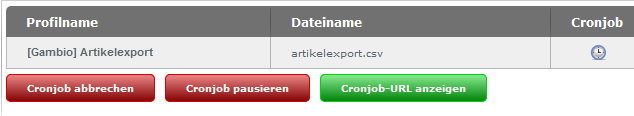

# Funktionen der Profilseite 

Unterhalb der Auflistung kann über die Schaltfläche Profil hinzufügen ein neues Profil erzeugt werden. Es stehen die gleichen Konfigurationsmöglichkeiten zur Verfügung wie im Reiter Einstellungen für die Funktion Profil bearbeiten.

Ist für mindestens ein Profil der automatische Export eingestellt, werden die Schaltflächen Cronjob fortsetzen und Cronjob-URL anzeigen eingeblendet. Die automatischen Exporte werden im Status pausiert angelegt. Über Cronjob fortsetzen werden die eingestellten Cronjobs aktiviert. Dies ist dadurch zu erkennen, dass die Uhren-Symbole in der Spalte Cronjob nicht mehr halbtransparent angezeigt werden. Wenn der Mauszeiger über das Symbol bewegt wird, erscheinen Datum und Uhrzeit des nächstens Exports.

Ein aktiver automatischer Export kann über Cronjob abbrechen oder Cronjob pausieren wieder inaktiv geschaltet werden.

Hierbei ist zu beachten, dass beim Abbrechen die CSV-Datei eines teilweise vorgenommenen Exports gelöscht wird. Ist der Cronjob pausiert, kann der Export über Cronjob fortsetzen wieder aufgenommen werden. Die zugehörige Datei wird beibehalten und weiter beschrieben.

Über Cronjob-URL anzeigen wird die URL zum Ausführen des Exports angezeigt. Diese URL muss in einen neu eingerichteten Cronjob bei deinem Hosting-Provider eingetragen werden. Weitere Details zu den Einstellungen erhältst du, wenn du auf das grüne Info-Symbol am Ende der Cronjob-URL klickst.

