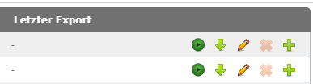
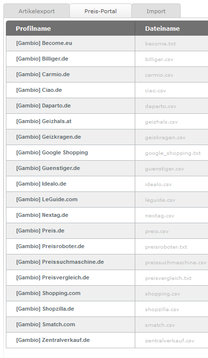

# Preis-Portal {#preis_portal}

Artikel-Exporte zu Preisportalen können über den Reiter Preis-Portal vorgenommen werden. Die Export-Profile sind in einer Tabelle aufgeführt, in der Profilname, Dateiname, Cronjob und Letzter Export aufgelistet sind. Vor dem ersten Export wird der zugehörige Dateiname grau angezeigt, die Datei wurde noch nicht auf dem Server angelegt. Für jeden Eintrag stehen von links nach rechts die Schaltflächen Profil exportieren, Exportieren und herunterladen , Profil bearbeiten , Profil löschen und Profil kopieren zur Verfügung.

-   **[Profil exportieren](8_8_1ca_Profil_exportieren.md)**  

-   **[Profil exportieren und herunterladen](8_8_1cb_Profil_exportieren_und_herunterladen.md)**  

-   **[Profil bearbeiten](8_8_1cc_Profil_bearbeiten.md)**  

-   **[Profil löschen](8_8_1cd_Profil_loeschen.md)**  

-   **[Profil kopieren](8_8_1ce_Profil_kopieren.md)**  

-   **[Funktionen der Profilseite](8_8_1cf_Preis_Portal.md)**  

