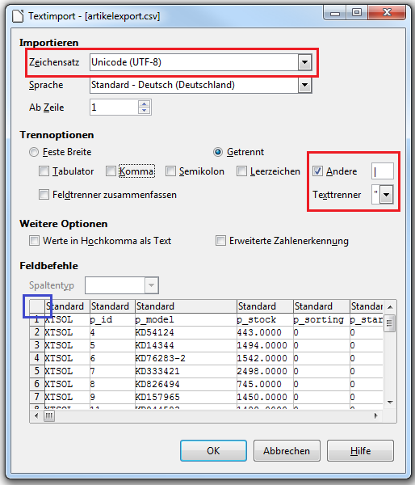

# Datei mit Tabellenkalkulation bearbeiten 

## Datei öffnen 

CSV-Dateien können idealerweise mit einer Tabellenkalkulation geprüft und bearbeitet werden. Wir empfehlen zu diesem Zweck die kostenlose Software Calc aus dem OpenOffice.org- oder LibreOffice-Paket.

Anhand von LibreOffice möchten wir die Besonderheiten beim Öffnen und Abspeichern von CSV-Dateien kurz erläutern.

CSV-Dateien trennen die Datensätze mit vorher definierten Trennzeichen. Um die Daten als Tabelle darstellen zu können, müssen diese Zeichen bekannt sein und beim Öffnen eingestellt werden. Standardmäßig werden hierfür das Pipe-Symbol als Trennzeichen und das doppelte Anführungszeichen als Texterkennungszeichen/Texttrenner verwendet. Stelle diese beiden Zeichen bitte im Dialogfenster ein \(siehe Screenshot\).

Zudem muss der verwendete Zeichensatz festgelegt werden, damit auch Umlaute und Sonderzeichen korrekt dargestellt und erkannt werden können. Im Shop wird hierfür UTF-8 ohne BOM verwendet. Stelle beim Öffnen ebenfalls sicher dass du eine Codierung nach UTF-8 als Zeichensatz einstellst.

Tabellenkalkulationen versuchen oftmals sogenannte Felddatentypen automatisch zu erkennen, um z.B. ein Datum entsprechend darzustellen. Bei einem CSV-Import dürfen die Daten jedoch nicht verändert werden. Um dies zu verhindern, klicke bitte in die linke obere Ecke der Beispieltabelle \(kleines blaues Kästchen\) um alle Felder zu markieren. Stelle anschließend den Spaltentyp im Dropdown auf Text.

## Datei speichern 

Wenn du die CSV-Datei nach dem Vornehmen der Änderungen speicherst, können die Einstellungen für Zeichensatz und Trennzeichen durch die Standardwerte der Tabellenkalkulation überschrieben werden.

Unter LibreOffice Calc kannst du dies verhindern, indem du über Datei \> Speichern unter vor dem Speichern die sogenannten Filtereinstellungen bearbeitest. Setze im Dialog nun den Haken für das Bearbeiten der Filtereinstellungen.

Es werden dir nun nochmals die wichtigsten Einstellungen angezeigt. Stelle hierbei sicher, dass UTF-8 als Zeichensatz und die ursprünglichen Trennzeichen \(standardmäßig Pipe-Symbol und doppeltes Anführungszeichen\) verwendet werden.

**Note:** Um das Pipe-Symbol \| zu erhalten, drücke auf der Tastatur bitte gleichzeitig ALT GR und < \(Spitze Klammer, links neben dem Y\).

