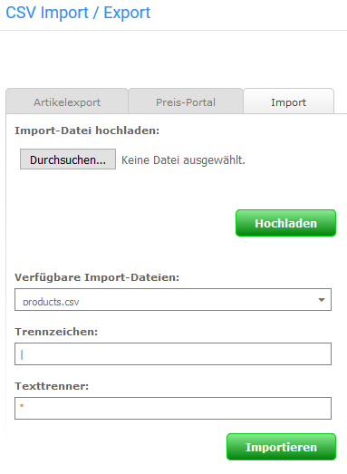

# Import durchführen 

CAUTION:

**Vor dem Durchführen eines CSV angelegt werden.

Du kannst dies wahlweise über die shopeigene Funktion unter Toolbox \> Datenbanksicherung oder den Administrationsbereich deines Hosting-Anbieters vornehmen.

## Import der Artikel 

Den Import einer CSV-Datei kannst du unter Import/Export \> Artikeldaten über den Reiter Import vornehmen.

Unter Import-Datei hochladen stehen die Schaltflächen Durchsuchen und Hochladen zur Verfügung um eine CSV-Datei auf dem lokalen Rechner auszuwählen und in das Import-Verzeichnis des Shops zu laden.

Die Dateien im Verzeichnis import werden unter Verfügbare Import-Dateien aufgeführt und können nach Auswahl im Dropdown-Menü importiert werden. Die Einstellungen für Trennzeichen und Texttrenner können vor dem Import festgelegt werden. Klicke auf Importieren um den Import der ausgewählten Datei durchzuführen.

Alle weiteren Einstellungen, beispielsweise zu Eigenschaften, werden über das Export-Profil \(siehe Artikelexport\) vorgenommen und beim Importieren angewendet.

## Import der Artikelbilder 

Zu einem vollständigen Import gehören in aller Regel auch die Artikelbilder. Diese müssen händisch auf den FTP-Server hochgeladen werden. Lade die Bild-Dateien hierzu in den Unterordner

/images/product\_images/original\_images/

deines Shopverzeichnisses. Anschließend muss unter Darstellung \> Bild-Optionen \> Image Processing die Stapelverarbeitung ausgeführt werden, um die verwendeten Bilder für die Artikel zu erzeugen \(z.B. Info-Bild, Thumbnails usw.\).

