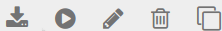

# Google Shopping 

Über Google \> Google Shopping kannst du Google Shopping-Profile erstellen und diese verwalten.

**Note:**

Wenn du für deine Exporte zu Google Shopping bisher Export-Profile unter Import/Export \> Artikeldaten verwendet hast, so werden diese nicht für das Google Services Modul übernommen.

Über die Schaltfläche Erstellen kann ein neues Export-Profil angelegt werden.

Bewege den Mauszeiger in die Zeile eines erstellten Export-Profils, um die möglichen Aktionen anzuzeigen. Diese werden am rechten Ende der Zeile als Icons aufgeführt:

Die möglichen Aktionen, für bereits angelegte Profile, sind von links nach rechts:

-   herunterladen: lädt die Datei auf deinen Computer herunter, hierfür muss vorher ein Export durchgeführt worden sein
-   exportieren: führt einen Export zu Google Shopping durch
-   bearbeiten: ruft die Einstellungen zu einem Export-Profil auf
-   löschen: löscht ein angelegtes Export-Profil
-   duplizieren: kopiert ein bestehendes Export-Profil

  

  

  

