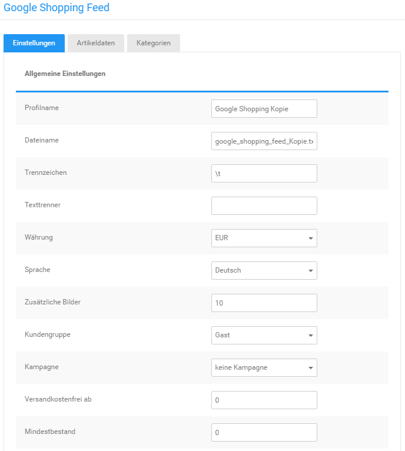
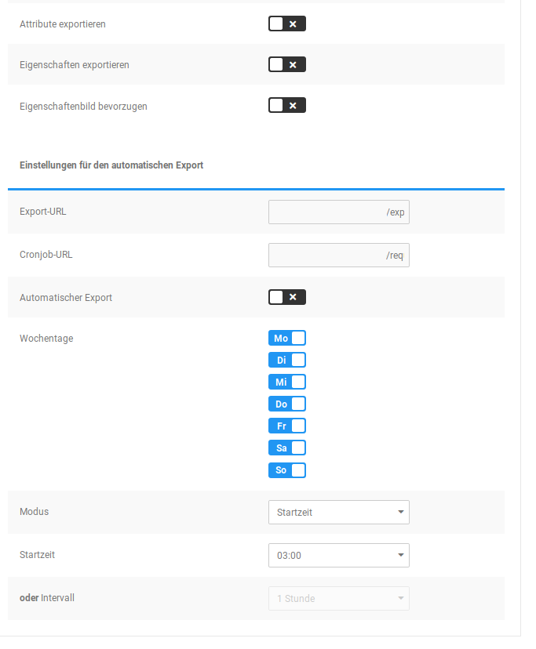

# Einstellungen 

Wenn du ein Export-Profil anlegst oder bearbeitest, gelangst du in den Reiter Einstellungen, den wir nachfolgend erläutern. Standard-Belegungen eines Felds sind in eckigen Klammern \[ \] angegeben.

## Allgemeine Einstellungen 

|Feldname|Beschreibung|
|--------|------------|
|Profilname|Name des Export-Profils|
|Dateiname|Dateiname der Export-Datei|
|Trennzeichen|Steuerzeichen zum Trennen der Spalten \[\\t\]|
|Texttrenner|Steuerzeichen zum Markieren von Inhalten \[\]|
|Währung|Währung in der Preise exportiert werden \[EUR\]|
|Sprache|Der Artikelname und die Artikelbeschreibung\(en\) werden in dieser Sprache exportiert \[Deutsch\]|
|Zusätzliche Bilder|Maximale Anzahl der Einträge für die Spalte Zusätzliche Bilder \[10\]|
|Kundengruppe|Die Preise für diese Kundengruppe werden exportiert \[Gast\]|
|Kampagne|Kampagne die für den Export verwendet werden soll \[keine Kampagne\]|
|Versandkostenfrei ab|Warenwert ab dem kostenfreier Versand erfolgt \[0\]|
|Mindestbestand|Minimaler Lagerstand für einen Export des Artikels \[0\]|
|Attribute exportieren|Ist die Einstellung gesetzt, werden Attribute beim Export berücksichtigt. Jeder Optionswert \(Auswahl bei einem Attribut\) wird als eigenständiger Artikel exportiert \[x\]|
|Eigenschaften exportieren|Ist die Einstellung gesetzt, werden Eigenschaften beim Export berücksichtigt. Jede Kombination \(Auswahl aller Eigenschaften eines Artikels\) wird als eigenständiger Artikel exportiert \[x\]|
|Eigenschaftenbild bevorzugen|Ist die Einstellung gesetzt, wird anstelle des Artikelbilds das Kombinationsbild der jeweiligen Kombination exportiert, sofern vorhanden \[x\]|

## Einstellungen für den automatischen Export 

|Feldname|Beschreibung|
|--------|------------|
|Export-URL|URL der Export-Datei|
|Cronjob-URL|URL zum Aufrufen des automatischen Exports, muss beim Hoster bzw. Cronjob-Anbieter eingetragen werden|
|Automatischer Export|Ist die Einstellung gesetzt, wird das Export-Profil für den automatischen Export berücksichtigt \[x\]ACHTUNG: damit der Export automatisch vorgenommen wird, muss bei deinem Hosting-Anbieter ein Cronjob eingerichtet werden

|
|Wochentage|Der automatische Export wird an den aktivierten Wochentagen \(blau hinterlegt\) vorgenommen \[Mo, Di, Mi, Do, Fr, Sa, So\]|
|Modus|Legt fest ob der automatische Export zu einer bestimmten Startzeit oder in einem regelmäßigen Intervall vorgenommen wird \[Startzeit\]|
|Startzeit|Zeitpunkt zu dem der automatische Export gestartet wird \[03:00\] HINWEIS: wird als Modus Intervall gewählt, ist die Einstellung **ausgegraut**|
|oder Intervall|Intervall in dem der automatische Export durchgeführt wird \[1 Stunde\] HINWEIS: wird als Modus Startzeit gewählt, ist die Einstellung **ausgegraut**|

Bestätige vorgenommene Änderungen mit einem Klick auf Speichern. Über Abbrechen verlässt du die Einstellungen des Profils ohne die Änderungen zu speichern.

## Hinweis zu automatischen, zeitgesteuerten Exporten 

Damit - unabhängig von manuellen Exporten per Klick - automatisch Exporte stattfinden können, muss ein sogenannter Cronjob eingerichtet werden. Dazu wird eine URL bei deinem Hoster hinterlegt, die von diesem regelmäßig aufgerufen wird. Wenn die URL aufgerufen wird, prüft der Shop welche Aktionen für den aktuellen Zeitpunkt auszuführen sind und führt diese dann aus.

Die Einrichtung beim Hoster selbst ist für diesen spezifisch und kann daher nicht allgemein erklärt werden. Fragen dazu wird dir dein Hoster gerne beantworten. Bitte beachte, dass oftmals vor der URL ein Kommando eingetragen werden muss wie wget oder curl, beachte hier die Hilfen deines jeweiligen Hosters.

Manche Hoster unterstützen keine Cronjobs, in diesem Fall kannst du über spezielle Anbieter für Cronjobs dennoch Gebrauch vom automatischen Export machen.

Beachte auch, dass der Cronjob für einen regelmäßigen Aufruf von 1x pro Minute eingerichtet werden muss. Der Export kann je nach Größe in mehreren Arbeitsschritten erfolgen, sodass bei nur einmaliger Ausführung eines Cronjobs zum Exportzeitpunkt eventuell kein vollständiger Export erzeugt wird. Befürchte hier keine Überlast durch den häufigen Aufruf der Cronjob URL, wenn keine Aufgaben abzuarbeiten sind, beendet sich der Aufruf des Shops sofort.

