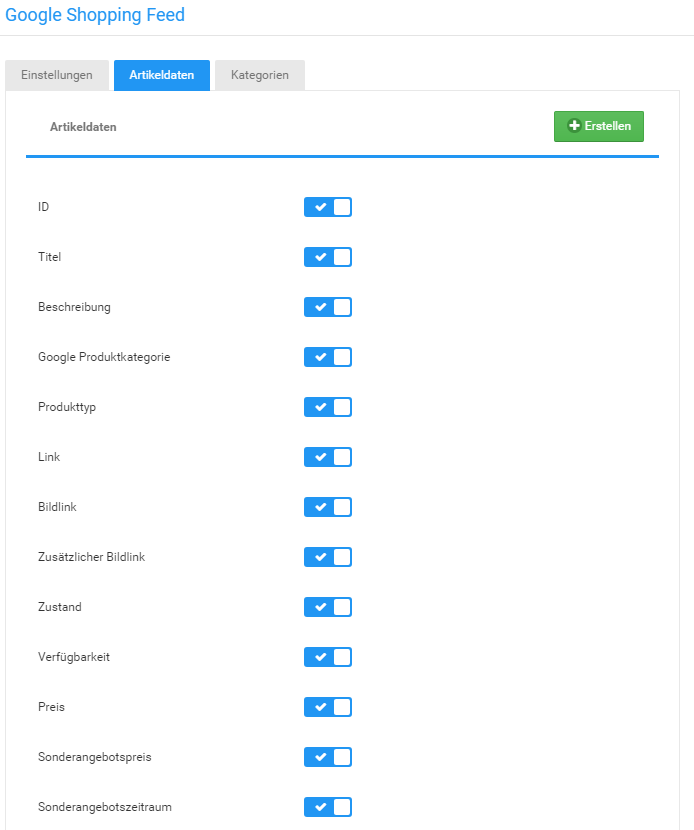
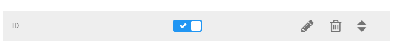
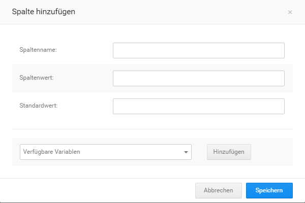
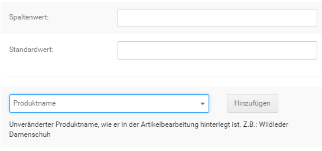
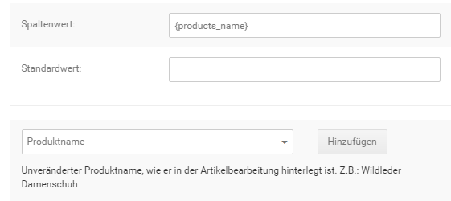

# Artikeldaten {#google_shopping_artikeldaten}

Über den Reiter Artikeldaten werden die Spalten des Export-Profils aufgeführt. Durch Setzen oder Entfernen des Hakens neben dem Spaltennamen kann festgelegt werden ob eine Spalte exportiert werden soll.

Wird der Mauszeiger über einen Spalten-Eintrag bewegt, werden die möglichen Aktionen hierfür angezeigt:

Diese sind von links nach rechts:

-   bearbeiten
-   löschen
-   verschieben

Die Aktionen bearbeiten und löschen können über einen Mausklick ausgelöst werden. Um eine Spalte zu verschieben, klicke das Pfeilsymbol an und halte die Maustaste gedrückt. Ziehe anschließend die Maus nach oben oder unten, um die Position der Spalte zu ändern.

## Spalte hinzufügen / bearbeiten { .section}

Klicke auf Erstellen um eine neue Spalte hinzuzufügen. Klicke auf das Bleistift-Icon einer Spalte, um diese zu bearbeiten.

In dem sich nun öffnenden Fenster kann der Spaltenname, Spaltenwert sowie ein Standardwert festgelegt werden. Der Spaltenwert wird anhand einer Variable defniert, die über einen Variablennamen in geschweiften Klammern in das Feld Spaltenwert eingetragen wird.

Die Eintragung muss jedoch nicht von Hand vorgenommen werden. Klicke auf das nach unten weisende Dreieck, um eine Liste der möglichen Werte für den Export anzuzeigen. Klicke einen Eintrag an, um eine genaue Beschreibung seines Verwendungszwecks zu erhalten. Wenn du dir sicher bist dass du die gewählte Variable verwenden möchtest, klicke auf Hinzufügen.

Über Klick auf Speichern wird die Spalte angelegt bzw. die Änderung an einer bestehenden Spalte gespeichert. Über Abbrechen gelangst du zurück zur Übersicht ohne eine Spalte anzulgen bzw. ohne die Änderungen zu speichern.

