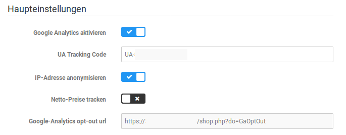
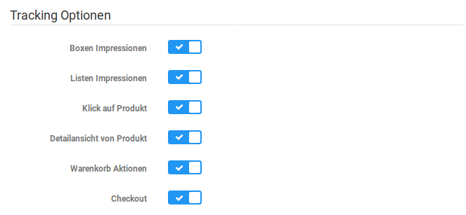
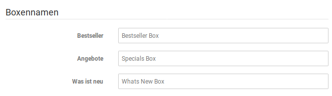
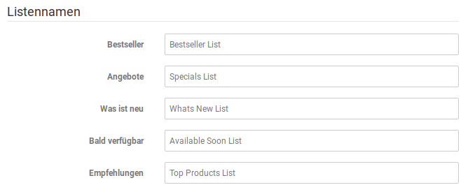
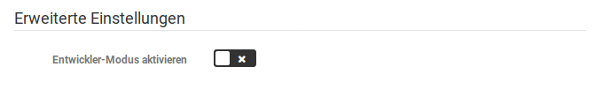

# Konfiguration 

Bevor Daten erfasst werden können, muss das Modul im Reiter Konfiguration eingerichtet werden.

## Haupteinstellungen { .section}

|Feldname|Beschreibung|
|--------|------------|
|Netto-Preise tracken|Auswahl, ob Analytics Netto- oder Bruttopreise erfassen soll.|
|IP-Adresse anonymisieren|Auswahl, ob die IP-Adressen der Besucher anonymisiert werden soll. Empfohlene Einstellung ist ✔.|
|Google Analytics aktivieren|Hier kann das Tracking durch Google Analytics aktiviert oder deaktiviert werden.|
|UA Tracking Code|Deine UA-ID, die beim Anlegen einer Property bei Google Analytics erstellt wird. Diese ID kann in Google Analytics in den Property-Einstellungen nachgesehen werden.|
|Google-Analytics opt-out-url|Über den hier ausgegebenen Link können Besucher des Shops erreichen, dass ihre Daten nicht von Google Analytics erfasst werden. Dieser Link wird benötigt, wenn die Opt-out-Möglichkeit manuell angegeben werden muss.|

## Tracking Optionen { .section}

|Feldname|Beschreibung|
|--------|------------|
|Boxen Impressionen|Sollen Aufrufe der Boxen Bestseller, Angebote und Was ist neu getrackt werden?|
|Listen Impressionen|Sollen Aufrufe der Listen Bestseller, Angebote, Was ist neu, Bald verfügbar und Empfehlungen getrackt werden?|
|Klick auf Produkt|Wenn aktiv, wird der Klick auf das Produckt getrackt|
|Detailansicht von Produkt|Trackt die Aufrufe der Produktseiten. Interessant bei direkten Aufrufen im Vergleich zu der Anzahl der Klicks auf Produkt|
|Warenkorb-Aktionen|Trackt die Warenkorb-Aktionen|
|Checkout|Trackt den Ablauf des Checkouts, so kann verfolgt werden, auf welcher Seite die Kunden am häufigsten aussteigen.|

## Boxennamen { .section}

Über diese Eingabefelder können die Boxennamen geändert werden. Dies vereinfacht die Zuordnung der Werte, wenn man diese Boxen im Shop umbenannt hat.

## Listennamen { .section}

Auch hier ist eine Änderung der Bezeichnungen möglich, hier die der angeführten Listen.

## Erweiterte Einstellungen { .section}

Während der Scriptcode im Livebetrieb soweit aufbereitet wird, dass Adblocker diesen in der Regel nicht blocken können, ist dies bei aktiviertem Entwickler-Modus nicht der Fall. Der unveränderte Scriptcode ermöglicht Tests, z.B. mit dem Google Tag Manager, führt aber gleichzeitig auch dazu, dass der Code von Adblockern blockiert werden kann. Der Entwicklermodus sollte daher nur aktiviert werden, wenn eine genauere Analyse ansteht, die der Weiterentwicklung des Moduls dient.

CAUTION:

Im normalen Betrieb sollte der Entwickler-Modus unbedingt deaktiviert werden!

