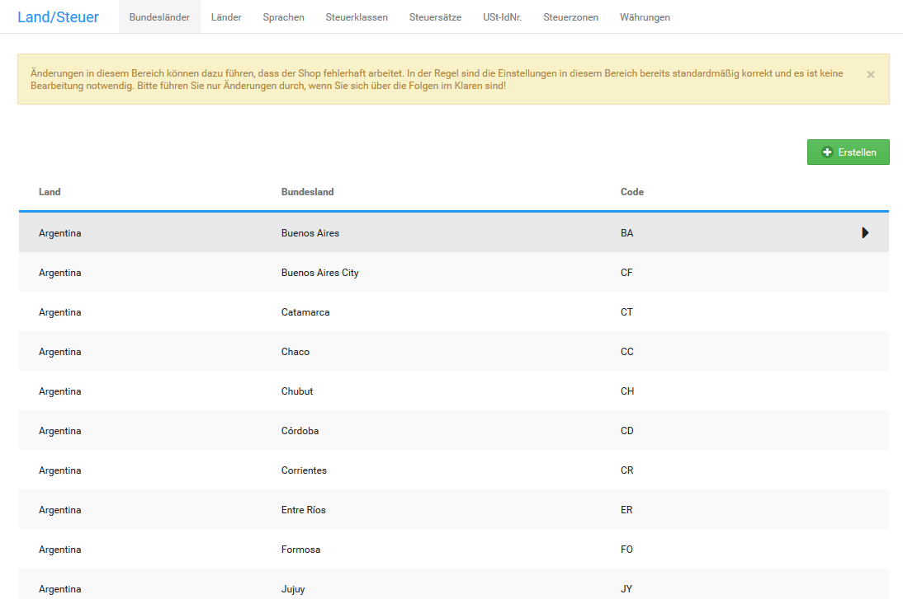

# Länder

!!! note "Hinweis" 
	 In der Installationsroutine wird nur der Versand innerhalb Deutschlands aktiviert. Wenn du deinen Shop in einem anderen Land betreiben, oder in andere Länder verschicken möchtest, müssen alle Zielländer unter _**Shop Einstellungen \> Land/Steuer \> Länder**_ bzw. _**Einstellungen / Sprachen, Länder, Steuern / Länder**_, nach Aufruf der Seite, separat aktiviert werden.

## Länder aktivieren

Länder, die Kunden beim Anlegen einer Adresse auswählen können, müssen einzeln aktiviert werden. Für die Ländergruppe Deutschland, Österreich und Schweiz sowie für alle Länder findest du unterhalb der Länderliste Schaltflächen zum gleichzeitigen Aktivieren.

Klicke auf _**D, A, CH aktivieren**_, um die Ländergruppe Deutschland, Österreich und Schweiz zur Auswahl in Adressformularen zu aktivieren.

Klicke auf _**alle aktivieren**_, um alle Länder zur Auswahl in Adressformularen zu aktivieren.

### Einzelne Länder aktivieren

So aktivierst du ein einzelnes Land zur Auswahl in Adressformularen:

1.  Rufe deinen Onlineshop im Gambio Admin unter _**Shop Einstellungen \> Land/Steuer \> Länder**_ bzw. _**Einstellungen / Sprachen, Länder, Steuern/ Länder**_ auf
2.  Suche das gewünschte Land aus der Liste aus
3.  Klicke auf das Kästchen in der Spalte _**Status**_, sodass dort ein Haken angezeigt wird.

## Länder deaktivieren

Länder, die Kunden beim Anlegen einer Adresse nicht mehr auswählen dürfen, müssen einzeln deaktiviert werden.

Klicke unterhalb der Länderliste auf _**Alle deaktivieren**_, um alle Länder zur Auswahl in Adressformularen zu deaktivieren.

### Einzelne Länder deaktivieren

So deaktivierst du ein einzelnes Land zur Auswahl in Adressformularen:

1.  Rufe deinen Onlineshop im Gambio Admin unter _**Shop Einstellungen \> Land/Steuer \> Länder**_ bzw. _**Einstellungen / Sprachen, Länder, Steuern / Länder**_ auf
2.  Suche das gewünschte Land aus der Liste aus
3.  Klicke auf das blaue Kästchen mit dem Haken in der Spalte _**Status**_

## Länder hinzufügen

Wenn du den Versand in ein Land erlauben möchtest, das in der Liste nicht erfasst ist, füge das Land unter _**Shop Einstellungen \> Land/Steuer \> Länder**_ bzw. _**Einstellungen / Sprachen, Länder, Steuern / Länder**_, nach Aufruf der Seite, hinzu.

1.  Klicke auf _**Erstellen**_

    In der rechten Spalte öffnet sich die Eingabemaske für ein neues Land

2.  Trage im Feld _**Name**_ den Namen des Landes ein
3.  Trage im Feld _**ISO Code \(2\)**_ den zweistelligen ISO Code des Landes ein

    Der zweistellige ISO Code wird für die Zuordnung der Versandkosten verwendet.

4.  Trage im Feld _**ISO Code \(3\)**_ den dreistelligen ISO Code des Landes ein
5.  Wähle aus der Liste _**Adressformat**_ das zu verwendende Adressformat für das neue Land aus

    Eine Übersicht der verfügbaren Adressformate findest du in den nachfolgenden Beispielen

6.  Klicke auf _**Einfügen**_

!!! danger "Achtung"

	 Der ISO Code wird zur Identifizierung deines Landes bei der Berechnung der Versandkosten verwendet. ISO Codes müssen einmalig sein, sie dürfen in der Länderliste kein zweites Mal vorkommen. ISO Codes dürfen außerdem nur aus Buchstaben, vorzugsweise Großbuchstaben, bestehen.

!!! example "Beispiel Adressformat 1"

	 Max Mustermann

	 Musterweg 1A

	 Musterstadt, 12345

	 Bundesland, Musterland

!!! example "Beispiel Adressformat 2"

	 Max Mustermann

	 Musterweg 1A

	 Musterstadt, Bundesland 12345

	 Musterland

!!! example "Beispiel Adressformat 3"

	 Max Mustermann

	 Musterweg 1A

	 Musterstadt

	 12345 – Bundesland, Musterland

!!! example "Beispiel Adressformat 4" 

	 Erika Mustermann

	 Musterweg 27B

	 Musterstadt \(12345\)

	 Musterland

!!! example "Beispiel Adressformat 5" 

	 Erika Mustermann

	 Musterweg 27B

	 12345 Musterstadt

	 Musterland

Dein neues Land muss abschließend einer Steuerzone zugewiesen werden, damit die Steuern bei der Summenberechnung korrekt ermittelt werden können. Rufe den Gambio Admin deines Shops unter _**Shop Einstellungen \> Land/Steuer \> Steuerzonen**_ bzw. _**Einstellungen / Sprachen, Länder, Steuern / Steuerzonen**_ auf.

1.  Wähle die Steuerzone aus, der dein neues Land angehört
2.  Klicke auf _**Details**_ \(►\)
3.  Klicke auf _**Erstellen**_
4.  Wähle aus der Liste _**Land**_ dein neues Land aus
5.  Klicke auf _**Einfügen**_

Dein neues Land wurde der gewählten Steuerzone zugewiesen.

!!! danger "Achtung"

	 Jedes Land darf nur jeweils einer Steuerzone zugewiesen werden. Wenn du ein Land mehr als einer Steuerzone zuweist, können die Steuern nicht korrekt berechnet werden.
	 
	 
## Länder löschen

!!! danger "Achtung"

	 Lösche ausschließlich Länder, die du selbst angelegt hast!

Wenn du ein neu angelegtes Land nicht mehr benötigst, kannst du es wieder aus der Länderliste unter _**Shop Einstellungen \> Land/Steuer \> Länder**_ bzw. _**Einstellungen / Sprachen, Länder, Steuern / Länder**_ entfernen.

1.  Wähle das zu löschende Land aus der Länderliste aus

    Die ausgewählte Zeile wird grau hinterlegt.

2.  Überprüfe in der rechten Spalte, dass das korrekte Land ausgewählt ist
3.  Klicke auf _**Löschen**_
4.  Klicke erneut auf _**Löschen**_, um das Löschen zu bestätigen

## Bundesländer

Die Bundesländer für selbst angelegte Länder und voreingestellte Länder kannst du unter _**Shop Einstellungen \> Land/Steuer \> Bundesländer**_ bzw. _**Einstellungen / Sprachen, Länder, Steuern / Bundesländer**_, nach Aufruf der Seite, festlegen.

!!! note "Hinweis" 
	 Im Installationsumfang werden nur Bundesländer für europäische Länder und große Länder außerhalb Europas angelegt. Die politische Entwicklung kann nicht in jeder Shopversion berücksichtigt werden, vereinzelt können Bundesländer daher nicht mehr aktuell sein.

### Bundesland hinzufügen

Wenn du ein neues Land anlegst, oder in einem Lieferziel ein neues Bundesland entstanden ist, lege unter _**Shop Einstellungen \> Land/Steuer \> Bundesländer**_ bzw. _**Einstellungen / Sprachen, Länder, Steuern / Bundesländer**_, nach Aufruf der Seite, ein neues Bundesland an.

1.  Klicke auf _**Erstellen**_ oberhalb der Bundesland-Liste
2.  Trage den Namen des Bundeslandes im Feld _**Name des Bundeslandes**_ ein
3.  Trage den Kurznamen des Bundeslandes im Feld _**Code des Bundeslandes**_ ein
4.  Wähle aus der Liste _**Land**_ das Land aus, dem du das Bundesland zuweist
5.  Klicke auf _**Einfügen**_

### Bundesland bearbeiten

Wenn die Details eines Bundeslandes in einem deiner Lieferziele geändert wurden, passe das jeweilige Bundesland unter _**Shop Einstellungen \> Land/Steuer \> Bundesländer**_ bzw. _**Einstellungen / Sprachen, Länder, Steuern / Bundesländer**_, nach Aufruf der Seite, an.

1.  Wähle das zu bearbeitende Bundesland aus der Liste _**Bundesländer**_ aus

    Das aktive Bundesland ist grau hinterlegt.

2.  Klicke auf _**Bearbeiten**_
3.  Nimm die gewünschten Änderungen vor
4.  Klicke auf _**Aktualisieren**_

### Bundesland löschen

Wenn du ein Bundesland aus einem selbst angelegten Land nicht mehr benötigst, lösche das Bundesland unter _**Shop Einstellungen \> Land/Steuer \> Bundesländer**_ bzw. _**Einstellungen / Sprachen, Länder, Steuern / Bundesländer**_, nach Aufruf der Seite.

1.  Wähle das zu löschende Bundesland aus der Liste _**Bundesländer**_ aus

    Das aktive Bundesland ist grau hinterlegt.

2.  Klicke auf _**Löschen**_
3.  Klicke erneut auf _**Löschen**_, um das Löschen des gewählten Bundeslandes zu bestätigen

