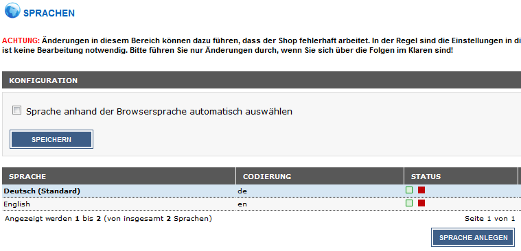
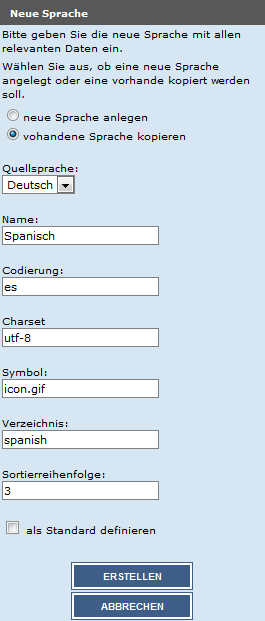
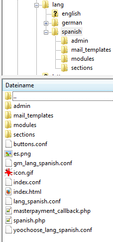
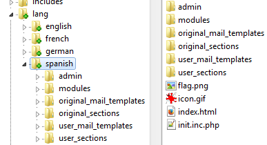

# Sprachen

## Sprachen anlegen ab Shopversion 2.1

!!! danger "Achtung"

	 Die neue Sprache sollte **auf keinen Fall** in der Spalte _**Status**_ aktiviert oder als Standard festgelegt werden, bevor sie auf dem FTP-Server korrekt installiert worden ist. Wir empfehlen die vorinstallierte Sprache _**Deutsch**_ als Standardsprache zu verwenden.

Das Shopsystem wird vollständig in Englisch und Deutsch lokalisiert ausgeliefert. Zusätzliche Sprachen können nachträglich hinzugefügt werden.

Öffne im Administrationsbereich den Menüpunkt _**Land/Steuer \> Sprachen**_ und klicke auf _**Sprache anlegen**_. Auf der rechten Seite öffnet sich eine Spalte. Hier findet die shopseitige Einrichtung der Sprache statt. Der Hauptbestandteil wird aber erst durch Kopieren der entsprechenden Dateien auf den FTP-Server erstellt. Ein alleiniges Anlegen der Sprache im Administrationsbereich ist keine vollständige Installation. Wenn die Sprache hier aktiv geschaltet wird, bevor die Installation auf dem Server besteht, kann es zu schwerwiegenden Fehlern im Shop kommen! Du hast beim Anlegen der Sprache im Administrationsbereich folgende Einstellungsmöglichkeiten:

!!! note "Hinweis" 
	 Wir empfehlen grundsätzlich die Einstellung _**vorhandene Sprache kopieren**_ beizubehalten. _**Neue Sprache anlegen**_ kann in Ausnahmefällen verwendet werden, z.B., wenn bereits Sprachdateien aus einer anderen Quelle vorliegen.

	 Verwende die Einstellung _**vorhandene Sprache kopieren**_, um z.B. Artikel- und Kategoriebeschreibungen mit zu übernehmen. Unter _**Quellsprache**_ kann die Sprache hierzu ausgewählt werden.

	 Wenn die Sprache mit der Einstellung _**neue Sprache anlegen**_ festgelegt wurde, müssen ggf. die einzelnen Kategorien unter _**Artikel \> Artikel/Kategorien**_ bearbeitet und neu gespeichert werden, bevor diese aufgerufen werden können.

Gib unter _**Name**_ den Namen der Sprache ein \(Beispiel: Spanisch\). Bei _**Codierung**_ gibst du den zweistelligen ISO-Code für deine Sprache ein \(Beispiel für Spanisch: es\). Gib bei Charset _**utf-8**_ ein. Gib bei _**Verzeichnis**_ den Namen des hochzuladenen Verzeichnisses auf deinem FTP-Server an \(Beispiel: spanish\). **Achte bei diesen beiden Eingaben bitte auf die genaue Schreibweise!**

Dies ist deshalb notwendig, damit sich der Shop auf die richtigen Verzeichnisse und Dateien beziehen kann. Anderenfalls können die übersetzten Sprachdateien nicht gefunden werden.

In das Feld _**Sortierreihenfolge**_ trägst du die gewünschte Sortierreihenfolge der Sprache ein. Die Sortierreihenfolge hat Einfluss auf die Position der Eingabefelder für diese Sprache in den Artikel- und Kategorie-Eingabemasken sowie in der Sprachwahl im Administrations- und Shopbereich.

Kopiere das Verzeichnis _**Shopsystem\\Dateien\\lang\\german**_ von der Installations-CD oder aus dem Installationsarchiv auf deinem Computer. Als Beispiel wird im Folgenden die Sprache Spanisch hinzugefügt. Benenne das zuvor kopierte Verzeichnis _**german**_ auf deinem Computer in _**spanish**_ um. Wir empfehlen, den englischen Namen der Sprache in Kleinbuchstaben zu verwenden.

Wechsele in das Verzeichnis _**spanish**_ auf deinem Computer. Benenne die nachfolgenden Dateien wie beschrieben um:

!!! danger "Achtung"

	 Achte beim Umbenennen darauf, den Rest des Dateinamens nicht zu verändern. Auch die Anzahl der Unterstriche muss erhalten bleiben!

	 Halte dich beim Übersetzen unbedingt an die vorliegende Struktur. Eine fehlerhafte Übersetzungsdatei kann den Shop in der gewählten Sprache unbenutzbar machen.

|Alter Name|Neuer Name|
|----------|----------|
|de.png|es.png|
|german.php|spanish.php|
|gm\_lang\_german.conf|gm\_lang\_spanish.conf|
|lang\_german.conf|lang\_spanish.conf|
|yoochoose\_lang\_german.conf|yoochoose\_lang\_spanish.conf|
|admin/german.php|admin/spanish.php|

!!! note "Hinweis" 
	 Wenn du die Sprache _**neu anlegst**_, anstatt eine vorhandene Sprache zu kopieren \(entsprechend der Einstellungen unter _**Land/Steuer \> Sprachen**_\), müssen ggf. weitere Sections-Dateien eingebunden werden. Wechsele hierzu in das Verzeichnis _**spanish/sections/\_samples**_ und verschiebe alle benötigten Dateien in das Verzeichnis _**spanish/sections**_. Benenne die mit _**lang\_\_**_ beginnenden Dateien so um, dass der Name der neuen Sprache im Dateinamen verwendet wird, also statt

	 _**lang\_\_german\_\_admin\_\_german\_\_\_php.lang.inc.php**_

	 muss die Datei folgendermaßen heißen:

	 _**lang\_\_spanish\_\_admin\_\_spanish\_\_\_php.lang.inc.php**_

Nimm in den _**.conf**_ und _**.php**_ Dateien die notwendigen Übersetzungen vor. Die Übersetzungsdateien für die Shopansicht findest du in den Verzeichnissen _**spanish**_ und _**spanish/sections**_. Übersetzungsdateien für Zusatzmodule befinden sich im Verzeichnis _**spanish/modules**_ in den jeweiligen Unterverzeichnissen.

Kopiere ein GIF-Bild der Landesfahne der Zielsprache nach _**spanish/icon.gif**_. Die Abmessungen sollten 32x35 Pixel betragen. Kopiere anschließend ein GIF-Bild der Landesfahne nach _**spanish/admin/images/icon.gif**_. Die Abmessungen für diese Grafik sollten 18x13 Pixel betragen.

Anschließend müssen noch organisatorische Änderungen an folgenden Dateien im Verzeichnis \\lang vorgenommen werden:

-   \\spanish\\admin\\spanish.php
-   \\spanish\\modules\\payment\\shopgate.php
-   \\spanish\\spanish.php

Hierzu zählen:

-   Pfadinformationen:

Es wird z.B. auf _**lang/german/german.php**_ verwiesen, hier müssen Verzeichnisse und Dateien zu _**spanish**_ umbenannt werden. Also beispielsweise folgendermaßen:

_**lang/spanish/spanish.php**_

-   Spracheinstellungen für die Datenbank

Dies kann z.B. in Zeilen dieser Art vorkommen:

_**@setlocale\(LC\_TIME, 'de\_DE.utf8', 'de\_DE.UTF-8', 'de\_DE@euro', 'de\_DE', 'de-DE', 'de', 'ge', 'German'\);**_

_**define\('HTML\_PARAMS','dir="ltr" lang="de"'\);**_

Ändere diese Zeilen für unser Beispiel Spanisch wie folgt:

_**@setlocale\(LC\_TIME, 'es\_ES.utf8', 'es\_ES.UTF-8', 'es\_ES@euro', 'es\_ES', 'es-ES', 'es', 'es', 'Spanish'\);**_

_**define\('HTML\_PARAMS','dir="ltr" lang="es"'\);**_

-   Währungseinstellungen

_**define\('LANGUAGE\_CURRENCY', 'EUR'\);**_

Hier sollten die Länder- und Währungscodes entsprechend angepasst werden. Für unser Beispiel Spanisch kann dieser Eintrag beibehalten werden.

Lade das Verzeichnis _**spanish**_ mit allen übersetzten Dateien und Unterverzeichnissen in das Verzeichnis _**/lang**_ im Shopverzeichnis auf deinem Webserver hoch.

Kopiere die Datei _**admin/yoochoose/yoo\_lang\_german.php**_ und benenne die Kopie in _**admin/yoochoose/yoo\_lang\_spanish.php**_ um. Nimm in dieser Kopie ebenfalls die nötigen Übersetzungen vor. Dupliziere folgende Ordner auf deinem FTP-Server und benenne sie in die Zielsprache um:

|Alter Name|Neuer Name|
|----------|----------|
|/templates/EyeCandy/buttons/german|/templates/EyeCandy/buttons/spanish|

Bitte beachte, dass dieser Schritt für alle verwendeten Templates wiederholt werden muss. Wenn z.B. ein Gambio MobileCandy vorhanden ist, sollte in den aufgeführten Verzeichnissen _**/templates/EyeCandy**_ gegen _**/templates/MobileCandy**_ ausgetauscht werden.

Abschließend kann die Sprache unter _**Land/Steuer \> Sprachen**_ über die Spalte _**Status**_ aktiviert werden. Sollten zu diesem Zeitpunkt noch Übersetzungen notwendig sein, können diese über _**Toolbox \> Texte anpassen**_ vorgenommen werden. Anschließend sollte unter _**Toolbox \> Cache leeren**_ der _**Cache für Modulinformationen**_ geleert werden.

!!! note "Hinweis" 
	 Wenn du Module externer Hersteller verwendest, müssen hier ggf. weitere Sprachdateien kopiert und übersetzt werden. Diese befinden sich im Regelfall im jeweiligen Modulverzeichnis in einem Unterordner_** /lang/...**_.

## Sprachen anlegen ab Shopversion 2.3

Das Shopsystem wird vollständig in Englisch und Deutsch lokalisiert ausgeliefert. Zusätzliche Sprachen können nachträglich hinzugefügt werden. Hierzu sind sowohl Schritte im Administrationsbereich/Gambio Admin des Shops als auch auf dem FTP-Server notwendig.

### Anlegen der Sprache im Administrationsbereich/Gambio Admin

Öffne im Gambio Admin den Menüpunkt _**Shop Einstellungen \> Land/Steuer \> Sprachen**_ bzw. _**Einstellungen / Sprachen, Länder, Steuern / Sprachen**_ und klicke ggf. auf _**aufrufen**_ und dann auf _**Erstellen**_. Auf der rechten Seite öffnet sich eine Spalte. Hier findet die shopseitige Einrichtung der Sprache statt. Der Hauptbestandteil wird aber erst durch Kopieren der entsprechenden Dateien auf den FTP-Server erstellt. Ein alleiniges Anlegen der Sprache im Administrationsbereich/ Gambio Admin ist keine vollständige Installation.

!!! note "Hinweis" 
	 Eine im Gambio Admin neu angelegte Sprache kann so lange nicht aktiviert werden, bis die Installation des Sprach-Verzeichnisses auf dem FTP-Server abgeschlossen ist. Ausstehende Dateien und Verzeichnisse werden mit einem entsprechenden Hinweis angezeigt.

Du hast beim Anlegen der Sprache im Gambio Admin folgende Einstellungsmöglichkeiten: Wähle zunächst ob du eine _**neue Sprache anlegen**_ oder _**vohandene Sprache kopieren**_ möchtest. Letzteres ist die vorgesehene Auswahl, da Datenbankinhalte der Quellsprache so übernommen werden. Stelle in diesem Fall unter _**Quellsprache**_ die Sprache ein, aus der du die Inhalte kopieren möchtest \(Standard: Deutsch\).

Gib unter _**Name**_ den Namen der Sprache ein \(Beispiel: _**Spanisch**_\). In das Feld _**Codierung**_ muss der zweistellige ISO-Code für deine Sprache eingetragen werden \(Beispiel für Spanisch: _**es**_\), in das Feld _**Charset**_ die vorgesehene Zeichencodierung: _**utf-8**_. Gib bei _**Verzeichnis**_ den Namen des hochzuladenen Verzeichnisses auf deinem FTP-Server an \(Beispiel: _**spanish**_\). Achte bei diesen beiden Eingaben bitte auf die genaue Schreibweise!

Dies ist deshalb notwendig, damit sich der Shop auf die richtigen Verzeichnisse und Dateien beziehen kann. Anderenfalls können die übersetzten Sprachdateien nicht gefunden werden. In das Feld _**Sortierreihenfolge**_ kannst du die gewünschte Sortierreihenfolge der Sprache eintragen. Die Sortierreihenfolge hat Einfluss auf die Position der Eingabefelder für diese Sprache in den Artikel- und Kategorie-Eingabemasken sowie in der Sprachwahl im Administrations- und Shopbereich.

Zudem müssen Einstellungen für die Formate von Datum und Uhrzeit, sowie die verwendete Währung vorgenommen werden. Nachfolgend findest du die Standardbelegung für die Quellsprache _**Deutsch**_.

|Feldname|Standardwert \(Sprache Deutsch\)|
|--------|--------------------------------|
|Datumsformat|d.m.Y|
|Datumsformat \(Tag, lang\)|%A, %d. %B %Y|
|Datumsformat \(Tag, kurz\)|%d.%m.%Y|
|Datumsformat \(Tag und Uhrzeit\)|%d.%m.%Y %H:%M:%S|
|Datumsformat \(Geburtsdatum\)|tt.mm.jjjj|
|HTML Parameter|dir="ltr" lang="de"|
|Währung|EUR|
|Datumsformat \(PHP, Tag und Uhrzeit\)|d.m.Y H:i:s|

Ändere hier den Eintrag _**lang="de"**_ entsprechend des Ländercodes ab, in unserem Beispiel also zu _**lang="es"**_. Bei anderen Sprachen außerhalb des Euro-Raumes muss ggf. unter _**Währung**_ der Währungscode _**EUR**_ ebenfalls angepasst werden.

### Anlegen der Sprache auf dem FTP-Server

Kopiere das Verzeichnis _**Shopsystem\\Dateien\\lang\\german**_ von der Installations-CD bzw. aus dem Installationsarchiv deines Shops der Versionsreihe 2.3 oder höher auf deinen Computer. Altnernativ kannst du auch den Ordner direkt von deinem FTP-Server herunterladen. Als Beispiel wird im Folgenden die Sprache Spanisch hinzugefügt. Benenne das zuvor kopierte Verzeichnis german auf deinem Computer in spanish um. Wir empfehlen, den englischen Namen der Sprache in Kleinbuchstaben zu verwenden. Wechsele in das Verzeichnis spanish auf deinem Computer. Nun müssen an den Dateien

_**/spanish/init.inc.php**_

sowie

_**/spanish/admin/init.inc.php**_

verschiedene Anpassungen vorgenommen werden.

Ändere die Einträge

_**@setlocale\(LC\_TIME, 'de\_DE.utf8', 'de\_DE.UTF-8', 'de\_DE@euro', 'de\_DE', 'de-DE', 'de', 'ge', 'German'\);**_

so ab, dass statt _**de**_ bzw. _**DE**_ der jeweilige Ländercode, in unserem Beispiel _**es**_ bzw. _**ES**_, verwendet wird. Zudem muss der Name der Sprache in den letzten beiden Anführungszeichen angepasst werden.

Bevor die eigentliche Übersetzung vorgenommen wird, sollte der Inhalt des Ordners _**original\_sections**_ in den Ordner _**user\_sections**_ kopiert werden. Auf diese Weise steht jederzeit das Original des jeweiligen Sprach-Pakets zur Verfügung.

Nimm die Übersetzung anschließend in den Dateien und Unterverzeichnissen des Ordners _**user\_sections**_ vor. Lade abschließend das gesamte Sprachverzeichnis, in unserem Beipspiel also den Ordner _**spanish**_ in den Unterordler _**/lang/**_ deines Shops hoch.

Zudem sollten die Dateien, welche für die jeweilige Landesflage verwendet werden:

-   /lang/spanish/flag.png
-   /lang/spanish/icon.gif
-   /lang/spanish/admin/images/icon.gif

ausgetauscht werden. Typische Größen sind

-   flag.png: 16x11 px
-   icon.gif: 32x35 px \(sichtbar: 23x16 px\)
-   /admin/images/icon.gif: 18x13px

!!! note "Hinweis" 
	 Die standardmäßig im Gambio Admin verwendete _**icon.gif**_ kann wahlweise auch durch eine Datei mit anderem Namen ersetzt werden. Der Dateiname kann hierbei beim Bearbeiten der Sprache unter _**Shop Einstellungen \> Land/Steuer \> Sprachen**_ bzw. _**Einstellungen / Sprachen, Länder, Steuern / Sprachen**_, nach Aufruf der Seite, im Eingabefeld _**Symbol**_ angepasst werden. Bitte beachte, dass diese Datei sowohl im Sprachverzeichnis, also z.B. _**/lang/spanish/**_ als auch im Unterordner _**/admin/images/**_ des Sprachverzeichnisses \(z.B. _**/lang/spanish/admin/images/**_\) hinterlegt werden muss.

### Anpassungen und Übersetzungen für Zusatzmodule

Oftmals verwenden die Module von externen Anbietern eigene Sprachdateien, die separat angepasst werden müssen. Diese Module sind teilweise im Grundumfang des Shops vorhanden, standardmäßig sind hier z.B. _**yoochoose**_ und _**shopgate**_ betroffen.

Wenn hier keine Änderungen vorgenommen werden, wird standardmäßig die deutsche Sprache verwendet. Wenn du keines der genannten Module verwendest, kannst du diesen Abschnitt überspringen.

_**yoochoose**_

Die Einbindung für yoochoose findet in der Datei _**/lang/spanish/admin/init.inc.php**_ statt. Ändere hier folgende Pfadangabe ab:

_**$coo\_lang\_file\_master-\>init\_from\_lang\_file\('admin/yoochoose/yoo\_lang\_german.php'\);**_

Im Unterordner _**/admin/yoochoose/**_ des Shopverzeichnisses stehen die Dateien

-   yoo\_lang\_english.php
-   yoo\_lang\_german.php
-   yoo\_lang\_spanish.php

zur Verfügung. Ändere hier den Dateinamen entsprechend ab. Ggf. müssen in der neu zugewiesenen Datei _**yoo\_lang\_...**_ selbst noch Übersetzungen vorgenommen werden.

_**Shopgate**_

Die Einbindung von Shopgate findet in der Datei _**/lang/spanish/modules/payment/**_shopgate.php statt. Dort findest du die Zeile:

_**require\_once DIR\_FS\_CATALOG.'shopgate/gambiogx/lang/german/modules/payment/shopgate.php';**_

Hier sollte der im Unterordner _**/shopgate/gambiogx/lang/**_ gelegene Ordner _**german**_ heruntergeladen und umbenannt werden. Nimm die Übersetzungen in den enthaltenen Dateien entsprechend vor und benenne die Datei _**/admin/german.php**_ entsprechend der Sprache um. Für unser Beispiel würde die Datei also _**/admin/spanish.php**_ heißen. Lade anschließend das Verzeichnis wieder hoch.

### Aktivieren der Sprache im Shop

Nachdem alle Änderungen auf dem FTP-Server abgeschlossen worden sind, kann die Sprache im Administrationsbereich/Gambio Admin aktiviert werden. Gehe hierzu unter _**Shop Einstellungen \> Land/Steuer \> Sprachen**_ bzw. _**Einstellungen / Sprachen, Länder, Steuern / Sprachen**_ und setze für die jeweilige Sprache die Haken für _**aktiv im Frontend**_ bzw. _**aktiv im Backend**_. Anschließend müssen unter _**Toolbox \> Cache**_ die Caches für _**Texte**_ und _**E-Mail- Vorlagen**_ geleert werden.

!!! danger "Achtung"

	 Bei Änderungen an den Sprachen ist ein Leeren der Caches immer erforderlich. Anderenfalls kann es zu **Fehlermeldungen und fehlerhaften Darstellungen** im Shop kommen.
	 
## Vorhandene Sprachen für Shopversion 2.3 umwandeln

Mit der Shopversion _**2.3**_ wird ein vereinfachtes, optimiertes Sprachsystem eingeführt. Dies erfordert Anpassungen am Dateisystem von Sprachpaketen. Beim Update der Shopversion wird diese Änderung für die Standardsprachen _**Deutsch**_ und _**Englisch**_ standardmäßig vorgenommen. Zusätzliche Sprachen, die in Version _**2.1**_ oder _**2.2**_ angelegt worden sind, müssen manuell gemäß der neuen Anforderungen angepasst werden.

Beispiel eines Sprachpakets für Französisch \(Ordnername _**french**_, ISO-Code _**fr**_\):

### Folgende Dateien müssen umbenannt werden:

_**lang/french/french.php**_

in

_**lang/french/init.inc.php**_

_**lang/french/admin/french.php**_

in

_**lang/french/admin/init.inc.php**_

_**lang/french/fr.png**_

in

_**lang/french/flag.png**_

_**lang/french/sections**_

in

_**lang/french/original\_sections**_

_**lang/french/mail\_templates**_

in

_**lang/french/original\_mail\_templates**_

_**lang/french/original\_mail\_templates/admin/\_samples/create\_account\_mail.txt**_

in

_**lang/french/original\_mail\_templates/admin/\_samples/admin\_create\_account\_mail.txt**_

_**lang/french/original\_mail\_templates/admin/\_samples/create\_account\_mail.html**_

in

_**lang/french/original\_mail\_templates/admin/\_samples/admin\_create\_account\_mail.html**_

### sofern vorhanden ebenfalls umbennen:

_**lang/french/original\_mail\_templates/admin/create\_account\_mail.html**_

in

_**lang/french/original\_mail\_templates/admin/admin\_create\_account\_mail.html**_

_**lang/french/original\_mail\_templates/admin/create\_account\_mail.txt**_

in

_**lang/french/original\_mail\_templates/admin/admin\_create\_account\_mail.txt**_

### Folgende Dateien müssen verschoben werden:

_**lang/french/original\_mail\_templates/admin **_gesamter Inhalt

nach

_**lang/french/original\_mail\_templates**_

Die _**\_samples**_-Ordner werden beim Verschieben zusammengeführt.

_**lang/french/original\_mail\_templates/\_samples**_ \(gesamter Inhalt OHNE zu überschreiben\)

nach

_**lang/french/original\_mail\_templates**_

Bereits vorhandene Dateien bleiben erhalten. Die so ggf. nicht verschobenen Dateien können gelöscht werden.

### Ordner anlegen:

_**lang/french/user\_mail\_templates**_

_**lang/french/user\_sections**_

Im Administrationsbereich/Gambio Admin des Shops muss nun unter dem Menüpunkt _**Toolbox \> Cache leeren**_ bzw. _**Toolbox \> Cache**_ der Button _**Cache für Texte leeren**_ geklickt werden.

Anschließend sollte im Shop auf die französische Sprache gewechselt werden können, ohne dass Fehlermeldungen erscheinen.

Mit der neuen Shopversion wurden Texte verändert und hinzugefügt. Diese fehlen in zusätzlichen Sprachpaketen und müssten nachgepflegt werden.

Der Shop zeigt in diesem Fall für diese Texte den Wert aus der Standardsprache an, die im Administrationsbereich/Gambio Admin unter dem Menüpunkt _**Sprachen**_ definiert ist.