# Modul-Center 

Der Bereich _**Module \> Modul-Center**_ enthält eine Zusammenstellung von Modulen zu verschiedenen Anwendungszwecken, sowie einzelne Unterfunktionen des Shops, die hier aktiviert bzw. konfiguriert werden können. Genauere Informationen zu den einzelnen Modulen kannst du den zugeordneten Unterkapiteln oder der jeweiligen Modulanleitung entnehmen.

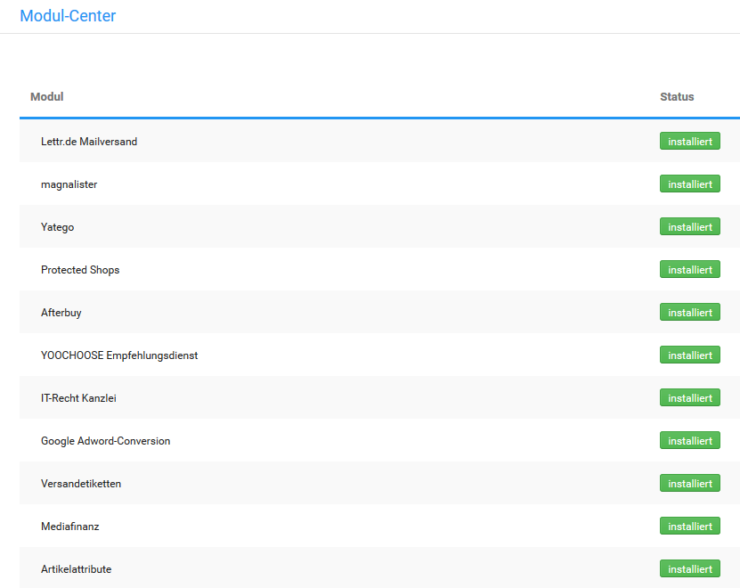

## Brickfox

### Installation

Das Brickfox-Modul ist Standardbestandteil des Shops und kann unter _**Module \> Modul-Center**_ installiert werden. Wähle hierzu den Eintrag _**Brickfox**_ in der Liste aus und klicke unten rechts auf _**Installieren**_.

### Konfiguration

Nach der Installation kann das Modul über den Button _**Bearbeiten**_ konfiguriert werden.

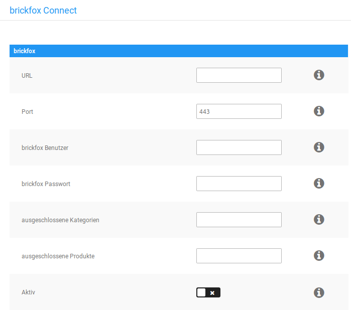

|Feldname|Beschreibung|
|--------|------------|
|URL|URL des brickfox-Servers|
|Port|Port des brickfox-Servers. Voreingestellt ist hier der Port 443|
|brickfox Benutzer|Brickfox Benutzername|
|brickfox Passwort|Brickfox Passwort|
|ausgeschlossene Kategorien|Kategorien, die nicht erfasst werden sollen, können hier anhand der Kategorie-ID angegeben werden.|
|ausgeschlossene Produkte|Artikel, die nicht erfasst werden sollen, können hier anhand der Produkt-ID angegeben werden.|
|Modul aktiv?|Setze den Haken ✔ um das Modul zu aktivieren. Entferne den Haken ✖ um das Modul zu deaktvieren.|

### Verwendung 

Die Benutzung erfolgt direkt über Brickfox, im Shop kann nur die Konfiguration vorgenommen werden. Bei allen Fragen zur Verwendung wende dich bitte an den Support von Brickfox \(https://www.brickfox.de/\).

## eKomi

### Installation

Das eKomi-Modul kann unter _**Module \> Modul-Center**_ installiert werden. Wähle hierzu den Eintrag _**eKomi**_ aus und klicke auf _**Installieren**_.

### Konfiguration

Nach der Installation steht der Button _**Bearbeiten**_ zur Verfügung. Hierüber kann die Konfigurationsseite aufgerufen werden. Die Einstellungen sind auf 3 verschiedene Tabs aufgeteilt.

#### Aktivierung

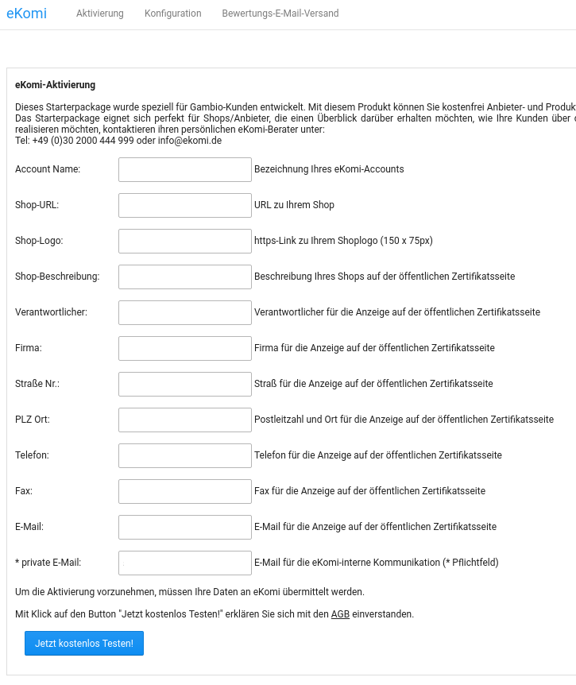

Über dieses Formular kannst du dich bei eKomi anmelden und die kostenlose Version nutzen. Diese ist allerdings in den Funktionen eingeschränkt, das eKomi Widget für den Shop z.B. kann hier nicht verwendet werden, dafür wäre ein Umstieg auf die kostenpflichtige Version nötig.

#### Konfiguration

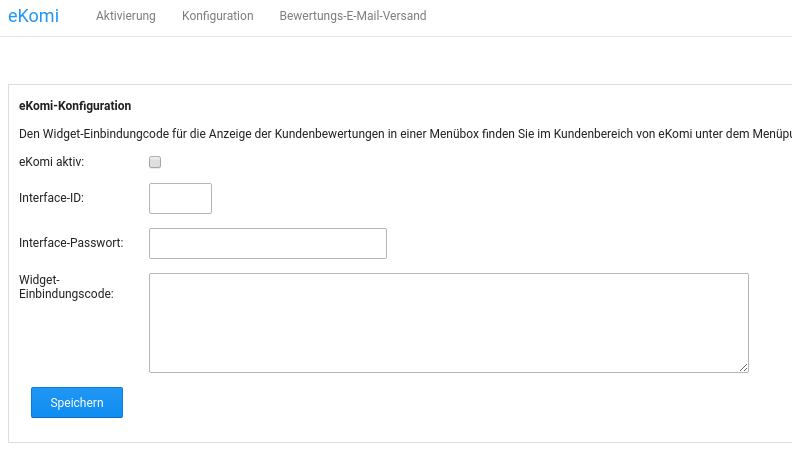

Nach der Anmeldung bei eKomi wird die _**Interface-ID**_ und das _**Interface-Passwort**_ automatisch ausgefüllt. Damit das Modul verwendet werden kann, muss der Haken bei _**eKomi aktiv**_ gesetzt werden. Das Verwenden eines Widget-Einbettungscodes ist nur mit einem kostenpflichtigen Vertrag mit eKomi möglich.

#### Bewertungs-E-Mail-Versand

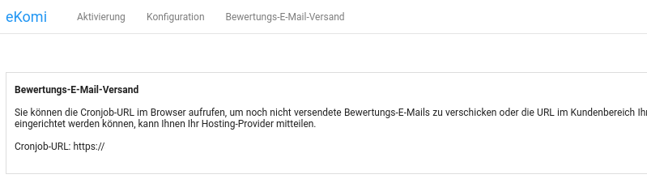

Es ist möglich, die noch nicht versendeten Bewertungsanfragen über einen CronJob auszulösen. Hierfür muss bei deinem Hosting-Provider oder einem anderen entsprechenden Anbieter eine CronJob-URL hinterlegt und der Aufruf eingerichtet werden. Die nötige _**CronJob-URL**_ wird im Shop ausgegeben \(im Screenshot unkenntlich gemacht\).

### Verwendung

Das eKomi-Modul versendet die Bewertungs-E-Mails standardmäßig automatisch. Zusätzlich gibt es in den Bestelldetails die Option _**ekomi-E-Mail senden**_, über die der Versand ausgelöst werden kann.

#### Bewertung

Der Link in der Bewertungs-E-Mail führt den Kunden zu einer Seite, auf der dieser den Shop \(nicht die Artikel\) bewerten kann.

## IT-Recht Kanzlei

### Installation

Das IT-Recht Kanzlei-Modul kann unter _**Module \> Modul-Center**_ installiert werden. Wähle hierzu den Eintrag _**IT-Recht Kanzlei**_ aus der Liste aus und klicke anschließend auf die Schaltfläche _**Installieren**_ in der rechten, unteren Bildschirm-Ecke. Für die Nutzung ist ein Vertrag mit IT-Recht Kanzlei nötig.

### Konfiguration

Nach der Installation kann das Modul konfiguriert werden. Wähle hierzu unter _**Module \> Modul-Center**_ den Eintrag _**IT-Recht Kanzlei**_ aus und klicke auf die Schaltfläche _**Bearbeiten**_ in der rechten, unteren Ecke des Bildschirms. Wurden bisher noch keine Einstellungen vorgenommen, erscheint eine Informationsseite. Über die Schaltfläche _**Jetzt buchen**_ gelangst du direkt zur Seite der IT-Recht Kanzlei.

#### Ersteinrichtung

Wechsele in den Reiter _**Konfiguration**_, um die Ersteinrichtung vorzunehmen und deinen Shop mit IT-Recht Kanzlei zu verbinden.

!!! danger "Achtung"

	 Damit der Shop erfolgreich mit IT-Recht Kanzlei verbunden werden kann, muss dieser unter _**Darstellung \> Shop online/offline**_ bzw. _**Inhalte \> Shop online/offline**_ online geschaltet werden. Anderenfalls ist ein Abgleich der Rechtstexte nicht möglich und die Anbindung kann nicht abgeschlossen werden.

##### API-Token

Der API-Token wird benötigt, um die Verbindung zwischen dem Shop und IT-Recht Kanzlei herzustellen. Der Token wird über den Button _**Token generieren**_ im Shop erstellt und dann bei IT-Recht Kanzlei in deinem Kundenkonto hinterlegt. Gehe hierzu wie folgt vor:

|Schritt|Anzeige|
|--------|-----------|
|1. Klicke auf den Link _**Schnittstellen verwalten**_ in der linken Seitenleiste||
|2. Wähle _**Online-Shop-AGB \(BASIC\)**_||
|3. Wähle bei IT-Recht _**Datenschnittstelle**_ aus||

Es öffnet sich nun ein Popup, über das die Art des Shops ausgewählt und der Token hinterlegt werden kann:

|Schritt|Anzeige|
|--------|-----------|
|1. Wähle das Shopsystem aus||
|2. Trage API-Token und Shop-URL ein|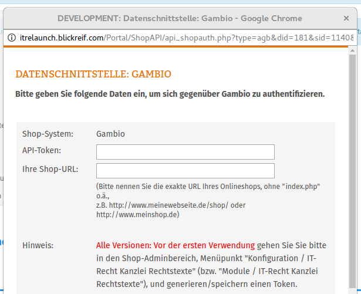|
|3. Rufe in einem zweiten Tab deines Browsers die Konfigurationsseite des Moduls im Gambio Admin auf und klicke unter _**Empfangene Texte**_ auf die Schaltfläche _**In Content-Manager verwenden**_.|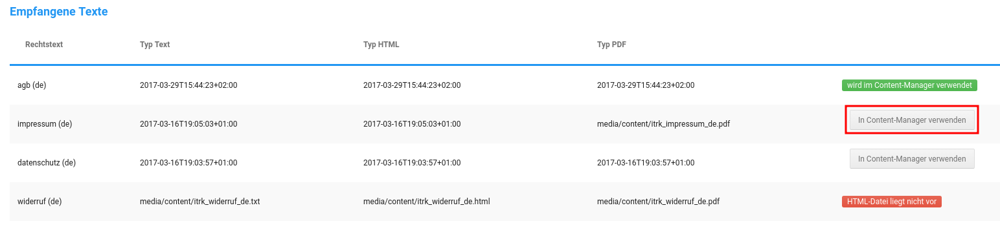|
|4. Bestätige die Angaben||

##### AGB-Text in PDF-Rechnung verwenden

Wird dieser Punkt aktiviert, wird der AGB-Text in die PDF-Rechnung übernommen. Der Text von IT-Recht Kanzlei ersetzt dann den Text, der ggf. unter _**Shop Einstellungen \> Rechnung/Lieferschein**_ bzw. _**Einstellungen / System / Rechnung & Lieferschein**_ im Tab _**Inhalt**_ für _**AGB/Widerruf**_ hinterlegt worden ist.

##### Widerrufsbelehrung in PDF-Rechnung verwenden

Wird dieser Punkt aktiviert, wird der Widerrufstext in die PDF-Rechnung übernommen. Der Text von IT-Recht Kanzlei ersetzt dann den Text, der ggf. unter _**Shop Einstellungen \> Rechnung/Lieferschein**_ bzw. _**Inhalte / System / Rechnung & Lieferschein**_ im Tab _**Inhalt**_ für _**AGB/Widerruf**_ hinterlegt worden ist.

#### Empfangene Texte

Über diesen Abschnitt können die Rechtstexte in die Contents übernommen werden.

Am Ende der Zeile wird für den jeweiligen Rechtstext der zugehörige Status innerhalb des Contents aufgeführt:

|Option|Erläuterung|
|------|-----------|
|_**In Content Manager verwenden**_|Soll ein Text in den Content übernommen werden, genügt es, hier zu klicken. Es ist nicht mehr nötig, den Content manuell zu bearbeiten und eine Datei auszuwählen, um die Ausgabe der Rechtstexte zu ermöglichen.|
|_**wird im Content Manager verwendet**_|Diese Meldung erscheint, wenn ein Text erfolgreich im Content hinterlegt wurde.|
|_**HTML-Datei liegt nicht vor**_|In diesem Fall muss der API-Token und die Shop-URL bei IT-Recht Kanzlei erneut hinterlegt werden, damit die Daten nochmals übertragen werden können.|

## Afterbuy

### Installation

Das Afterbuy-Modul kann unter _**Module \> Modul-Center**_ installiert werden. Wähle hierzu den Eintrag _**Afterbuy \(neu\)**_ aus und klicke auf die Schaltfläche _**Installieren**_, in der rechten, unteren Bildschirmecke.

### Konfiguration

Nachdem das Afterbuy-Modul installiert worden ist, kann es konfiguriert werden. Wähle hierzu unter _**Module \> Modul-Center**_ den Eintrag _**Afterbuy \(neu\)**_ aus und klicke auf die Schaltfläche _**Bearbeiten**_, in der rechten, unteren Bildschirmecke. Du gelangst zur Konfigurationsseite, hier können die Daten von Afterbuy hinterlegt werden.

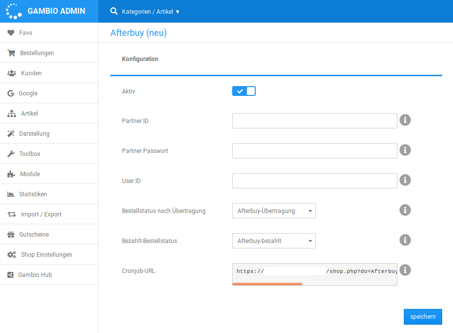

|Feldname|Beschreibung|
|--------|------------|
|_**Aktiv**_|Schaltet das Modul ein oder aus|
|_**Partner-ID**_|Die Afterbuy Partner-ID, die du von Afterbuy erhalten hast|
|_**Partner Passwort**_|Das Afterbuy-Passwort für die Schnittstelle|
|_**User ID**_|Die User-ID entspricht dem Benutzernamen, mit dem man sich bei Afterbuy anmelden kann|
|_**Bestellstatus nach Übertragung**_|Hier kann der Bestellstatus ausgewählt werden, der nach der Übertragung zu Afterbuy gesetzt wird|
|_**Bezahlt-Bestellstatus**_|Manuell kann jede Bestellung unabhängig vom Bestellstatus übertragen werden. Wird die Übertragung zu Afterbuy aber über einen CronJob automatisch ausgeführt, so werden dabei nur die Bestellungen übertragen, die den hier ausgewählten Status haben. Alle anderen Bestellungen bleiben unberührt|
|_**CronJob-URL**_|Die CronJob-URL kann bei deinem Hoster hinterlegt werden. Damit ist die automatische Übertragung zu Afterbuy möglich.|

### Bedienung

In der Bestellübersicht unter _**Bestellungen \> Bestellungen**_ kann über die Dropdown-Schaltfläche der jeweiligen Bestellung der Eintrag _**an Afterbuy übertragen**_ ausgewählt werden.

Die Übertragung wird durch eine entsprechende Meldung bestätigt, welche die Afternbuy-Kundennummer enthält.

Nach der Übertragung an Afterbuy wird der Bestellstatushistorie ein entsprechender Eintrag hinzugefügt. DIe Historie kann über die Detailseite der Bestellung eingesehen werden. Du erreichst die Detailseite wahlweise über das Augen-Symbol oder den Eintrag _**Anzeigen**_ der jeweiligen Dropdown-Schaltfläche.

## DHL Paketshops

### Installation

Das Modul kann unter _**Module \> Modul-Center**_ installiert werden. Wähle hierzu den Eintrag _**DHL Paketshops**_ aus der Liste aus und klicke auf die Schaltfläche _**Installieren**_, in der rechten, unteren Bildschirmecke.

### Konfiguration

Ist das Modul installiert, kann es unter _**Module \> Modul-Center**_ konfiguriert werden. Wähle hierzu den Eintrag _**DHL Paketshops**_ aus der Liste aus und klicke auf die Schaltfläche _**Bearbeiten**_, in der rechten, unteren Bildschirmecke. Die Konfiguration beschränkt sich auf wenige Eingaben.

	  
#### Zugangsdaten für Kartendarstellung per Google Maps \(optional\) 

|Feldname|Beschreibung|
|--------|------------|
|_**Kartentyp**_|Hier kann ausgewählt werden, ob im Shop eine Karte angezeigt werden soll: 
|  | keine
|  | statisch
|  | dynamisch

!!! note "Hinweis"
	 Die statische Karte zeigt immer nur einen festen Kartenausschnitt an, während die Ansicht der dynamischen bewegt werden kann.
	 
|Feldname|Beschreibung|
|--------|------------|
|_**API-Schlüssel**_|Für die Anzeige einer Karte wird ein API-Key von Google benötigt, da der Kartenausschnitt über Google Maps eingeblendet wird.|
|_**URL-Signatur-Secret**_|Das Secret erhält man ebenfalls von Google. Die Angabe ist aber optional und nicht für die Verwendung des Moduls erforderlich.|

##### Erlangen der nötigen Zugangsdaten

Über den Link, welcher unter dem Punkt _**Maps-Zugangsdaten**_ aufgeführt wird, gelangst du zur entsprechenden Unterseite von Google. Folge den jeweils angezeigten Anweisungen des API Managers, um die _**Google Maps JavaScript API**_ und die _**Google Static Maps API**_ zu aktivieren. Anschließend wird ein neuer Bereich _**URL-Signatur-Secret**_ angezeigt, aus dem das Secret herauskopiert werden kann. Weitere Informationen hierzu erhältst du beim Support von Google.

!!! note "Hinweis"

	 Alternativ kann auch der Link

	 https://console.developers.google.com

	 verwendet werden.

#### Ergebnisliste

Hier kann ausgewählt werden, wieviele Packstationen und Paketshops dem Kunden angezeigt werden sollen. Standardmäßig sind 10 voreingestellt.

### Darstellung im Shop 

#### Aufruf im Shop 

Um eine Packstation oder einen Paketshop auszuwählen, kann der Kunde im Bestellvorgang die Versandadresse ändern:

Unterhalb des Adressbuchs wird das DHL-Logo als Schaltfläche angezeigt.

Die gleiche Schaltfläche steht auch im Adressbuch unter _**Ihr Konto**_ zur Verfügung.

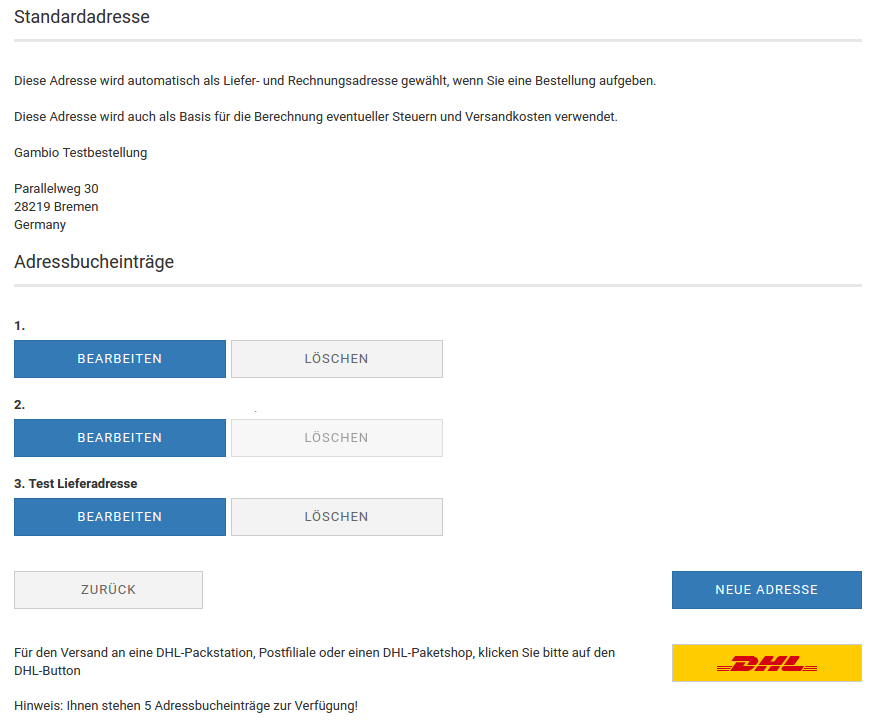

#### Auswahl einer Packstation / eines Paketshops 

Wurde das Modul aufgerufen, wird unterhalb der vorausgefüllten Lieferadresse eine Karte mit der Position der nächsten Packstationen und Paketshops angezeigt. Darunter befindet sich eine Liste, über die die betreffende Adresse als Lieferadresse übernommen werden kann. Nach der Auswahl erfolgt ein Sprung ans Ende der Seite, damit der Kunde seine Postnummer eintragen kann. Die Adresse der Packstation wird in die Bestellung übernommen.

## Shipcloud

### Installation

Das Shipcloud-Modul kann im Gambio Admin unter _**Module \> Modul-Center**_ installiert werden. Wähle hierzu den Eintrag _**Shipcloud**_ aus der Liste aus und klicke auf die Schaltfläche _**Installieren**_, in der rechten, unteren Bildschirmecke. Nach der Installation wird hier der Button _**Bearbeiten**_ angezeigt, hierüber kann die Konfiguration des Moduls aufgerufen werden.

### Konfiguration

#### Zugangsdaten

Die notwendigen Zugangsdaten erhältst du von Shipcloud. Bewege den Mauszeiger über das Info-Symbol um den Tooltipp anzuzeigen. Dieser enthält einen Link zu Shipcloud.

Logge dich bei Shipcloud ein und klicke oben rechts auf deine E-Mail-Adresse. Wähle hier den Punkt _**API-Key**_ bzw. _**API-Schlüssel**_ aus.

Es werden sowohl der _**Live**_- als auch der _**Sandbox API-Schlüssel**_ angezeigt.

#### Sonstige Einstellungen

|Feldname|Beschreibung|
|--------|------------|
|_**API-Key \(Sandbox\)**_|Hier kann der Key für die Sandbox hinterlegt werden, wenn das Modul im Testbetrieb verwendet werden soll.|
|_**Live-Modus**_|Hier muss gewählt werden, in welchem Modus das Modul aktuell betrieben wird.|
|_**Erweitertes Logging**_|Hier kann das Logging deaktiviert werden. Allerdings kann ohne Logging keine Analyse erfolgen, wenn es zu einem Problem kommt, da die hierfür notwendigen Detail-Informationen ohne Logging nicht mehr verzeichnet werden. Dieser Punkt sollte daher grundsätzlich aktiviert sein.|
|_**API-Timeout**_|Grenze für Zeitüberschreitungen bei Zugriffen auf die Shipcloud-Schnittstelle \(Sekunden\). Standard: 20 Sekunden|

!!! danger "Achtung"

	 Erhöhe diesen Wert nur, wenn es beim Abruf von Labels vermehrt zu Zeitüberschreitungen kommt.

|Feldname|Beschreibung|
|--------|------------|
|_**Tracking-Link-Vorlage**_|Unter _**Shop Einstellungen \> Paketdienste**_ bzw. _**Einstellungen / Lieferung / Versanddienstleister**_, nach Aufrufen der Seite _**Paketdienste**_, befinden sich standardmäßig einige Tracking-Link-Vorlagen, die für den Versand der Sendungsnummer benutzt werden. Da das Label über Shipcloud erstellt wurde, empfehlen wir die gleichnamige Vorlage zu verwenden.|
|_**Bestellstatus nach Labelerzeugung**_|Wenn der Bestellstatus nach dem Erstellen des Labels geändert werden soll, muss dieser hier ausgewählt werden.|
|_**E-Mail-Benachrichtigung nach Bestellstatusänderung**_|Wurde dieser Punkt aktiviert, werden Kunden automatisch über die eingestellte Änderung des Bestellstatus' informiert.|
|_**E-Mail-Adresse des Kunden an Shipcloud weitergeben und Telefonnummer des Kunden an Shipcloud weitergeben **_|Ist diese Einstellung abgeschaltet, werden die Kontaktdaten des Kunden nicht an Shipcloud weitergegeben, selbst wenn dieser im Bestellvorgang der Weitergabe zugestimmt hat.|
|_**Sendungsankündigung verwenden**_|DHL, DPD, Hermes und GLS bieten eine eigene Sendungsankündigung an. Erlaubt der Kunde die Weitergabe seiner Kontaktdaten an die Versanddienstleister, kann hiermit übergeben werden, dass die dienstleistereigene Ankündigung verwendet werden soll.|
|_**DHL: GoGreen**_ und _**DHL: Premium**_ verwenden|Zur Verwendung müssen DHL: GoGreen bzw. DHL: Premium in deinem DHL-Vertrag vorgesehen sein. |
|_**Inhaltsangabe automatisch vorausfüllen**_|Bei Sendungen in andere Länder muss unter bestimmten Bedingungen eine Inhaltsangabe mit übermittelt werden. Diese kann automatisch ausgefüllt werden, wenn diese Option gesetzt wurde.|
|_**Warenwert übertragen ab**_ und _**Warenwert übertragen bis**_|Bei Sendungen über DHL den Warenwert \(für Höherversicherung\) übertragen, wenn er in das hier konfigurierbare Intervall fällt.|

#### Absender

Die Absenderdaten müssen komplett ausgefüllt sein.

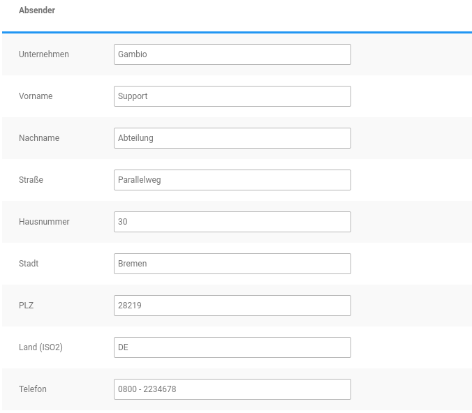

Die Daten werden im Regelfall direkt aus den Einstellungen unter _**Shop Einstellungen \> Mein Shop**_ bzw. _**Einstellungen / Shop / Shopbetreiber**_ bezogen und können in der Konfiguration des Moduls nachträglich angepasst werden.

#### Bankverbindung für Nachnahme

Die Bankverbindung sollte ebenfalls komplett hinterlegt werden. Dies ist vor allem dann wichtig, wenn die Zahlung per Nachnahme angeboten wird.

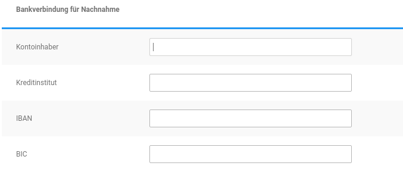

#### Webhook \(automatische Statusaktualisierung\)

Wurden Webhooks noch nicht konfiguriert, wird hier ein Button angezeigt, über den diese eingerichtet werden können.

Innerhalb der Einstellungen kann für jeden Sendungsstatus ein Bestellstatus zugeordnet werden.

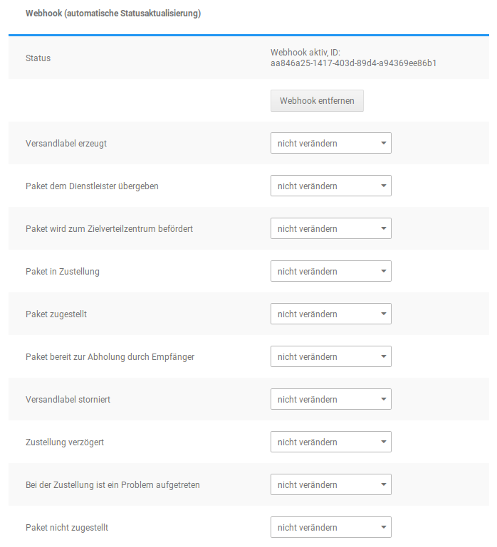

#### Dienstanbieter

In diesem Bereich kannst du festlegen, welche Dienstanbieter du für den Versand verwenden möchtest. Die Auswahl hängt hierbei davon ab, welche Anbieter du bei Shipcloud hast freischalten lassen. Jene Dienstanbieter, für die der Haken _**Vorauswahl**_ gesetzt worden ist, werden für die Kostenermittlung der Label-Erstellung vorausgewählt.

Hier muss beachtet werden, dass Diensteanbieter hinzukommen oder wegfallen können, wenn die Kooperationen zwischen Shipcloud und den einzelnen Dienstleistern sich ändern.

### Paketvorlagen

Du hast die Möglichkeit, Vorlagen für deine Standard-Paketgrößen anzugeben. Auf diese Weise ist es nicht notwendig, die Maße für jedes Paket einzeln einzugeben. Die jeweilige Vorlage kann bei der Erstellung des Labels über ein Dropdown-Menü ausgewählt werden.

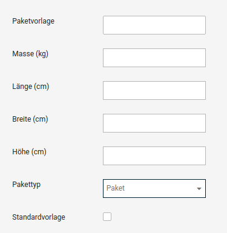

Zudem kann der _**Pakettyp**_ ausgewählt werden. Es stehen die folgenden Typen zur Auswahl:

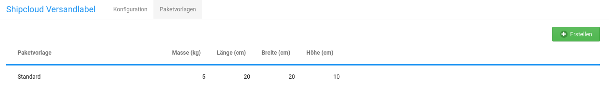

### Labelerstellung

#### Funktion aufrufen

Die Labelerstellung erfolgt im Gambio Admin in der Bestellübersicht unter _**Bestellungen \> Bestellungen**_. Soll nur für eine Bestellung ein Label erstellt werden, kann die Funktion über die Dropdown-Schaltfläche der jeweiligen Bestellung aufgerufen werden. Werden Bestellungen in der Mehrfachauswahl angehakt, kann die zugehörige Dropdown-Schaltfläche links unten verwendet werden. Es öffnet sich ein Popup mit möglichen Einstellungen zur Labelerstellung.

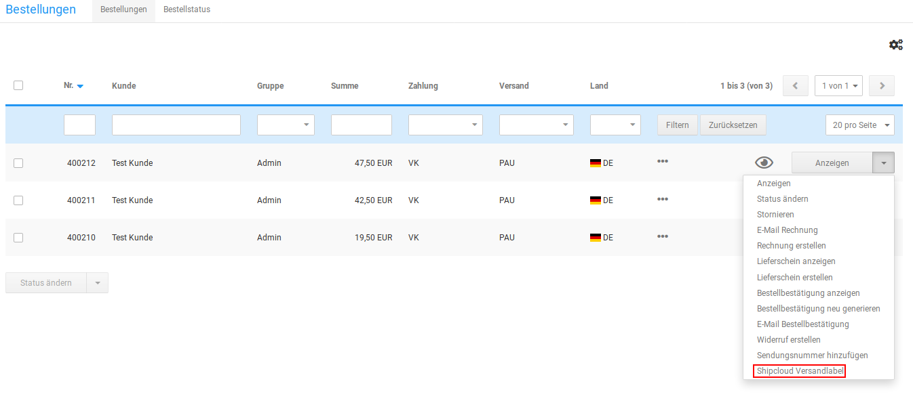

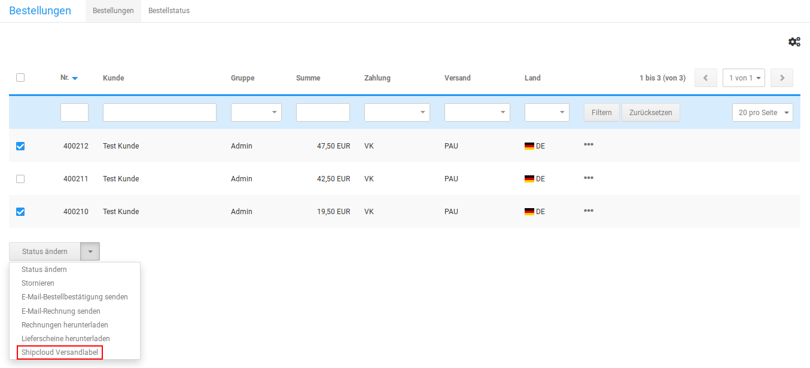

#### Angaben zum Empfänger

Die aufgeführten Lieferadressen sollten kurz auf Richtigkeit geprüft werden. Beim Einzelaufruf ist auch eine Korrektur der Daten möglich.

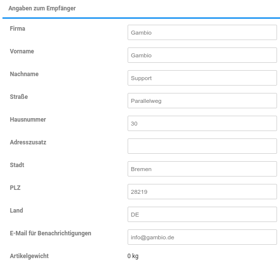

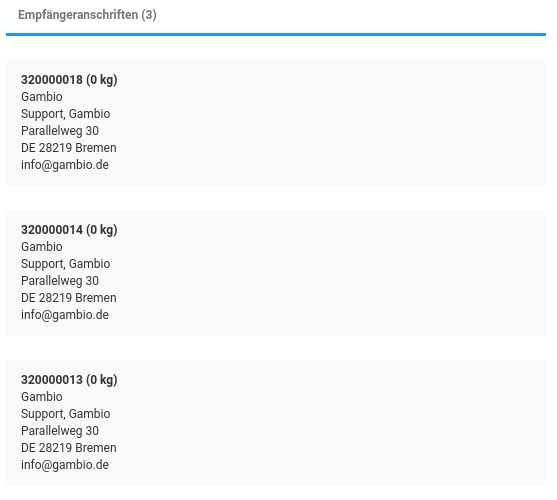

#### Angaben zum Paket

Die Größen- und Gewichtsangaben können individuell erfasst oder über eine Paketvorlage ausgewählt werden. Hierbei ist zu beachten, dass die möglichen Größen und Gewichte sich je nach Versanddienstleister unterscheiden können. Gleiches gilt für das allgemeine Angebot, so bieten z.B. nicht alle Dienstleister Briefsendungen an.

Das Feld _**Nachnahmebetrag**_ wird nur bei Nachnahmebestellungen angezeigt. Ist dies nicht der Fall, hat der Kunde bei der Bestellung eine andere Zahlungsweise ausgewählt. Zudem muss beachtet werden, dass nicht jeder Paketdienstleister die Abwicklung von Nachnahmesendungen anbietet.

Wenn in der Modulkonfiguration das automatische Ausfüllen der _**Inhaltsangabe**_ ausgewählt wurde, so werden hier die Artikel jetzt kommagetrennt voneinander ausgegeben. Über _**Abholzeit**_ kann angegeben werden, wann das Paket vom Dienstleister abgeholt werden soll. Sofern ein Vertrag mit Shipcloud/GLS existiert, der die _**GLS 24-Stunden-Zustellung**_ mit einschließt, kann die garantierte 24-Stunden-Zustellung hier ausgewählt werden.

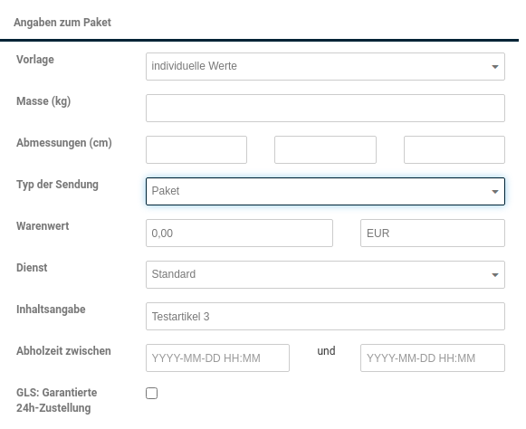

#### Versandkosten ermitteln

Über die Schaltfläche _**Versandkosten ermitteln**_ kannst du dir verschiedene Preise ausgeben lassen. Die Angabe _**nicht möglich**_ bzw. das Fehlen von Preisen in den Abbildungen lässt sich darauf zurückführen, dass der Transport von Sendungen in den angegebenen Abmessungen vom jeweiligen Dienstleister nicht angeboten wird.

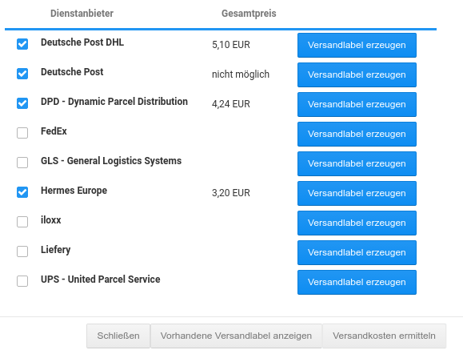

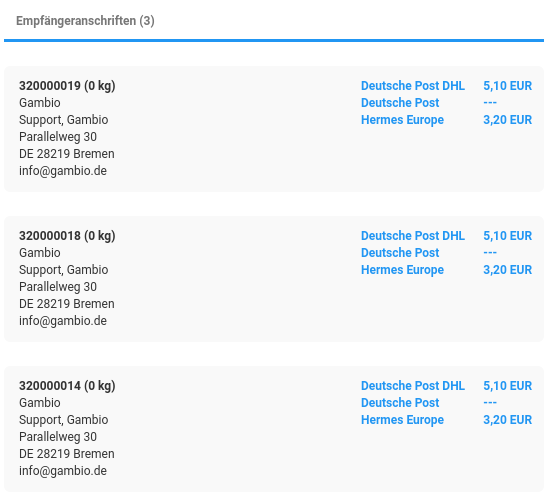

#### Versandlabel erzeugen und löschen

Mit Klick auf _**Versandlabel erzeugen**_ können die benötigten Label erstellt werden, es öffnet sich ein neues Dialogfenster. Dort wird der Zeitpunkt der Erzeugung protokolliert sowie die Tracking-Nummer und der Preis ausgegeben. Hier kann das Versandlabel aufgerufen oder gelöscht werden.

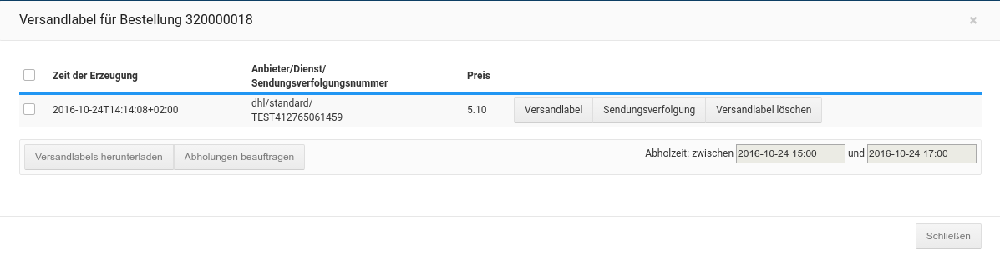

Über die Schaltfläche _**Sendungsverfolgung**_ wird man zur Sendungsverfolgungsseite weitergeleitet.

#### Tracking-Link versenden

Mit Erstellen des Versandlabels wird die Sendungsnummer automatisch in den Bestelldetails eingetragen. Auch wird ein entsprechender Vermerk in der Bestellstatushistorie hinterlegt. Nun kann von hier aus der Bestellstatus geändert und im gleichen Zug eine Information an den Kunden versendet werden, welche den Tracking-Link enthält, sofern dies ausgewählt worden ist.

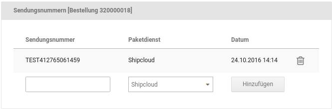

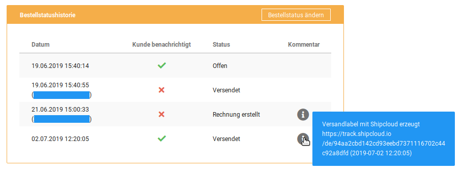

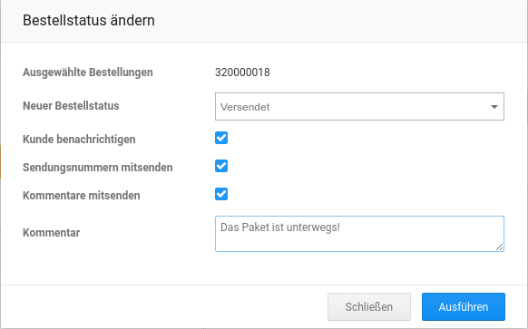

#### Ausnahmen

Das Anlegen des Tracking-Links sowie der Versand des Tracking-Links ist bei Versand über GLS nicht möglich. Im Gegensatz zu anderen Dienstleistern, wird die Sendungsnummer bei GLS erst bei der Abholung der Sendungen erstellt und ist damit zum Zeitpunkt der Labelerstellung im Shop noch nicht bekannt. Somit kann diese Nummer natürlich auch nicht in der Bestellung hinterlegt und an den Kunden versendet werden. Bei Sendungen über GLS ist es daher nötig, die Sendungsnummer manuell in der Bestellung zu hinterlegen.

### Abholung beauftragen

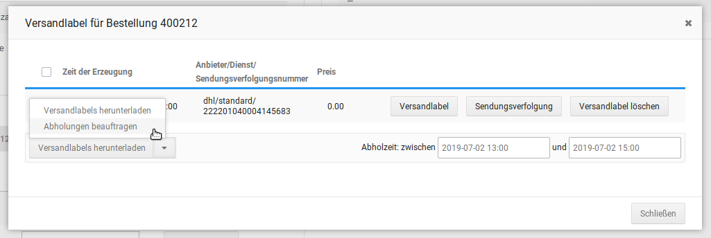

Ruft man zu einer oder mehreren Bestellung\(en\) die bereits vorhandenen Label auf, so kann man dort den gewünschten Abholzeitraum auswählen und auf _**Abholungen beauftragen**_ klicken. Es können so auch Abholungen für mehrere Pakete gleichzeitig beauftragt werden.

## Findologic

Über das Findologic-Modul ist eine alternative Suche im Shop realisiert. Details zum Angebot von Findologic findest du unter folgendem Link:

https://www.findologic.com/solutions/

### Installation

Um das Findologic-Modul zu installieren, rufe im Gambio Admin den Menüpunkt _**Module \> Modul-Center**_ auf. Wähle in der Auflistung den Eintrag _**Findologic**_ aus und klicke auf die Schaltfläche _**Installieren**_, in der rechten, unteren Bildschirmecke.

### Konfiguration

Nach der Installation kann das Findologic-Modul konfiguriert werden. Rufe hierzu unter _**Module \> Modul-Center**_ den Eintrag _**Findologic**_ auf und klicke auf die Schaltfläche _**Bearbeiten**_, in der rechten, unteren Bildschirmecke.

|Feldname|Beschreibung|
|--------|------------|
|_**Findologic-Suche verwenden**_|Setze den Haken, wenn du die Findologic-Suche verwenden möchtest.|
|_**Shop-ID EN / Shop-ID DE**_|Die Shop-IDs für Englisch und Deutsch erhältst du direkt von Findologic.|
|_**Shop-URL**_|Die Shop-URL ist standardmäßig schon voreingetragen und entspricht der URL des aktuellen Shops.|
|_**Service-URL**_|Hier soll die Findologic Service-URL eingetragen werden. Diese erhältst du von Findologic.|
|_**Exportdatei**_|Dateiname, den die Export-Datei tragen soll. Diese wird im Verzeichnis /export abgelegt.|
|_**Nettopreise exportieren**_|Hier kann ausgewählt werden, ob die Preise netto exportiert werden sollen.|
|_**Export-Kundengruppe**_|Wenn Staffelpreise bzw. Kundengruppenpreise im Shop hinterlegt wurden, sollte hier die Kundengruppe ausgewählt werden, deren Preise exportiert werden sollen.|
|_**SmartSuggest-Snippet**_|Das Snippet ist bei Findologic erhältlich und kann in dieses Feld kopiert werden. Dies führt dann dazu, dass im Shop bei der Direktsuche nicht mehr die shopeigenen Suchvorschläge gezeigt werden, sondern die Suchvorschläge von Findologic.|

!!! note "Hinweis"

	 Die Export-Datei kann standardmäßig unter

	 https://www.shop.de/export/findologic.csv

	 abgerufen werden, wobei _**www.shop.de**_ durch deine tatsächliche Shopadresse ersetzt werden muss.

Exportiert werden folgende Daten:

-   Artikel\*ID
-   Artikelname
-   Beschreibung
-   Preis \(aktuell\)
-   Normalpreis
-   Link zum Artikel
-   Link zum Hauptartikelbild
-   Attribute
-   Zusatzbegriffe für Suche
-   Kundengruppen
-   Anzahl verkaufte
-   Datum der Anlage \(Unix Timestamp\)
-   Lieferzeit

### Verwendung

Mit dem Speichern wird eine CSV-Datei erstellt, die bei Findologic importiert werden muss, damit die Suche im Shop auf die Findologic-Ergebnisse zurückgreifen kann. Der Import der CSV-Datei kann auch über einen CronJob erfolgen, hierüber kann dich der Support von Findologic näher informieren.

Die Findologic-Suche im Shop unterscheidet sich von der Verwendung und Darstellung nicht wesentlich von der Standardsuche. Auf der Suchergebnisseite erscheint das Logo von Findologic:

## Hermes

### Installation

Das Hermes-Modul wird im Gambio Admin unter _**Module \> Modul-Center**_ installiert. Wähle hierzu den Eintrag _**Hermes-Versand**_ aus und klicke auf die Schaltfläche _**Installieren**_ in der rechten, unteren Bildschirmecke. Nach der Installation erscheinen links im Menü weitere Einträge.

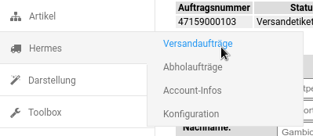

### Konfiguration

Du erreichst die Konfigurationsseite wahlweise unter _**Module \> Modul-Center**_, indem du den Eintrag _**Hermes-Versand**_ auswählst und auf _**Bearbeiten**_ klickst, oder den neuen Menüeintrag _**Hermes \> Konfiguration**_ aufrufst.

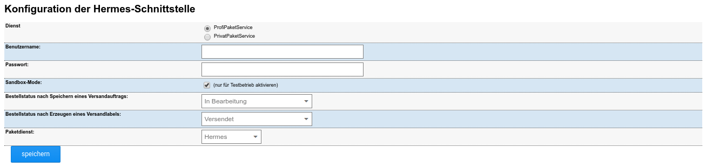

|Feldname|Beschreibung|
|--------|------------|
|_**Dienst**_|Es kann zwischen _**PrivatPaketService**_ \(kurz: PriPS\) für Privatkunden und _**ProfiPaketService**_ \(kurz: ProPS\) für Geschäftskunden ausgewählt werden. Der PrivatPaketService kann ohne Login-Daten verwendet werden, allerdings bietet dieser einen geringeren Leistungsumfang als der Service für Geschäftskunden.|
|_**Benutzername & Passwort**_|Benutzername und Passwort müssen nur für ProPS angegeben werden. Du erhältst diese Daten direkt von Hermes.|
|_**Sandbox-Mode**_|Der Sandbox-Modus kann aktiviert werden, wenn du die Funktion des Moduls testen möchtest. Bitte beachte, dass diese Einstellung vor dem Erstellen von Labels im Geschäftsbetrieb wieder abgeschaltet werden muss.|
|_**Bestellstatus auswählen**_|Du kannst festlegen, ob der Status der Bestellung nach Speichern eines Auftrags bzw. Erzeugen eines Labels geändert werden soll. Durch eine Änderung des Status' lassen sich Bestellungen in der Übersicht leichter zuordnen.|
|_**Paketdienst**_|Wird ProPS verwendet, ist der Paketdienst _**Hermes**_, bei PriPS muss hier _**MyHermes**_ ausgewählt werden. Hiermit wird der Tracking-Link festgelegt, der dem Kunden in der Statusbenachrichtigung zugesendet wird. Sendungen, deren Label über PriPS erstellt wurden, können nicht über den Link für ProPS nachverfolgt werden und umgekehrt.|

### Label erstellen und stornieren

#### ProfiPaketService

Die Labelerstellung wird unabhängig vom gewählten Dienst aus der Bestellübersicht unter _**Bestellungen \> Bestellungen**_ aufgerufen. Wähle hierzu über die Dropdown-Schaltfläche der Bestellung den Eintrag _**Hermes Versand**_ aus. Das gleichzeitige Erstellen von Labels für mehrere Bestellungen ist nicht möglich.

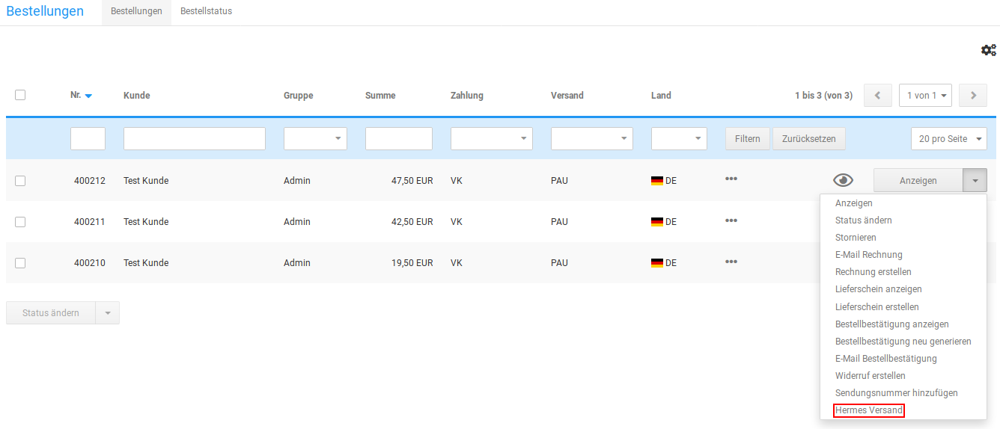

Wenn du ProPS verwendest, werden die Adressdaten vorausgefüllt. Hierbei wird als Absenderadresse die Shopbetreiberadresse verwendet, wie sie bei Hermes im Geschäftskundenkonto hinterlegt wurde. Klicke auf _**Auftrag speichern + senden**_, um das Label zu erzeugen.

Nachdem das Label erzeugt worden ist, ändert sich die Ansicht der Hermes-Versandauftragserfassung. Du hast die Möglichkeit den Auftrag zu stornieren oder das Label auszudrucken.

!!! note "Hinweis"

	 Die Sendungsnummer wird erst in die Bestellung eingetragen, wenn das Label gedruckt wurde.

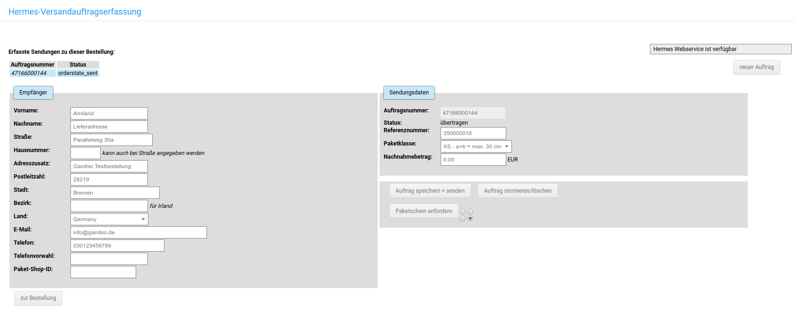

Unten siehst du ein Beispiel für ein Label, das mit ProPS erzeugt worden ist, auch wenn fälschlicherweise auf myhermes.de verwiesen wird. Inhalt und Darstellung des Labels lassen sich shopseitig nicht beeinflussen, da es über den Hermes-Server erzeugt wird.

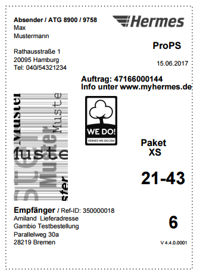

#### PrivatPaketService

Das Erstellen eines Labels über PriPS unterscheidet sich in wenigen Punkten von der Verwendung des ProPS. Zum Einen werden die Absender-Daten nicht vorausgefüllt, sondern müssen von Hand eingetragen werden. Zum Anderen ist es notwendig, bei jeder Erstellung eines Labels den Geschäftsbedingungen von Hermes zuzustimmen. Links unten befindet sich eine Auswahl zur Größe des Pakets. Zudem kann festgelegt werden, ob die Lieferung abgeholt werden soll und hierfür ein Termin angegeben werden.

Das Label enthält einen Abschnitt für die Auftragsbestätigung.

### Aufträge verwalten

#### Versandaufträge

|Feldname|Beschreibung|
|--------|------------|
|_**Alle auswählen**_|Alle angezeigten Aufträge auswählen.|
|_**Alle abwählen**_|Alle angezeigten Aufträge abwählen.|
|_**Ungedruckte auswählen**_|Hierüber können automatisch alle Sendungen ausgewählt werden, für die bisher kein Label gedruckt wurde.|
|_**Labels für alle selektierten Aufträge abrufen**_|Hiermit werden die fehlenden Label als PDF-Datei abgerufen. Die Label werden in einer Datei gesammelt, wobei immer 4 Label auf einer Seite untergebracht werden. Bei Shops mit mehreren Sendungen pro Tag sollten die Label also über diese Funktion gedruckt werden, da dies Papier spart.|
|_**Aktualisieren**_|Hiermit können die Seiteninhalte aktualisiert werden. Nach dem Druck von Labels ist dies ratsam, um die Liste auf den neuesten Stand zu bringen.|
|_**Label abrufen**_|Hierüber können die Label einzeln abgerufen werden.|
|_**Position bestimmen**_|Über die Einstellung auf der rechten Seite neben _**Label abrufen**_ kann die Position des Labels auf der DIN A4-Seite bestimmt werden.|

#### Abholaufträge

Hier können die Abholaufträge für die Pakete an die Kunden eingerichtet werden. Dies kann bei ProPS bequem als Sammelauftrag erfolgen, es genügt, das Datum und die Anzahl der Pakete der verschiedenen Paketgrößen auszuwählen.

Über das Feld _**Abholdatum**_ wird das passende Datum ausgewählt. Mit der Schaltfläche _**stornieren**_ kann eine Stornierung des Auftrags vorgenommen werden.

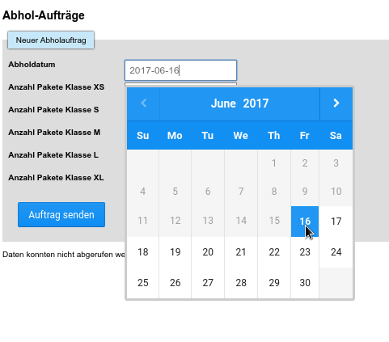

#### Account-Infos

In den Account-Infos werden die Kundeninformationen des ProfiPaketServices aufgeführt. Es können die Kosten für die verschiedenen Pakete eingesehen werden, aufgelistet nach Größe und Versandzonen.

!!! note "Hinweis"

	 Da die Konditionen von dem jeweiligen Vertrag abhängen, können die aufgeführten Preise und Leistungen von denen in deinem Shop abweichen.

### Tracking-Link versendens

Mit dem Druck des Hermes-Labels erfolgt automatisch ein Eintrag der Sendungsnummer in die jeweilige Bestellung. Der Tracking-Link setzt sich, je nach gewähltem Dienst \(PriPS oder ProPS\), aus dem Link unter _**Shop Einstellungen \> Paketdienste**_ bzw. _**Einstellungen / Lieferung / Versanddienstleister**_, nach Aufrufen der Seite _**Paketdienste**_, und der Sendungsnummer zusammen.

Der Tracking-Link kann dem Kunden unter _**Bestellungen \> Bestellungen**_ per E-Mail zugesendet werden. Ändere hierzu wahlweise aus der Bestellübersicht oder aus der Detailansicht der Bestellung den Bestellstatus und setze jeweils die Haken _**Kunde benachrichtigen**_ und _**Sendungsnummer mitsenden**_.

## Trusted Shops

### Installation

Das Trusted Shops-Modul kann im Gambio Admin unter _**Module \> Modul-Center**_ installiert werden. Wähle hierzu den Eintrag _**Trusted Shops**_ aus der Liste aus und klicke auf die Schaltfläche _**Installieren**_, in der rechten, unteren Bildschirmrecke.

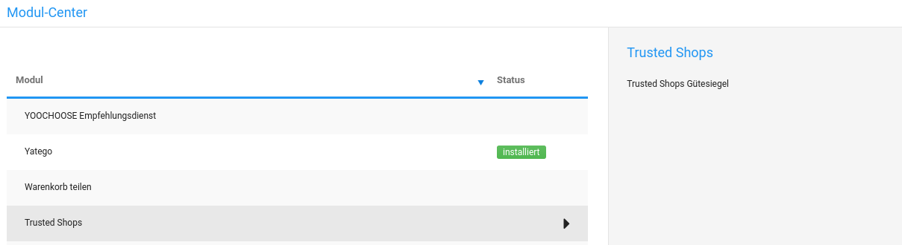

### Einrichtung

Nach der Installation kann das Modul eingerichtet werden. Wähle es hierzu unter _**Module \> Modul-Center**_ aus und klicke auf die Schaltfläche _**Bearbeiten**_, in der rechten, unteren Bildschirmecke.

#### Information

Der Abschnitt _**Information**_ enthält Angaben zur generellen Bedienung des Moduls, er lässt sich über einen Klick auf die Überschrift einklappen.

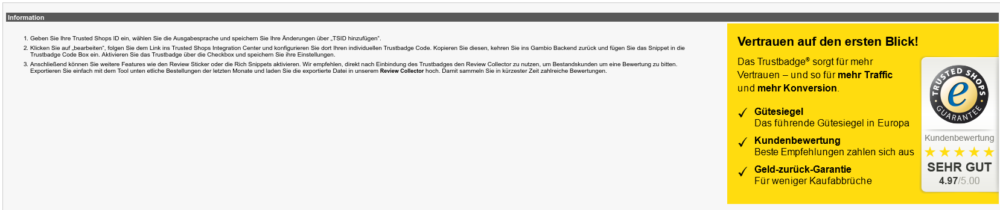

#### Konfiguration 

##### TSID hinzufügen

|Feldname|Beschreibung|
|--------|------------|
|_**TSID hinzufügen**_|Hier ist die Trusted Shops ID einzufügen, diese erhältst du direkt von Trusted Shops. Die ID besteht aus Großbuchstaben und Zahlen und ist normalerweise 33 Zeichen lang.|
|_**Sprache**_|Legt die Sprache fest, die für die Texte im Modul gewählt wird.|
|_**Excellence-Käuferschutz aktivieren**_|Wenn dein Vertrag mit Trusted Shops den _**Excellence-Käuferschutz**_ beinhaltet, so kann dies hier ausgewählt werden. Wird Excellence gewählt, muss unter _**Module \> Zusammenfassung**_ zudem das Modul _**Trusted Shops Käuferschutz Excellence**_ \(ot\_tsexcellence\) installiert und aktiviert werden, da sonst keine Anzeige der Käuferschutzgebühr in der Bestellzusammenfassung erfolgen kann.|
|_**Benutzername**_|Wurde _**Excellence-Käuferschutz**_ aktiviert, muss hier der Benutzername angegeben werden. Diesen erhältst du von Trusted Shops.|
|_**Passwort**_|Wurde _**Excellence-Käuferschutz**_ aktiviert, muss zudem das Passwort angegeben werden. Dieses erhältst du ebenfalls von Trusted Shops.|

Nach erfolgreicher Aktivierung wird die folgende Box angezeigt:

|Feldname|Beschreibung|
|--------|------------|
|_**Trusted-Shops-ID**_|Zeigt die angegebene Trusted Shops-Id an, in der Abbildung unkenntlich gemacht|
|_**Typ**_|Zeigt an, welcher Kontotyp gewählt wurde - im Modul werden diese standardmäßig als _**Classic**_ und _**Excellence angezeigt**_ - die einen unterschiedlichen Leistungsumfang beinhalten.|
|_**Sprache**_|Zeigt an, welche Sprache ausgewählt wurde.|

Darunter können die Zugangsdaten geprüft und ggf. korrigiert werden.

#### Einstellungen für die Trusted Shops-ID

Rechts neben der Trusted Shops-ID befindet sich der Button _**bearbeiten**_ über den weitere Einstellungen aufgerufen werden können.

##### Trustbadge

Das Trusted Shops-Badge wird standardmäßig rechts unten im Shop angezeigt. Klickt man darauf, erscheint ein Info-Popup.

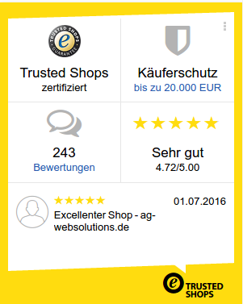

Damit das Badge angezeigt werden kann, muss der _**Trust Badge Code**_ eingefügt werden. Dieser wird bei Trusted Shops auf der Seite generiert. Klicke hierzu auf _**Klicken Sie hier**_, du gelangst dann zur Trusted Shops Seite und kannst dort den Badge Code kopieren.

!!! note "Hinweis"

	 Alternativ kann der Trusted Badge Code auch unter dem folgenden Link generiert werden:

	 http://www.trustedshops.de/shopbetreiber/integration/trustbadge/trustbadge-custom/

|Code|Mögliche Änderungen|
|----|-------------------|
|_**yOffset**_|Hier kann der Abstand vom unteren Rand des Shops eingestellt werden. Dies ist z.B. dann sinnvoll, wenn der _**Page Up**_-Button im Shop aktiviert ist und dieser durch das Badge sonst überdeckt würde.|
|_**variant**_|Hier kann eingetragen werden, welche der verschiedenen verfügbaren Varianten des Badge verwendet werden soll. Es kann ausgewählt werden zwischen _**reviews**_, _**default**_, _**custom**_ und _**custom\_reviews**_. Die beiden letztgenannten müssen über eigene Styles angepasst werden; verfügbar ohne weitere Anpassung sind 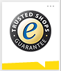|
|_**customElementId**_|Diese ID muss angegeben werden, wenn die Varianten _**custom**_ und _**custom\_reviews**_ verwendet werden sollen.|
|_**trustcardDirection**_|Hier kann die Ausrichtung des Badge in eine der vier Ecken festgelegt werden. Im Honeygrid funktioniert derzeit nur die Darstellung in der rechten unteren Ecke.|
|_**customBadgeWidth**_|Hier wird die Breite des Badge eingestellt.|
|_**customBadgeHeight**_|Hier wird die Höhe des Badge eingestellt.|
|_**disableResponsive**_|Hiermit kann die responsive Darstellung abgestellt werden, das Badge würde sich bei Ansicht auf mobilen Endgeräten dann nicht dem Display anpassen.|
|_**disableTrustbadge**_|Setzt man diesen Punkt auf _**true**_, deaktiviert dies die Anzeige des Badge.|

##### Review Sticker

Der Review Sticker wird unterhalb des Footers angezeigt und enthält die letzten Kundenbewertungen. Auch wenn der Review Sticker nicht aktiv ist, wird immer die Zeile _**4.34 / 5.00 of 11 Testzertifikat für Shopsystempartner Excellence Kundenbewertungen**_ angezeigt.

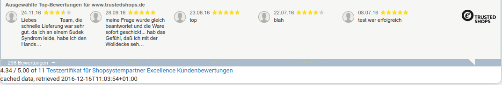

Hier wird der Code für den Review Sticker in einem Textfeld angezeigt. Der Code ist bereits eingetragen, wenn das Modul installiert wird. Sollen die Bewertungen im Shop angezeigt werden, muss der Haken bei _**Review Sticker aktivieren**_ gesetzt werden.

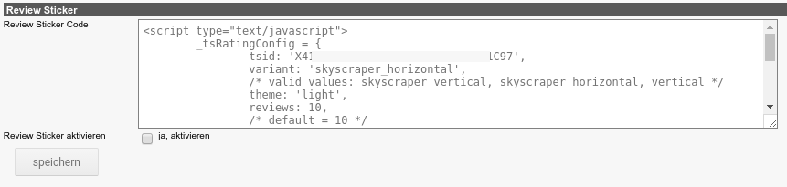

Der Code des Review Stickers kann von erfahrenen Benutzern angepasst werden:

|Code|Mögliche Änderungen|
|----|-------------------|
|_**variant**_|Standardmäßig ist die Variante "horizontal" hinterlegt. Wir empfehlen dies bei der Verwendung des Honeygrid-Templates beizubehalten.|
|_**reviews**_|Hier kann die Anzahl der anzuzeigenden Bewertungen ausgewählt werden. Bei mehr als 10 Bewertungen werden diese anders aufgeteilt, der Abschnitt unterhalb des Footers kann also sehr hoch dargestellt werden.|
|_**borderColor**_|Hier wird die Farbe der Umrandung der Box sowie die Hintergrundfarbe hinter _**298 Bewertungen**_ geändert.|
|_**colorclassName**_|Es ist auch möglich, eigene CSS-Klassen für die Ausgabe des Review Stickers anzugeben. Der Name der Klasse kann hier eingetragen werden.|
|_**introtext**_|Die Überschrift kann auf einen beliebigen Text geändert werden. Die Überschrift wird allerdings nicht in den Skyscraper-Varianten verwendet.|

#### Allgemeine Integrationsoptionen

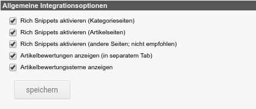

|Feldname|Beschreibung|
|--------|------------|
|_**Rich Snippets aktivieren \(Kategorieseiten\)**_|Wenn aktiviert, werden die Eckdaten der Kategorien an Google übergeben.|
|_**Rich Snippets aktivieren \(Artikelseiten\)**_|Wenn aktiviert, werden die Artikel-Bewertungen und andere Artikel Eckdaten \(Preis, Name\) an Google übergeben.|
|_**Rich Snippets aktivieren \(andere Seiten; nicht empfohlen\)**_|Übergabe der Rich Snippets von anderen Seiten des Shops an Google \(nicht empfohlen\).|
|_**Artikelbewertungen anzeigen \(in separatem Tab\)**_|Zeigt die Artikelbewertungen durch Trusted Shops in einem eigenen Tab auf der Artikeldetailseite an.|
|_**Artikelbewertungssterne anzeigen**_|Auf der Artikeldetailseite können die Bewertungssterne von Trusted Shops zusätzlich zu den Sternen der normalen Artikelbewertungsfunktion des Shops angezeigt werden.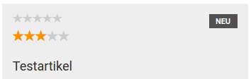|

#### Datenexport für Review Collector

Mit dem Review Collector kannst du die Bestellungen exportieren und bei Trusted Shops importieren, die dann ihrerseits den Versand der Bewertungs-E-Mails auslösen. Diese Funktion hat die Bewertungsbuttons abgelöst. In der aktuellen Shopversion ist dieser jedoch nicht mehr nötig. Wenn das Badge angezeigt wird, erfolgt die Anforderung der Bewertung automatisch.

### Trusted Shops Käuferschutz Excellence

!!! danger "Achtung"

	 Aktuell kann der Excellence Käufterschutz noch nicht zusammen mit den Zahlungsweisen aus dem _**Gambio Payment Hub**_ eingesetzt werden.

#### Installation

Das Modul für den Aufschlag der Käuferschutz-Gebühr kann unter _**Module \> Zusammenfassung**_ installiert werden und bewirkt, dass die Gebühr für den Trusted Shops Käuferschutz in der Bestellzusammenfassung ausgegeben wird. Wähle hierzu den Eintrag _**Trusted Shops Käuferschutz Excellence**_ \(ot\_tsexcellence\) aus der Liste aus und klicke auf die Schaltfläche _**Installieren**_, in der rechten, unteren Bildschirmecke. Nachdem das Modul installiert worden ist, kann es über Klick auf _**Bearbeiten**_ konfiguriert werden.

|Feldname|Beschreibung|
|--------|------------|
|_**Käuferschutz-Gebühr anzeigen**_|Hierüber kann das Modul aktiviert oder deaktiviert werden.|
|_**Sortierreihenfolge**_|Die Sortierreihenfolge wirkt sich auf die Position der Ausgabe sowie auf die Berechnung aus. Es sollten daher nach Möglichkeit keine Änderungen daran vorgenommen werden. Sind Änderungen nötig, so sollte geprüft werden, ob die Berechnung noch korrekt ist.|
|_**Steuerklasse**_|Mit Auswahl einer Steuerklasse wird die Rechnungsgebühr als Nettowert betrachtet und die Steuer in der Bestellzusammenfassung aufgeschlagen. Wählt man keinen Steuersatz aus, gilt die hinterlegte Rechnungsgebühr brutto wie netto.|

### Darstellung von Käuferschutz Exellence im Bestellvorgang

Auf der Bestellbestätigungsseite kann der Kunde sich entscheiden, ob er den Käuferschutz dazu buchen möchte.

Bei Bedarf kann der Kunde seine Auswahl auch rückgängig machen.

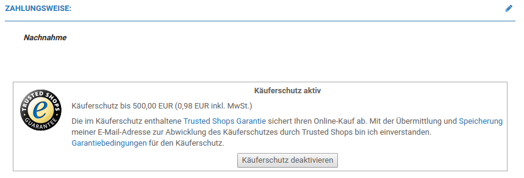

Dem Summenblock wird bei aktiviertem Käuferschutz eine Zeile mit den Kosten hinzugefügt.

	  

## Checkout Loading-Spinner

Der Checkout Loading-Spinner soll bei längeren Ladeprozessen im Bestellvorgang eine animierte Grafik anzeigen, die dem Kunden verdeutlicht, dass seine Eingaben verarbeitet werden. Dies soll verhindern, dass die Kunden annehmen, der Shop würde nicht reagieren und den Kauf womöglich abbrechen.

### Installation

Das Modul kann unter _**Module \> Modul-Center**_ installiert werden. Wähle hierzu den Eintrag _**Checkout Loading-Spinner**_ aus und klicke auf die Schaltfläche _**Installieren**_ in der rechten, unteren Bildschirm-Ecke.

### Konfiguration

Nach der Installation kann das Modul konfiguriert werden. Wähle hierzu den Eintrag _**Checkout Loading-Spinner**_ aus und klicke auf die Schaltfläche _**Bearbeiten**_, in der rechten, unteren Bildschirm-Ecke.

Setze den Haken für _**Aktiviert**_, um den Checkout Loading-Spinner zu verwenden. Über das Feld _**Nach Timeout anzeigen \(Sekunden\)**_ kannst du die Zeit festlegen, nach der der Checkout Loading-Spinner während des Ladevorgangs angezeigt wird. Standardeinstellung ist hier 0, sodass der Spinner immer angezeigt wird, wenn er aktiviert wurde. Stellt man hier eine Sekundenanzahl ein, wird die Animation nur dann angezeigt, wenn sich das Laden der Zahlungsweisenseite tatsächlich um den festgelegten Zeitraum verzögert.

## Direkthilfe

Über die Direkthilfe kann das zugehörige Handbuch-Kapitel zur jeweiligen Unterseite des Gambio Admins aufgerufen werden. Gibt es zu der aufgerufenen Seite keine Kapitel-Zuordnung, wird der Anfang des Handbuchs geladen. Klicke zum Laden der Seite auf das Glühbirnen-Symbol am unteren Bildrand.

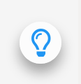

### Installation
Die Installation kann im Gambio Admin unter _**Module \> Modul-Center**_ vorgenommen werden. Wähle hierzu den Eintrag _**Direkthilfe**_ aus der Liste aus und klicke auf die Schaltfläche _**Installieren**_ in der rechten, unteren Bildschirmecke.

### Konfiguration

Die Konfiguration des Moduls beschränkt sich auf das An- und Abschalten der Direkthilfe. Wähle hierzu den Eintrag _**Direkthilfe**_ unter _**Module \> Modul-Center**_ aus und klicke auf die Schaltfläche _**Bearbeiten**_ in der rechten, unteren Bildschirmecke. Setze bzw. entferne den Haken bei _**Aktiv**_ um das Modul zu aktivieren, respektive zu deaktivieren.

## MyDPD / Iloxx

### Installation

Die Installation kann im Gambio Admin unter _**Module \> Modul-Center**_ vorgenommen werden. Wähle hierzu den Eintrag _**MyDPD Business / iloxx**_ aus der Liste aus und klicke auf die Schaltfläche _**Installieren**_.

### Konfiguration

Nach der Installation kann das Modul konfiguriert werden. Wähle hierzu den Eintrag _**MyDPD Business / iloxx**_ unter _**Module \> Modul-Center**_ aus und klicke auf die Schaltfläche _**Bearbeiten**_, in der unteren, rechten Bildschirmecke.

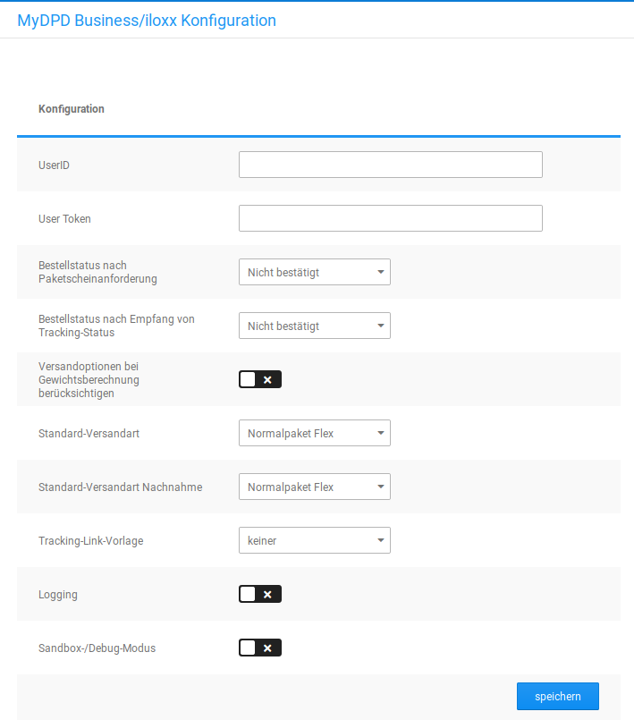

|Feldname|Beschreibung|
|--------|------------|
|_**UserID**_|Die UserID erhältst du direkt von DPD|
|_**User Token**_|Den User Token erhältst du direkt von DPD|
|_**Bestellstatus nach Paketscheinanforderung**_|Hier kann eingestellt werden, welcher Bestellstatus direkt mit der Labelerstellung vergeben werden soll.|
|_**Bestellstatus nach Empfang von Tracking-Status**_|Hier kann der Bestellstatus ausgewählt werden, der gesetzt werden soll, wenn DPD das Paket erhalten hat.|
|_**Versandoptionen bei Gewichtsberechnung berücksichtigen**_|Bei der Labelerstellung muss das Sendungsgewicht eingegeben werden. Dies kann mit dem Artikelgewicht vorausgefüllt werden. Wenn diesem Wert noch das Verpackungsgewicht aufgeschlagen werden soll, wie unter _**Module \> Versandarten \> Versand-Optionen**_ konfiguriert, muss dieser Punkt aktiviert werden.|
|_**Standard-Versandart**_|Voreingestellt auf _**Normalpaket Flex**_, was DPD Predict entspricht. Es kann auch eine andere Versandart ausgewählt werden.|
|_**Standard-Versandart Nachnahme**_|Voreingestellt auf _**Normalpaket Flex**_, was DPD Predict entspricht. Es kann auch eine andere Versandart ausgewählt werden.|
|_**Tracking-Link-Vorlage**_|Unter _**Shop Einstellungen \> Paketdienste**_ bzw. _**Einstellungen / Lieferung / Versanddienstleister**_, nach Aufrufen der Seite _**Paketdienste**_, sind verschiedene Tracking-Links zu einigen Paketdienstleistern vorangelegt, aus denen eine entsprechende Vorlage ausgewählt werden kann. Wir empfehlen _**DPD**_ zu verwenden, damit die Sendungsnummer mit dem korrekten Link zur DPD Sendungsverfolgung kombiniert werden kann.|
|_**Logging**_|Aktiviert das Logging.|
|_**Sandbox-/Debug-Modus**_|Aktiviert den Testbetrieb.|

### Tagesabschlussliste

Hierüber kann eine Liste der am gewählten Tag erstellten Label erzeugt werden.

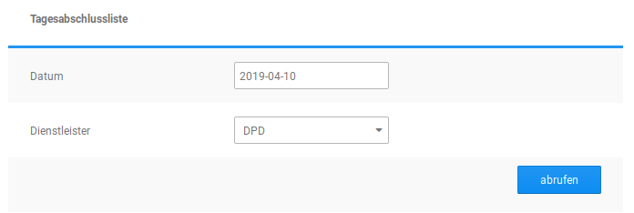

### Labelerstellung

#### Menüpunkt aufrufen

Die Label werden aus der Bestellübersicht heraus erstellt. Verwende hierzu wahlweise die Dropdown-Schaltfläche der einzelnen Bestellung \(siehe Abbildung\) und klicke auf _**MyDPD/Iloxx-Versandlabel anfordern**_ oder hake die Bestellung\(en\) an und wähle den Eintrag über das Dropdown der Mehrfachauswahl links unterhalb der Bestellübersicht aus.

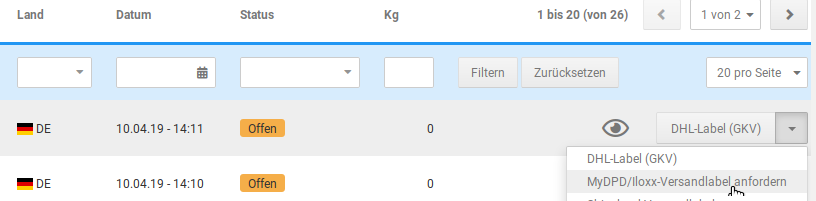

#### Iloxx Auftragsvorbereitung

Über den Menüpunkt wird automatisch die Auftragsvorbereitung aufgerufen, in der die gewählten Bestellungen untereinander aufgelistet werden. Die Liste enthält hierbei Angaben zu Bestellnummer, Kunde und Versandadresse, Inhalt, DPD Versandart, Warenwert, Sendungsgewicht und die Paketnummer, sofern vorhanden. Es können zudem Änderungen an der Versandart, dem Warenwert sowie dem Versandgewicht vorgenommen werden.

Das Betätigen der Schaltflächen _**Adressen prüfen**_, _**Versandlabels abrufen**_ und _**Gewählte entfernen**_ unter der Liste der Bestellungen wirkt sich jeweils nur auf die Bestellungen aus, die in der Auflistung ausgewählt worden sind. Um eine Bestellung auszuwählen, setze den Haken in das Kästchen vor der zugehörigen Bestellnummer.

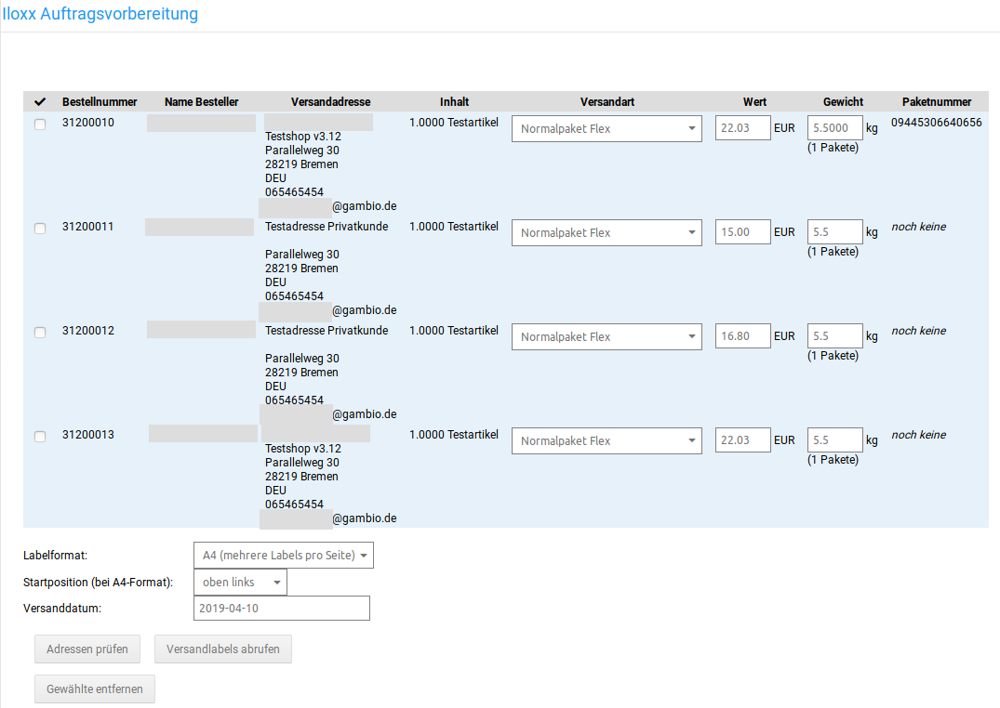

|Feldname|Beschreibung|
|--------|------------|
|_**Labelformat**_|Hier kann das Ausgabeformat der Label gewählt werden. Bei DIN A4 werden vier Label auf einer Seite ausgegeben.|
|_**Startposition**_|Diese Option wirkt sich nur für den Druck auf DIN A4 aus und legt fest, wo mit dem Druck begonnen werden soll.|
|_**Versanddatum**_|Das Versanddatum kann manuell festgelegt und nach dem Klick in das Eingabefeld ausgewählt werden. Das Datum darf nicht in der Vergangenheit liegen und muss ein Werktag \(Mo-Fr\) innerhalb der nächsten 7 Werktage sein. Dieses Datum wird nicht auf dem Etikett ausgegeben.|
|_**Adressen prüfen**_|Vor der Labelerstellung können die Adressen der Bestellungen automatisch geprüft werden. Diese Option wirkt sich nur auf die zuvor ausgewählten Bestellungen aus.|
|_**Versandlabels abrufen**_|Erstellt die Versandlabel. Diese Option wirkt sich nur auf die zuvor ausgewählten Bestellungen aus.|
|_**Gewählte entfernen**_|Entfernt die ausgewählten Bestellungen aus der Liste in der Iloxx Auftragsvorbereitung. Die Bestellung selbst wird dadurch nicht gelöscht.|

#### Label \(Muster\)

Nachfolgend ist ein Muster-Label im Format DIN A6 abgebildet.

## Mailbeez

### Grundlegende Informationen

Bei Mailbeez handelt es sich um ein Drittanbieter-Modul, welches Teil des Grundunfangs ist, jedoch nicht von Gambio entwickelt wurde. Dieses Kapitel enthält daher nur einen allgemeinen Überblick und beschreibt das Modul nicht zur Gänze.

Den Support für das Modul übernimmt Mailbeez. Detailliertere Informationen findest du unter folgendem Link:

https://www.mailbeez.de/dokumentation

### Installation

Das Mailbeez-Modul kann im Gambio Admin unter _**Module \> Modul-Center**_ installiert werden. Wähle hierzu den Eintrag _**MailBeez**_ aus der Liste aus und klicke auf die Schaltfläche _**Installieren**_, in der rechten, unteren Bildschirmecke.

Es öffnet sich der CloudLoader von MailBeez. Klicke hier auf _**Installation starten**_, um die notwendigen Dateien von MailBeez in den Shop einzuspielen.

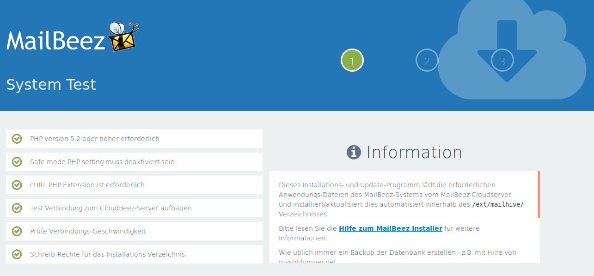

Im nächsten Schritt wird ein Systemtest durchgeführt.

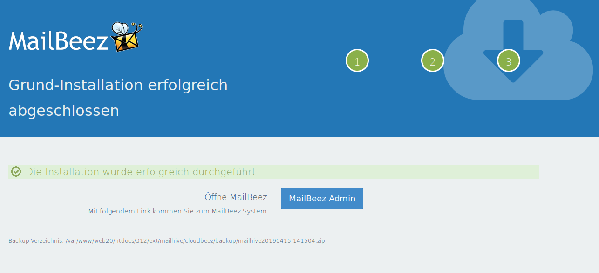

Nach der erfolgreichen Installation gibt MailBeez eine entsprechende Rückmeldung.

Anschließend kann die MailBeez-Seite im Shop aufgerufen werden.

### Übersicht der Tabs

#### 1. Tab

Im ersten Tab stehen verschiedene Touren durch das Modul zur Verfügung, die als Hilfestellung bei der Konfiguration dienen sollen.

#### 2. Dashboard

Im _**Dashboard**_ finden sich die wichtigsten Statistiken, die z.B. über Werte der Kundenrückgewinnung o.ä. informieren. Die Tabs können bei Bedarf einzeln deaktiviert werden. Die erste Statistik fungiert als 'Startseite' von MailBeez und wird auch im Dashboard des Shops angezeigt.

#### 3. Mailbeez Module

Der zweite Tab gruppiert alle MailBeez Module. Es stehen Module verschiedener Art zur Verfügung, vom E-Mail-Versand bis hin zur Warnehmung von Service-Aufgaben. Genaueres hierzu findest du in der Dokumentation von MailBeez.

#### 4. Filter & Hilfsmodule

Im dritten Tab werden Filter und Hilfsmodule gruppiert. Diese Module haben typischerweise keine eigenständige Funktion, sondern erweitern das MailBeez System grundlegend. Dies kann z.B. der Kundengruppen-Filter sein, mit dem konfiguriert werden kann, für welche Kundengruppen welche MailBeez Module aktiv sein sollen.

#### 5. Berichte

Im Tab _**Berichte**_ sind Module zur Generierung verschiedener Berichte gruppiert. Viele Berichts-Funktionen sind aber auch über das Dashboard direkt zugänglich.

#### 6. Konfiguration

Der Tab _**Konfiguration**_ gruppiert Konfigurations-Einstellungen. Diese Einstellungen beeinflussen die grundlegende Funktion des MailBeez Systems, z.B. ob die von MailBeez generierten E-Mails über die Mail-Funktion des Shops, über die zertifizierten Server von Newsletter2Go oder über einen eigenen SMTP-Server versendet werden.

#### 7. ?

Hier werden einige System-Informationen angezeigt, wie z.B. die Mailbeez-Version und die Domain, für die der Mailbeez-Lizenzschlüssel gültig ist.

## Ampify

Ampify hat die Aufgabe, von den Produktdetailseiten im Shop reduzierte Versionen bereitzustellen, die dann auf Mobilgeräten schneller geladen werden können. Diese Seiten sind reduziert auf Produktbilder und Beschreibung und enthalten einen Link zum Shop.

Im Vergleich hier eine herkömmliche Produktseite \(links\) gegenüber einer Ampify-Seite \(rechts\):

 mit der entsprechenden Ampify-Seite (rechts)")
	  
### Installation

Das Ampify-Modul kann im Gambio Admin unter _**Module \> Modul-Center**_ installiert werden. Wähle hierzu den Eintrag _**AMPIFY**_ aus der Liste aus und klicke auf die Schaltfläche _**Installieren**_, in der rechten, unteren Bildschirmecke.

### Inbetriebnahme 

Für die Inbetriebnahme müssen mehrere Schritte durchlaufen werden.

#### CSV-Export erstellen

Zuerst muss im Gambio Admin unter _**Import/Export \> Artikeldaten**_ bzw. _**Artikel \> Import/Export**_ im Reiter _**Preis-Portal**_ der Ampify-Export erstellt werden. Details zum Bearbeiten der CSV-Profile findest du im Kapitel _**Import/Export**_ des Handbuchs. Folgende Schritte sind hier nötig:

-   Export bearbeiten
-   im Tab _**Einstellungen**_ die Export-URL kopieren
-   im Tab _**Kategorien**_ die zu exportierenden Kategorien auswählen
-   Einstellungen speichern
-   Export ausführen

#### Anmeldung bei Ampify

Nun muss die Anmeldung bei Ampify unter https://ampify.it erfolgen. Gehe hierzu wie folgt vor:

-   https://ampify.it im Browser aufrufen
-   Zuvor kopierte Export-URL in das Feld _**URL der CSV-Datei**_ einfügen
-   E-Mail-Adresse eintragen
-   auf _**AMP-Seiten erzeugen**_ klicken

Es wurde nun eine E-Mail an die hinterlegte E-Mail-Adresse versendet, in der man um die Bestätigung der E-Mail-Adresse gebeten wird. Dies erfolgt, indem man den in der Mail erhaltenen Link anklickt. Ampify.it beginnt dann direkt mit dem Einlesen der Artikel des Shops.

Nach dem Einlesen werden eine Liste der gelisteten Artikel sowie einige grundlegende Informationen \(Shop-URL, Anlagedatum, Tarif, etc.\) angezeigt.

#### Einstellungen bei Ampify

|Einstellung|Erläuterung|
|-----------|-----------|
|_**Quelldatei**_|Hier kann der Link zur Exportdatei angepasst werden, etwa wenn der Dateiname geändert wurde.|
|_**Shop-Adresse**_|Bei Änderungen der Shopadresse kann diese hier aktualisiert werden.|
|_**Logo**_|Wenn auf den Ampify-Seiten ein abweichendes Shop-Logo angezeigt werden soll, kann hier der Link zur Logo-Datei eingetragen werden.|
|_**Links**_|Dieses Feld enthält die Links zu den von Ampify im Shop gefundenen Rechtstexten, die bei Bedarf geändert oder ergänzt werden können.|
|_**Google Analytics**_|Wenn Google Analytics auch auf die Ampify-Seiten angewendet werden soll, kann hier die Property-ID des Shops eingetragen werden.|
|_**Facebook-App-ID**_|Wenn der Facebook-Button benutzt werden soll, kann hier die Facebook-App-ID hinterlegt werden.|
|_**Preise anzeigen**_|Auswahl, ob Preise angezeigt werden sollen|
|_**Social Media Buttons anzeigen**_|Auswahl, ob die Buttons zum Teilen des Artikels angezeigt werden sollen.|

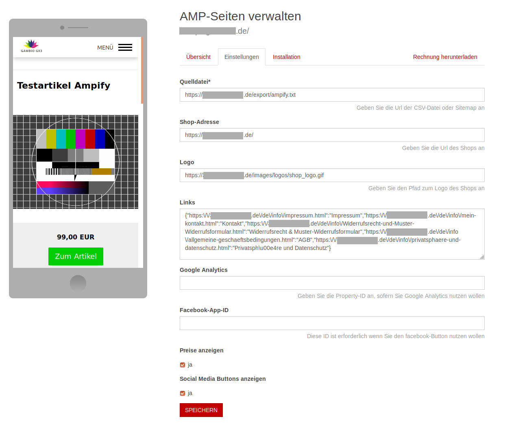

#### Installation bei Ampify

Nach dem Buchen von Ampify Premium stehen im Reiter _**Installation**_ weitere Einstellungen zur Verfügung.

1.  _**AMP-Seiten veröffentlichen**_: Wenn die AMP-Seiten verwendet werden sollen, muss dies hier aktiviert werden.
2.  _**Gambio-Modul einrichten**_: In Shopversionen ab 3.9.1 ist Ampify bereits enthalten, hier genügt es, das Token zu kopieren.
3.  _**Produktseite aufrufen**_: Hier muss einmal auf den Link geklickt werden, um eine Zuordnung der verfügbaren AMP-Seiten zu laden
4.  _**Überprüfung**_: Im letzten Schritt muss einmal auf _**Aktualisieren**_ geklickt werden. Der Status wechselt dann von _**nicht verbunden**_ auf _**verbunden**_.

### Einstellungen im Shop {#ampify_einstellungen}

Das von Ampify kopierte Token wird nun im letzten Schritt im Modul hinterlegt und das Modul aktiviert.

	  
	  
## Mediafinanz

In diesem Kapitel geben wir einen kurzen Überblick über die shopseitigen Einstellungsmöglichkeiten des Mediafinanz-Moduls. Da dieses Modul jedoch nicht von Gambio entwickelt worden ist, können wir die Verwendung nicht im Detail beschreiben. Bei Nachfragen hierzu oder Problemen bei der Benutzung wende dich bitte direkt an den Support von Mediafinanz \(http://www.mediafinanz.de\).

### Installation

Das Modul kann unter _**Module \> Modul-Center**_ installiert werden. Wähle hierzu den Eintrag _**Mediafinanz**_ aus der Liste aus und klicke auf die Schaltfläche _**Installieren**_ in der rechten, unteren Bildschirmecke. Klicke abschließend auf _**Bearbeiten**_.

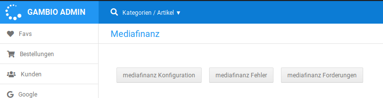

### mediafinanz Konfiguration

#### Allgemeine Optionen

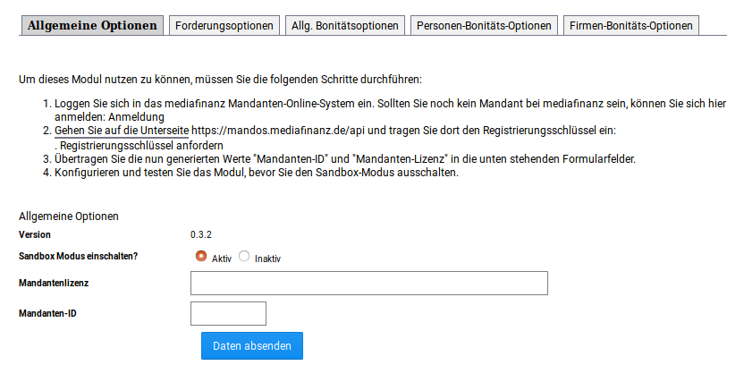

Hier kannst du das Modul konfigurieren, indem du deine Mandantenlizenz und die ID einträgst, die du von Mediafinanz erhalten hast. Über den Link _**Registrierungsschlüssel anfordern**_ wird eine Zahlenkombination eingeblendet, die du wiederum auf einer Seite von Mediafinanz eintragen kannst. Dies wird benötigt, um die Mandantenlizenz und die ID zu generieren, die dann ins Modul eingetragen werden müssen.

#### Forderungs-Optionen

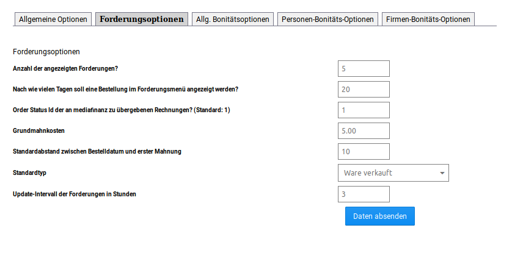

Hier können generelle Einstellungen zu den Forderungen vorgenommen werden. Dies geht von den Aktualisierungsintervallen über Grundmahnkosten bis hin zur Anzahl der angezeigten Forderungen.

#### Allg. Bonitäts Optionen

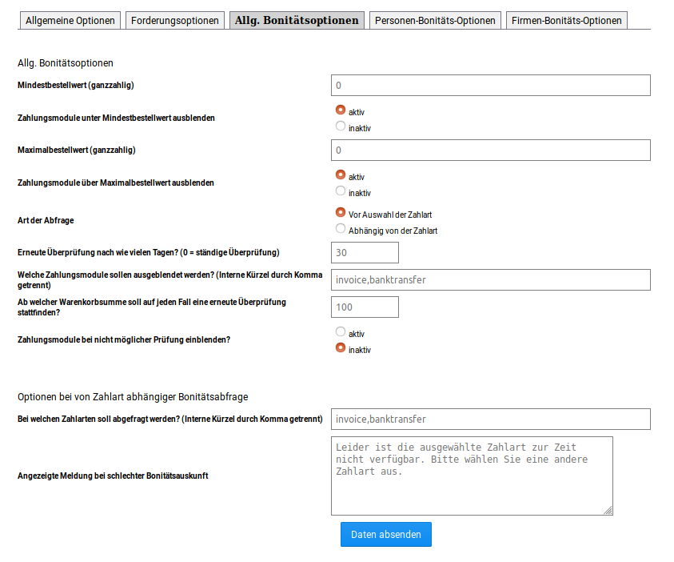

Hier werden Einstellungen bezüglich der Bestellung und der Zahlungsweisen vorgenommen. Hierzu zählen z.B. ab welchem Warenwert die Prüfung greifen soll, bei welchen Zahlungsmodulen dies erfolgen soll und welche Nachricht der Kunde ggf. erhalten soll, wenn die Bonität nicht gegeben ist.

#### Personen-Bonitäts-Optionen

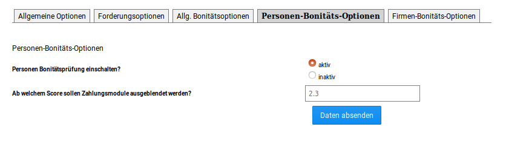

Hier kann die Bonitätsprüfung für Einzelpersonen aktiviert werden.

#### Firmen-Bonitäts-Optionen

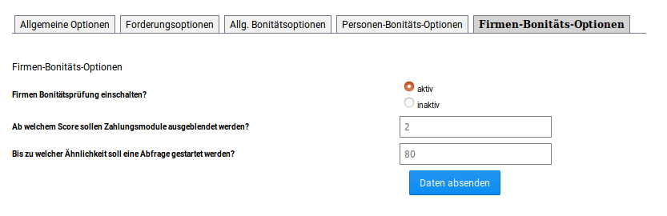

Hier kann die Bonitätsprüfung für Firmenkunden aktiviert werden.

### mediafinanz Fehler

Unter _**mediafinanz Fehler**_ werden nach unserem letzten Stand Einträge für fehlerhafte Prüfungen und allgemeine Fehler im Sinne eines Logs aufgeführt. Bitte erfrage Details hierzu direkt bei Mediafinanz.

### mediafinanz Forderungen

Dieser Menüpunkt verweist direkt nach der Installation auf den Unterpunkt _**Forderungs-Optionen**_. Nach unserem derzeitigen Stand gehen wir davon aus, dass zum Aufruf der Forderungsübersicht ein Mandantenaccount bei Mediafinanz erforderlich ist.

## Warenkorb teilen

Über das Modul _**Warenkorb teilen**_ ist es möglich, den Inhalt des Warenkorbs über einen Link an eine andere Person zu schicken.

### _**Warenkorb teilen**_ installieren / deinstallieren

Um das Modul zu installieren, gehe im Gambio Admin unter _**Module \> Modul-Center**_ und wähle den Eintrag _**Warenkorb teilen**_ aus der Liste aus. Klicke anschließend auf die Schaltfläche _**Installieren**_, in der rechten, unteren Bildschirmecke. Wurde das Modul installiert, kann es dort über einen Klick auf _**Deinstallieren**_ wieder abgeschaltet werden. Bisher im Modul vorgenommene Einstellungen bleiben hierbei erhalten.

### _**Warenkorb teilen**_ bearbeiten

Wurde das Modul installiert, kann es unter _**Module \> Modul-Center**_ bearbeitet werden. Wähle hierzu den Eintrag _**Warenkorb teilen**_ und klicke auf die Schaltfläche _**Bearbeiten**_, in der rechten, unteren Bildschirmecke. In dieser Maske kann festgelegt werden, wie lange ein Link zu einem auf diese Weise geteilten Warenkorb gültig ist. Stelle hierzu über das Dropdown _**Lebenszeit in Tagen**_ die gewünschte Anzahl Tage ein und bestätige die Änderung mit einem Klick auf _**Speichern**_. Wird 0 eingestellt, kann der Link ohne zeitliche Einschränkung verwendet werden.

### Teilen eines Warenkorbs über den Shopbereich

Ínnerhalb des Warenkorbs wird nach Installation des Moduls der Link _**Warenkorb teilen**_ unterhalb des _**Kasse**_-Buttons angezeigt.

Bei einem Klick auf den Link öffnet sich ein neues Dialogfenster, welche den generierten Warenkorb-Link angezeigt.

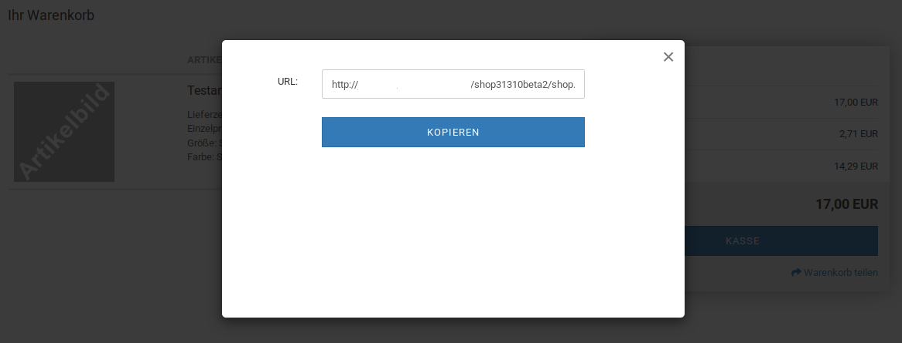

Mit einem Klick auf die Schaltfläche _**Kopieren**_ kann der Link in die Zwischenablage übernommen werden.

## Janolaw

Das Janolaw-Modul dient zum Beziehen und Einbinden von Rechtstexten. Es wird im Grundumfang des Shopsystems mit ausgeliefert, jedoch übernimmt Janolaw Support und Entwicklung des Moduls. Der Support von Janolaw kann unter _**support@janolaw.de**_ oder unter _**06196 / 77 22 777**_ kontaktiert werden.

### Installation

Das Janolaw-Modul kann unter _**Module \> Modul-Center**_ installiert werden. Wähle hier den Eintrag _**janolaw AGB Hosting-Service**_ aus und klicke auf die Schaltfläche _**Installieren**_, in der rechten, unteren Bildschirmecke.

### Konfiguration

Über den Button _**Bearbeiten**_ kann man die Moduleinstellungen aufrufen. Es wird der Inhalt des ersten Tabs _**AGB Hosting Service**_ angezeigt, der über die Anmeldung bei Janolaw informiert. Im zweiten Reiter findet die Konfiguration des Moduls selbst statt.

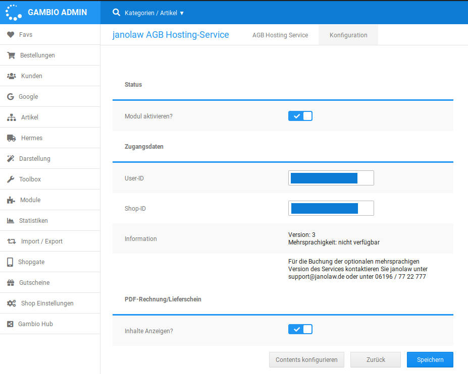

#### Status

Mit der Option _**Modul aktivieren**_ kann das Modul aktiviert oder deaktiviert werden.

#### Zugangsdaten

_**User-ID**_ und _**Shop-ID**_ erhältst du von Janolaw. Nach Eingabe der Daten wird unter _**Information**_ ein Hinweis zum Inhalt des gebuchten Pakets, sowie die Kontaktdaten des Janolaw-Supports angezeigt.

#### PDF-Rechnung/Lieferschein

Hier kann ausgewählt werden, ob die Janolaw-Rechtstexte für AGB und Widerruf automatisch in der PDF-Rechnung bzw. im PDF-Lieferschein eingebunden werden sollen.

#### Contents konfigurieren

Mit Klick auf den Button _**Contents konfigurieren**_ werden die Janolaw-Rechtstexte automatisch in die Content-Seiten eingebunden und sind damit im Shop aufrufbar.

## Fehlerberichte 

Das Modul _**Fehlerberichte senden**_ dient beim Auftreten einer Fehlermeldung der Übermittlung von Detailinformationen an Gambio. Anhand der übermittelten Daten können wir neben der Meldung selbst auch Rahmenbedingungen auswerten, die zum Zeitpunkt der Meldung bestanden haben und die Ergebnisse dieser Auswertung in die Entwicklung zukünftiger Versionen einfließen lassen.

Fehlerberichte enthalten:

-   Server-Informationen \(z.B. PHP- und mySQL-Versionen, Einstellungen, geladene Module\)
-   Laufzeit-Informationen \(z.B. Script-Name/URL, Sprache, IP, Zeitstempel, Browser, genutzte Parameter\)
-   Fehlerdetails \(z.B. Fehlermeldung, betroffener Code-Abschnitt\)

!!! danger "Achtung"

	 Fehlerberichte können unter Umständen auch persönliche Daten enthalten, z.B. wenn es zu Fehlern während der Verarbeitung von Bestelldaten kommt. Bitte prüfe, ob eine Information deiner Kunden, zum Beispiel im Rahmen der Datenschutzerklärung, nötig ist. Das Senden der Fehlerberichte kannst du im Modul-Center jederzeit wieder deaktivieren, indem du das Modul deinstallierst.

### Installieren / Deinstallieren

Das Modul kann unter _**Module \> Modul-Center**_ installiert werden. Wähle hierzu den Eintrag _**Fehlerberichte senden**_ aus der Übersicht aus und klicke auf die Schaltfläche _**Installieren**_, in der rechten, unteren Bildschirmecke.

Ist das Modul installiert, kannst du es in der Auflistung auswählen und mit einem Klick auf die Schaltfläche _**Deinstallieren**_ wieder abschalten.

## Zwei-Faktor-Authentifizierung

Mit der Zwei-Faktor-Authentifizierung kann man den Login in den Shop zusätzlich absichern. Hierfür gibt es verschiedene Apps, z.B. den _**Google Authenticator**_ oder auch die App _**Authenticator**_ von der Firma _**Pixplicity**_.

### Installation und Einrichtung

Das Modul kann unter _**Module \> Modul-Center**_ installiert werden. Wähle hierzu den Eintrag _**Zwei-Faktor-Authentifizierung**_ aus der Liste aus und klicke auf die Schaltfläche _**Installieren**_, in der rechten, unteren Bildschirmecke.

Nach der Installation kann das Modul über einen Klick auf _**Bearbeiten**_ eingerichtet werden.

#### Erste Seite der Einrichtung 

Die erste Seite beschreibt allgemein, wozu die Zwei-Faktor-Authentifizierung dient. Klicke auf _**Einrichten**_, um den Vorgang fortzusetzen. Über einen Klick auf _**Weiter**_ gelangst du zur nächsten Seite der Einrichtung.

#### QR-Code

Der angezeigte QR-Code muss über die jeweils installierte Handy-App gescannt werden.

#### Darstellung in der App

Die App zeigt einen 6-stelligen Code an.

#### Code eintragen

Der Code aus der App muss dann im Shop eingetragen werden.

#### Bestätigung

War die Authentifizierung erfolgreich, wird eine Bestätigung angezeigt und das Kundenkonto aufgerufen.

#### Code nicht korrek

Erhält man die Rückmeldung, der eingegebene Code sei nicht korrekt, so kann dies drei uns bekannte Gründe haben.

-   Der Code wurde tatsächlich falsch eingetippt
-   Der Code wurde erst Minuten nach dem Erstellen eingetippt und ist daher nicht mehr gültig
-   Die Serverzeit weicht von der tatsächlichen Zeit ab, was im Ergebnis dem vorherigen Fall entspricht. Wende dich hier bitte an deinen Hosting-Anbieter, damit dieser die Serverzeit korrigieren kann.

### Auswirkung auf die Anmeldung

Künftig erhält der Kunde bei jeder Anmeldung zusätzlich noch eine Abfrage des 6-stelligen Codes, den er in seiner App ablesen kann.

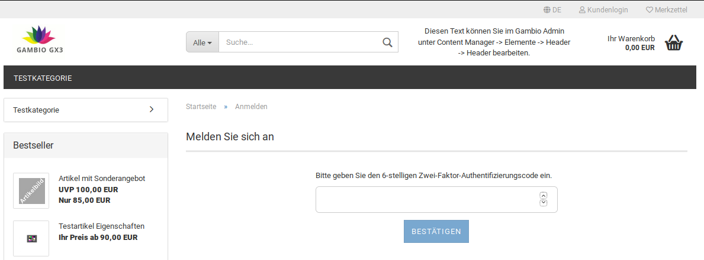

## Sunnycash

Das SunnyCash-Modul \(früher Ovisto\) blendet nach dem Bestellvorgang für den Kunden Gutscheine ein, die dieser als Dankeschön für die Bestellung in Anspruch nehmen kann. Aktuell \(2019-07-16\) sind dies Gutscheine von anderen Shops, jedoch sind für die Zukunft Erweiterungen geplant, damit die Zusammenstellung der Gutscheine gezielter eingestellt werden kann.

### Installation

Das Modul kann unter _**Module \> Modul-Center**_ installiert werden. Wähle hierzu aus der Liste den Eintrag _**SunnyCash**_ aus und klicke auf _**Installieren**_, in der rechten, unteren Bildschirmecke. Nach der Installation kann über einen Klick auf die Schaltfläche _**Bearbeiten**_ die Anzahl der Gutscheine festgelegt werden. Zudem kann das Modul hier bei Bedarf deaktiviert oder aktiviert werden.

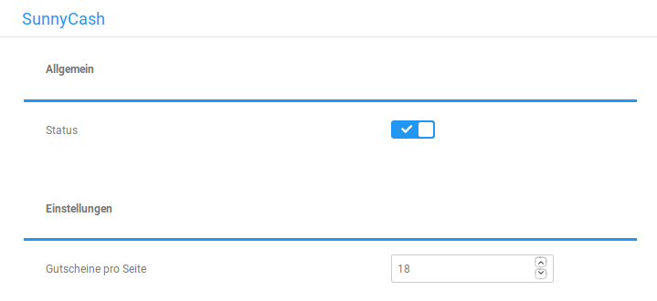

## Cookie Consent-Panel

Über das Cookie Consent-Panel können deine Kunden sich über die im Shop eingesetzten Cookies informieren und deren Verwendung zustimmen bzw. diese ablehnen.

### Aufbau des Cookie Consent-Panels im Shop

In der Grundansicht informiert das Cookie Consent-Panel den Besucher allgemein über die Verwendung von Cookies. Er kann sofort allen einwilligen oder über den Link unter dem entsprechenden Button das Cookie-Preference-Center aufrufen.

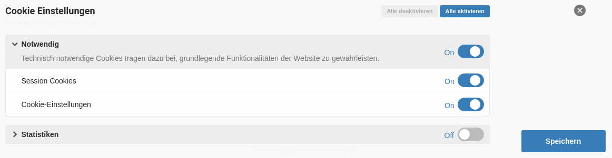

Über das Cookie-Preference-Center kann die Verwendung einzelner Cookies an- und abgewählt werden. Die Cookies sind hierbei unter ihren jeweiligen Kategorien aufgelistet, die sich aus- und einklappen lassen. Über das _**x**_ gelangt der Besucher zurück zum allgemeinen Consent-Panel.

!!! note "Hinweis"

	 Die Cookies unter _**Notwendig**_, hierzu zählen Session Cookies und Cookie-Einstellungen, können standardmäßig nicht abgeschaltet werden, da sie zum Betrieb des Shops bzw. des Cookie Consent-Panels erforderlich sind. Für technisch absolut notwendige Cookies muss keine Zustimmung durch den Besucher erfolgen.

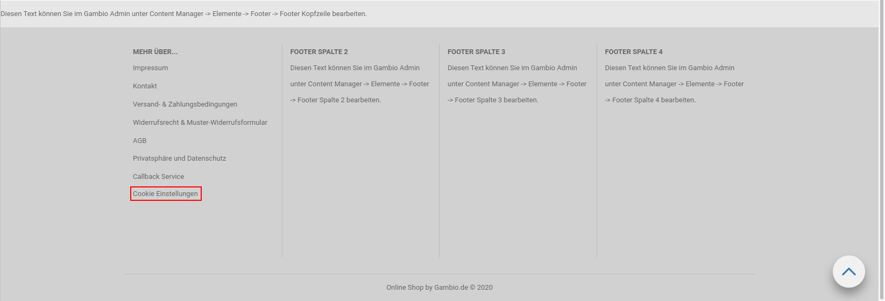

Über den Link _**Cookie Einstellungen**_ in der ersten Spalte \(Mehr über\) des Footers kann jederzeit auf die Cookie Einstellungen zugegriffen und diese angepasst werden.

!!! note "Hinweis"

	 Der Text des Links im Footer kann bei Bedarf über _**Toolbox \> Texte anpassen**_ bzw. _**Inhalte \> Texte anpassen**_ geändert werden.

	  
### Installieren / Deinstallieren

Das Modul kann unter _**Module \> Modul-Center**_ installiert werden. Wähle hierzu den Eintrag _**Cookie Consent**_ aus und klicke auf die Schaltfläche _**Installieren**_, in der rechten, unteren Bildschirmecke. Über _**Deinstallieren**_ kann die Installation wieder rückgängig gemacht werden.

### Bearbeiten

Über einen Klick auf _**Bearbeiten**_ kann das Modul eingerichtet werden. Hierzu stehen die Reiter _**Allgemein**_, _**Kategorien**_ und _**Zwecke**_ zur Verfügung.

#### Allgemein

Im Bereich _**Allgemein**_ kann das Modul über die Einstellung _**Status**_ an- und abgeschaltet werden. Setze bzw. entferne hierzu den Haken und bestätige dies mit einem Klick auf die Schaltfläche _**Speichern**_, am unteren Ende der Seite.

Zudem können die im Cookie Consent-Panel verwendeten Texte für die im Backend aktivierten Sprachen \(_**Shop Einstellungen \> Land/Steuer \> Sprachen**_ bzw. _**Einstellungen / Sprachen, Länder, Steuern / Sprachen**_, nach Aufruf der Seite\) eingestellt werden. Hierzu zählen die folgenden Einstellungen:

|Feldname|vorbelegt mit \(de\)|vorbelegt mit \(en\)|
|--------|--------------------|--------------------|
|Überschrift|Diese Webseite verwendet Cookies und andere Technologien|This website uses Cookies and other technologies.|
|Text für den Link zum Cookie-Preference-Center|Weitere Informationen|More information|
|Label für den Zustimmen-Button|Speichern|Save|
|Label für den Allen-Zustimmen-Button|Alle Akzeptieren|Accept all|
|Label für den Button, der alle Zwecke aktiviert|Alle aktivieren|Activate all|
|Label für den Button, der alle Zwecke deaktiviert|Alle deaktivieren|Deactivate all|
|Überschrift des Cookie-Preference-Centers|Cookie Einstellungen|Cookie settings|
|Text|Wir verwenden Cookies und ähnliche Technologien, auch von Drittanbietern, um die ordentliche Funktionsweise der Website zu gewährleisten, die Nutzung unseres Angebotes zu analysieren und Ihnen ein bestmögliches Einkaufserlebnis bieten zu können. Weitere Informationen finden Sie in unserer <a href='shop\_content.php?coID=2'\>Datenschutzerklärung</a\>.|We use Cookies and other technologies, also from third-party suppliers, to ensure the basic functionalities and analyze the usage of our website in order to provide you with the best shopping experience possible. You can find more information in our <a href='shop\_content.php?coID=2'\>Privacy Notice</a\>.|
|Überschrift wenn alle Cookies nicht erlaubt sind|Keine Cookies erlaubt.|No Cookies allowed.|
|Text wenn alle Cookies nicht erlaubt sind|Bitte aktivieren Sie Cookies in den Einstellungen Ihres Browsers.|Please activate Cookies in the settings of your browser.|

Klicke auf die jeweilige Flagge, um den Inhalt für die zugehörige Sprache anpassen zu können.

#### Kategorien

Es gibt verschiedene Arten von Cookies, die je nach Zweck andere Funktionen erfüllen. Im Cookie Consent-Panel werden die einzelnen Cookies zur besseren Übersicht in verschiedene Kategorien aufgeteilt, die ihrem Verwendungszweck entsprechen. Standardmäßig sind dies

-   Notwendig
-   Funktional
-   Statistiken
-   Marketing
-   Sonstiges

Im Reiter _**Kategorien**_ können die Namen und Beschreibungstexte dieser Kategorien pro aktive Sprache angepasst werden. Klicke hierzu auf die jeweilige Landesflagge, nimm die Änderungen nach Bedarf vor und bestätige mit einem Klick auf _**Speichern**_ am unteren Ende der Seite.

#### Zwecke

Über den Reiter _**Zwecke**_ können die einzelnen Cookies für den Hinweis hinzugefügt und gepflegt werden.

Die Haken in der Spalte _**Status**_ legen jeweils fest, ob ein definierter Cookie-Hinweis im Cookie Consent-Panel eingebunden wird. Eingebundene Cookies werden im Cookie-Preference-Center angezeigt und können nach Akzeptieren durch den Kunden bzw. Besucher gesetzt werden.

##### Neuen Zweck hinzufügen

Über den grünen Button _**Neuen Zweck hinzufügen**_ kann ein neuer Eintrag für einen Cookie angelegt werden. Der Reihe nach können die _**Kategorie**_ \(siehe Kategorien\), der _**Status**_ und für die einzelnen Sprachen _**Titel**_ \(der Namen, unter dem der Cookie im Cookie-Preference-Center angezeigt wird\) sowie _**Beschreibung**_ festgelegt werden.

##### Zweck bearbeiten

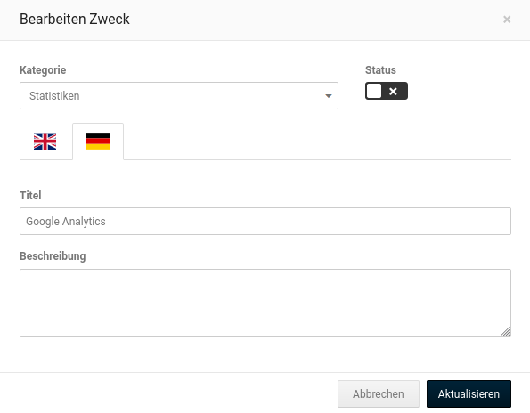

Beim Bearbeiten eines Zwecks stehen die gleichen Einstellungen wie beim Anlegen zur Verfügung.

##### Zweck Löschen

Selbst angelegte Zwecke können wieder gelöscht werden. Öffne hierzu das Dropdown und wähle den Eintrag _**Löschen**_ aus.

Bestätige die Sicherheitsabfrage mit einem Klick auf den roten _**Löschen**_-Button.

##### Integration anzeigen

Über _**Integration anzeigen**_ wird ein neues Fenster mit zwei Textfeldern geöffnet, diese zeigen wie man selbst eingefügten externe Inhalte kapseln muss, damit die Einstellung des Cookiepanels dafür entsprechend greift.

!!! note "Hinweis"

	 Das Eingabefeld _**Integration von direkt geladenem Code**_ ist für Inline JavaScript vorgesehen.

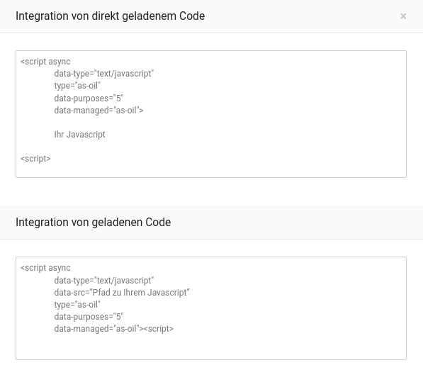

## Protected Shops

### Installation

Das Protected Shops-Modul kann im Gambio Admin unter _**Module \> Modul-Center**_ installiert werden. Wähle hierzu den Eintrag _**Protected Shops**_ aus und klicke auf die Schaltfläche _**Installieren**_, in der rechten, unteren Bildschirmecke. Über einen Klick auf _**Deinstallieren**_, kann dieser Schritt bei Bedarf rückgängig gemacht werden.

### Einrichtung

Nach der Installation kommt man mit Klick auf _**Bearbeiten**_ auf die Konfigurationsseite. Im ersten Tab werden allgemeine Informationen zu Protected Shops, der Hinweis auf ein Angebot für Gambio-Kunden sowie eine Kurzanleitung für die Anmeldung bei Protected Shops angezeigt.

#### Konfiguration

Die eigentliche Einrichtung findet im Tab _**Konfiguration**_ statt und besteht zu diesem Zeitpunkt nur aus einem Eingabefeld für die _**Shop-ID**_, die du von Protected Shops erhältst. Nach der Eingabe der Shop-ID werden weitere Felder angezeigt.

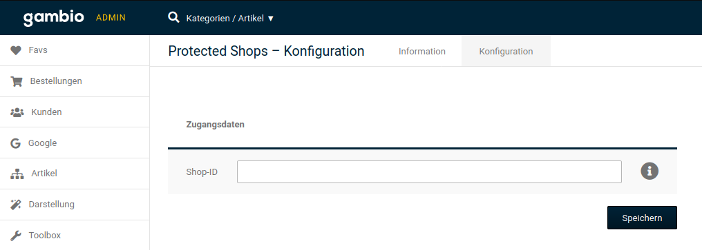

#### Verwendung der Dokumente in Content-Seiten

Hier wird ausgewählt, welcher Rechtstext in welchem Content ausgegeben werden soll. Wir empfehlen hier die Auswahl der vorangelegten Contents, sofern vorhanden.

!!! danger "Achtung"

	 Wichtig beim Widerruf: hier darf nicht der Content _**Widerrufsrecht & Muster-Widerrufsformular**_ \(ID 3889895\) ausgewählt werden, sondern nur einer der darüber eingebundenen Widerrufscontents _**Widerruf 1-4**_ \(IDs 3889896 bis 3889899\).

Für die Handlungsanleitung und das Batteriegesetz gibt es keine vorangelegten Contents im Shop, diese musst du vorher unter _**Darstellung \> Content Manager**_ bzw. _**Inhalte \> Content Manager**_ selbst anlegen und anschließend im Protected Shops-Modul auswählen.

#### Verwendung in Rechnung/Lieferschein \(PDF\)

Wenn die Rechtstexte in Rechnung und Lieferschein angehängt werden sollen, kann dies hier aktiviert werden.

")

#### Aktualisierung

Legt den Zeitraum fest, in dem die Texte automatisch aktualisiert werden sollen. Der Zeitraum wird hier in Sekunden angegeben, ein zu kurzer Zeitraum wird sich negativ auf die Ladezeiten im Shop auswirken. Eine Aktualisierung pro Tag ist völlig ausreichend, dies wären also 86400 Sekunden.

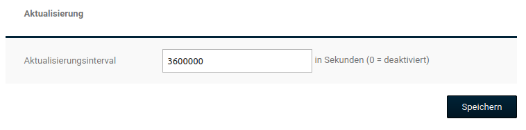

#### Verfügbare Dokumente

Hier können die Dokumente manuell aktualisiert und zur Verwendung gekennzeichnet werden.

!!! note "Hinweis"

	 Es kann bei der Ersteinrichtung unter Umständen nötig sein, die _**Seitenart**_ der jeweiligen Contents von Hand auf _**Skriptdatei**_ umzustellen und die jeweilige Datei von Protected Shops über den Dateimanager auszuwählen.

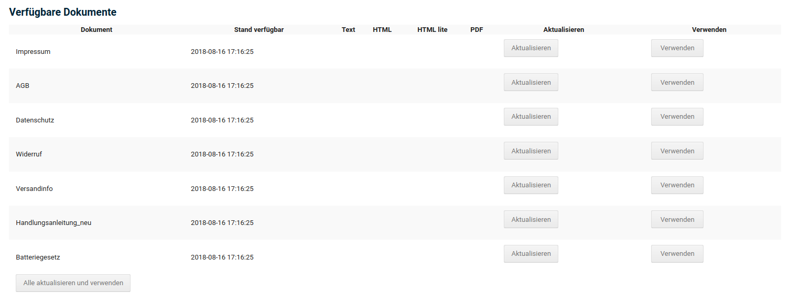

## Hermes HSI

### Allgemeines

_**Hermes \(HSI\)**_ ist das Modul für die neue Hermes-Schnittstelle und löst das bisherige Modul _**Hermes-Versand**_ ab, da die dafür benötigte Schnittstelle von Hermes voraussichtlich Ende März 2020 abgeschaltet wird. Ein wesentlicher Unterschied ist, dass dieses Modul die Erstellung von Versandlabeln ohne Vertrag mit Hermes \(früher PriPS - PrivatPaketService, auch für Privatkunden nutzbar\) nicht mehr unterstützt.

Hermes \(HSI\) ist ab Shopversion 4.0 im Umfang der Shopsoftware enthalten und steht nicht als separates Modul zur Verfügung.

### Installation

Das Modul kann im Gambio Admin unter _**Module \> Modul-Center**_ installiert werden. Wähle hierzu den Eintrag _**Hermes \(HSI\)**_ aus und klicke auf die Schaltfläche _**Installieren**_, in der rechten, unteren Bildschirmecke. Über die Schaltfläche _**Deinstallieren**_ kann dieser Schritt wieder rückgängig gemacht werden.

### Konfiguration

#### API-Zugangsdaten

Im ersten Schritt erlaubt die Konfiguration nur die Eingabe der API-Daten. Diese Daten erhältst du bei deinem Vertragspartner Hermes. Zudem kann zwischen Live- und Testbetrieb gewählt werden.

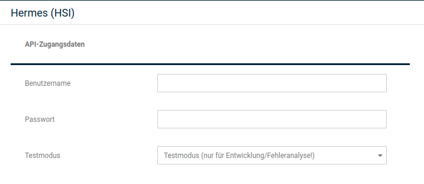

#### Absender

Damit die Label mit den nötigen Angaben erstellt werden können, musst du hier deine Adressdaten hinterlegen.

#### Konfiguration

|Feldname|Beschreibung|
|--------|------------|
|Bestellstatus nach Speichern des Versandauftrags|Wenn gewünscht, kann direkt nach dem Erstellen des Labels schon ein abweichender Bestellstatus gesetzt werden. Welcher dies ist, kann hier ausgewählt werden.|
|Bestellstatus nach Abruf des Labels|Auch nach dem Abruf des Labels kann der Bestellstatus geändert werden, eine Auswahl ist über das Dropdown-Menü hier möglich.|
|Paketdienst|Hier kann der gewünschte Paketdienst gewählt werden, die unter _**Shop Einstellungen \> Paketdienste**_ bzw. _**Einstellungen / Lieferung / Paketdienste**_, nach Aufruf der Seite, konfiguriert werden können und in denen man einrichten kann, welcher Trackinglink für die Sendungsverfolgung verwendet wird. Als Standard sollte hier _**Hermes**_ gewählt werden. Der Paketdienst_** MyHermes**_ betraf nur Sendungen, die mit PriPS \(PrivatPaketService\) erstellt wurden, was aktuell noch über die Hermes-Webseite möglich ist.|
|Methode für Labeldownload|Hier kann gewählt werden, ob das Label beim Abruf direkt im Browserfenster geöffnet werden oder zuerst heruntergeladen werden soll. Da es in der Vergangenheit in einigen Browserversionen Probleme beim Öffnen und Drucken von PDF-Dateien im Browser gab, kann diese Option helfen, eben diese Probleme zu vermeiden.|
|Sofortdownload verwenden|Hier kann gewählt werden, ob das erstelle Label sofort im Shop abgerufen wird oder ob dies später manuell z.B. über die Oberfläche im Hermes-Geschäftskundenkonto geschehen soll.|
|Vorgabe Paketgewicht|Das Sendungsgewicht kann berechnet werden, sofern in den Artikeln ein Artikelgewicht hinterlegt wurde. An dieser Stelle kann gewählt werden, ob die Berechnung nur das Artikelgewicht oder zusätzlich noch das Verpackungsgewicht einschließt.|

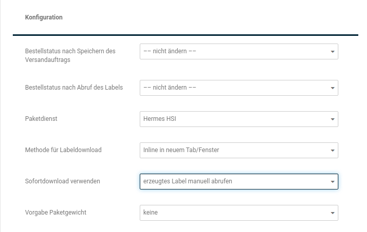

#### Vorgabe-Abmessungen

Wenn du häufig bestimmte Kartongrößen verwendest, so kannst du die Abmessungen dafür hier eintragen. So muss diese bei der Labelerstellung dann nur noch ausgewählt werden, statt die Maße manuell eintragen zu müssen.

!!! note "Hinweis"

	 Die vorausgefüllten Werte dienen nur der Illustration.

		
### Verwendung

In der Bestellübersicht kann über die Dropdown-Schaltfläche rechts neben der Bestellung _**Hermes \(HSI\)**_ gewählt werden. Auch aus der Bestelldetailseite heraus steht diese Option zur Verfügung.

 über die Dropdown-Schaltfläche")

Es erscheint nun ein Modal-Dialogfenster, in dem verschiedene Angaben zur Sendung gemacht werden können.

#### Empfänger

Die Adressdaten des Empfängers werden aus der Lieferadresse der Bestellung übernommen, Änderungen sind hier nur notwendig, wenn noch ein Adresszusatz hinzugefügt oder eine Korrektur vorgenommen werden soll.

!!! danger "Achtung"

	 Bei Lieferungen in manche Länder \(z.B. Dänemark oder Schweden\) ist die Angabe einer Kontaktmöglichkeit wie Telefonnummer oder E-Mail-Adresse nötig. Diese kann unterhalb der Adressdaten in speziellen Feldern hinterlegt werden.

	 

#### Paket

Hier wird die Größe des Paketes angegeben. Dabei kann entweder aus den Hermes-Größen S bis XXL gewählt oder alternativ eine Berechnung aus den zuvor im Modul angegeben Paketgrößen gewählt werden.

#### Optionen

Hier kann der Nachnahme-Betrag manuell festgelegt werden. Bei Bestellungen über Nachnahme ist dies nicht nötig, hier wird der Gesamtbestellwert inklusive Nachnahmegebühr hinterlegt, wie er auch in der Bestellung erfasst ist.

#### Absender

Die Absenderangaben werden automatisch mit den Werten befüllt, die zuvor im Modul selbst vorgenommen wurden. Änderungen sind jedoch möglich.

### Label abrufen

#### Manueller Abruf

Der Erfolg der Labelerstellung wird durch die Meldung _**Hermes-Versandauftrag angelegt**_ sichtbar gemacht. Darunter finden sich dann Details zum Label und ein Button für den Abruf. Der Status ist hier _**Auftrag erzeugt**_ - das Label wurde also erstellt, aber noch nicht abgerufen, es wird auch noch keine Sendungsnummer angezeigt.

Nach dem Abruf ändert sich die Darstellung, der Status ändert sich in _**Label erzeugt**_ und eine Sendungsnummer wird hinzugefügt.

#### Sofortiger Abruf

Das Label öffnet sich direkt im gleichen Tab, ruft man die Seite mit der Labelerzeugung auf, sieht die Erfolgsmeldung so aus:

#### Label

Das abgerufene Label weist Empfänger, Absender und die Retourenadresse aus. Auch das Versandgewicht und das Datum der Labelerstellung wird angezeigt.

#### Darstellung in Bestellung

Die Sendungsnummer wird mit dem Abruf des Labels automatisch in den Bestelldetails hinterlegt und kann jetzt im Rahmen einer manuellen Statusbenachrichtigung an den Kunden mit versendet werden.

")

## releva.nz

### Allgemeines

Releva.nz ist ein Dienst, über den automatisches Retargeting vorgenommen werden kann. Auf der Webseite von releva.nz \(https://releva.nz/gambio-plugin/\) finden sich hierzu zahlreiche Informationen, es werden hier zudem Grundlagen wie dynamisches Retargeting \(https://releva.nz/dynamisches-retargeting/\) und die Funktion von AD-Netzwerken \(_**https://releva.nz/ad-netzwerke/**_\) erklärt.

### Verfügbarkeit

Das releva.nz-Modul ist standardmäßig in allen Cloud-Shops enthalten. Für Nutzer selbstgehosteter Shops steht das Modul unter _**https://releva.nz/gambio-plugin/**_ zum Download bereit.

### Installation

#### Dateiupload in selbst gehosteten Shops

Vor dem Hochladen des Moduls muss das heruntergeladene Paket entpackt werden.

!!! note "Hinweis für Windows-Nutzer"

	 Wir empfehlem aufgrund der Pfadlängenbegrenzung unter Windows das Paket an einem Ort zu entpacken, der möglichst weit oben im Verzeichnisbaum liegt. Dies kann z.B. ein Ordner wie _**C:\\Gambio**_ sein.

Wechsele in den entpackten Ordner. Hier sollte ein weiterer Ordner _**Releva**_ zu finden sein. Dieser Ordner mus in das Verzeichnis _**GXModules**_ deiner Shopinstallation hochgeladen werden. Hierzu kannst du einen sogenannten FTP-Client, wie das kostenlose Programm _**FileZilla**_ verwenden.

!!! note "Hinweis"

	 Wenn du dir nicht sicher bist, in welchem Ordner auf deinem Server sich dein Shopverzeichnis befindet, kannst du den Gambio Admin aufrufen. Wechsele hier zum Menüpunkt _**Toolbox \> Datenbanksicherung**_. Auf der rechten Seite findest du die Angabe _**Sicherungsverzeichnis**_. Entferne hier gedanklich die beiden Unterordner _**/admin/backups/**_ und du hast den Pfad zum Shopverzeichnis auf dem Server.

#### Installation im Modul-Center in Cloud- und selbst gehosteten Shops

Das Modul releva.nz ist nun unter _**Module \> Modul-Center**_ zu finden und kann hier mit wenigen Mausklicks installiert werden. Wähle hierzu den Eintrag aus der Liste aus und klicke auf die Schaltfläche _**Installieren**_ in der rechten, unteren Bildschirmecke. Über eine Klick auf _**Deinstallieren**_ kann dieser Schritt wieder rückgängig gemacht werden.

### Einrichtung

Direkt nach der Installation besteht die Konfigurationsseite des Moduls nur aus dem Eingabefeld für den _**API-Key**_, den du von releva.nz erhältst, nachdem du dort ein Konto eröffnet hast.

Nach erfolgreicher Eingabe des API-Keys werden zwei weitere Felder angezeigt, die _**Kunden-ID**_ und die _**Export-URL**_.

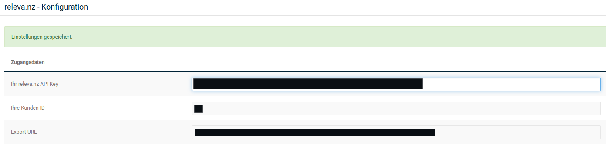

Es werden zudem neue Einträge im linken Menü des Gambio Admin angezeigt.

### Statistiken

In den Statistiken finden sich drei neue Bereiche:

#### Statistiken

Zuoberst gibt es eine übersichtliche Zusammenfassung der Einblendungen, Verkäufe, Kosten und Umsätze. Darunter können noch Tagesstatistiken ausgewählt und eine grobe Monatsstatistik eingesehen werden.

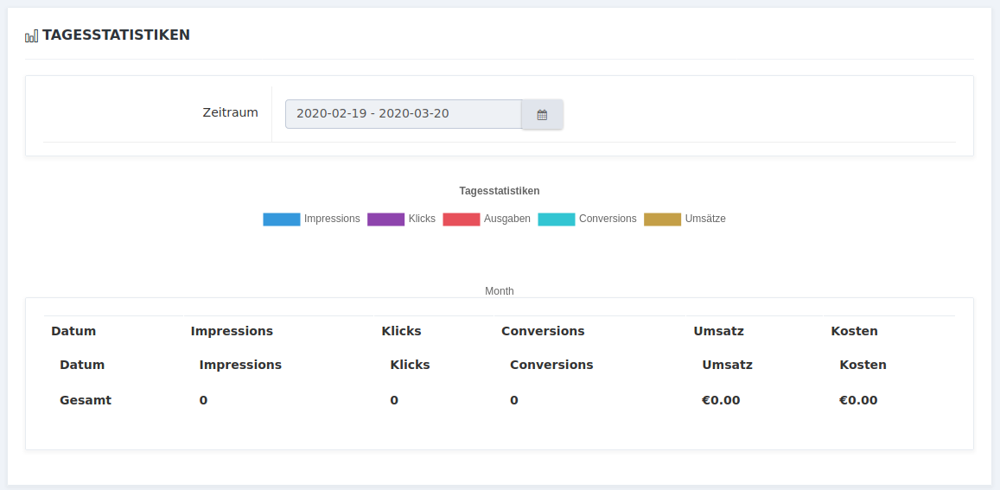

#### Tarif Informationen

Hier werden Details über den gewählten Tarif eingeblendet, zudem kannst du auch direkt über diesen Punkt kündigen, wenn du diesen Dienst nicht mehr in Anspruch nehmen möchtest.

#### Werbeeinstellungen

Hier kann das tägliche Budget festgelegt werden. Man hat also - obwohl das Modul das Retargeting komplett automatisch durchführt - die Möglichkeit, die Kosten weitestgehend selbst festzulegen.

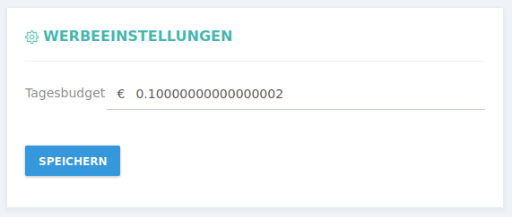

## CleverReach

### Verfügbarkeit

-   Derzeit \(24.09.2020\) ist das Modul für Cleverreach nicht in selbstgehosteten Shops enthalten und nur als separates Modul für Shopversionen bis _**4.3.x**_ verfügbar.
-   In Cloud Shops ist das CleverReach-Modul standardmäßig enthalten.
-   Voraussetzung für den Einsatz ist die Verwendung des _**Honeygrid**_-Templates oder _**Honeygrid**_-basierter Themes; dies umfasst auch das aktuelle _**Malibu**_ Theme, das auf _**Honeygrid**_ basiert.

### Installation

#### Installation in selbstgehosteten Shops

!!! note "Hinweis"

	 Die nachfolgenden Schritte sind nur in selbstgehosteten Shops bei Verwendung des händisch zu installierenden Moduls notwendig. In Cloud-Shops kann das Modul direkt unter _**Module \> Modul-Center**_ installiert werden.

1.  Zuerst müssen die Moduldateien auf den FTP-Server in das Shopverzeichnis geladen werden.
2.  Nun werden im Gambio Admin unter _**Toolbox \> Cache**_ leeren der Texte-, Modul- und der Seitenausgabecache geleert. Hierbei muss die Reihenfolge beachtet werden. Auch kann es nötig sein, die Caches mehrere Male zu leeren.

Das Modul kann nun im Gambio Admin unter unter _**Module \> Modul-Center**_ \(siehe Screenshot\) installiert werden. Wähle hierzu den Moduleintrag aus und klicke auf _**Installieren**_.

		
### Registrierung bei CleverReach

Wer CleverReach benutzen möchte, kann sich unter https://www.cleverreach.com/de/ über den Button _**Jetzt kostenlos testen**_ ein Konto anlegen.

|Abbildung|Erläuterung|
|---------|-----------|
||Für die Anmeldung ist es ausreichend, die E-Mail-Adresse einzutragen und die Kontoerstellung zu bestätigen.|
||Anschließend erhält man eine E-Mail, über die die Kontoerstellung noch einmal bestätigt werden muss. Es öffnet sich ein neuer Browertab mit dem CleverReach-Benutzerkonto. Parallel wird eine E-Mail mit den Nutzerdaten versendet.|

### Konfiguration

#### Zugang gewähren

|Abbildung|Erläuterung|
|---------|-----------|
|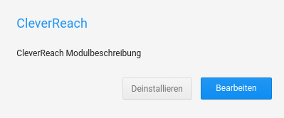|Wenn das Modul unter _**Module \> Modul-Center**_ installiert wurde, kann man mit Klick auf _**Bearbeiten**_ die Modulkonfiguration aufrufen|
|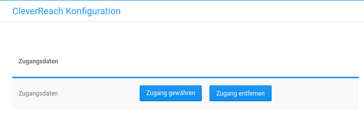|Mit Klick auf _**Zugang gewähren**_ wird man zu CleverReach weitergeleitet.|
||Hier kann jetzt ein neues Konto angelegt oder sich in ein bestehendes Konto angemeldet werden.|
|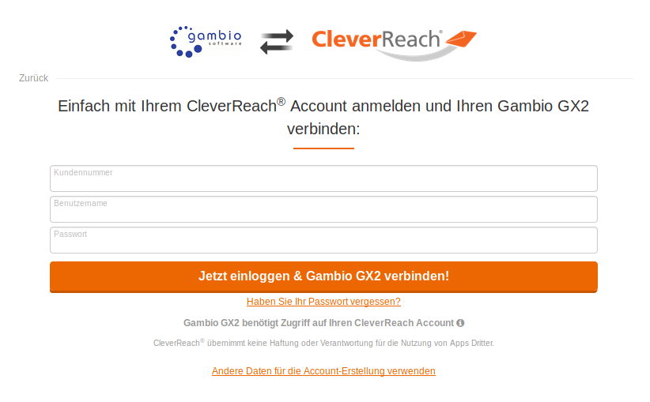|Hier müssen jetzt die Login-Daten eingegeben werden, damit das Modul Zugriff auf das CleverReach-Konto erhält. Die Daten hast du bei der Registrierung per E-Mail erhalten.|

#### Konfigurationsseite

|Abbildung|Erläuterung|
|---------|-----------|
|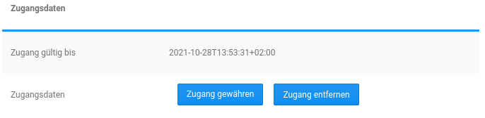|Der Zugang ist nicht unendlich gültig, sondern vorerst auf einige Jahre beschränkt. Mit Klick auf _**Zugang gewähren**_ können die Login-Daten aktualisiert werden, mit Klick auf _**Zugang entfernen**_ wird die Anbindung zum CleverReach-Konto entfernt.|
|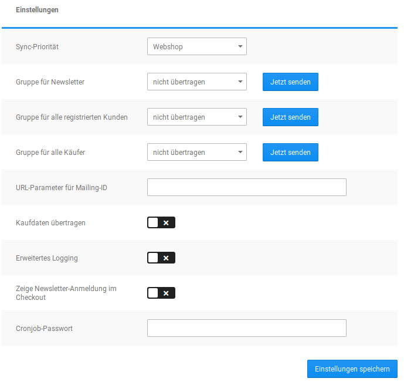|Hier können verschiedene Einstellungen zu Empfängern, Automatisierung und zu übertragende Daten gemacht werden.|

##### Sync-Priorität

Legt fest, welche Daten Priorität haben sollen. Wurde ein Kunde bei CleverReach als Empfänger aktiviert, im Shop jedoch nicht, so kann man hier festlegen, welche Einstellung die höhere Priorität haben soll. Es kann daher zwischen _**Webshop**_ und _**Cleverreach**_ gewählt werden.

##### Gruppen

Hier kann zugeordnet werden, welche Art Kunden welcher Gruppe bei CleverReach zugeordnet werden soll. Hierzu müssen bei Cleverreach zuerst Gruppen angelegt werden. Wir haben zum Zweck der Erläuterung bei CleverReach drei Gruppen angelegt, die der Einfachheit halber den Menüpunkten auf der Konfigurationsseite entsprechen.

!!! danger "Achtung"

	 Die 3 möglichen Quellen im Shop \(Kundendaten, Bestellungen, Newsletter-Anmeldungen\) müssen jeweils in verschiedene Gruppen bei Cleverreach übertragen werden!

Sollten die Gruppen hier nicht ausgewählt werden können, müssen bei CleverReach erst die Adressdaten vervollständigt werden. Hierzu muss das CleverReach-Konto aufgerufen und die Adressdaten im Bereich _**Account**_ eingetragen werden.

|Gruppe|Erläuterung|
|------|-----------|
|Gruppe für Newsletter|Damit sind Kunden gemeint, die sich im Shop für den Newsletter-Empfang angemeldet haben.|
|Gruppe für alle registrierten Kunden|Hiermit sind alle Kunden mit einem Kundenkonto gemeint.|
|Gruppe für alle Käufer|Diese Gruppe wird alle Kunden enthalten, die einmal eine Bestellung getätigt haben, unabhängig davon, ob für den Kunden noch ein Kundenkonto existiert oder nicht.|

##### URL-Parameter für Mailing-ID

Hier kann ein Name für einen URL-Parameter festgelegt werden. Dies ist interessant, wenn ein Mailing Links zu Angebotsartikeln enthält. Gibt man als Name z.B. _**crmailing**_ an, sähe die URL so aus:

http://www.dein-shop.de/tolles-produkt.html?crmailing=dez2016

Die URL beginnt also mit dem Link zum Artikel, gefolgt vom URL-Parameter _**crmailing**_. Der Wert _**dez2016**_ stellt in unserem Beispiel einen Wert dar, der bei jedem Mailing automatisch von CleverReach erstellt und vergeben wird. Hierüber ist dann die genaue Auswertung von Rückmeldungen auf die einzelnen Mailings möglich.

##### Kaufdaten übertragen

Wird diese Einstellung aktiviert, so werden Warenkorb-Inhalte nach Kaufabschluss an CleverReach übertragen. Dies ist interessant für das Erfolgstracking bei Werbemailings, die dann auch den oben erwähnten Tracking-Parameter für Links in den Shop verwenden.

##### Erweitertes Logging

Das erweiterte Logging ermöglicht eine detaillierte Analyse, wenn es bei der Verwendung des Moduls zu Problemen kommt. Standardmäßig ist dieser Punkt aus.

##### Zeige Newsletter-Anmeldung im Checkout

Hierüber kann auf der Zusammenfassungsseite eine Checkbox im Bestellvorgang eingeblendet werden, über die der Kunde sich für den Newsletter im Shop anmelden kann.

##### CronJob-Passwort

Die Gruppen können automatisch über einen CronJob abgeglichen werden. Wird ein CronJob-Passwort hinterlegt und gespeichert, so erscheint unterhalb der Einstellungen die CronJob-URL, die beim Provider eingetragen werden kann. Der CronJob führt den Abgleich der Kundengruppen dann in dem Intervall durch, der bei der Anlage des CronJobs beim Provider festgelegt wurde. Das CronJob-Passwort kannst du selbst festlegen.

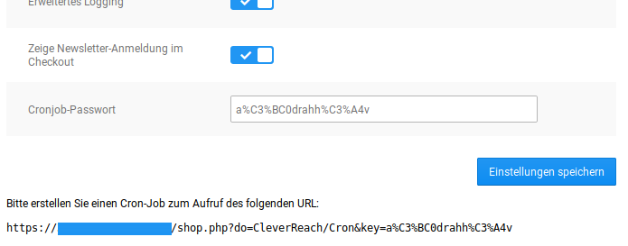

### Verwendung

Die Funktionen des Moduls beschränken sich auf die Zuweisung der Gruppen und auf die anderen oben erwähnten Einstellungen. Die Anlage von Mailings sowie deren Versand erfolgt über das Kundenkonto bei CleverReach.

Unter http://support.cleverreach.de/hc/de kann das CleverReach-Helpcenter aufgerufen werden, dort finden sich detaillierte Erklärungen zu allen Funktionen.

## ShopVote

### Grundlegende Informationen

Das ShopVote-Modul ist im Umfang der Cloud-Shops enthalten. Für selbst gehostete Shops mit Version _**3.14.x**_ bis _**3.15.x**_ steht das Modul bei Shopvote unter _**https://plugins.shopvote.de/shopvote-integrationsanleitung-fuer-gambio-gx3/**_ zum Download bereit.

!!! note "Hinweis"

	 Das Modul für Shopversionen von _**3.0.x**_ bis _**3.12.x**_ stammt nicht von Gambio, die Anleitung auf der Webseite von ShopVote bezieht sich auf das Modul von ShopVote.

!!! danger "Achtung"

	 Die folgenden Informationen beziehen sich ausschließlich auf das Modul von Gambio!

#### Installation

!!! note "Hinweis"

	 Die Schritte 1 und 2 sind nur bei Shops mit eigenem Hosting erforderlich. Betreibst du einen Cloud-Shop, kannst du direkt mit Schritt 3 beginnen, um das Modul zu installieren.

1.  Verzeichnisse aus dem Downloadpaket hochladen

    , links ist der Ordner
                des Installationspakets geöffnet, rechts das
                Shopverzeichnis")

2.  Texte-, Modul- und Seitenausgabecache des Shops in dieser Reihenfolge leeren, gehe hierzu im Gambio Admin unter _**Toolbox \> Cache**_ und betätige die entsprechenden Schaltflächen.
3.  Jetzt kann das Modul unter _**Module \> Modul-Center**_ installiert und über den Button _**Bearbeiten**_ konfiguriert werden.

### Konfiguration

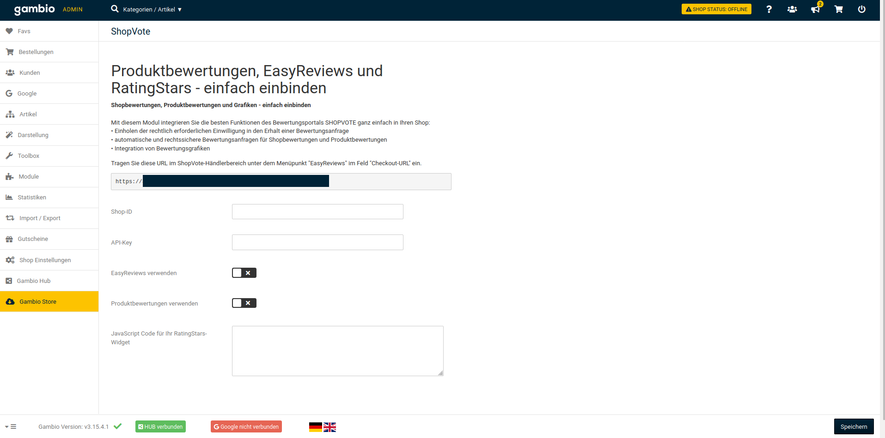

#### Shopdaten

Die Shop-ID und der API-Key, die im Modul eingetragen werden müssen, findet man im ShopVote-Konto unter dem Punkt _**VotesAPI**_

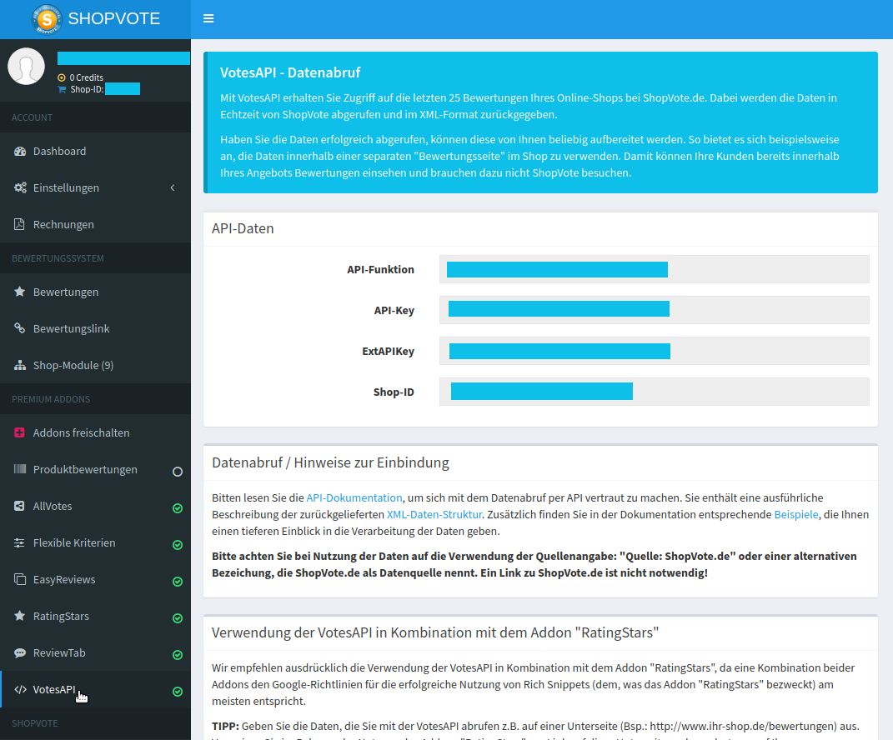

#### JavaScript Code für dein RatingStars-Widget

Den JavaScript Code für das RatingStars-Widget findet man im ShopVote-Konto, wenn man im linken Menü ganz unten auf _**Grafiken & Siegel**_ geht. Hier kann die gewünschte Darstellung ausgewählt und der Code dafür angezeigt werden. Dieser muss dann kopiert und im Modul hinterlegt werden.

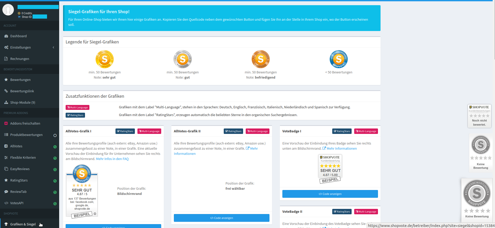

## Internetmarke

### Installation

Das aktuelle Internetmarke-Modul wird installiert, indem die Dateien auf den FTP-Server und in das Shopverzeichnis geladen werden. Ein Ausführen des Gambio Updaters ist nicht notwendig. Anschließend müssen unter _**Toolbox \> Cache**_ der Cache für die Texte, der Modul- und der Seitenausgabecache in dieser Reihenfolge geleert werden.

Anschließend kann es unter _**Module \> Modul-Center**_ ausgewählt und der Vorgang mit einem Klick auf _**Installieren**_ abgeschlossen werden.

In Cloud-Shops ist das Modul bereits enthalten und kann direkt unter _**Module \> Modul-Center**_ installiert werden.

### Konfiguration

Um das Modul zu konfigurieren, wird dieses unter _**Module \> Modul-Center**_ ausgewählt. Klicke anschließend auf _**Bearbeiten**_.

#### Login zur Portokasse

Hier werden die Login-Daten zur Portokasse benötigt.

!!! danger "Achtung"

	 Die Dienste _**Portokasse**_ und _**efiliale**_ sind nicht identisch! Mit den Daten der efiliale kann das Modul nicht verwendet werden!

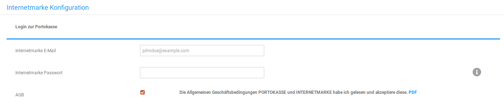

#### Absender

Diese Felder werden automatisch vorausgefüllt, können aber nachträglich angepasst werden. Es handelt sich hier um die Absenderangaben des Shopbetreibers, die vollständig vorliegen sollten und unter _**Shop Einstellungen \> Mein Shop**_ bzw. _**Einstellungen \> Shop**_ \(ab Shopversion _**4.3**_\) sowie in diesem Formular bearbeitet werden können.

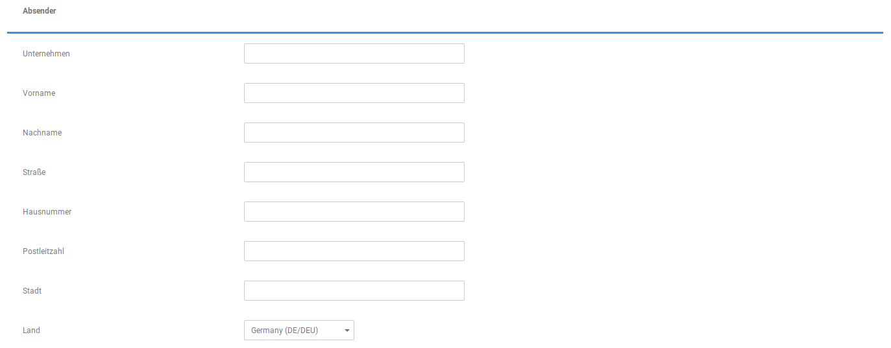

#### Bevorzugte Einstellungen

-   _**Produkt**_: Hier kann die gewünschte Art des Versands \(Umschlaggröße, Warensendung, Büchersendung, etc\) ausgewählt werden.
-   _**Druckformat**_: Mit/ohne Adresse; Gibt an, ob Kunden- und Absenderadresse mit auf die Marke gedruckt werden
-   _**Seitenformat**_: Hier kann das Format des zu bedruckenden Papiers/Umschlags gewählt werden. Es stehen verschiedene Umschlaggrößen zur Verfügung
-   _**Tracking-Link-Vorlage**_: Möchtest du einen Tracking-Link anbieten \(wahrscheinlich nicht bei allen Produkten möglich\), so kann hier eine selbst erstellte Vorlage ausgewählt werden. Unter _**Shop Einstellungen \> Paketdienste**_ bzw. _**Einstellungen / Lieferung / Versanddienstleister**_, nach Aufruf der Seite _**Paketdienste**_, können weitere Vorlagen angelegt werden. Über die Option _**E-Mail-Benachrichtigung nach Bestellstatusänderung**_ wird jedoch bereits ein Tracking-Link erstellt und versendet, die Auswahl der Vorlage ist also nur dann interessant, wenn ein spezieller Trackinglink verwendet werden soll.
-   _**Bestellstatus nach Labelerzeugung**_: Wenn der Bestellstatus nach Erstellen des Labels verändert werden soll, kann dieser hier ausgewählt werden.
-   _**E-Mail-Benachrichtigung nach Bestellstatusänderung**_: Versendet eine Nachricht an den Kunden, die einen Trackinglink enthält.
-   _**Niedrigen Guthabensstand beachten**_: Wenn aktiviert, werden nur Produkte angezeigt, die mit dem aktuellen Guthabensstand deiner Portokasse erworben werden können. Bei Verwendung von Portokasse auf Rechnung \(Guthaben kann negativ sein\) bitte deaktivieren.
-   _**Nur Vertragsprodukte zeigen**_: Wenn aktiviert, stehen nur die explizit im Vertrag freigeschalteten Produkte bei der Markenerstellung zur Auswahl

#### Motiv

Hier kann ein Motiv ausgewählt werden, welches mit auf die Marke gedruckt werden kann, wenn die Kundenadresse nicht mit ausgegeben wird. Dies kann direkt bei der Labelerstellung ausgewählt werden

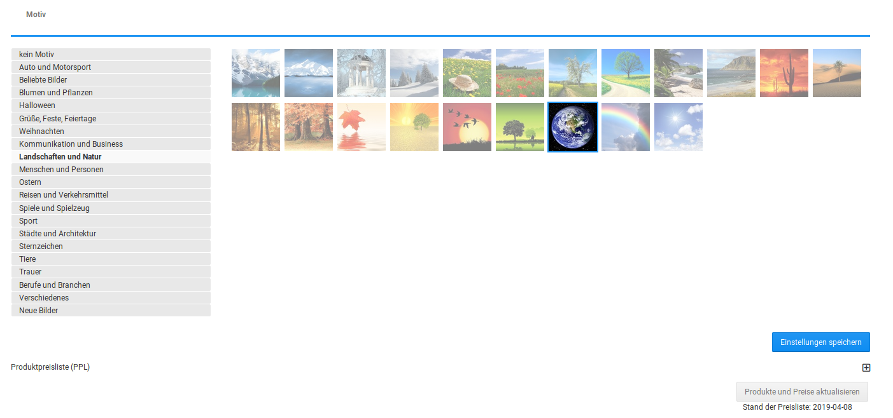

#### Produktpreisliste \(PPL\)

Du kannst dir hier die aktuellen Preise anzeigen lassen. Es gibt die Möglichkeit, die Preise über den Button _**Produkte und Preise aktualisieren**_ zu aktualisieren, da diese sich von Zeit zu Zeit ändern.

### Marke erstellen

Eine Internetmarke kann erstellt werden, indem im Gambio Admin unter _**Bestellungen \> Bestellungen**_ im Dropdown rechts von der Bestellung der Punkt _**Internetmarke erstellen**_ gewählt wird. Auch aus den Bestelldetails heraus ist dies möglich.

In diesem Dialog können bei Bedarf Änderungen an der Empfängeradresse vorgenommen. Lässt man diese weg, wird stattdessen das gewählte Motiv ausgegeben. Auch kann noch das _**Produkt**_, das _**Druckformat**_ oder das _**Seitenformat**_ geändert werden, es sind also jederzeit Ausnahmen von den generellen Einstellungen möglich, die in der Modul-Konfiguration getätigt wurden.

Mit _**Spalte**_ und _**Zeile**_ kann man angeben, wo auf dem zu bedruckenden Papier/Umschlag die Adresse gedruckt werden soll. Zur räumlichen Orientierung findet sich rechts neben den Angaben eine kleine Grafik, die die Position der Adresse deutlich macht.

Über den Button _**gedruckte Marken anzeigen**_ kann man die bisher für diese Bestellung erstellen Marken anzeigen lassen.

## Gutscheinsystem

### Installieren / Deinstallieren

Durch das Modul _**Gutscheinsystem**_ ist es im Shop möglich Gutscheine und Rabatt Coupons einzulösen und die zugehörigen Codes als Willkommensgeschenk bei der Registrierung eines Kundenkontos zu versenden. Es wird außerdem der automatische Versand der Codes von Gutscheinartikeln gesteuert.

Das Modul _**Gutscheinsystem**_ kann unter _**Module \> Modul-Center**_ installiert werden. Wähle hierzu den Eintrag _**Gutscheinsystem**_ aus und klicke rechts unten auf die Schaltfläche _**Installieren**_.

Das Gutscheinsystem ist nach der Installation aktiviert und im Gambio Admin steht das Menü _**Gutscheine**_ zur Verfügung.

Über einen Klick auf _**Deinstallieren**_ kann das Modul wieder deinstalliert und das Gutscheinsystem deaktiviert werden.

### Bearbeiten

Ist das Modul installiert, kann es über die Schaltfläche _**Bearbeiten**_ konfiguriert werden. Es stehen die folgenden Einstellungen zur Verfügung:

 

|Feldname|Beschreibung|
|--------|------------|
|Länge der Gutschein-Codes|Länge der vom Shop erzeugten Codes für Gutscheine \(max. 16 Zeichen\)|

|Feldname|Beschreibung|
|--------|------------|
|Willkommensgeschenk Gutscheinwert|Wert des Willkommensgeschenk-Gutscheins. Angabe mit Punkt als Dezimaltrenner und ohne Währung. Trage als Wert 0 ein, wenn kein Willkommensgeschenk-Gutschein versendet werden soll.|
|Willkommensrabatt-Couponcode|Code des Willkommensrabatt-Coupon. Der Coupon muss zuvor unter _**Gutscheine \> Rabatt Coupons**_ angelegt worden sein. Lasse das Feld leer, wenn du keinen Willkommensrabatt-Coupon verschicken möchtest.|

!!! note "Hinweis"

	 Willkommensgeschenk-Gutscheine und Willkommensrabatt-Coupons werden automatisch mit der Bestätigungsmail bei der Registrierung eines Kundenkontos versendet, wenn die jeweilige Funktion aktiviert ist.

|Feldname|Beschreibung|
|--------|------------|
|Bestellstatus für automatischen Versand von Gutscheincodes|Versand der Codes von Gutschein-Artikeln bei diesen Bestellstatus.|

## Single Sign-on

Single Sign-on erlaubt das Einloggen in den Shop über Konten bei den unterstüzten Anbietern. So können deine Kunden sich beispielsweise mit ihrem Facebook-Konto in deinen Shop einloggen.

### Installation

Der Single Sign-on ist ab Shopversion 3.7.1.0 standardmäßig im Umfang der Shopsoftware enthalten. Die Installation erfolgt im Gambio Admin unter _**Module \> Modul-Center \> Single Sign-on**_.

### Konfiguration

Nach Installation des Moduls kann dieses mit Klick auf _**Bearbeiten**_ konfiguriert werden. Für die verschiedenen Anbieter müssen jeweils die benötigten Zugangsdaten hinterlegt werden.

#### Google 

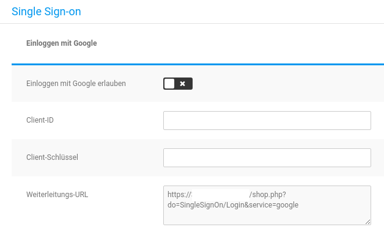

Client-ID und Client-Schlüssel erhältst du direkt bei Google unter folgender URL:

https://console.developers.google.com/apis/credentials

Sofern du bei Google noch kein Projekt angelegt hast, das als Sammlung für Einstellungen verstanden werden muss, wirst du aufgefordert dies zu tun. Wähle einen beliebigen Namen \(für deine Wiedererkennung\) und klicke auf _**Projekt erstellen**_.

Wähle über die Dropdown-Schaltfläche _**Anmeldedaten erstellen**_ den Eintrag _**OAuth-Client-ID**_ aus. Klicke auf der sich nun öffnenden Seite auf _**Zustimmungsbildschirm konfigurieren**_.

Wähle dort deine E-Mail-Adresse aus und vergib einen Produktnamen, beispielsweise deinen Shopnamen. Gib zudem noch die URL deines Shops, die URL der Datenschutzerklärung und der AGB ein. Speichere die Angaben abschließend.

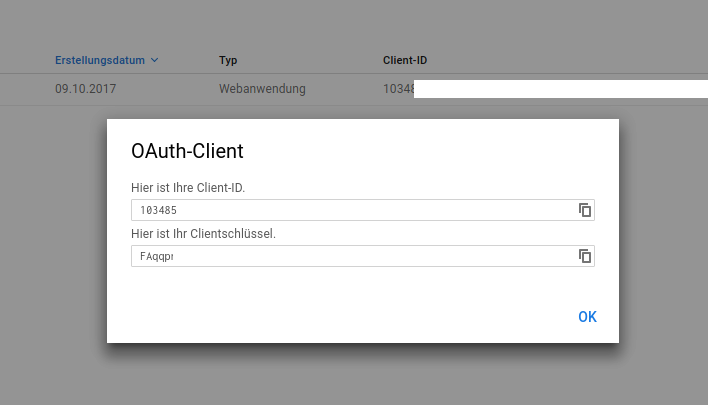

Wähle auf dem folgenden Bildschirm als Anwendungstyp _**Webanwendung**_ aus und trage unten die Weiterleitungs-URL ein, die du in der Modulkonfiguration findest. Wenn du deine Daten gespeichert hast, erhältst du ein Popup mit Client-ID und Clientschlüssel. Kopiere und hinterlege diese im Modul. Dein Single Sign-on für Google ist damit fertig eingerichtet.

#### Facebook

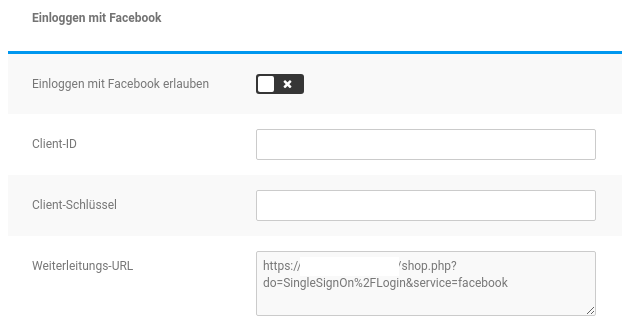

Hier werden Client-ID und Schlüssel benötigt. Öffne folgenden Link in deinem Browser:

https://developers.facebook.com/

und logge dich mit deinem Facebook-Konto ein. Sofern du dich noch nicht als FacebookDeveloper registriert hast, klicke rechts oben auf _**Los gehts**_ und folge den Schritten des Assistenten, der eine neue App anlegt. Wenn du dich bereits als Developer registriert hast, sollte über den Punkt oben rechts die passende App für den Shop respektive eine neue App für den Shop angelegt werden.

Es muss innerhalb der App nun das Produkt _**Facebook Login**_ eingerichtet werden. Klicke bei Facebook Login auf _**Einrichten**_.

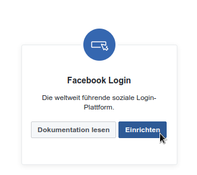

Klicke im folgenden Bildschirm links im Menü auf _**Einstellungen**_. In der Produktkonfiguration sind _**Client-OAuth-Anmeldung**_ und _**Web-OAuth-Anmeldung**_ zu aktivieren, alle anderen Optionen können abgeschaltet bleiben. Die in der Modulkonfiguration angezeigte Weiterleitungs-URL ist unter _**Gültige OAuth Redirect URIs**_ zu hinterlegen.

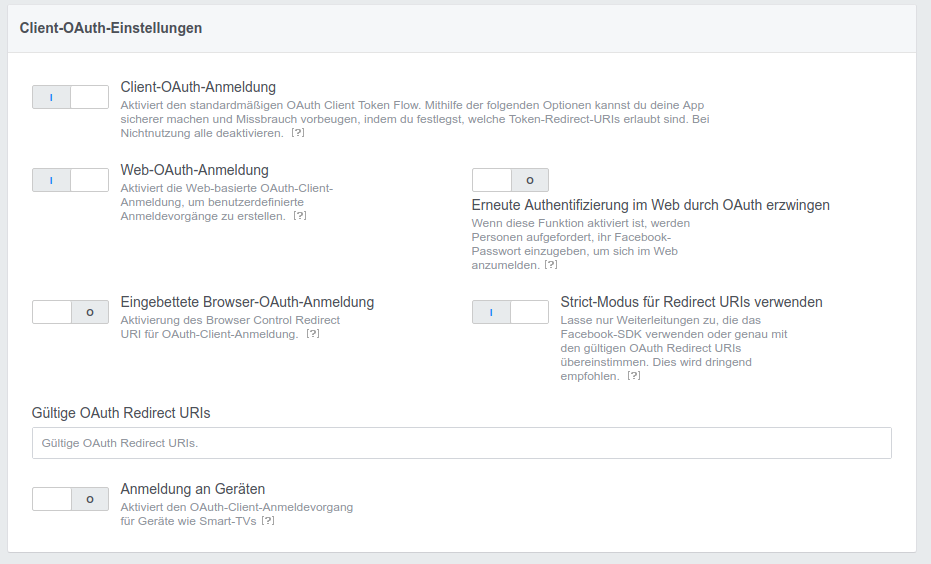

Bei Facebook werden Client-ID und Secret als App-ID und App-Geheimcode bezeichnet. Um App-ID und Geheimcode zu finden, klicke nun noch einmal ganz oben links im Menü auf den Punkt _**Einstellungen**_. Du findest hier die App-ID, kannst dir den App-Geheimcode anzeigen lassen und überträgst diese in die Modulkonfiguration.

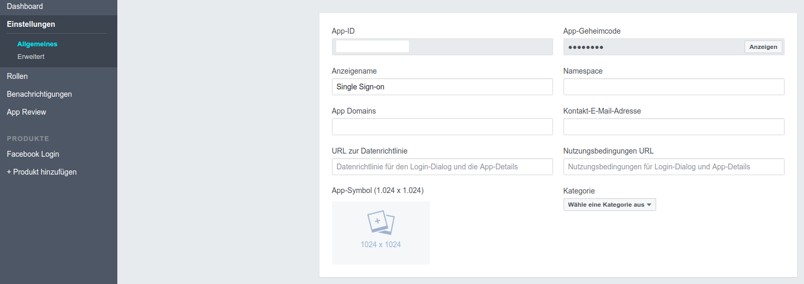

#### Paypal

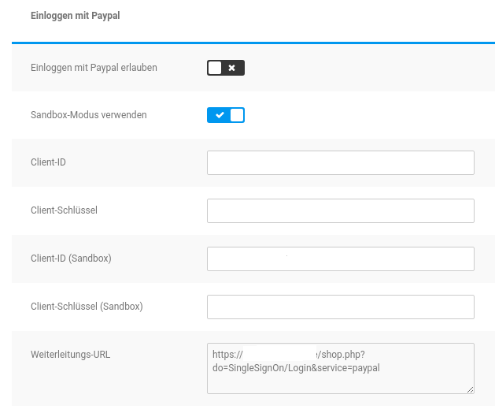

Client und Secret sind identisch mit den Daten des PayPal & PayPal PLUS-Moduls und werden automatisch übernommen, sofern das Zahlungs-Modul schon konfiguriert wurde. Wir gehen hier davon aus, dass die Konfiguration des Zahlungsmoduls bereits vorgenommen wurde und somit schon eine passende "REST-App" auf der Seite https://developer.paypal.com/ vorhanden ist, aber noch geeignet weiter konfiguriert werden muss.

Nach dem Login klickst du in der linken Leiste einmal auf _**My Apps & Credentials**_. Du findest dort den Abschnitt _**REST API apps**_. Klicke dort die App an, die du für deinen Shop angelegt hast. Hier fährst du dann mit den _**Sandbox App Settings**_ fort:

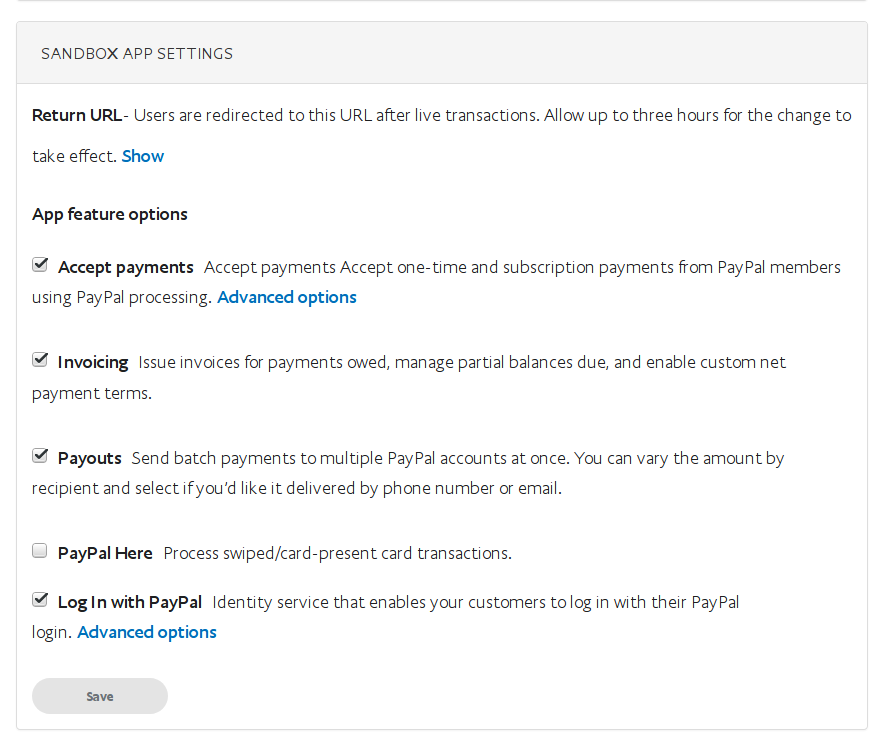

Unter dem obersten Punkt _**Return-URL**_ klickst du auf den Link _**Show**_. Fülle das nun angebotene Feld mit dem Inhalt des Feldes Weiterleitungs-URL aus der Modulkonfiguration.

Aktiviere den Haken für _**Log In with PayPal**_ und klicke dann auf _**Advanced Options**_. Setze hier die folgenden Haken: _**Basic authentication**_, _**Personal Information**_, _**Address Information**_ und _**Account Information**_, um möglichst viele Daten von deinen Kunden zu erhalten, sodass diese nur noch wenige Felder ausfüllen müssen.

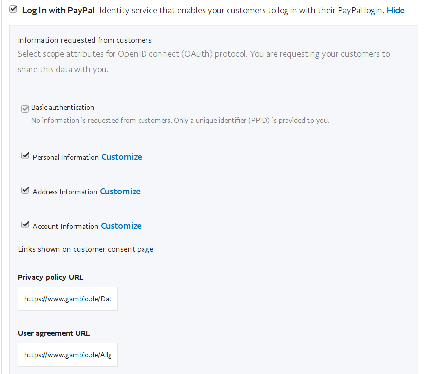

Im Feld _**Privacy policy URL**_ sollte der Link zu deiner Datenschutzerklärung hinterlegt werden.

Achte darauf dass der Punkt _**Enable customers who have not yet confirmed their email address with PayPal to log in to your app**_ nicht aktiviert wird, da das Single Sign-on-Modul generell darauf vertraut, dass die erhaltenen Benutzerdaten gesichert sind.

#### Amazon

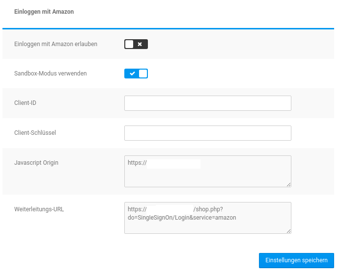

Mit Einführung des Single Sign-on-Moduls erhält das bislang schon verfügbare AmazonPayModul einen zusätzlichen Betriebsmodus. Sofern Single Sign-on über Amazon konfiguriert ist, wird dieses automatisch im Single Sign-on-Modus betrieben. In diesem Modus fallen vor allem auch die bislang nötigen Amazon-Gast-Accounts weg, da Single Sign-on immer reguläre Kundenkonten erzeugt.

Um die zugehörigen Zahlungsmodule und Login Module zu konfigurieren müssen im Seller Central unter

https://sellercentral-europe.amazon.com

Einstellungen vorgenommen werden.

Nach dem Login auf der Amazon Seite kannst du über _**Integration \> Integrationsressourcen \> Access Keys abrufen**_ auf eine Übersicht wechseln. Mit dem Button_** Zugangsdaten kopieren**_ kann ein JSON-Block abgerufen werden, der in die Konfiguration des AmazonPay-zahlungsmoduls zu kopieren ist. Das Zahlungsmodul allein erlaubt dann schon Zahlungen, ist aber noch nicht im Single Sign-on Modus.

Im Single Sign-on-Modul im Gambio Admin müssen dann noch weitere Zugangsdaten konfiguriert werden. Dazu wechselst du im Seller Central über den Dropdown ganz oben auf _**Login mit Amazon**_. Dort kann man dann ClientID und Secret herauskopieren um sie in den Shop in die Konfiguration des Single Sign-On Moduls zu übertragen. Die Rückleitungs-URL, wie im Shop angezeigt, muss bei Amazon hinterlegt werden; dies kannst du über _**Return URLs und Javascript Origins**_ konfigurieren.

## DHL Geschäftskundenversand

Das Modul _**DHL Geschäftskundenversand \(GKV2\)**_ ist ab Shopversion _**v3.5.x.x**_ im Shopumfang enthalten. Es dient zum Erstellen von Versandetiketten.

### Installation

Das Modul kann unter _**Module \> Modul-Center**_ installiert werden. Wähle hierzu den Eintrag _**DHL Geschäftskundenversand**_ aus und klicke rechts unten auf _**Installieren**_.

### Konfiguration

Um das Modul zu konfigurieren, wähle es unter _**Module \> Modul-Center**_ aus und klicke auf _**Bearbeiten**_. Es stehen Einstellungen zu den folgenden Bereichen zur Verfügung:

#### Zugangsdaten

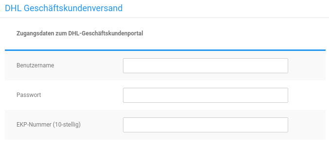

|Feldname|Beschreibung|
|--------|------------|
|Benutzername & Passwort|Benutzername und Passwort erhältst du bei deinem Vertragspartner DHL. Als Login-Daten werden die Zugangsdaten für das Geschäftskundenportal eingetragen, wobei der Benutzername hier jedoch komplett klein geschrieben werden muss. Das Passwort hingegen ist genauso anzugeben wie beim Geschäftskundenportal.|
|EKP|Hier muss die DHL-Kundennummer eingetragen werden. Die EKP besteht aus den ersten 10 Ziffern der 14-stelligen DHL Account Nummer. Es dürfen nicht mehr als 10 Ziffern eingegeben werden.|

#### Absender und Retourempfänger {#dhl_geschaeftskundenversand_konfiguration_absender_und_retourempfaenger}

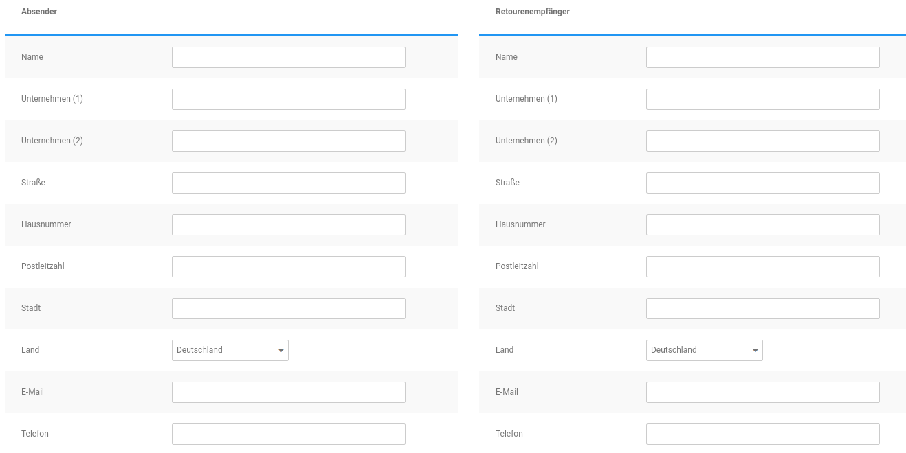

In diesem Bereich müssen die Adressdaten deiner Firma hinterlegt werden. Es kann eine abweichende Retouradresse angegeben werden.

!!! danger "Achtung"

	 Das Feld _**Name**_ muss zwingend ausgefüllt werden, es kommt sonst zu Problemen bei der Labelerstellung.
	 
#### Bankverbindung für Nachnahmesendungen

Wenn im Shop Bestellungen per Nachnahme möglich sind, müssen diese Bankdaten unbedingt hinterlegt werden

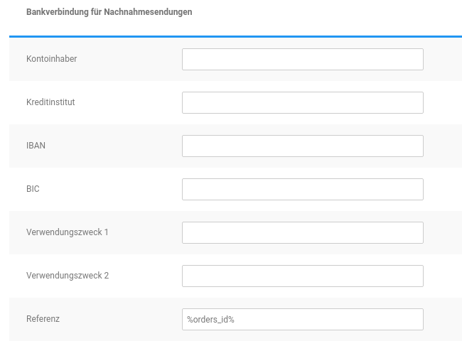

##### Referenz

Als Referenz ist die Variable _**%orders\_id%**_ für die Bestellnummer hinterlegt. Damit wird als Referenz auf dem Paketschein die Bestellnummer angegeben und eine Zuordnung einer Zahlung zu einer Bestellung ist möglich. Aktuell können noch keine anderen Variablen verwendet werden. Es ist jedoch möglich die Variable über das Eingabefeld um einen Vermerk o.ä. zu ergänzen oder bei Bedarf ganz zu ändern.

#### Einstellungen

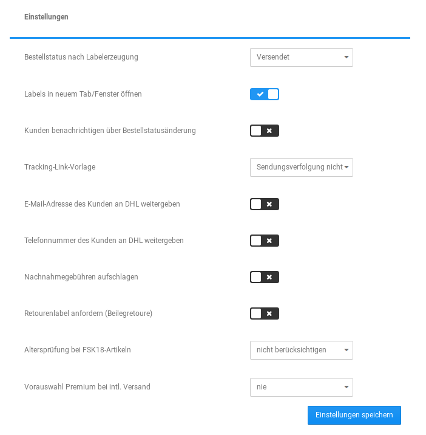

|Feldname|Beschreibung|
|--------|------------|
|Bestellstatus nach Labelerzeugung|Nach der Labelerzeugung kann automatisch ein Bestellstatus gesetzt werden, z.B. _**Label erstellt**_, o.ä. Dies hilft dir, die Bestellungen mit bereits erstelltem Label schon in der Bestellübersicht anhand des Status zu erkennen.|
|Labels in neuem Tab/Fenster öffnen|Hier kann eingestellt werden, ob das Label gleich in einem neuen Tab geöffnet werden soll.|
|Kunden benachrichtigen über Bestellstatusänderung|Wenn der Status automatisch geändert wurde, kann vom Shop auch automatisch eine Benachrichtigung darüber an den Kunden versendet werden.|
|Tracking-Link-Vorlage|Als Tracking-Link-Vorlage sollte _**DHL**_ eingestellt werden. Ausgewählt wird aus den Vorlagen, die unter _**Shop Einstellungen \> Paketdienste**_ bzw. _**Einstellungen / Lieferung / Versanddienstleister**_, nach Aufruf der Seite _**Paketdienste**_, eingesehen und bearbeitet werden können. Die Vorlage wird um die Sendungsnummer des erstellten Labels ergänzt und bildet so den Link zur Sendungsverfolgung, der dem Kunden zugeschickt werden kann. Auch die Auswahl _**Sendungsverfolgung nicht verwenden**_ ist möglich, wenn kein Tracking-Link angeboten werden soll.|

!!! note "Hinweis" 
	 Würde als Tracking-Linkg-Vorlage z.B. _**Hermes**_ ausgewählt, wird als Tracking-Link in der Bestellung ein Link zu Hermes mit der Sendungsnummer von DHL erstellt. Es sollte daher keine abweichende Vorlage eingestellt werden.

|Feldname|Beschreibung|
|--------|------------|
|E-Mail-Adresse / Telefonnummer des Kunden an DHL weitergeben|Hier kann generell festgelegt werden, ob die Kontaktdaten der Kunden an DHL weitergegeben werden sollen. Hat der Kunde der Weitergabe im Bestellvorgang jedoch widersprochen, werden die Daten nicht übermittelt. Unter _**Shop Einstellungen \> Rechtliches**_ bzw. _**Einstellungen / Rechtliches**_ kann eine entsprechende Abfrage im Bestellvorgang aktiviert werden.|
|Verpackungsgewicht addieren|Hiermit wird das Verpackungsgewicht dem Artikelgewicht hinzugefügt.|
|Retourenlabel anfordern \(Beilegretoure\)|Wenn du diese Option bei DHL gebucht hast, wird bei jeder Labelerstellung auch ein Retourenlabel erstellt, das dem Paket gleich beigelegt werden kann. **Achtung**: Diese Option darf nur aktiv sein, wenn Retourenlabel auch in deinem Vertrag enthalten sind. Ist dies nicht der Fall, wird es zu Problemen bei der Labelerstellung kommen.|
|Altersprüfung bei FSK18-Artikeln|Hier kann die Art der Altersprüfung bei FSK18-Artikeln gewählt werden.|
|Vorauswahl Premium bei intl. Versand|Ist diese Option aktiv, wird Premium bei der Labelerstellung vorausgewählt.|

##### Produkte

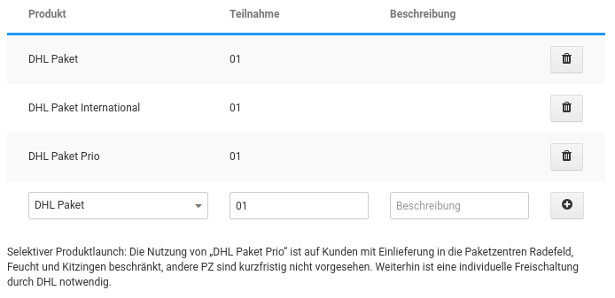

Du kannst über das Dropdown-Menü aus den verschiedenen Produkten auswählen und diese hinzufügen. Es sollten nur Produkte ausgewählt werden, die du auch gebucht hast. Welche Produkte gebucht wurden und welche Teilnahmenummer zum jeweiligen Produkt gehört, kannst du in deinem Konto bei _**DHL Versenden**_, bzw. beim DHL Support erfahren.

### Verwendung 

#### Verwendung

Unter _**Bestellungen \> Bestellungen**_ kann im Dropdown rechts neben der Bestellung über _**DHL-Label \(GKV\)**_ der Dialog für die Labelerstellung aufgerufen werden.

**_")

#### Labelerzeugung

##### Einfache Ansicht

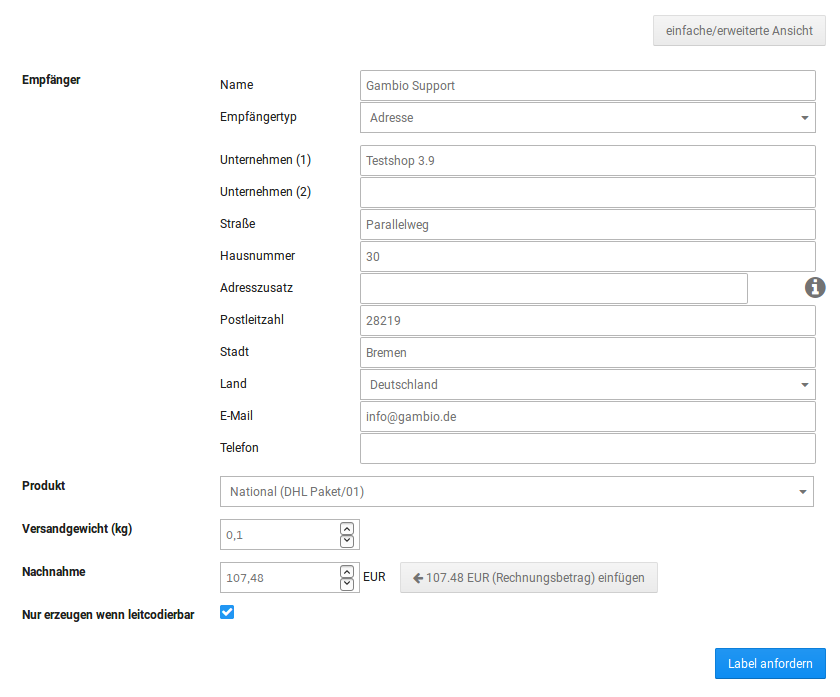

|Feldname|Beschreibung|
|--------|------------|
|Name, Adressdaten|Hier kann die Adresse des Kunden noch einmal geprüft werden.|
|Empfängertyp|Hier muss ausgewählt werden, ob es sich bei der Lieferadresse um eine normale Hausadresse handelt oder etwa um Packstation, Postfiliale oder einen Paketshop. Die verfügbaren Adressfelder ändern sich entsprechend der benötigten Angaben.|
|Produkt|Hier muss ausgewählt werden, über welches Produkt das Label erstellt werden soll. Welche Produkte hier zur Verfügung stehen, ist abhängig von den in der Konfiguration ausgewählten Produkten und bei DHL gebuchten Leistungen.|
|Versandgewicht \(kg\)|Über dieses Feld kann das Versandgewicht in Kilogramm angepasst werden. Standardmäßig wird hier nur das reine Artikelgewicht übernommen, das Versandgewicht findet hier noch keine Berücksichtigung.|
|Nachnahme|Hier wird die Rechnungssumme eingetragen, die bei Bestellungen auf Nachnahme automatisch befüllt wird.|
|Nur erzeugen wenn leitcodierbar|Wenn die Adresse nicht leitcodierbar, also nicht korrekt ist, wird das Label nicht erstellt, wenn dieser Option ausgewählt ist. Es erscheint dann eine Meldung mit einem entsprechenden Hinweis.|

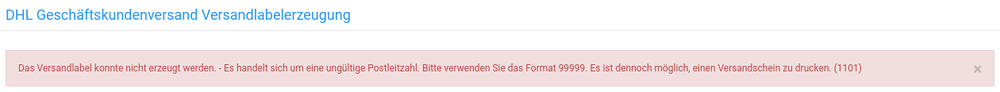

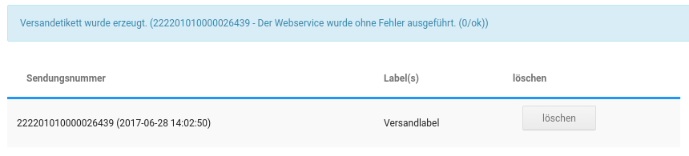

##### Erweiterte Ansicht

In der erweiterten Ansicht gibt es noch zahlreiche weitere Optionen.

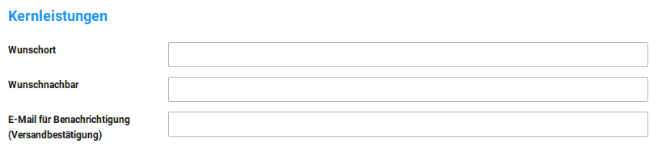

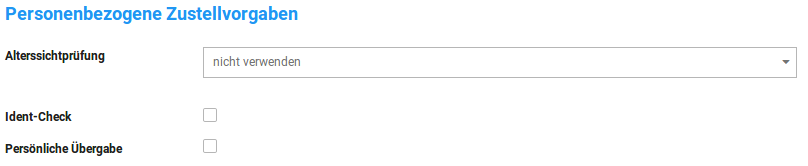

|Feldname|Beschreibung|
|--------|------------|
|Absender, Retourenempfänger, Empfänger|Hier können die verschiedenen Adressen noch einmal geprüft und korrigiert werden.|
|Wunschort|Wenn der Kunde einen Wunschort hinterlegt hat, kann dieser hier angegeben werden.|
|Wunschnachbar|Auch ein Wunschnachbar ist möglich, dieser wird hier eingetragen.|
|E-Mail für Benachrichtigung \(Versandbestätigung\)|Hier kann die E-Mail-Adresse des Kunden eingetragen oder geändert werden. Die Adresse aus der Bestellung wird hier vorausgefüllt, sofern der Kunde der Übermittlung der Kontaktdaten an die Transportunternehmen zugestimmt hat.|
|Alterssichtprüfung|Hierüber kann die Alterssichtprüfung aktiviert werden. Der Zusteller prüft dann, ob der Empfänger das nötige Mindestalter hat|
|Ident-Check|Wird diese Option gewählt, öffnet sich ein Bereich mit weiteren Eingabefeldern. Hier kann der Name des Empfängers sowie sein Geburtsdatum oder das Mindestalter hinterlegt werden. Auf dem Label erscheint dann dieser Hinweis für den Zusteller: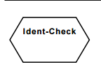|
|Persönliche Übergabe|Wird aktiviert, wenn die Ware persönlich übergeben werden soll.|

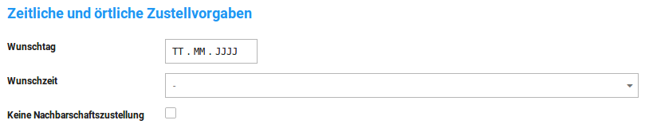

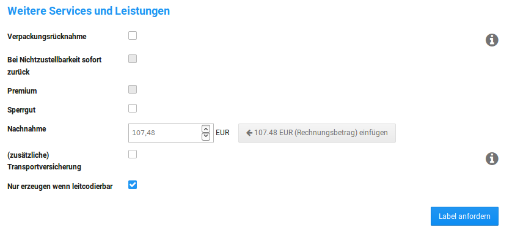

|Feldname|Beschreibung|
|--------|------------|
|Wunschtag, Wunschzeit|Hier kann ein Wunschtag, sowie eine Wunschzeit für die Lieferung angegeben werden.|
|Keine Nachbarschaftszustellung|Über diese Option kann die Lieferung an Nachbarn unterbunden werden.|
|Verpackungsrücknahme|Es ist möglich, die Versandverpackung vom Boten gleich wieder mitnehmen zu lassen. Dies ist jedoch nicht in allen Produkten verfügbar.|
|Bei Nichtzustellbarkeit sofort zurück|Bei empfindlicher Ware kann man angeben, dass das Paket sofort retour gehen soll, wenn die Zustellung nicht möglich war. Dies ist jedoch nur beim Produkt _**DHL Paket Taggleich**_ möglich.|
|Premium|Diese Option kann in der Modulkonfiguration selbst aktiviert werden und steht an dieser Stelle daher nicht zur Verfügung.|
|Sperrgut|Sendungen, die schwerer als 31,5kg sind oder bestimmte Maße überschreiten, können als Sperrgut versendet werden.|
|\(zusätzliche\) Transportversicherung|Bei besonders wertvollen Sendungen kann die Sendung zusätzlich bis zu einem bestimmten Wert versichert werden. Nähere Angaben bekommst du hierzu bei DHL.|

#### Label in Länder außerhalb der EU erstellen

Bei Sendungen in Länder außerhalb der EU gilt es, die Ausfuhrangaben bei der Labelerstellung korrekt zu tätigen.

|Feldname|Beschreibung|
|--------|------------|
|Produkt|Bei Sendungen in Länder außerhalb der EU wird automatisch das korrekte Produkt eingestellt. Hierzu muss zuvor ein Produkt für internationale Sendungen in der Modulkonfiguration hinterlegt werden. Produkt und Teilnahmenummer erhältst du direkt von DHL, sofern dies von deinem Vertrag abgedeckt wird.|
|Versandgewicht|Das Versandgewicht wird in aktuellen Shopversionen vorausgefüllt und darf nicht weniger als 0,1 betragen, da dies das angenomme Mindestverpackungsgewicht ist. Wurde in den Artikeln ein Versandgewicht hinterlegt, werden diese addiert und automatisch in das Feld Versandgewicht eingetragen.|
|Ausfuhrangabe _**Exporttyp**_|Voreingestellt ist hier _**EU \(keine Angabe\)**_. Bei Sendungen in Länder außerhalb der EU muss jedoch ein anderer Exporttyp gewählt werden. Neben den Exporttypen _**Geschenk**_, _**Warenmuster**_, _**Dokument**_ und _**Warenretoure**_ gibt es noch den Typen _**anderer**_.|
|Ausfuhrangabe _**anderer Exporttyp**_|Wird der Exporttyp _**anderer**_ gewählt, muss im Feld _**anderer Exporttyp**_ ein Vermerk dazu hinterlassen werden, wie z.B. ein Hinweis auf den Inhalt.|

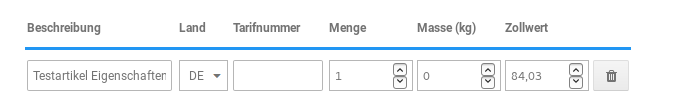

Weiter unten in den Ausfuhrangaben werden die Artikel der Bestellung aufgeführt. Wurde das Versandgewicht in den Artikeln hinterlegt, so ist dies hier bereits vorausgefüllt. Ansonsten muss das Gewicht für einen Artikel in die jeweilige Zeile im Feld _**Masse**_ hinterlegt werden. Aus der Menge der Artikel und den jeweiligen Gewichten muss dann das Gesamtgewicht errechnet und weiter oben in das Feld _**Versandgewicht**_ eingetragen werden.

#### Mögliche Meldungen

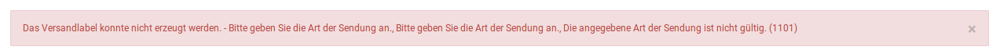

Die Meldung _**Die angegebene Art der Sendung ist nicht gültig**_ bedeutet bei Sendungen ins Ausland meist, dass kein oder ein ungültier Exporttyp angegeben wurde oder das kein Produkt für den internationalen Versand hinterlegt ist.

Bitte prüfe die hinterlegten Produkte und erstelle das Label mit allen Angaben erneut.

Die Meldung _**Die Gewichtsangabe ist kleiner als im CN23-Formular**_ sagt aus, dass das Versandgewicht geringer ist als das Gesamtgewicht der in den Ausfuhrangaben eingetragenen Artikel.

Bitte prüfe und korrigiere die angegebenen Gewichte.

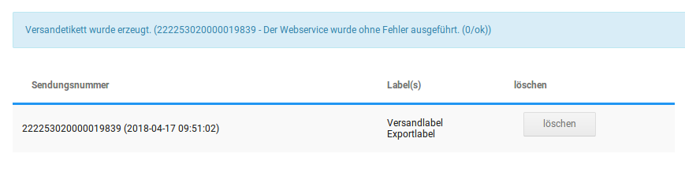

Die Meldung _**Versandetikett wurde erzeugt**_ ist eine Erfolgsmeldung. Darunter finden sich die Sendungsnummer sowie in der Spalte _**Label**_ ein Link zum Versandlabel und ein Link zum Exportlabel.

#### Label ansehen / stornieren

Bestehende Label können aufgerufen werden, wenn im Dropdown der Bestellübersicht wieder _**DHL-Label \(GKV2\)**_ gewählt wird. Oberhalb des Dialogs für die Labelerstellung werden die bereits erstellten Label mit Angabe von Datum und Uhrzeit aufgeführt und können hierüber aufgerufen oder auch gelöscht werden.

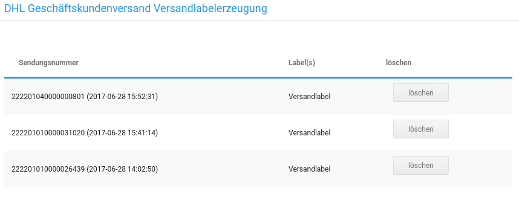

#### Muster von Versandlabeln sowie Exportlabeln

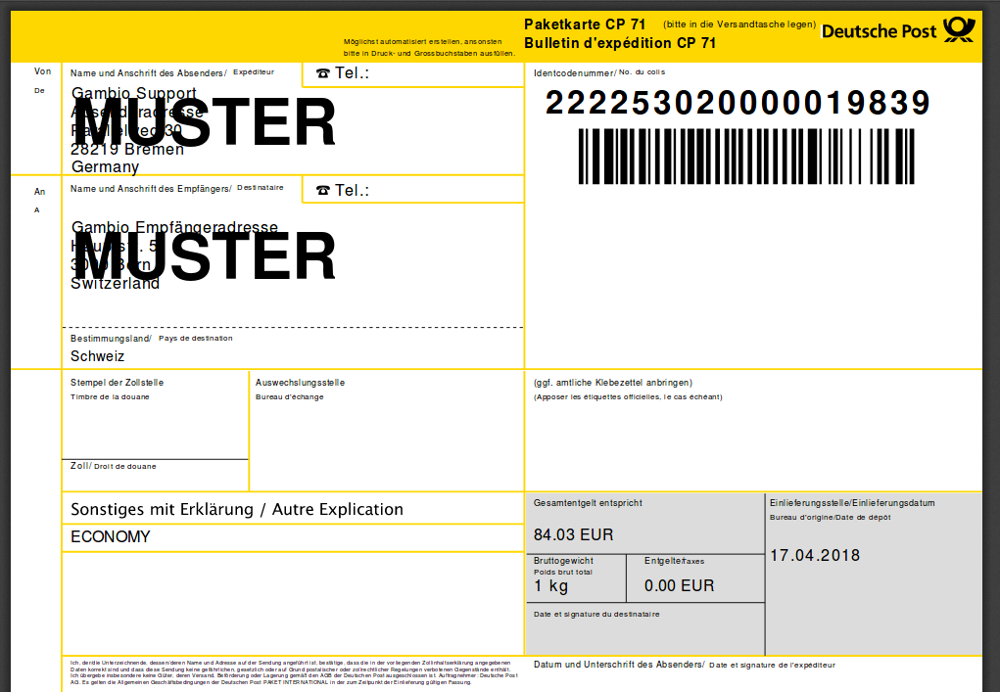

### Tracking-Link

Mit Erstellung des Labels wird der Bestellung automatisch die Sendungsnummer hinzugefügt. Diese ist dann in den Bestelldetails unter _**Bestellungen \> Bestellungen**_ zu sehen und kann über eine Statusänderungs-E-Mail an den Kunden versendet werden. Je nach Einstellung in der Modulkonfiguration kann diese Mail auch bereits automatisch versendet worden sein.

### DHL Services 

Unter dem folgenden Link kann man sich bei DHL über die verschiedenen Services informieren:

https://www.dhl.de/services

### Sandbox-Modus 

Der Sandbox-Modus kann für dieses Modul nicht einfach gesetzt werden. Wenn du das Modul testen möchtest, ist es am sinnvollsten, im Live-Betrieb ein Label zu erstellen und direkt im Anschluss wieder zu stornieren, um das Anfallen von Kosten zu vermeiden.

