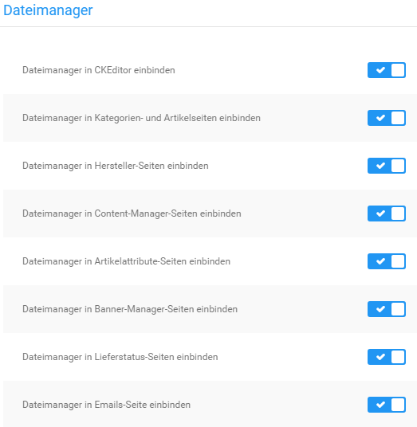

# Konfiguration 

Der Dateimanager ist nach der Installation für Verwendung im ganzen Shop voreingestellt. Unter Module \> Modul-Center können diese Einstellungen bei Bedarf angepasst werden. Es stehen folgende Einstellungsmöglichkeiten zur Verfügung:

-   Dateimanager in CKEditor einbinden
-   Dateimanager in Kategorien- und Artikelseiten einbinden
-   Dateimanager in Hersteller-Seiten einbinden
-   Dateimanager in Content-Manager-Seiten einbinden
-   Dateimanager in Artikelattribute-Seiten einbinden
-   Dateimanager in Banner-Manager-Seiten einbinden
-   Dateimanager in Lieferstatus-Seiten einbinden
-   Dateimanager in Emails-Seite einbinden

Setze bzw. entferne einen Haken, um die jeweiligen Einstellung zu aktivieren bzw. zu deaktivieren und bestätige die Änderungen mit einem Klick auf Speichern.

