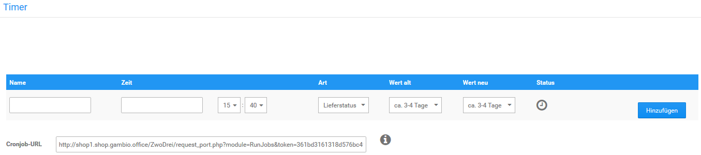

# Timer 

Über Toolbox \> Timer können zeitgesteuerte Änderungen bei deinen Artikeln vorgenommen werden. Es besteht hierbei die Möglichkeit, sowohl den Lieferstatus als auch den Artikelpreisstatus anzupassen.

Um einen solchen Vorgang anzulegen, trage bitte in das Eingabefeld der Spalte Name eine entsprechende Bezeichnung ein. In der Spalte Zeit wird über Datum und Uhrzeit festgelegt, wann der Vorgang ausgeführt werden soll.

Stelle unter Art bitte ein ob du den Lieferstatus oder den Artikelstatus ändern möchtest. Hierbei werden die Änderungen nicht für alle Artikel gleichzeitig vorgenommen, sondern es muss vorher ein Status festgelegt werden, der geändert werden soll. Wähle unter Wert alt z.B. ca. 1 Woche aus, um um für alle Artikel mit diesem Lieferstatus die Lieferzeit auf einen neuen Wert \(wie etwa ca. 2 Wochen\) zu ändern. Wähle die neue Einstellung bitte unter Wert neu aus. Klicke abschließend auf Hinzufügen, um den Vorgang anzulegen.

!!! Info "Hinweis"
	 Über Artikelstatus kann der Wert geändert werden, welcher im Artikel als Artikelpreisstatus ausgewählt werden kann. Genaueres zu dieser Einstellung findest du im Kapitel Artikel anlegen.

Damit automatisierte Vorgänge ausgeführt werden können, muss bei deinem Hosting-Anbieter ein sogenannter Cronjob angelegt werden. Hierzu wird eine zugehörige Cronjob-URL benötigt. Solltest du bereits für den automatischen Statuswechsel unter Darstellung \> Shop online/offline, wie z.B. die Urlaubsschaltung, einen Cronjob angelegt haben, kann dieser ebenfalls für den Timer verwendet weden, da die Cronjob-URL identisch ist.

Um Änderungen an einem bestehenden Vorgang vorzunehmen, klicke bitte auf das Bleistift-Symbol. Die Änderung kann anschließend mit Klick auf Speichern übernommen oder über die Schaltfläche Abbrechen verworfen werden.

