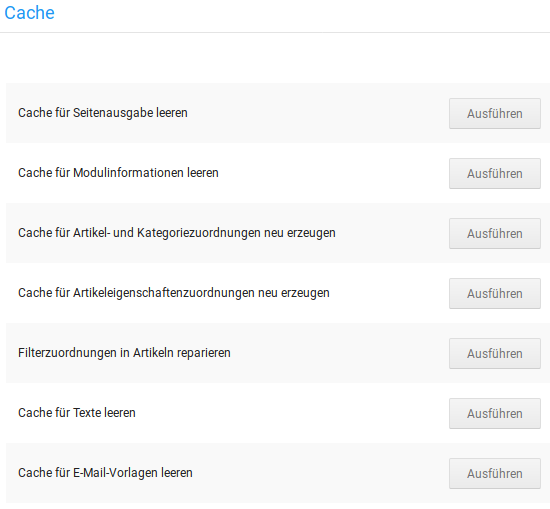

# Cache {#toolbox_cache}

Das Shopsystem speichert bestimmte Daten auf dem Server. Das serverseitige Caching verbessert die allgemeine Betriebsgeschwindigkeit des Shops. Mit den Funktionen unter Toolbox \> Cache löscht du die jeweiligen serverseitigen Cache-Dateien vom Server. Der Servercache muss gelöscht werden, nachdem Änderungen im Shop vorgenommen wurden, die Einfluss auf die Ausgabe im Shopbereich haben.

