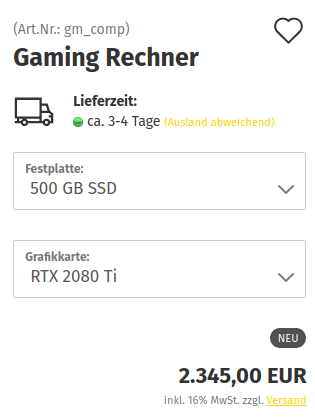
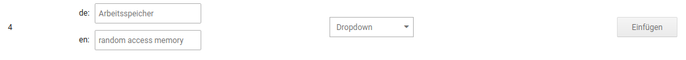
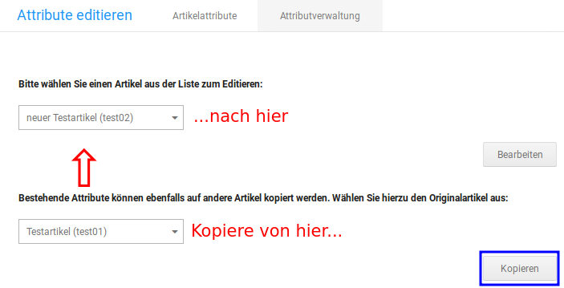

# Artikelattribute

!!! danger "Achtung"

	 Um Artikelattribute verwenden zu können, muss das zugehörige Modul unter _**Module \> Modul-Center**_ installiert sein.

Über Artikelattribute, die auch als Artikel-Merkmale bezeichnet werden, können einem Artikel Auswahlmöglichkeiten in Form von _**Optionswerten**_ hinzugefügt werden. Jedes Attribut kann ein oder mehrere Optionswerte haben, die einzeln einem Artikel zugeordnet werden.

 und
      eingerahmte Texte (unten)")

!!! example "Beispiel"

	 Ein Computer kann mit verschiedenen Komponenten geordert werden. Grafikkarte, Arbeitsspeicher und Festplatte können frei gewählt werden. Welche Festplatte verwendet wird, ist unabhängig von der eingebauten Grafikkarte.

Die Attribute sind unabhängig voneinander.

!!! note "Hinweis"

	 Wenn eine Abhängikeit zwischen den Auswahlen dargestellt werden soll, wie z.B. Farbe und Größe eines Kleidungsstücks, dann sollten Artikeleigenschaften verwendet werden.
	 
## Attribute anlegen

Unter _**Artikel \> Artikelattribute**_ können die Attribute mit ihren Optionswerten angelegt und bearbeitet werden. Die bestehenden Attribute werden in einer Tabelle angezeigt, die folgende Angaben enthält:

|Spalte|Beschreibung|
|------|------------|
|ID|interne ID-Nummer des Attributs|
|Artikelmerkmal-Bezeichnung|Name des Attributes|
|Anzeigeart|Darstellung der Optionswerte als _**Dropdown**_-Menü, _**Bild**_, _**Radio**_-Button, _**Text**_ oder _**Eingerahmter Text**_|
|Aktion|Aktionen zu einem Attribut, siehe _**Attribute bearbeiten und löschen**_|

Die untere Hälfte der Seite zeigt die Optionswerte in einer ähnlichen Tabelle an.

Hier werden die folgenden Angaben aufgelistet:

|Spalte|Beschreibung|
|------|------------|
|ID|interne ID des Optionswerts|
|Artikelmerkmal-Bezeichnung|zu welchem Attribut gehört der Optionswert?|
|Optionswert|Name des Optionswerts|
|Bild|Bild, das zur Auswahl des Optionswert angezeigt werden kann|
|Aktion|Aktionen zu einem Optionswert, siehe _**Optionswerte bearbeiten und löschen**_|

### Attribute anlegen

Am unteren Ende der Attribut-Tabelle befindet sich ein Bereich, über den neue Attribute angelegt werden können. Trage hier die _**Artikelmerkmal-Bezeichnung**_ \(Name des Attributs\) ein und wähle die _**Anzeigeart**_ \(_**Dropdown**_, _**Bild**_, _**Radio**_, _**Text**_ oder _**Eingerahmter Text**_\) aus. Klicke abschließend auf _**Einfügen**_.

### Attribute bearbeiten und löschen

Bewegst du den Mauszeiger über ein Attribut, werden die möglichen Aktionen hierzu angezeigt. Klicke auf das Bleistift-Symbol, um das Attribut zu bearbeiten oder auf das Mülltonnen-Symbol, um es wieder zu löschen.

!!! danger "Achtung"

	 Attribute können nur dann gelöscht werden, wenn sie keinem Artikel mehr zugeordnet worden sind. Vor dem Löschen findet eine Sicherheitsabfrage statt, die ggf. eine entsprechende Warnung anzeigt.

### Optionswerte anlegen

Ist ein Attribut angelegt, können die Optionswerte hierfür erstellt werden. Wähle das gewünschte Attribut über das Dropdown aus und trage den Namen des Optionswerts ein. Zudem kannst du ein Bild hochladen, über das der Optionswert im Artikel ausgewählt werden kann, wenn für das Attribut die _**Anzeigeart**_ _**Bild**_ verwendet wird. Klicke auf _**Einfügen**_, um den Optionswert anzulegen.

### Optionswerte bearbeiten und löschen

Bewegst du den Mauszeiger über einen Optionswert, werden die möglichen Aktionen hierzu angezeigt. Klicke auf das Bleistift-Symbol, um den Optionswert zu bearbeiten oder auf das Mülltonnen-Symbol, um ihn wieder zu löschen.

!!! danger "Achtung"

	 Optionswerte können nur dann gelöscht werden, wenn sie keinem Artikel mehr zugeordnet worden sind. Vor dem Löschen findet eine Sicherheitsabfrage statt, die ggf. eine entsprechende Warnung anzeigt.

## Optionswerte zuweisen

Optionswerte können unter _**Artikel \> Artikel/Kategorien**_ den Artikeln zugewiesen werden. Hierzu kann wahlweise das Dropdown aus der Artikelübersicht oder der Eingabemaske verwendet werden.

Bei einem Artikel, dem bisher keine Optionswerte zugewiesen worden sind, werden die verfügbaren Attribute eingeklappt dargestellt. Über einen Klick auf das Plus-Zeichen kann die Ansicht ausgeklappt werden.

In der ausgeklappten Ansicht können die Optionswerte durch Setzen der Hakens ausgewählt und dem Artikel zugewiesen werden.

Ist ein Optionswert ausgewählt, dann stehen die Eingabefelder und Einstellungen für den jeweiligen Optionswert zur Verfügung. Folgende Eingaben bzw. Einstellungen können gemacht werden:

|Feldname|Beschreibung|
|--------|------------|
|NAME DES ATTRIBUTES|Aus- bzw. Abwählen des Optionswerts, um ihm dem Artikel zuzuordnen oder die Auswahl rückgängig zu machen.|
|Sort.|Sortierreihenfolge des Optionswerts bei der Auswahl im Artikel|
|Artikel Nr.|Zusatz zur Artikelnummer des Optionswerts|
|EAN|EAN-Nummer des Optionswerts|
|Lager|Lagerstand des Optionswerts|
|VPE|Verpackungseinheit \(Wert und Einheit\) des Optionswerts|
|Gewicht - Präfix Gewicht|Gewicht des Optionswerts, Verrechnung mit dem Gewicht des Hauptartikels \(Wert und Vorzeichen\)|
|Preis - Präfix Preis|Aufpreis des Optionswerts \(Wert und Vorzeichen\)|

Zudem kann über das Bild-Symbol am Ende der Zeile dem jeweiligen Optionswert eine Bilder-Kollektion hinterlegt werden \(siehe Kapitel _**Kollektionen**_\).

!!! note "Hinweis"

	 Kollektionen können einem Optionswert erst hinzugefügt werden, nachdem dessen Zuweisung gespeichert worden ist.
	 
## Attributverwaltung

Über die Attributverwaltung können die Optionswerte eines Artikels geändert bzw. einem beliebigen Artikel neue Attribute und Optionswerte zugewiesen werden.

Über das Dropdown _**Bitte wählen Sie einen Artikel aus der Liste zum Editieren**_ kann ein Artikel ausgewählt werden. Bestätige die Auswahl mit einem Klick auf _**Bearbeiten**_. Es stehen die gleichen Einstellungen wie beim erstmaligen Zuweisen von Optionswerten zur Verfügung \(siehe Kapitel _**Optionswerte zuweisen**_\).

### Attribute kopieren

Zugewiesene Optionswerte können bei Bedarf auch von einem Artikel kopiert und direkt einem anderen Artikel zugeordnet werden. Auf diese Weise lassen sich schnell mehrere Artikel mit den gleichen Auswahlmöglichkeiten versehen.

Hierbei werden die eingestellten Optionswert des Artikels aus dem unteren Dropdown-Menü auf den Artikel im oberen Dropdown-Menü kopiert. Wähle daher die gewünschten Artikel in beiden Menüs aus und klicke dann auf _**Kopieren**_.

Abschließend werden die Optionswerte des Ziel-Artikels nochmals angezeigt. Du hast so die Möglichkeit noch Änderungen vorzunehmen, wie im Kapitel _**Optionswerte zuweisen**_ beschrieben.