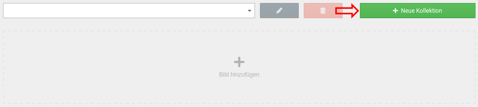
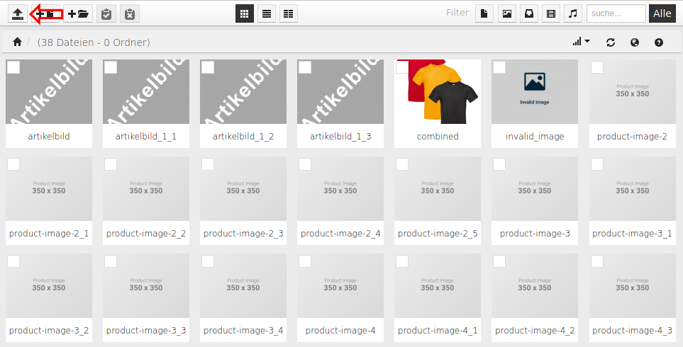
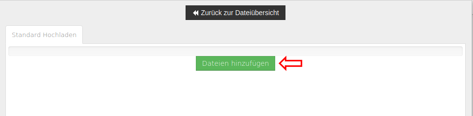
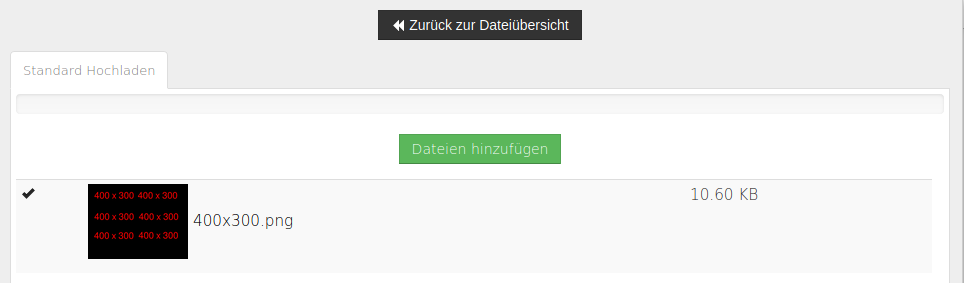
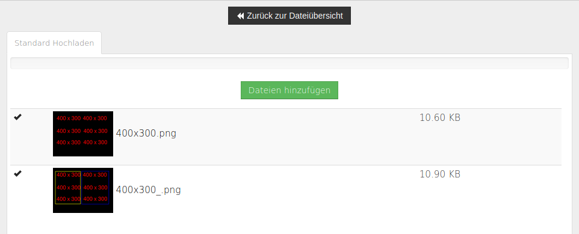
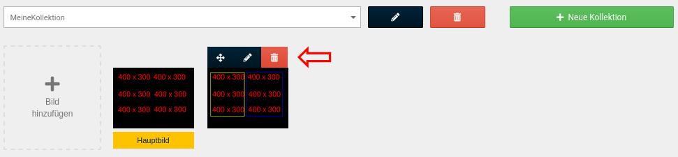

# Kollektionen

Kollektionen bzw. Bilderlisten werden verwendet, um Sammlungen von Bildern zu erstellen. Die Kollektionen können z.B. bei Artikelattributen und Artikeleigenschaften verwendet werden, um ein oder mehrere Bilder einem Optionswert \(Artikelattribute\) bzw. einer Kombintion \(Artikeleigenschaften\) zuzuordnen.

## Kollektion erstellen

Um eine neue Kollektion zu erstellen, klicke zunächst auf die grüne Schaltfläche _**Neue Kollektion**_.

Trage in das Eingabefeld den Namen der gewünschten Kollektion als _**Sammlungsname**_ ein und klicke auf _**Erstellen**_. Um das Anlegen der Kollektion abzubrechen, klicke auf die blaue Schaltfläche _**Kollektion auswählen**_.

## Kollektion auswählen, bearbeiten und löschen

Über das Dropdown kann die gewünschte Kollektion ausgewählt werden. Nach der Auswahl kann mit dem Bleistift-Icon der Name der Kollektion geändert werden. Über das Mülltonnen-Icon kann die Bilderliste wieder gelöscht werden.

## Bilder hinzufügen

Nachdem eine Kollektion ausgewählt worden ist, kann ein Bild hinzugefügt werden. Klicke hierzu auf das mit _**Bild hinzufügen**_ beschriftete Pluszeichen.

Die Bildauswahl erfolgt über den Dateimanager \(ResponsiveFilemanager\).

Klicke hier auf den Upload-Button, um den Dialog zum Hochladen eines Bilds zu öffnen.

Klicke abschließend auf den grünen Button, um eine oder mehrere Bild-Dateien hochzuladen.

Klicke nach dem ersten Hochladen das Bild an, welches du als Hauptbild verwenden möchtest. Das Hauptbild wird an erster Stelle angezeigt.

!!! note "Hinweis"

	 Das Hauptbild kann nachträglich geändert werden.

Zum Einrichten eines Bilds muss für jede verwendete Sprache der Bildttitel angegeben werden. Zudem kann ein Alternativtext eingestellt werden, der z.B. dann angezeigt wird, wenn das Bild nicht geladen werden kann.

Wenn du mehrere Bilder hochgeladen hast, können diese bei einem erneuten Hinzufügen eines Bilds direkt ausgewählt werden.

## Steuerelemente für Kollektionsbilder

Wird der Mauszeiger über ein Kollektionsbild bewegt, werden Steuerelemente angezeigt. Diese sind von links nach rechts:

-   Bild verschieben
-   Bild bearbeiten
-   Bild löschen

!!! note "Hinweis"

	 Um ein Bild zu verschieben, klicke das erste Icon an und halte die linke Maustaste gedrückt. Ziehe das Bild an die gewünschte Position und lasse die Maustaste wieder los.

