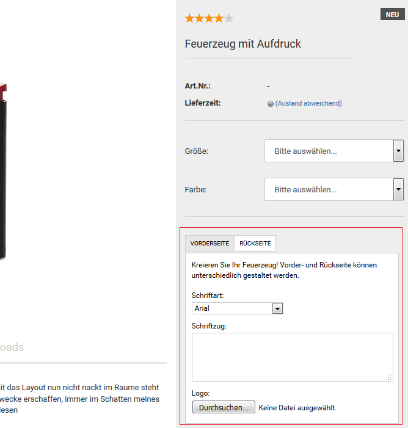

# GX-Customizer

!!! note "Hinweis" 
	 Mit dem GX-Customizer bietest du deinen Kunden die Möglichkeit Artikel in deinem Shop zu personalisieren. Du kannst dabei aus einer Vielzahl an Formularelementen wählen, wie Eingabefelder, Datei-Uploadfelder und Listenauswahl-Felder.

## Customizer-Set anlegen

Neue Customizer-Sets kannst du im Gambio Admin unter _**Artikel \> GX-Customizer**_ anlegen. Trage in das Feld _**Bezeichnung**_ eine Bezeichnung für das neue Customizer-Set ein und klicke auf _**Erstellen**_.

Ein neues Customizer-Set wird angelegt und zum Bearbeiten geöffnet. Das neue Customizer-Set verfügt vorerst über keine Darstellungselemente. Eingabefelder und Listenfelder können in verschiedene Bereiche eingefügt werden. Jeder Bereich wird in der Shopansicht als Tab angezeigt.

1.  Klicke unter _**Bereich**_ auf _**Erstellen**_, um einen neuen Bereich anzulegen
2.  Trage in das Feld _**Bezeichnung**_ eine Bezeichnung für den neuen Bereich ein
3.  Trage in das Feld _**Abmessungen**_ die Breite und die Höhe des neuen Bereichs ein

    Die voreingestellten Abmessungen sind bereits ideal, wenn das Customizer-Set auf der Artikel-Detailseite oberhalb der Preisanzeige eingebunden werden soll. Wenn das Customizer-Set in der Artikel-Beschreibung eingebunden werden soll, kann die Breite bis auf 760 Pixel erhöht werden.

	!!! note "Hinweis" 
		 Die Einstellungen im letzten Absatz gelten nur für das _**EyeCandy**_-Template.

4.  Klicke auf _**Erstellen**_, um den neuen Bereich zu speichern

    In deinem neuen GX-Customizer-Bereich kannst du die Elemente anlegen, die deine Kunden personalisieren können. In der Bestellbestätigung und auf der Rechnung werden die personalisierten Elemente in der Reihenfolge ausgegeben, in der sie angelegt wurden.

5.  Klicke unter _**Element**_ auf _**Erstellen**_
6.  Wähle aus der Liste _**Typ**_ den Elementtyp aus

    Eine Übersicht über die Elementtypen findest du in der nachfolgenden Auflistung.

7.  Trage in die Felder _**Abmessungen**_ die Breite und die Höhe des neuen Elements ein
8.  Trage in die Felder _**Abstand nach oben**_ und _**Abstand nach links**_ die Abstände des Elements vom linken und rechten Bereichsrand ein
9.  Trage in das Feld _**Bezeichnung**_ die Bezeichnung des Elements ein
10. Je nach Elementtyp sind zusätzliche Felder auszufüllen, bitte beachte die nachfolgenden Beschreibungen der einzelnen Elementtypen
11. Klicke auf _**Hinzufügen**_, um das Element hinzuzufügen

### Textfeld 

Mit dem Element _**Textfeld**_ kannst du beschreibende Texte ausgeben, die deine Kunden nicht ändern können. Trage in das Feld _**Wert**_ den auszugebenden Text ein. Weitere Einstellungen sind nicht vorzunehmen.

### Eingabefeld

Das Element _**Eingabefeld**_ liegt in den Varianten _**einzeilig**_ und _**mehrzeilig**_ vor. Einzeilige Eingabefelder werden dargestellt wie das Feld _**Bezeichnung**_, mehrzeilige Eingabefelder werden dargestellt, wie das Feld _**Wert**_. In Eingabefelder tragen deine Kunden personalisierten Text zu einem Artikel ein.

1.  Trage in das Feld _**Max. Zeichenanzahl**_ die Zeichenbegrenzung für das Eingabefeld ein
2.  Aktiviere das Kontrollkästchen_** Namen anzeigen?**_, wenn der Wert aus dem Feld _**Bezeichnung**_ im Customizer-Set oberhalb des Eingabefeldes angezeigt werden soll
3.  Trage in das Feld _**Wert**_ einen Vorgabewert für das Eingabefeld ein

### Dateiuploadfeld

Über Dateiuploadfelder laden deine Kunden beispielsweise personalisierte Bilder oder andere Vorgaben hoch. Der Dateiname des Uploads wird beim Hochladen kryptisch verschlüsselt und die Datei in einem gesicherten Verzeichnis abgelegt. Hochgeladene Dateien kannst du in den Bestelldetails der Bestellung herunterladen.

1.  Trage im Feld _**Erlaubte Dateitypen**_ kommagetrennt und ohne Leerzeichen die Dateiendungen ein, die von Kunden hochgeladene Dateien haben dürfen
2.  Trage im Feld _**Min. Dateigröße**_ eine Mindestgröße für hochgeladene Dateien ein
3.  Trage im Feld Max. Dateigröße eine Maximalgröße für hochgeladene Dateien ein

### Dropdown

Mit Dropdown-Feldern wählen deine Kunden aus einer Reihe von dir vorgegebener Werte aus.

1.  Aktiviere das Kontrollkästchen _**Namen anzeigen?**_, wenn der Wert aus dem Feld _**Bezeichnung**_ im Customizer-Set oberhalb des Eignabefeldes angezeigt werden soll
2.  Füge über das Symbol _**+**_ beim Feld _**Wert**_ neue Eingabefelder für deine Vorgabewerte hinzu
3.  Trage in die Felder _**Wert**_ die Vorgabewerte ein

### Bild

Über das Element _**Bild**_ kannst du deinem Customizer-Set ein Bild hinzufügen. Das Bild wird direkt angezeigt und kann durch deine Kunden nicht verändert werden. Lade im Dateifeld _**Bild**_ ein Bild von deinem Computer hoch. Weitere Einstellungen sind nicht vorzunehmen.

!!! note "Hinweis" 
	 Die Abmessungen werden bei GX-Customizer-Bildern nicht automatisch angepasst und können nachträglich nicht verändert werden. Lade dein Bild in der Größe hoch, in der es später angezeigt werden soll.
	 
## Customizer-Set zuweisen

### Einem Artikel zuweisen

Das Customizer Set kannst du deinem Artikel über die Artikel-Eingabemaske unter _**Artikel \> Artikel/Kategorien**_ zuweisen.

")

1.  Markiere den gewünschten Artikel

    Die aktuell gewählte Kategorie wird blau hinterlegt.

2.  Klicke auf _**Bearbeiten**_
3.  Wähle aus der Liste _**GX-Customizer Set**_ das gewünschte Customizer-Set aus
4.  Klicke am Ende der Eingabemaske auf _**Speichern**_ oder _**Aktualisieren**_, um die Änderungen am GX-Customizer Set zu speichern

## GX-Customizer konfigurieren

Über den Reiter _**Konfiguration**_ können Einstellungen zur Verwendung des GX-Customizers vorgenommen werden. Hierbei kann schwerpunktmäßig festgelegt werden, wo das sogenannte _**Customizer-Set**_ angezeigt und wie es dargestellt werden soll. Zudem kann die Anzahl der Datei-Uploads zur Spam-Vermeidung eingeschränkt werden.

|Feldname|Beschreibung|
|--------|------------|
|Leerzeichen bei der Berechnung der maximalen Zeichenanzahl in Texteingabefeldern ausschließen?|Wenn diese Einstellung aktiviert ist, werden Leerzeichen bei der Begrenzung der Zeichenanzahl nicht mitgezählt.|
|Tabs zum Wechseln der Bereiche in Artikeldetailseite anzeigen?|Ist der Haken gesetzt, kann das Customizer-Set als eigener Tab angezeigt werden \(siehe _**Set-Position**_\)|
|Set-Breite ignorieren und in Artikeldetailansicht maximale Breite anzeigen?|Bei ✔ wird die Breiten-Einstellung des im Set festgelegten _**Bereich**_s nicht verwendet. Stattdessen wird der maximal verfügbare Platz in dem jeweiligen Teil der Artikel-Detailseite ausgenutzt. Bei ✖ ist die im _**Bereich**_ eingestellte Breite die maximale Breite.|
|Kürzen von Texteingaben in Übersichten|Vom Kunden eingegebene Texte werden im Warenkorb, auf der Bestellbestätigungsseite vor Abschluss der Bestellung, im Gambio Admin in der Bestellungenübersicht und in der Bestelldetailansicht in der Artikelauflistung auf die angegebene Zeichenzahl gekürzt \(0 = kein Kürzen\). Der gesamte Text wird weiterhin im Set, in der Druckversion der Bestellbestätigung, in der Bestellbestätigungs-E-Mail, in der PDF-Rechnung und im PDF-Lieferschein angezeigt.|
|Set Position|Legt fest, wo genau auf der Artikel-Detailseite das Customizer-Set angezeigt wird. Es stehen folgende Einstellungen zur Auswahl:
|  | _**unter Artikelbeschreibung**_: das Set wird unterhalb der Artikelbeschreibung angezeigt
|  | _**als eigener Tab**_: es wird ein Tab _**Customize**_ angezeigt, über den von der Artikelbeschreibung zum Customizer-Set umgeschaltet werden kann.
|  | _**unter Attributauswahl**_: das Customizer-Set wird in der Produktdetail-Box angezeigt, unterhalb von Attributen bzw. Eigenschaften|

|Feldname|Beschreibung|
|--------|------------|
|Anzahl erlaubter Dateiuploads pro Besucher \(0 = keine Begrenzung\)|Begrenzt die Anzahl der Dateien, die über den GX-Customizer hochgeladen werden können.|
|Zeitraum in Minuten, für den die Begrenzung der Anzahl an Dateiuploads gilt|Wie lange gilt die oben festgelegte Begrenzung?|

Bestätige vorgenommene Änderungen mit einem Klick auf _**Speichern**_. Über _**Zurück**_ gelangst du zur Sets-Übersicht.

