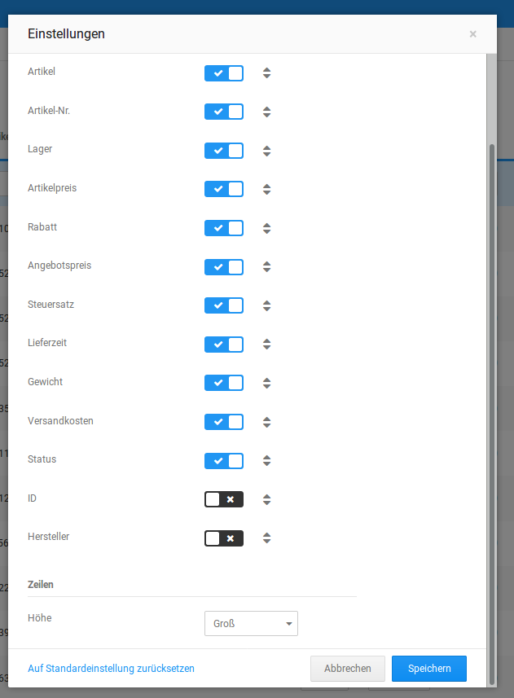
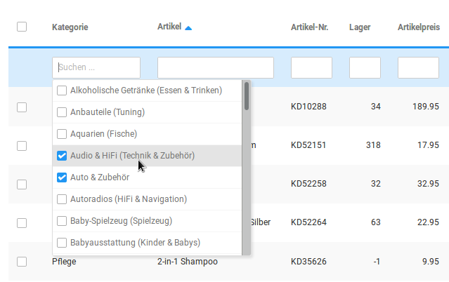
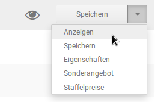
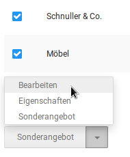
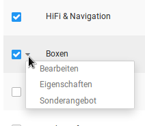
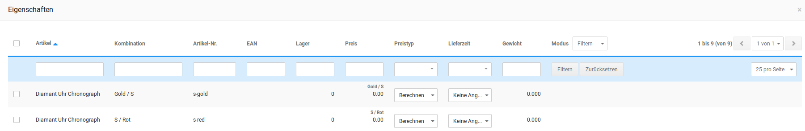
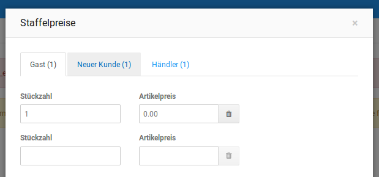

# QuickEdit

QuickEdit ist ein Werkzeug zur Massenbearbeitung von Artikeln. Es können also Änderungen an mehreren Artiklen gleichzeitig vorgenommen werden. Der QuickEdit kann unter _**Artikel \> QuickEdit**_ aufgerufen werden.

## Anpassung der Übersicht

Über das Rädchen-Symbol oben rechts lassen sich die _**Einstellungen**_ zur Anzeige aufrufen. Hier kann ausgewählt werden, was für Spalten angezeigt werden sollen. Auch lässt sich die Reihenfolge verändern, wenn man mit der Maus das Pfeil-Symbol gedrückt hält und die Spalten nach oben oder unten zieht. Unterhalb der Spalten kann zusätzlich die Größe der Einträge gewählt werden.

## Filtern der Artikel

In der oberen Leiste lassen sich verschiedene Filter setzen, um Artikel in der Liste besser finden zu können. Es können mehrere Kategorien ausgewählt und zugleich auch Suchbegriffe verwendet werden. Hierbei muss beachtet werden, dass einige Felder die Verwendung von Wildcards, also Platzhaltern, voraussetzen um die Suche nach Teilbegriffen zu ermöglichen.

!!! example "Beispiel"  
	 Wenn du dort zum Beispiel nach 'Artikel' suchst, dann werden nur die Kategorien oder Artikel mit dem Namen "Artikel" ausgegeben, weil der Shop nur nach vollständigen Namen sucht. Wenn du allerdings

	 **\*Artikel\***

	 mit Sternchen eingibst, dann werden auch entsprechende Artikel gefunden, welche diesen Begriff als Teilbegriff enthalten.

## Inventarliste

Ganz unten rechts kann über den Button _**Inventarliste erstellen**_ eine Inventarliste erstellt werden. Werden zuvor Artikel über einen Haken in der Checkbox ausgewählt, so enthält diese Liste nur die gewählten Artikel. Für eine komplette Inventarliste dürfen keine Haken gesetzt werden.

## Artikel bearbeiten

Einzelne Artikel können direkt über die Optionen rechts vom Artikelnamen bearbeitet werden. Will man mehrere Artikel gleichzeitig bearbeiten, kann man diese über die Checkboxen auswählen und dann aus dem Dropdown unten oder dem kleinen Menü neben der Checkbox die Art der Bearbeitung auswählen.

  

Wählt man _**Anzeigen**_, so werden die Artikeldetails aufgerufen. Dies ist nicht möglich, wenn mehrere Artikel ausgewählt wurden. Mit _**Bearbeiten**_ kann man die Artikel direkt in der Übersicht bearbeiten und dort alle Werte anpassen, die in den Spalten angezeigt werden. Wurden mehrere Artikel gewählt und auf _**Bearbeiten**_ geklickt, werden für alle betreffenden Artikel die Werte durch Eingabefelder ersetzt und können geändert werden. Um den gleichen Wert auf mehrere Artikel anzuwenden, wählt man oben bei _**Modus ändern**_ zuerst

_**Editieren**_, wählt dann die gewünschten Artikel über die Checkbox aus und gibt in der \(vormaligen\) Filterleiste dann den gewünschten Wert an, z.B. _**15**_ in der Spalte Rabatt. Speichert man nun, wird für alle ausgewählten Artikel ein Rabatt von 15% eingetragen, wie im Screenshot zu sehen.

Bei der Bearbeitung muss beachtet werden, dass die Zeilenwerte eine höhere Priorität haben als die oben angegebenen globalen Werte. Wird in der Editierleiste also für drei Artikel ein Rabatt von 15% angegeben, beim ersten aber ein abweichender Rabatt von 5%, so werden die 15% nur für die beiden letzten Artikel gesetzt, der erste wird mit 5% Rabatt gespeichert.

## Eigenschaften

Will man die Eigenschaften mehrerer Artikel bearbeiten, so kann man im Dropdown _**Eigenschaften**_ auswählen. Es öffnet sich ein Fenster, in dem die angelegten Eigenschaftskombinationen aufgeführt werden. Die Bearbeitung erfolgt hier genauso wie in der Artikelübersicht des QuickEdit.

Bei den Eigenschaften kann zudem noch der _**Preistyp**_ gewählt werden. Hiermit wird festgelegt, ob der Preis aus den Kombinationen berechnet oder der Festpreis aus der Eigenschaft selbst bezogen werden soll.

## Sonderangebote

Die Sonderangebote öffnen sich ebenfalls in einem separaten Fenster und können dort genauso über den Modus _**Editieren**_ angepasst werden. Während aus der Übersicht heraus nur eine Anpassung des _**Sonderangebotspreises**_ möglich ist, kann über dieses Fenster noch die _**Gültigkeit**_, der _**Angebotsstatus**_ und die _**Anzahl**_ der Sonderangebotsartikel geändert werden.

## Staffelpreise

Wählt man nur einen Artikel aus, können für diesen die Staffelpreise angepasst werden. Es öffnet sich dann ein Fenster, in dem für jede Kundengruppe ein gesonderter Tab vorhanden ist, über den die Staffelpreise geändert werden können.

