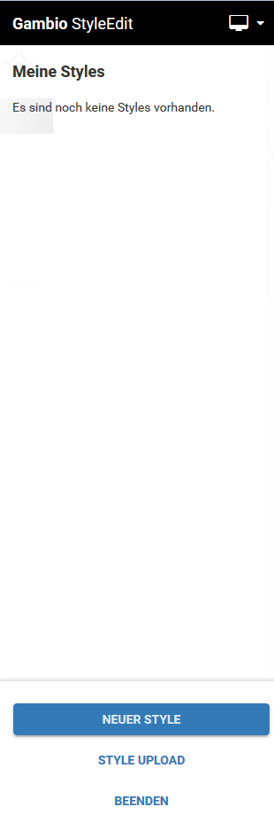
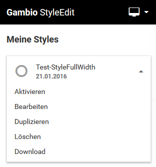
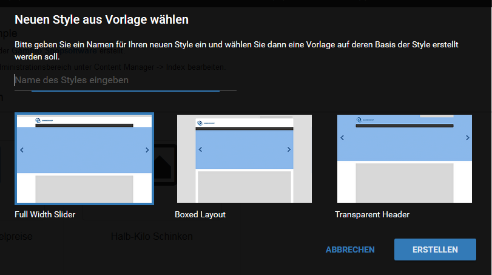

# Übersicht 

Das StyleEdit wird in einer Box auf der rechten Seite des Bildschirms angezeigt. Von oben nach unten stehen die folgenden Bereiche zur Verfügung

## Vorschau-Ansicht 

in der schwarzen Titel-Zeile des StyleEdits kann die Vorschau-Ansicht ausgewählt werden. Klicke hierzu auf das Symbol in der rechten, oberen Ecke und wähle unter den folgenden Ansichten aus:

-   Smartphone \(375x637\)
-   Tablet Portrait \(768x1024\)
-   Tablet Landscape \(1024x768\)
-   Desktop \(\> 1200\)

Standardmäßig ist die Ansicht Desktop aktiviert. Wenn eine der Vorschau-Ansichten für mobile Endgeräte gewählt wird, erfolgt die Darstellung in einem zum Endgerät passenden, stilisierten Rahmen. Die Anzeige des Shops entspricht der in den Klammern angegebenen Auflösung.

## Meine Styles 

Dies ist der Hauptbereich des StyleEdits. Änderungen an den Grafik-Einstellungen können in eigenen Profilen zusammengefasst und gespeichert werden, den sogenannten Styles. Styles lassen sich anlegen, bearbeiten und herunterladen. Sie können ebenfalls dupliziert und gelöscht werden.

**Note:** Wenn du das StyleEdit v3 das erste Mal aufrufst, sind noch keine Styles vorhanden \(vgl. Abb. StyleEdit v3\). Um Änderungen an deinem Template vornehmen zu können, sollte daher ein neuer Style angelegt werden. Weiteres hierzu findest du im Abschnitt StyleEdit-Buttons.

Styles werden mit einem frei vergebenen Namen und dem Datum der letzten gespeicherten Änderung aufgelistet. Über einen Klick auf das nach unten weisende Dreieck können für einen Style die folgenden Aktionen aufgerufen werden:

-   Aktivieren: aktivert den Style, sodass die hier vorgenommenden Einstellungen im Shop verwendet werden. Ein aktiver Style wird im StyleEdit mit einem blauen Haken und dem Hinweis Aktiv angezeigt.

 und ein inaktiver Style")

-   Bearbeiten: öffnet den Style zur Bearbeitung, um Änderungen daran vorzunehmen. Weiteres hierzu findest du im Kapitel Bearbeiten.
-   Duplizieren: kopiert einen Style und legt ihn unter einem neuen Namen an. Klicke auf Name des Styles angeben um einen Namen festzulegen. Mit einem Klick auf Erstellen wird der Style unter dem neuen Namen angelegt. Mit Klick auf Abbrechen verlässt du den Dialog, ohne den Style zu duplizieren.

CAUTION:

Wir empfehlen das Anlegen je eines Duplikats deiner Styles als Sicherung.

-   Löschen: Löscht einen bestehenden Style. Es findet eine Sicherheitsabfrage statt. Mit Klick auf Ja wird der Style unwiderruflich gelöscht.

**Note:** Aktive Styles können nicht gelöscht werden.

-   Download: mit Klick auf Download kann der Style heruntergeladen werden.

**Note:** Styles werden in sogenannten JSON-Dateien gespeichert. JSON steht für JavaScript Object Notation.

## StyleEdit-Buttons 

Über die Schaltfläche Neuer Style kann ein neuer Style angelegt werden. Es stehen drei grundsätzliche Layouts zur Verfügung:

-   Full Width Slider: der Teaser-Slider wird über die gesamte Breite der Seite angezeigt
-   Boxed Layout: der gesamte Shop-Bereich wird in einer zentralen Box angezeigt
-   Transparent Header: der Head-Bereich wird transparent zum Hintergrund dargestellt

Wähle einen Namen und klicke auf Erstellen, um einen neuen Style anzulegen. Über Abbrechen verlässt du den Dialog, ohne einen neuen Style zu erstellen.

Über die Schaltfläche Style Upload kann ein gespeicherter Style hochgeladen werden. Mit einem Klick auf Datei wählen kann die Datei auf deinem Computer ausgewählt werden. Klicke auf Erstellen, um den Style unter dem eingegebenen Namen hochzuladen. Mit einem Klick auf Abbrechen verlässt du den Dialog, ohne den Style hinzuzufügen.

Über Beenden kannst du das StyleEdit verlassen und kehrst zur Shop-Ansicht zurück.

