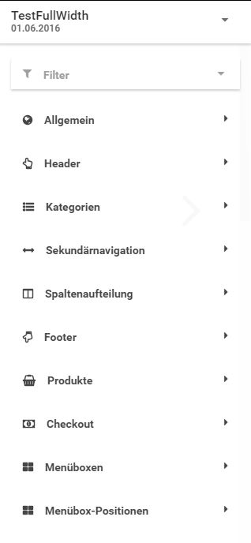
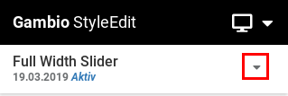
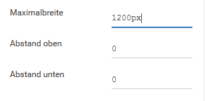
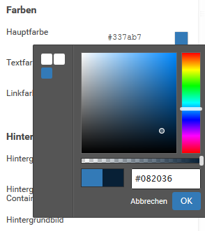

# Bearbeiten {#template_einstellungen_bearbeiten}

Wähle den jeweiligen Style aus, welchen du bearbeiten möchtest und öffne das Menü über einen Klick auf das nach unten weisende Dreieck. Klicke auf Bearbeiten.

Es öffnen sich die einzelnen Bestandteile des Styles, die über ein Dropdown ausgewählt werden können. Klicke den jeweiligen Bereich an, um die einzelnen Einstellungen einzublenden. Es stehen der Reihe nach die folgenden Bereiche zur Verfügung:

-   Allgemein
-   Header
-   Kategorien
-   Sekundärnavigation
-   Spaltenaufteilung
-   Footer
-   Produkte
-   Checkout
-   Menüboxen
-   Menüboxen-Positionen

Während der Style bearbeitet wird, steht neben dem Style-Namen ein Drodpown-Feld zur Verfügung. Hierüber kann der Link Eigenes CSS hinzufügen ausgeklappt werden. Dieser verweist auf ein Texteingabefeld, in das eigener CSS-Code platziet werden kann.

CAUTION:

Eigene CSS-Codes können im ungünstigen Fall ungewollte Auswirkungen auf die Darstellung haben. Wir empfehlen daher etwaige Änderungen zunächst an einer Kopie deines aktiven Styles vorzunehmen und die Auswirkung auf die einzelnen Seiten des Shops eingängig zu prüfen, indem du diese aus dem Bearbeitungsmodus heraus aufrufst.

Die Anzeige der Einstellungen kann über einen Filter übersichtlicher gemacht werden. Klicke auf Filter um die gewünschten Filter auszuwählen:

-   Alle anzeigen
-   Farben & Hintergründe
-   Schriftart
-   Mobil
-   Layout

Nach der Auswahl werden nur noch die Bereiche und Einstellungen angezeigt, die im Filter eingestellt sind. Wenn du z.B. den Filter Farben & Hintergründe auswählst, werden nur noch die Bereiche angezeigt, in denen Farb- und Hintergrund-Einstellungen vorgenommen werden können. Zudem werden bei der Auswahl eines Bereichs nur noch die Einstellungen für Farben und Hintergründe angezeigt. Der Name des ausgwählten Filters wird neben dem Filter-Symbol in dunkelgrauer Schrift angezeigt.

Über Alle Anzeigen wird die Filter-Auswahl wieder rückgängig gemacht, der inaktive Filter wird in hellgrauer Schrift dargestellt.

Änderungen können über vier Arten von Einstellungen vorgenommen werden:

## Schalter/Schieber { .section}

Die jeweilige Einstellung wird an- oder ausgeschaltet. Wird ein Schieber blau angezeigt, ist die Einstellung aktiv. Wird er stattdessen hellgrau angezeigt, ist die Einstellung inaktiv

 und eine inaktive Einstellung")

## Textfelder { .section}

Textfelder sind im StyleEdit mit einem Unterstrich versehen. Über einen Klick in das Textfeld kann der Inhalt geändert werden. Bei einem aktiven Textfeld wird der Unterstrich blau angezeigt.

## Farbauswahl { .section}

Farbauswahlen werden über ein Textfeld, das den Farb-Wert im Hex-Code enthält \(zu erkennen an der vorangestellten Raute\) und die Vorschau-Box dargestellt, in der die eingestellte Farbe angezeigt wird. Über einen Klick in das Textfeld kann der Farbwert manuell eingetragen werden. Wenn du auf die Vorschau-Box klickst, kann die Farbe über einen Dialog eingestellt werden.

Der Dialog besteht aus einer zentralen Auswahl-Box, in der der Farbverlauf angezeigt wird und verschiedenen Einstellungen. Klicke in die Box in der Mitte, um eine Farbe im Verlauf auszuwählen. Über den Regler rechts neben dem Verlauf kann ein anderer Bereich des Farbspektrums eingestellt werden. Unterhalb der Auswahl-Box kann die Transparenz der gewählten Farbe über einen Regler festgelegt werden. Unterhalb dieses Reglers wird die ausgewählte Farbe in einem Vorschau-Fenster angezeigt. Die linke Hälfte der Vorschau zeigt die bisher eingestellte Farbe an. Die rechte Hälfte zeigt die neue Auswahl an. Rechts neben der Vorschau wird der Farbwert in einem Eingabefeld angezeigt und kann dort nachträglich geändert werden.

Links von der Vorschau-Box befindet sich eine Historie der bisher eingestellten Farben. Über einen Klick in das jeweilige Quadrat wird die angezeigte Farbe eingestellt. Über einen Klick auf OK wird die neue Farbe als Auswahl übernommen. Mit Abbrechen verlässt du den Dialog, ohne die Farbe zu ändern.

## Dateiauswahl { .section}

Die Dateiauswahl ist ähnlich wie das Textfeld aufgebaut, es wird der Dateiname der eingestellten Datei angezeigt. Bewege die Maus über das Feld, um die einzelnen Auswahlen anzuzeigen. Die drei Symbole stellen von links nach rechts die Aktionen Upload, Vorschau und Löschen dar.

Über einen Klick auf Upload öffnet sich der Dialog zum Hochladen einer Datei, typischerweise eines Bildes. Klicke auf Datei auswählen um die Datei auf deinem Rechner auszuwählen. Über die Schaltfläche Upload wird die Datei hochgeladen und eingebunden. Mit Abbrechen verlässt du den Dialog, ohne die eingerichtete Datei zu ändern.

Mit Vorschau wird eine Vorschau-Ansicht des eingerichteten Bilds geöffnet. Über Löschen kann ein eingerichtetes Bild wieder entfernt werden. Das Löschen muss mit einer Sicherheitsabfrage bestätigt werden, klicke auf Ja um das Bild zu entfernen. Mit Nein wird das Löschen abgebrochen.

Am unteren Ende des StyleEdits werden drei Schaltflächen angezeigt. Über Speichern werden die im Style vorgenommenen Änderungen übernommen. Mit Vorschau kann die Änderung im Vorschau-Bereich angezeigt werden, ohne sie dauerhaft zu speichern.

Mit einem Klick auf Zurück gelangst du wieder zur Auswahl der Styles. Wenn seit dem letzten Speichern Änderungen vorgenommen wurden, wird eine Sicherheitsabfrage angezeigt. Wenn du die Bearbeitung des Styles abbrechen möchtest, bestätige dies mit einem Klick auf Ja, alle Änderungen die seit dem letzten Speichern vorgenommen worden sind, gehen hierbei verloren. Mit einem Klick auf Nein wird die Aktion abgebrochen und du kehrst zur Bearbeitung des Styles zurück.

