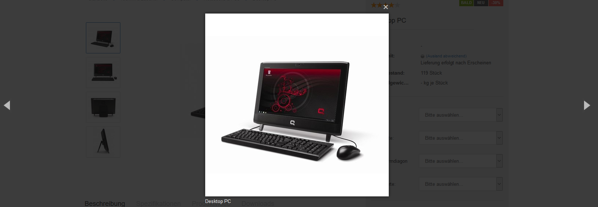

# Einstellungen für die Artikeldetailseite 

|Feldname|Beschreibung|
|--------|------------|
|Hersteller-Bilder anzeigen|Anzeige des Hersteller-Bilds auf der Artikeldetailseite|
|Zusatzfelder auf Detailseite aktivieren|Die Inhalte der Zusatzfelder werden auf der Detailseite angezeit|
|Bilderzoom aktivieren|Aktivieren der Lupenfunktion für das Artikelbild|
|Merkzettel aktivieren|Aktivieren des Merkzettels auf der Artikeldetaiseite|
|"Frage zum Produkt"- Modul auf Detailseite aktivieren|Der Link Frage zu Produkt wird auf der Artikel-Detailseite unterhalb des Warenkorb-Buttons angezeigt|
|Facebook "Gefällt mir"-Button auf Detailseite aktivieren|Aktivieren des Gefällt Mir-Buttons auf der Artikeldetailseite|
|WhatsApp Teilen Button auf Detailseite aktivieren|Aktivieren des WhatsApp teilen-Buttons auf der Artikeldetailseite|
|Tweet-Button \(Twitter\) auf Detailseite aktivieren|Aktivieren des Tweet-Buttons auf der Artikeldetailseite|
|Google +1 Button auf Detailseite aktivieren|Aktivieren des Google +1 Buttons auf der Artikeldetailseite|
|Pinterest Button auf Detailseite aktivieren|Aktivieren des Pinterest-Buttons auf der Artikeldetailseite|
|Bildergalerie als Lightbox einbinden|Die Bildergalerie wird als Lightbox angezeigt|
|Artikelnummer anzeigen|Anzeige der Artikelnummer auf der Artikeldetailseite aktivieren|

