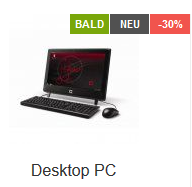
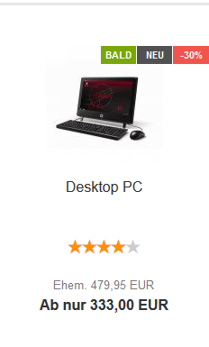

# Einstellungen für die Artikelübersicht {#template_konfiguration_einstellungen_fuer_die_artikeluebersicht}

|Feldname|Beschreibung|
|--------|------------|
|Lagerbestand anzeigen \(z. B. Suchergebnisse, Hersteller-Artikel\)|Lagerbestand in der Artikelübersicht anzeigen|
|Artikelattribute anzeigen \(z. B. Suchergebnisse, Hersteller-Artikel\)|Attribute in der Artikelübersicht anzeigen|
|Staffelpreise anzeigen \(z. B. Suchergebnisse, Hersteller-Artikel\)|Staffelpreise in der Artikelübersicht anzeigen|
|Mengeneingabefeld anzeigen \(z. B. Suchergebnisse, Hersteller-Artikel\)|Mengeneingabefeld in der Artikelübersicht anzeigen|
|Gekachelte Artikelauflistung \(z. B. Suchergebnisse, Hersteller-Artikel\)|Wenn aktiviert, werden Artikel in der Artikelübersicht gekachelt angezeigt, sonst in Listenform|
|Hersteller-Bilder anzeigen|Hersteller-Bilder in der Artikelübersicht anzeigen|
|Artikel-Ribbons aktivieren|Artikel-Ribbons in der Artikelübersicht anzeigen|
|Anzahl der Angebote auf der Startseite|Anzahl der Sonderangebote, die auf der Startseite angezeigt werden|
|Anzahl der neuen Artikel auf der Startseite|Anzahl der neuen Artikel, die auf der Startseite angezeigt werden|
|Anzahl der empfohlenen Artikel auf der Startseite|Anzahl der Empfehlungen, die auf der Startseite angezeigt werden|
|Artikelnummer anzeigen|Anzeige der Artikelnummer in der Artikelübersicht aktivieren|

