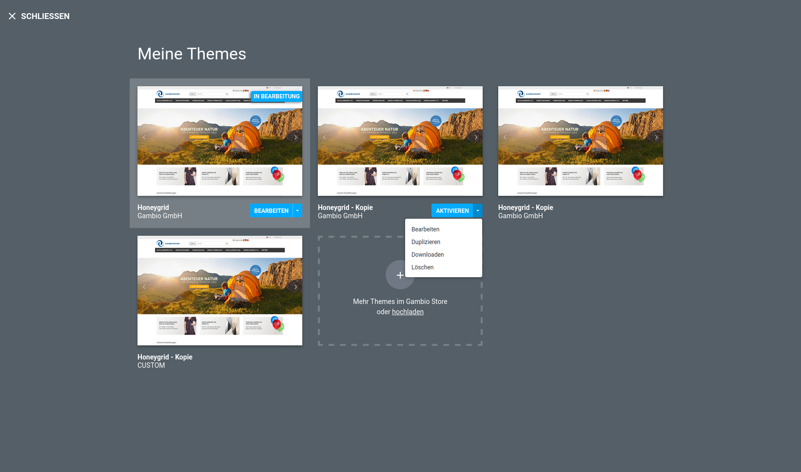

# Themeübersicht 'Meine Themes' {#styleedit4_themes_themeuebersicht}

Auf der Seite Meine Themes findest du eine Übersicht über alle im Shop angelegten Themes. Die Theme-Übersicht kann über das StyleEdit 4 aufgerufen werden. Klicke hierzu auf das Symbol mit den drei Linien, in der linken, oberen Ecke.

Es wird mindestens ein Theme angezeigt, das im Shop standardmäßig mitgelieferte Honeygrid. Dieses Theme kann bearbeitet werden, es ist jedoch nicht möglich es zu löschen.

CAUTION:

Wir empfehlen das Original-Theme unverändert zu lassen und alle Änderungen innerhalb einer Kopie des Originals durchzuführen.

CAUTION:

Beim Duplizieren eines Themes entsteht eine Abhängigkeit zwischen dem ursprünglichen Theme und der Kopie \(Child-Theme\), die Kopie bezieht sich auf das Original, um von dort bestimmte Eigenschaften zu übernehmen.

Wenn das ursprüngliche Theme ebenfalls eine Kopie ist, ist die Löschen-Funktion nicht ausgegraut. Wird so ein ursprüngliches Theme \(Parent-Theme\) entfernt, verschwinden u.U. auch die Inhalte, auf die ein Child-Theme sich ggf. bezieht - dies führt zu Problemen mit dem Child-Theme.

Aus der Reihenfolge der Themes in der Übersicht lässt sich **nicht** ableiten, welches Child-Theme zu welchem Ursprungs-Theme gehört.

Wir empfehlen daher nur Kopien des Originals anzulegen, um ungewollte Abhängigkeiten zu vermeiden.

Über die Dropdown-Schaltfläche eines Themes stehen dir folgende Aktionen zur Verfügung:

-   Aktivieren
-   Bearbeiten
-   Duplizieren
-   Downloaden
-   Löschen

Wird ein Theme aktiviert, wird es im Shop verwendet. Der Shop ist also nach außen mit allen Grafik-Einstellungen zu sehen, die im aktiven Theme vorgenomen worden sind.

Mit einem Klick auf Bearbeiten wird das StyleEdit 4 aufgerufen und das jeweilige Theme kann darin bearbeitet werden.

