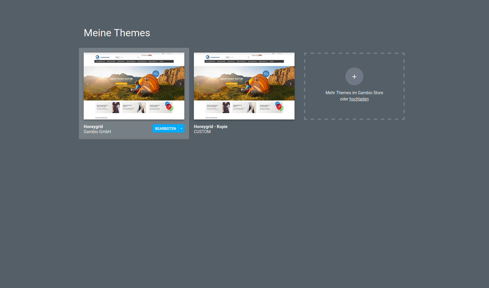
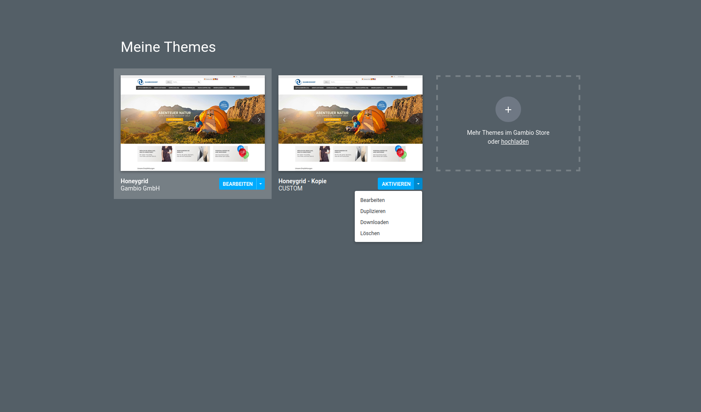
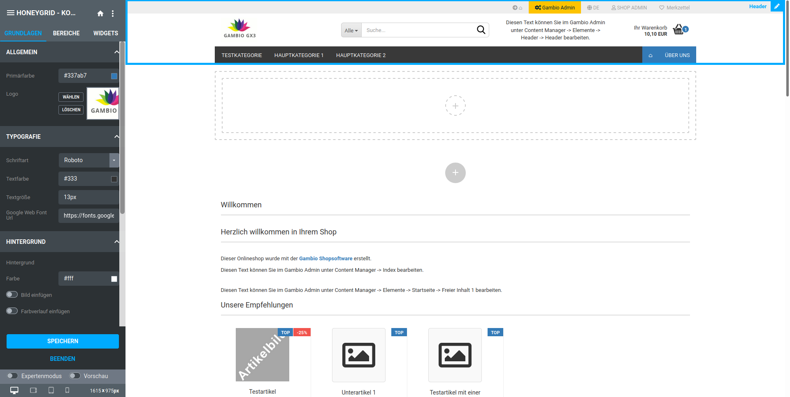
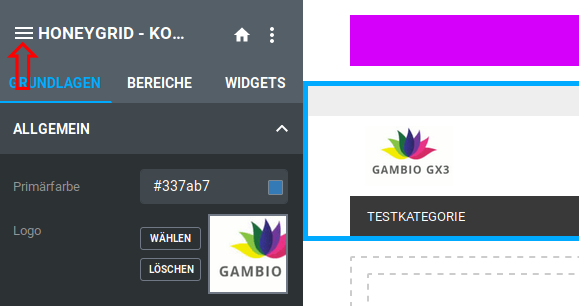
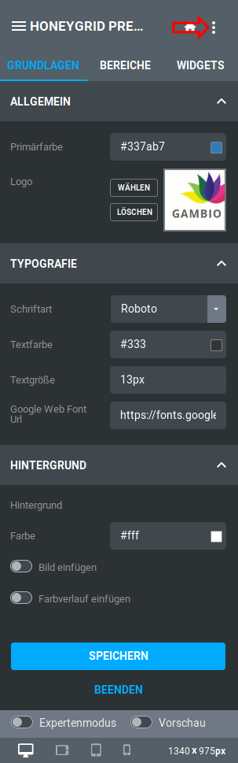
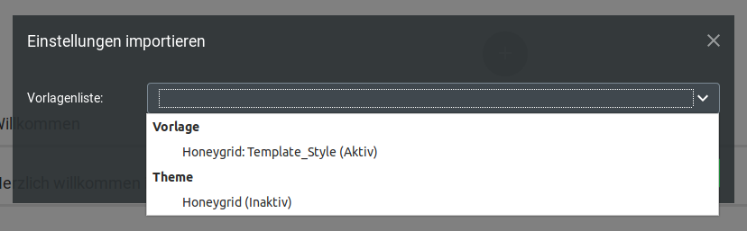

# StyleEdit 4 aufrufen 

Das StyleEdit 4 kann unter Darstellung \> Template-Einstellungen aufgerufen werden:

Wird nur der Button Theme bearbeiten angezeigt, verwendet der Shop die Standardeinstellungen, sodass unter Shop Einstellungen \> Mein Shop im Dropdown Templateset \(Theme\) der Eintrag Honeygrid \(Theme\) eingestellt ist.

Klicke auf Theme bearbeiten, um das StyleEdit 4 aufzurufen.

Erhältst du stattdessen die folgende Ansicht, verwendet der Shop die Vorgänger-Oberfläche auf Template-Basis \(Honeygrid \(Template\) unter Shop Einstellungen \> Mein Shop\):

Klicke auf Neues Theme bearbeiten, um im Hintergrund an der neuen Oberfläche des Shops zu arbeiten, während dein bisheriges Template aktiv bleibt.

## Der erste Aufruf 

Beim ersten Aufruf wird nur ein Theme angezeigt, das aktive Honeygrid-Theme. Aktiv bedeutet, dass Änderungen direkt im Shop zu sehen sind.

Wir empfehlen daher eine Kopie des Themes anzulegen.

Klicke hierzu auf das nach unten weisende Dreieck der blauen Schaltfläche und wählen den Eintrag Duplizieren aus.

Das neue Theme wird mit dem Zusatz Kopie im Namen angezeigt.

Wähle hier, ebenfalls über das Dropdown in der blauen Schaltfläche, den Eintrag Bearbeiten aus. Das StyleEdit 4 wird gestartet, und die Kopie des aktiven Themes geladen.

Nach dem ersten Aufruf gelangst du beim Klick auf den Button Theme bearbeiten unter Dartstellung \> Template-Einstellungen direkt zum StyleEdit 4.

Aus dem StyleEdit 4 heraus gelangst du bei Bedarf zurück zur Seite Meine Themes. Klicke hierzu auf das Icon mit den drei Linien, in der linken, oberen Ecke oder dem daneben angezeigten Theme-Namen. Über den Button Beenden am unteren Ende des StyleEdits kannst du den Bearbeitungsmodus beenden und gelangst zurück zum Shop.

**Note:** Beim nächsten Aufruf gelangst du direkt zum StyleEdit, es wird mit dem Style Honeygrid Preview geladen. Um deinen gewünschten Style zu bearbeiten, klicke auf den Namen in der Titelleiste des StyleEdits, um zurück auf die Seite Meine Themes zu gelangen.

## Übernahme der Einstellungen des aktiven Template-Styles 

Es ist über das StyleEdit 4 möglich die Einstellungen des bisher verwendeten Honeygrid-Templates in das aktuelle Theme zu importieren. Klicke hierzu auf das Symbol in der rechten, oberen Ecke des StyleEdit 4.

Wähle hier den Eintrag Einstellungen importieren aus, es öffnet sich ein neues Dialogfenster.

Öffne das Dropdown Vorlagenliste und wähle den Eintrag Honeygrid: Template\_Style \(Aktiv\) aus.

Klicke auf den Button Einführen, um den Import vorzunehmen.

