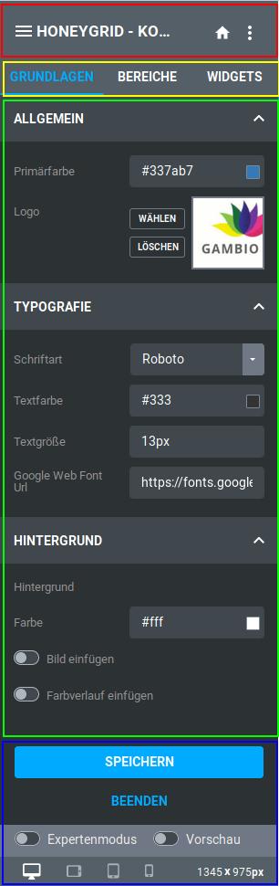

# Aufbau des StyleEdit 4 {#styleedit4_themes_aufbau}

Das StyleEdit lässt sich in vier Bestandteile unterteilen:

-   Titelleiste
-   Menüleiste
-   Einstellungsbereich
-   untere Schaltflächen

## Titelleiste { .section}

Die Titelleiste verfügt von links nach rechts über die Einstellungen

-   Theme-Übersicht / Theme Name: Aufruf der Seite Meine Themes
-   Zurück zur Shop-Startseite: Ruft innerhalb des StyleEdits die Startseite des Shops auf
-   Weitere Einstellungen: SCSS/CSS bearbeiten ermöglicht das Einfügen eigener Style-Definitionen über SCSS- oder CSS-Codes. Einstellungen importieren ermöglicht das Importieren von Einstellungen aus einem anderen Theme oder Style auf Basis des älteren Honeygrid-Templates

## Menüleiste { .section}

Über die Menüleiste können die verschiedenen Arten von Einstellungen ausgewählt werden. Der jeweils aktive Menüeintrag wird blau hervorgehoben.

## Einstellungsbereich { .section}

Im Einstellungsbereich werden die eigentlichen Einstellungen vorgenommen. Je nachdem, welcher Menüeintrag ausgewählt worden ist, stehen andere Einstellungen zur Verfügung.

## untere Schaltflächen { .section}

Im unteren Bereich gibt es verschiedene Buttons:

-   Speichern: speichert die im Theme vorgenommenen Änderungen ab
-   Beenden: beendet das StyleEdit 4, sodass du zur Shop-Ansicht zurückkehrst
-   Expertenmodus: wenn aktiviert, stehen unter Bereiche mehr Einstellungen zur Verfügung
-   Vorschau: aktiviert den Vorschaumodus, sodass der Shop ohne Platzhalter für Widgets und Hervorhebung einzelner Bereiche dargestellt wird

Darunter befindet sich eine Leiste, in der die aktuelle Größe des angezeigten Shopbereichs aufgeführt wird und über die dessen Größe innerhalb des StyleEdits angepasst werden kann. Die Darstellung kann entsprechend der typischen Auflösung bestimmter Endgeräte umgestellt werden:

-   Desktop
-   Tablet Landscape
-   Tablet Portrait
-   Smartphone

