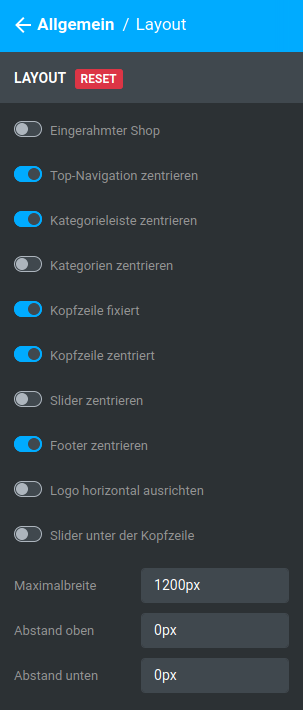
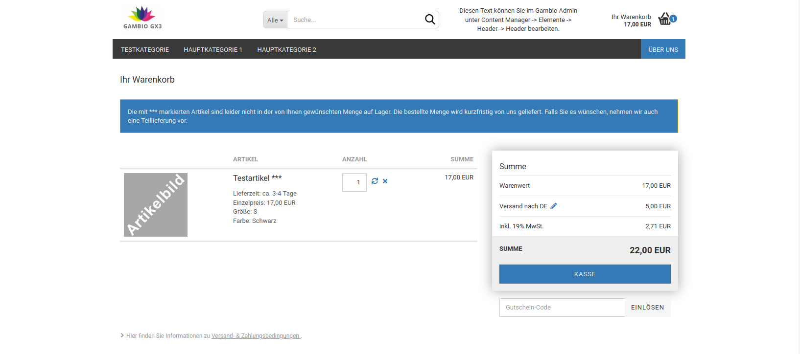

# Allgemein 

## Layout 

Es stehen folgende Einstellungen zur Verfügung:

|Feldname|Beschreibung|
|--------|------------|
|Eingerahmter Shop|stellt den Shop eingerahmt dar, die Breite der einzelnen Bereiche wird auf die Breite des Hauptbereichs \(Containers\) reduziert.!!! Info "Hinweis
	 Wenn der Shop eingerahmt dargestellt wird, hat die Einstellung Kopfzeile fixiert keine Funktion, da die Kopfzeile als Teil des Containers nicht fixiert wird.

|
|Top-Navigation zentrieren|Richtet die Sekundärnavigationsleiste am zentralen Bereich \(Container\) aus|
|Kategorieleiste zentrieren|Richtet die horizontale Navigationsleiste am zentralen Bereich \(Container\) aus|
|Kategorien zentrieren|Richtet die Einträge in der horizontalen Navigationsleiste \(Kategorien und Content-Seiten\) zentriert aus|
|Kopfzeile fixiert|Fixiert die Kopfzeile am oberen Ende des Fensters, beim runterscrollen wird die Kopfzeile im Sticky-Modus \(ohne Sekundärnavigation und horizontales Menü\) dargestellt|
|Kopfzeile zentriert|Richtet die Inhalte der Kopfzeile \(Logo, Suche, freigestaltbarer Bereich, kleiner Warenkorb\) zentriert am zentralen Bereich \(Container\) aus|
|Slider zentrieren|Richtet den Teaser-Slider am zentralen Bereich \(Container\) aus|
|Footer zentrieren|Richtet die Inhalte des Footers am zentralen Bereich \(Container\) aus|
|Logo horizontal ausrichten|Zentriert das Logo im dafür vorgesehenen Bereich des Headers|
|Slider unter der Kopfzeile|verschiebt den Slider unter die Elemente der Kopfzeile|
|Maximalbreite|Maximale Breite des ContainersCAUTION:

Dieser Wert hat maßgebliche Auswirkung auf die Darstellung des Honeygrids auf einzelnen Endgeräten. Er sollte keinesfalls erhöht und nur in Ausnahmefällen verringert werden

|
|Abstand oben|Abstand oberhalb des Shops im Pixeln|
|Abstand unten|Abstand unterhalb des Shops in Pixeln|

## Farben 

!!! Info "Hinweis
	 Dieser Unterabschnitt steht nur im Expertenmodus zur Verfügung.

!!! Info "Hinweis
	

Hovern bzw. Mouseover bezeichnet das Platzieren des Mauszeigers über ein Element, ohne es anzuklicken

Die Hauptfarbe wird an verschiedenen Stellen des Shops verwendet. Hierzu zählen

-   Farbe von Links \(ohne Hover\)
-   Hintergrundfarbe der aktiven Kategorie im vertikalen Kategorienmenü in der linken Spalte
-   Hintergrundfarbe von Content-Seiten-Einträgen in der horizontalen Navigationsleiste
-   Trennzeichen \>\> in der Breadcrumb
-   Die Hintergrundfarbe der Artikelanzahl des kleinen Warenkorbs

|Feldname|Beschreibung|
|--------|------------|
|Textfarbe|Wähle die gewünschgte Textfarbe aus, indem du in das Feld bzw. Vorschau-Symbol klickst oder trage wahlweise den Farbcode direkt ein.|
|Linkfarbe|Die Linkfarbe ist über den Platzhalter $brand-primary mit der Haupt- bzw. Primärfarbe vorbelegt. Wird dieser Platzhalter entfernt, kann hier ein eigener Farbcode hinterlegt bzw. über die Farbpalette ausgewählt werden.|
|Breadcrumb-Farbe|Hierüber kann die Link/Text-Farbe für die Breadcrumb festgelegt werden. ")

!!! Info "Hinweis
	 Die Trennzeichen \>\> verwenden die Hauptfarbe

|
|Schriftfarbe Keine Bewertungen Hinweis|Farbe des Hinweises Leider sind noch keine Bewertungen vorhanden. Seien Sie der Erste, der das Produkt bewertet., der auf der Artikeldetailseite angezeigt wird, wenn für den Artikel noch keine Kundenrezension geschrieben worden ist. Standardmäßig wird über den Platzhalter $text-color die Textfarbe verwendet. Dieser Platzahalter kann jedoch bei Bedarf entfernt und durch eine eigene Farbe ersetzt werden.")

|

## Hintergrund 

Hier können Einstellungen für den Hintergrund vorgenommen werden. Es können wahlweise Hintergrundbilder oder -farben eingerichtet werden. Es können für letztere auch Farbverläufe eingestellt werden.

Es wird hierbei zwischen dem Hintergrund \(der gesamten Seite\) und dem Hintergrund des Containers \(dem Hintergrund der angezeigten Inhalte im zentralen Bereich der Seite\) unterschieden. Ein Beispiel anhand eines Honeygrid-Templates im Boxed Layout:

 und Hintergrund des
        Containers (rot)")

Die Hintergrundfarbe unter Hintergrund ist blau eingestellt, die Hintergrundfarbe unter Hintergrund des Containers rot.

## Schrift 

Es stehen die folgenden Einstellungen zur Verfügung:

|Feldname|Beschreibung|
|--------|------------|
|Google-Webfonts-Url|URL zu Google Web Fonts, standardmäßig ist ein Verweis auf die Schriftart Roboto hinterlegt: https://fonts.googleapis.com/css?family=Roboto:400,700,300,900|
|Schriftgröße|Allgemeine Schriftgröße für die im Shop verwendeten Texte.|
|Schriftgröße H1|Schriftgröße für Überschriften erster Ordnung, z.B. Artikelname auf Artikelseite, Kategoriename auf Kategorieseite, usw.|
|Schriftgröße H2|Schriftgröße für Überschriften zweiter Ordnung, z.B. Überschrift Kundenrezensionen auf der Artikelseite|
|Schriftgröße H3|Schrfitgröße für Überschriften dritter Ordnung, z.B. Anzeige der Summe im Warenkorb|
|Schriftgröße H4|Schriftgröße für Überschriften vierter Ordnung|
|Schriftgröße H5|Schriftgröße für Überschriften fünfter Ordnung|
|Schriftgröße H6|Schriftgröße für Überschriften sechster Ordnung|
|Überschriftenfarbe|Schriftfarbe der Überschriften, wird standardmäßig über den Platzhalter $text-color mit der Textfarbe belegt. Nach Entfernen des Platzhalters kann bei Bedarf eine eigene Farbe eingetragen werden.|
|Überschriftenstärke|Legt die Stäkre der Überschriften fest|

## Abgerundete Ecken 

Es stehen die folgenden Einstellungen zur Verfügung, um den Radius der im Honeygrid verwendeten Ecken anzupassen:

")

-   Eckenradius normal, z.B. für das Warenkorb-Dropdown
-   Eckenradius groß, z.B. für Sucheingabefeld im Header
-   Eckenradius klein
-   Eckenradius des eingerahmten Shops
-   Eckenradius des horizontalen Kategoriemenüs
-   Eckenradius der Warenkorb-Summenbox

## Teaser-Slider 

Hier kann an- und abgeschaltet werden, ob der Teaser-Slider für bestimmte Ausgabegeräte angezeigt werden soll.

!!! Info "Hinweis
	 Die Teaser-Slider-Bilder müssen weiterhin für alle Ausgabegrößen separat festgelegt werden

## Page-Up-Button 

, Hintergrundfarbe
        schwarz (#000000), links ausgerichtet")

|Feldname|Beschreibung|
|--------|------------|
|Schriftfarbe|Farbe des 'nach oben'-Symbols im Page-Up-Button, es wird standardmäßig die Hauptfarbe über den Platzhalter $brand-primary hinterlegt. Wird der Platzhalter entfernt, kann eine eigene Farbe eingestellt werden|
|Schriftfarbe Hover|Farbe des 'nach oben'-Symbols im Page-Up-Button, wenn der Mauszeiger darüber bewegt wird, es wird standardmäßig die Hauptfarbe über den Platzhalter $brand-primary hinterlegt. Wird der Platzhalter entfernt, kann eine eigene Farbe eingestellt werden|
|Hintergrundfarbe|Hintergrundfarbe des Page-Up-Buttons|
|Hintergrundfarbe Hover|Hintergrundfarbe des Page-Up-Buttons, wenn der Mauszeiger darüber bewegt wird|
|Button links ausrichten|Page-Up-Button wird in der linken unteren statt der rechten unteren Ecke angezeigt|
|Vertikaler Abstand|Abstand zum unteren Rand des Browserfensters|

!!! Info "Hinweis
	

Hovern bzw. Mouseover bezeichnet das Platzieren des Mauszeigers über ein Element, ohne es anzuklicken

## Buttons 

!!! Info "Hinweis
	 Es wird in den Einstellungen zwischen Primary-Button, Default-Button und Kaufen-Button unterschieden.

Primary-Buttons sind z.B. Filtern in der Filter-Box, Senden im Kontaktformular, Anmelden in der Newsletter-Box, Weiter im Bestellvorgang.

Default-Buttons sind z.B. Zurücksetzen in der Filter-Box, Zurück auf Content-Seiten oder im Bestell-Vorgang, Adresse ändern im Bestellvorgang, sowie die Schaltflächen zur Pagination \(Kachelansicht, Listenansicht, Sortieren nach, ... pro Seite\), etwa auf Kategorie-Seiten.

Kaufen-Buttons sind die Schaltflächen in den Warenkorb und zum Artikel.

|Feldname|Beschreibung|
|--------|------------|
|Abgerundete Ecken|Ecken-Radius der Schaltflächen im Shop, Angabe erfolgt zusammen mit einer Einheit, z.B.: 10px|
|Texttransformation|Ändert Groß- und Kleinschreibung der Beschriftung der Buttonsnone: Text wird so ausgegeben, wie er im Shop \(z.B. Toolbox -\> Texte anpassen\) hinterlegt ist

uppercase: Text wird in Großbuchstaben ausgegeben

lowercase: Text wird in Kleinbuchstaben ausgegeben

capitalize: Jedes Wort beginnt mit einem Großbuchstaben

|
|Farbe Primary-Button|Schriftfarbe für die Primary-Buttons, standardmäßig mit dem Platzhalter $btn-primary-color belegt, kann nachträglich geändert werden|
|Hintergrund Primary-Button|
|Farbe|Hintergrundfarbe für die Primary-Buttons, standardmäßig nicht belegt|
|Bild einfügen|Legt ein Hintergrundbild für die Primary-Buttons fest|
|Farbverlauf einfügen|Legt einen Farbverlauf als Hintergrund der Primary-Buttons fest|
|Rahmenfarbe Primary-Button|Legt die Rahmenfarbe der Primary-Buttons fest, standardmäßig mit dem Platzhalter $btn-primary-border vorbelegt, kann nachträglich geändert werden|
|Farbe Default-Button|Schriftfarbe der Default-Buttons, standardmäßig mit dem Platzhalter $btn-default-color vorbelegt, kann nachträglich geändert werden|
|Hintergrund Default-Button|
|Farbe|Hintergrundfarbe für die Default-Buttons, standardmäßig nicht belegt|
|Bild einfügen|Legt ein Hintergrundbild für die Default-Buttons fest|
|Farbverlauf einfügen|Legt einen Farbverlauf als Hintergrund der Default-Buttons fest|
|Rahmenfarbe Default-Button|Legt die Rahmenfarbe der Default-Buttons fest, standardmäßig mit dem Platzhalter $btn-default-border vorbelegt, kann nachträglich geändert werden|
|Farbe Kaufen-Button|Schriftfarbe der Kaufen-Buttons|
|Hintergrund Kaufen-Button|
|Farbe|Hintergrundfarbe für die Kaufen-Buttons|
|Bild einfügen|Legt ein Hintergrundbild für die Kaufen-Buttons fest|
|Farbverlauf einfügen|Legt einen Farbverlauf als Hintergrund der Default-Buttons fest|
|Rahmenfarbe Kaufen-Button|Legt die Rahmenfarbe der Kaufen-Buttons fest, ist standardmäßig mit dem Wert darken\($gx-btn-calltoaction-bg-color, 5%\) vorbelegt, kann nachträglich geändert werden|

## Trennlinien 

Hier können die Farben der verschiedenen Trennlinien geändert werden:

-   Linienfarbe Überschriften
-   Rahmenfarbe Footer-Boxen
-   Linienfarbe Überschriften im Checkout
-   Rahmenfarbe Pagination
-   Rahmenfarbe Produktlisten und Kacheln
-   Farbe der Trennlinien Produktdetails-Box

Die Felder sind zum Teil mit Platzhaltern befüllt, diese können bei Bedarf durch eine eigene Farbangabe ersetzt werden.

## Hinweise 

Im Shop werden an verschiedenen Stellen farblich hervorgehobene Warnungen, Fehlermeldungen, allgemeine Hinweise und Informationen angezeigt. In diesem Abschnitt können die zugehörigen Schrift-, Rahmen und Hintergrundfarben angepasst werden. Für die Hintergründe können bei Bedarf auch Bilder und Farbverläufe eingestellt werden.

Die einzelnen Farbeinstellungen sind jeweils mit Platzhaltern für die Standardfarben befüllt, die bei Bedarf durch eigene Farbwerte ersetzt werden können.

## QR-Codes 

In diesem Abschnitt können Farbe und Hintergrundfarbe der im Shop verwendeten QR-Codes eingestellt werden.

## Modal-Fenster 

Modal-Fenster werden oberhalb der eigentlichen Shop-Oberfläche angezeigt und können verschiedene Aufgaben haben. Für sie kann in diesem Unterabschnitt eine Hintergrundfarbe, ein Hintergrundbild oder Farbverlauf als Hintergrund festgelegt werden.

