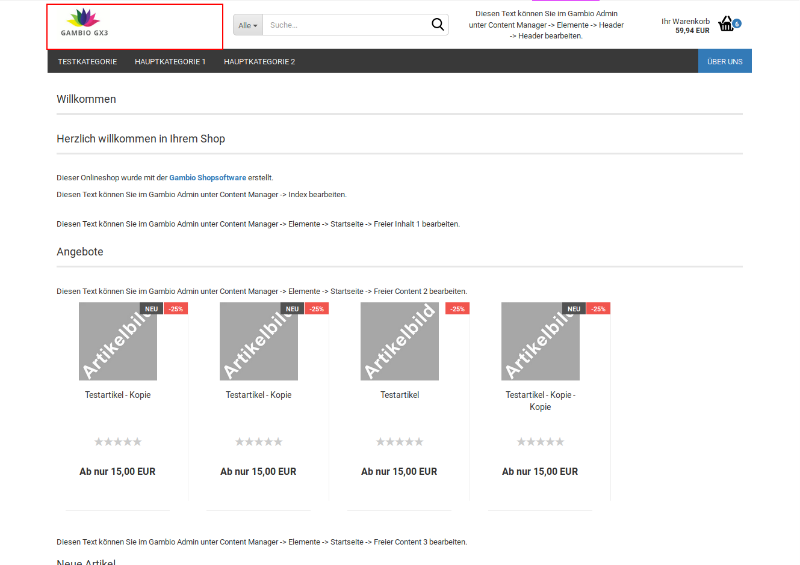
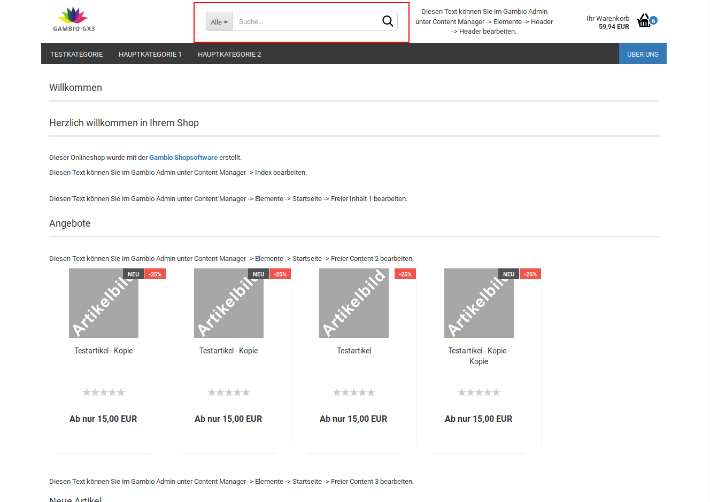
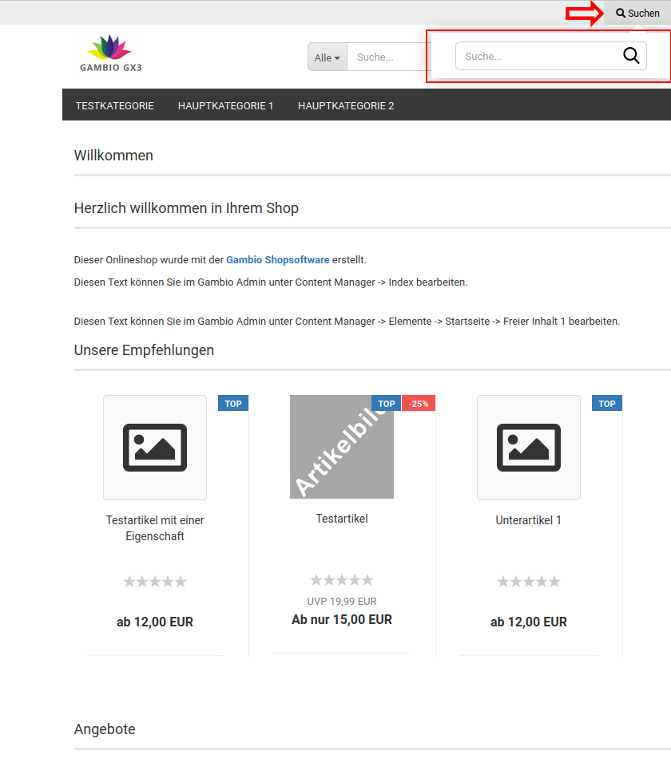
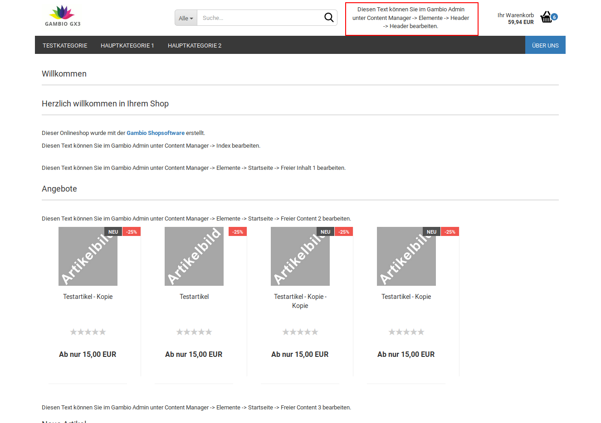

# Standard {#styleedit4_themes_theme_bearbeiten_menues_bereiche_header_standard}

## Allgemein { .section}

Im diesem Unterabschnitt kann der Hintergrund des Headers \(Farbe, Farbverlauf oder Hintergrundbild\) sowie dessen Höhe für die verschiedenen Größen \(ohne Größeneinschränkung, Mobil, Sticky\) festgelgt werden.

**Note:**

Sticky bezeichnet die reduzierte Form des Headers, die verwendet wird, wenn mit fixierter Kopfzeile nach unten gescrollt wird.

|Feldname|Beschreibung|
|--------|------------|
|Hintergrund|
|Farbe|Hintergrundfarbe des Headers auf Desktop-Computern und Tablets|
|Bild einfügen|Hintergrundbild des Headers auf Desktop-Computern und Tablets|
|Farbverlauf einfügen|Farbverlauf als Hintergrund des Headers auf Desktop-Computern und Tablets|
|Hintergrund Mobil|
|Farbe|Hintergrundfarbe des Headers auf Smartphones|
|Bild einfügen|Hintergrundbild des Headers auf Smartphones|
|Farbverlauf einfügen|Farbverlauf als Hintergrund des Headers auf Smartphones|
|Hintergrund Sticky|
|Farbe|Hintergrundfarbe des Sticky Headers|
|Bild einfügen|Hintergrundbild des Sticky Headers|
|Farbverlauf einfügen|Farbverlauf als Hintergrund des Sticky Headers|
|Höhe|Höhe des Headers auf Desktop-Computern und Tablets|
|Höhe Mobil|Höhe des Headers auf Smartphones|
|Höhe Sticky|Höhe des Sticky Headers|
|Farbe des Menü-Icons Mobile|Farbe des Menü-Icons auf Smartphones|

## Logo { .section}

Für das Logo können die folgenden Einstellungen vorgenommen werden:

|Feldname|Beschreibung|
|--------|------------|
|Logo im Header ausblenden|blendet den Logo-Bereich im Header aus \(verringert die Zahl der verwendeten Grid-Spalten\)|
|Grid-Spalten Klein|Anzahl der Grid-Spalten des Logo-Bereichs für kleine Darstellung, typischerweise Tablet im Portrait/Hoch-Format|
|Grid-Spalten Medium|Anzahl der Grid-Spalten des Logo-Bereichs für mittelgroße Darstellung, typischerweise Tablet im Landscape/Quer-Format|
|Grid-Spalten Groß|Anzahl der Grid-Spalten des Logo-Bereichs für große Darstellung, typischerweise Desktop-Computer|
|Logo Höhe|Höhe des Logo-Bereichs, Angabe standardmäßig in Pixeln z.B. 80px|
|Logo Max-Breite Mobil|maximale Breite des Logo-Bereichs in der Smartphone-Ansicht, Angabe standardmäßig in Pixeln z.B. 80px|
|Logo Höhe Sticky|Höhe des Logo-Bereichs im Sticky-Header, Angabe standardmäßig in Pixeln z.B. 60px|

**Note:**

Die grafische Oberfläche des Shops wird in der Breite in 12 sogenannte Grid-Spalten aufgeteilt. Für jede Größe \(groß, medium, klein\) gibt es eine eigene Einstellung. Die Summe aller Einstellungen einer Größe, die nicht ausgeblendet werden, muss 12 ergeben. Weitere Informationen hierzu sind im Kapitel Grid-Spalten aufgeführt.

**Note:**

Sticky bezeichnet die reduzierte Form des Headers, die verwendet wird, wenn mit fixierter Kopfzeile nach unten gescrollt wird.

## Suche { .section}

|Feldname|Beschreibung|
|--------|------------|
|Suche in Top-Navigation anzeigen|aktiviert den Eintrag Suchen in der Sekundärnavigation

|
|Suche im Header ausblenden|blendet den Such-Bereich im Header aus \(verringert die Zahl der verwendeten Grid-Spalten\)|
|Farbe des Suche-Icons Mobile|Farbe des Suchen-Icons auf Smartphones|
|Suche Höhe|Höhe des Such-Bereichs, Angabe standardmäßig in Pixeln z.B. 80px|
|Suche Höhe Sticky|Höhe des Such-Bereichs im Sticky-Header, Angabe standardmäßig in Pixeln z.B. 60px|
|vertikaler Abstand|Abstand des Suchfensters zur oberen und unteren Kante des Such-Bereichs, Angabe standardmäßig in Pixeln z.B. 22px|
|vertikaler Abstand Sticky|Abstand des Suchfensters zur oberen und unteren Kante des Such-Bereichs im Sticky-Header, Angabe standardmäßig in Pixeln z.B. 12px|
|vertikaler äußerer Abstand|Abstand des Such-Bereichs zur oberen und unteren Kantes des Headers|
|ertikaler äußerer Abstand Sticky|Abstand des Such-Bereichs zur oberen und unteren Kantes des Sticky-Headers|
|Grid-Spalten Klein|Anzahl der Grid-Spalten des Such-Bereichs für kleine Darstellung, typischerweise Tablet im Portrait/Hoch-Format|
|Grid-Spalten Medium|Anzahl der Grid-Spalten des Such-Bereichs für mittelgroße Darstellung, typischerweise Tablet im Landscape/Quer-Format|
|Grid-Spalten Groß|Anzahl der Grid-Spalten des Such-Bereichs für große Darstellung, typischerweise Desktop-Computer|

**Note:**

Sticky bezeichnet die reduzierte Form des Headers, die verwendet wird, wenn mit fixierter Kopfzeile nach unten gescrollt wird.

**Note:**

Die grafische Oberfläche des Shops wird in der Breite in 12 sogenannte Grid-Spalten aufgeteilt. Für jede Größe \(groß, medium, klein\) gibt es eine eigene Einstellung. Die Summe aller Einstellungen einer Größe, die nicht ausgeblendet werden, muss 12 ergeben. Weitere Informationen hierzu sind im Kapitel Grid-Spalten aufgeführt.

## Freigestaltbarer Bereich { .section}

|Feldname|Beschreibung|
|--------|------------|
|Frei gestaltbaren Bereich im Header ausblenden|blendet den Bereich im Header aus \(verringert die Zahl der verwendeten Grid-Spalten\)|
|Höhe|Höhe des Bereichs, Angabe standardmäßig in Pixeln z.B. 80px|
|Höhe Sticky|Höhe des Bereichs im Sticky-Header, Angabe standardmäßig in Pixeln z.B. 60px|
|Grid-Spalten Klein|Anzahl der Grid-Spalten des Bereichs für kleine Darstellung, typischerweise Tablet im Portrait/Hoch-Format|
|Grid-Spalten Medium|Anzahl der Grid-Spalten des Bereichs für mittelgroße Darstellung, typischerweise Tablet im Landscape/Quer-Format|
|Grid-Spalten Groß|Anzahl der Grid-Spalten des Bereichs für große Darstellung, typischerweise Desktop-Computer|

**Note:**

Sticky bezeichnet die reduzierte Form des Headers, die verwendet wird, wenn mit fixierter Kopfzeile nach unten gescrollt wird.

**Note:**

Die grafische Oberfläche des Shops wird in der Breite in 12 sogenannte Grid-Spalten aufgeteilt. Für jede Größe \(groß, medium, klein\) gibt es eine eigene Einstellung. Die Summe aller Einstellungen einer Größe, die nicht ausgeblendet werden, muss 12 ergeben. Weitere Informationen hierzu sind im Kapitel Grid-Spalten aufgeführt.

## Kleiner Warenkorb { .section}

|Feldname|Beschreibung|
|--------|------------|
|Warenkorb im Header ausblenden|blendet den Warenkorb-Bereich im Header aus \(verringert die Zahl der verwendeten Grid-Spalten\)|
|Farbe des Icons|Farbe des Warenkorb-Symbols|
|Farbe des Icons Sticky|Farbe des Warenkorb-Symbols im Sticky-Header|
|Farbe des Icons Mobile|Farbe des Warenkorb-Symbols in der mobilen Ansicht|
|Textfarbe|Farbe des Textes Ihr Warenkorb und des Betrags|
|Textfarbe Sticky|Farbe des Textes Ihr Warenkorb und des Betrags im Sticky-Header|
|Höhe|Höhe des Warenkorb-Bereichs im Header|
|Höhe Sticky|Höhe des Warenkorb-Bereichs im Sticky-Header|
|Vertikaler Abstand|Abstand des Warenkorb-Icons und Schriftzugs von der Oberkante und Unterkante des Warenkorb-Bereichs|
|Vertikaler Abstand Sticky|Abstand des Warenkorb-Icons und Schriftzugs von der Oberkante und Unterkante des Warenkorb-Bereichs im Sticky-Header|
|Vertikaler äußerer Abstand|Abstand des Warenkorb-Bereichs zu Ober- und Unterkante des umgebenden Headers|
|Vertikaler äußerer Abstand Sticky|Abstand des Warenkorb-Bereichs zu Ober- und Unterkante des umgebenden Sticky-Headers|
|Grid-Spalten Klein|Anzahl der Grid-Spalten des Warenkorb-Bereichs für kleine Darstellung, typischerweise Tablet im Portrait/Hoch-Format|
|Grid-Spalten Medium|Anzahl der Grid-Spalten des Warenkorb-Bereichs für mittelgroße Darstellung, typischerweise Tablet im Landscape/Quer-Format|
|Grid-Spalten Groß|Anzahl der Grid-Spalten des Warenkorb-Bereichs für große Darstellung, typischerweise Desktop-Computer|

**Note:**

Sticky bezeichnet die reduzierte Form des Headers, die verwendet wird, wenn mit fixierter Kopfzeile nach unten gescrollt wird.

**Note:**

Die grafische Oberfläche des Shops wird in der Breite in 12 sogenannte Grid-Spalten aufgeteilt. Für jede Größe \(groß, medium, klein\) gibt es eine eigene Einstellung. Die Summe aller Einstellungen einer Größe, die nicht ausgeblendet werden, muss 12 ergeben. Weitere Informationen hierzu sind im Kapitel Grid-Spalten aufgeführt.

