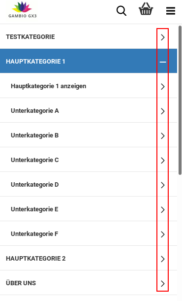
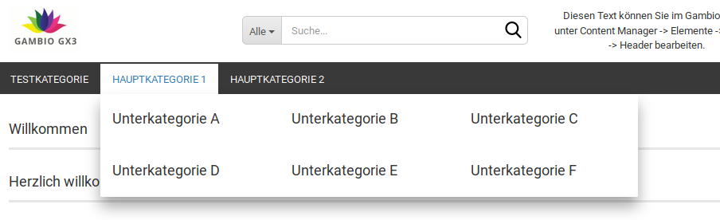

# Kategorien 

## Allgemein 

|Feldname|Beschreibung|
|--------|------------|
|Höhe|Höhe des inneren Bereichs der horizontalen Navigationsleiste, ist mit dem Platzhalter $navbar-height vorbelegt|
|Höhe Sticky|Höhe des inneren Bereichs der horizontalen Navigationsleiste im Sticky-Header, ist standardmäßig mit 0 vorbelegt|
|Übergänge|sanfteres Einblenden des Mega-Dropdown, wenn der Mauszeiger über eine Kategorie mit Unterkategorien bewegt wird|
|Höhe außen|Höhe des äußeren Bereichs der horizontalen Navigationsleiste|
|Abstand unten|Unterer Abstand zur Kategorieleiste, ist mit dem Platzhalter $line-height-computed vorbelegt|

!!! Info "Hinweis
	

Sticky bezeichnet die reduzierte Form des Headers, die verwendet wird, wenn mit fixierter Kopfzeile nach unten gescrollt wird.

## Menüpunkte 

Kategorien, rechts Einträge zu Content-Seiten")

|Feldname|Beschreibung|
|--------|------------|
|horizontaler Abstand|linker Abstand der Einträge der Sekundärnavigation, vorbelegt mit floor\(\($grid-gutter-width/2\)\)|
|vertikaler Abstand|Abstand oberhalb und unterhalb der Einträge für Hauptkategorien|
|Hintergrund|
|Farbe|Hintergrundfarbe der horizontalen Menüleiste \(ohne Content-Einträge\)|
|Bild einfügen|Hintergrundbild der horizontalen Menüleiste \(ohne Content-Einträge\)|
|Farbverlauf einfügen|Farbverlauf für den Hintergrund der horizontalen Menüleiste \(ohne Content-Einträge\)|
|Hintergrund außen|Hintergrundfarbe, die in der Fortführung der horizontalen Menüleiste links und rechts angezeigt wird")

|
|Schriftfarbe|Schriftfarbe der Hauptkategorien \(ohne Unterkategorien und Content-Einträge\) in der horizontalen Menüleiste|
|Schriftfarbe Custom|Schriftfarbe der Content-Einträge in der horizontalen Menüleiste|
|Schriftfarbe Hover|Schriftfarbe der Hauptkategorien \(ohne Unterkategorien und Content-Einträge\) in der horizontalen Menüleiste, beim Hovern mit dem Mauszeiger, ohne dass Unterkategorien aufgeklappt werden|
|Schriftfarbe Hover Custom|Schriftfarbe der Content-Einträge in der horizontalen Menüleiste, beim Hovern mit dem Mauszeiger|
|Schriftfarbe Aktiv|Schriftfarbe der Hauptkategorie in der horizontalen Menüleiste, die aktuell angezeit wird|
|Schriftfarbe Aktiv Custom|Schriftfarbe der Content-Seite in der horizontalen Menüleiste, die aktuell angezeigt wird|
|Texttransformation|Ändert Groß- und Kleinschreibung der Beschriftung der Hauptkategorie in der horizontalen Menüleistenone: Text wird so ausgegeben, wie er im Shop als Kategoriename hinterlegt ist

uppercase: Text wird in Großbuchstaben ausgegeben

lowercase: Text wird in Kleinbuchstaben ausgegeben

capitalize: Jedes Wort beginnt mit einem Großbuchstaben

|
|Schriftgröße|Schriftgröße der Hauptkategorien in der horizontalen und vertikalen Menüleiste|
|Hintergrund Hover|Hintergrundfabre der Hauptkategorien in der horlzontalen Menüleiste beim Hovern mit der Maus, vorbelegt mit darken\($gx-cat-navbar-bg-color, 6.5%\)|
|Hintergrund Aktiv|Hintergrundfarbe der aktuell angezeigten Hauptkategorie in der horizontalen Kategoriemeleiste, vorbelegt mit darken\($gx-cat-navbar-bg-color, 6.5%\)|
|Hintergrund Custom|Hintergrundfarbe der Content-Einträge in der horizontalen Menüleiste, vorbelegt mit $brand-primary|
|Hintergrund Hover Custom|Hintergrundfarbe der Content-Einträge in der horizontalen Menüleiste, beim Hovern mit der Maus, vorbelegt mit darken\($gx-custom-bg-color, 10%\)|
|Hintergrund Aktiv Custom|Hintergrundfarbe des Content-Eintrags in der horizontalen Menüleiste, der aktuell angezeit wird, vorbelegt mit darken\($gx-custom-bg-color, 10%\)|

!!! Info "Hinweis
	

Hovern bzw. Mouseover bezeichnet das Platzieren des Mauszeigers über ein Element, ohne es anzuklicken

## Kategorien Mobil 

|Feldname|Beschreibung|
|--------|------------|
|Mobil-Menü Höhe|Höhe des mobilen Menüs|
|Höhe|Höhe der Menü-Einträge|
|Vertikaler Abstand|Abstand des Namens zur oberen Kante des Menüeintrags|
|Heller Farbmodus|Umschalten zwischen hellem Farbmodus \(weißer Hintergrund, dunkle Schrift\) und dunklem Farbmodus \(dunkler Hintergrund, weiße Schrift\)|
|Icons anzeigen|Icons im mobilen Menü anzeigen ja/nein

|

## Mega-Dropdown 

|Feldname|Beschreibung|
|--------|------------|
|Schriftgröße Überschriften|Schriftgröße der Einträge im Dropdown des Kategoriemenüs|
|Schriftfarbe|Schriftfarbe der Einträge im Dropdown des Kategoriemenüs, vorbelegt mit $text-color|
|Rahmenfarbe|Farbe der Rahmenelemente der Einträge im Dropdown des Kategoriemenüs im Mega-Dropdown")

|
|Block-Breite|Breite der Unterkategorie-Blöcke im Mega-Dropdown

|
|Anzahl Blöcke|Anzahl der nebeneinander angezeigten Blöcke im Mega-Dropdown|
|Tab-Verschiebung|innerer Abstand der einzelnen Menüeinträge, vorbelegt mit 2px|
|Hintergrund|
|Farbe|Hintergrundfarbe des Mega-Dropdowns|
|Bild einfügen|Hintergrundbild des Mega-Dropdowns|
|Farbverlauf einfügen|Verwenden eines Farbverlaufs für den Hintergrund des Mega-Dropdowns|
|Schriftfarbe Alle Anzeigen|Schriftfarbe des Buttons Alle Anzeigen, vorbelegt mit $text-color|
|Hintergrund Alle Anzeigen|
|Farbe|Hintergrundfarbe des Buttons Alle Anzeigen, vorbelegt mit $gray-lighter|
|Bild einfügen|Hintergrundbild des Buttons Alle Anzeigen|
|Farbverlauf einfügen|Farbverlauf als Hintergrundbild des Buttons Alle Anzeigen|

## Vertikales Kategoriemenü 

|Feldname|Beschreibung|
|--------|------------|
|Schriftfarbe|Schriftfarbe des vertikalen Kategoriemenüs, mit $text-color vorbelegt|
|Schriftfarbe Hover|Schriftfarbe des vertikalen Kategoriemenüs beim Hovern, mit $text-color vorbelegt|
|Schriftfarbe Aktiv|Schriftfarbe der aktuell angezeigten Kategorie im vertikalen Kategoriemenü|
|Schriftfarbe geöffnet|Schriftfartbe der aufgeklappten Kategorien im vertikalen Kategoriemenü, vorbelegt mit $text-color|
|Hintergrund|
|Farbe|Hintergrundfarbe des vertikalen Kategoriemenüs im vertikalen
                  Kategoriemenü")

|
|Bild einfügen|Hintergrundbild des vertikalen Kategoriemenüs im vertikalen
                  Kategoriemenü")

|
|Farbverlauf einfügen|Farbverlauf als Hintergrund im vertikalen Kategoriemenü nach blau
                  (#0000FF)")

|
|Hintergrund Hover|
|Farbe|Hintergrundfarbe des Untermenüeintrags im vertikalen Kategoriemenü beim Hovern mit der Maus|
|Bild einfügen|Hintergrundbild des Menüeintrags im vertikalen Kategoriemenü beim Hovern mit der Maus|
|Farbverlauf einfügen|Farbverlauf als Hintergrund des Menüeintrags im vertikalen Kategoriemenü beim Hovern mit der Maus|
|Hintergrund Aktiv|
|Farbe|Hintergrundfarbe der aktuell angezeigten Kategorie im vertikalen Kategoriemenü, vorbelegt mit $brand-primary|
|Bild einfügen|Hintergrundbild der aktuell angezeigten Kategorie im vertikalen Kategoriemenü|
|Farbverlauf einfügen|Farbverlauf als Hintergrund der angezeigten Kategorie im vertikalen Kategoriemenü|
|Hintergrund geöffnet|
|Farbe|Hintergrundfarbe der aktuell aufgeklappten Hauptkategorie als Hintergrund
                  hat")

|
|Bild einfügen|Hintergrundbild der Hauptkategorien im vertikalen Kategoriemenü

|
|Farbverlauf einfügen|Farbverlauf als Hintergrund der Hauptkategorien im vertikalen Kategoriemenü
                  nach gelb (#fdc300) eingestellt")

|

!!! Info "Hinweis
	

Hovern bzw. Mouseover bezeichnet das Platzieren des Mauszeigers über ein Element, ohne es anzuklicken

