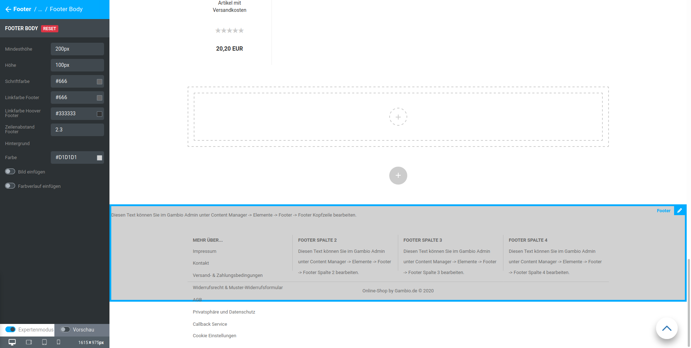

# Standard 

## Footer Header 

Der Footer Header ist die durchgehende Zeile oberhalb der Spalten des Footers.

")

|Feldname|Beschreibung|
|--------|------------|
|Mindesthöhe|minimale Höhe, die vom Footer Header in Anspruch genommen wird, auch wenn der Platz vom zugehörigen Inhalt nicht benötigt wird|
|Schriftfarbe|Schriftfarbe, die standardmäßig im Footer Header verwendet wird, vorbelegt mit $gx

Der in diesem Bereich angezeigte Content hat eigene Farbeinstellungen, diese haben eine höhere Priorität als die Grundeinstellung des StyleEdits. Wir empfehlen die allgemeine Einstellung mit dem StyleEdit vorzunehmen und bei Bedarf nur Teile des Inhalts über den Content Manager bzw. CK-Editor anders einzufärben.

|
|Hintergrund|
|Farbe|Hintergrundfarbe des Footer Headers, mit transparent vorbelegt|
|Bild einfügen|Hintergrundbild des Footer Headers|
|Farbverlauf einfügen|Farbverlauf als Hintergrund des Footer Headers|

## Footer Body 

|Feldname|Beschreibung|
|--------|------------|
|Mindesthöhe|minimale Höhe des Footer Bodys|
|Höhe|Höhe des Footer Bodys!!! Info "Hinweis"
	

Die Höhe des Footers sollte die Mindesthöhe nicht unterschreiten

|
|Schriftfarbe|Schriftfarbe des Footers insgesamt, ohne Links")

|
|Linkfarbe Footer|Linkfarbe innerhalb des Footers, außer Footer Header")

|
|Linkfarbe Hover Footer|Linkfarbe innerhalb des Footers beim Hovern \(darübergehen mit der Maus\), außer Footer Header|
|Zeilenabstand Footer|Zeilenabstand von Absätzen innerhalb der Footer Spalten|
|Hintergrund|
|Farbe|Hintergrundfarbe des Footers|
|Bild einfügen|Hintergrundbild des Footers|
|Farbverlauf einfügen|Farbverlauf als Hintergrund des Footers|

!!! Info "Hinweis"
	

Hovern bzw. Mouseover bezeichnet das Platzieren des Mauszeigers über ein Element, ohne es anzuklicken

## Footer Spalte N 

Dieser Abschnitt beschreibt die Einstellungen für Footer Spalte 1 bis Footer Spalte 4.

")

|Feldname|Beschreibung|
|--------|------------|
|Spalte 1 ausblenden|blendet die Spalte innerhalb des Footers aus|
|Grid-Spalten Klein|Anzahl der Grid-Spalten für diese Spalte des Footers bei kleinen Ausgabegeräten \(z.B. Smartphone\)|
|Grid-Spalten Medium|Anzahl der Grid-Spalten für diese Spalte des Footers bei mittelgroßen Ausgabegeräten \(z.B. Tablets\)|
|Grid-Spalten Groß|Anzahl der Grid-Spalten für diese Spalte des Footers bei großen Ausgabegeräten \(z.B. Desktop-Computern\)|

!!! Info "Hinweis"
	

Die grafische Oberfläche des Shops wird in der Breite in 12 sogenannte Grid-Spalten aufgeteilt. Für jede Größe \(groß, medium, klein\) gibt es eine eigene Einstellung. Die Summe aller Einstellungen einer Größe, die nicht ausgeblendet werden, muss 12 ergeben. Weitere Informationen hierzu sind im Kapitel Grid-Spalten aufgeführt.

Hierbei ist zu beachten, dass die Spalten des Footers auf kleineren Bildschirmen auch untereinander dargestellt werden. Es gilt

12 / Anzahl der Grid-Spalten = Anzahl der Footer-Spalten die nebeneinander angezeigt werden

