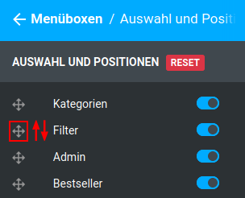

# Menüboxen {#styleedit4_themes_theme_bearbeiten_menues_bereiche_menueboxen}

## Kopfzeile { .section}

|Feldname|Beschreibung|
|--------|------------|
|Schriftfarbe|Schriftfarbe der Kopfzeile, vorbelegt mit $text-color")

|
|Hintergrund|
|Farbe|Hintergrundfarbe der Kopfzeile")

|
|Bild einfügen|Hintergrundbild der Kopfzeile|
|Farbverlauf einfügen|Farbverlauf als Hintergrund der Kopfzeile|

## Inhaltsbereich { .section}

|Feldname|Beschreibung|
|--------|------------|
|Hintergrund|
|Farbe|Hintergrundfarbe des Inhaltsbereichs")

|
|Bild einfügen|Hintergrundbild des Inhaltsbereichs|
|Farbverlauf einfügen|Farbverlauf als Hintergrund des Inhaltsbereichs|
|Rahmenfarbe|Rahmenfarbe der Menübox")

|

## Seiten mit Menüboxspalten { .section}

Die Anzeige der Menüboxen kann für die einzelnen Seiten bzw. Seitenarten des Shops an- und abgeschaltet werden. Aktiviere \(Schalter blau\) bzw. deaktiviere \(Schalter grau\) hierzu die gewünschten Einstellungen. Für folgende Seiten können die Menüboxen im Honeygrid aktiviert werden:

-   Startseite
-   Suchergebnis-Seite
-   Contentmanager Seite
-   Artikelseiten
-   Kategorien und Produktlisten
-   Warenkorb
-   Merkzettel
-   Checkout
-   Kundenkontoseiten
-   Kontoerstellung
-   Newsletteranmeldung

## Auswahl und Positionen { .section}

In diesem Bereich sind die Menüboxen des Shops aufgelistet. Durch Aktivieren \(Schalter blau\) und Deaktivieren \(Schalter grau\) der einzelnen Einstellungen kannst du die jeweiligen Menüboxen im Shop an- und abschalten.

Um die Reihenfolge der Menüboxen zu verändern, bewege den Mauszeiger über das Pfeilkreuz-Symbol, links neben dem Namen der Box, die du an eine andere Position verschieben möchtest. Mache einen Linksklick auf das Symbol und halte die Maustaste geprückt. Ziehe nun den Eintrag nach oben oder unten, um seine Reihenfolge zu ändern. Lasse die Maustaste wieder los, wenn er sich an der gewünschten Position befindet.

