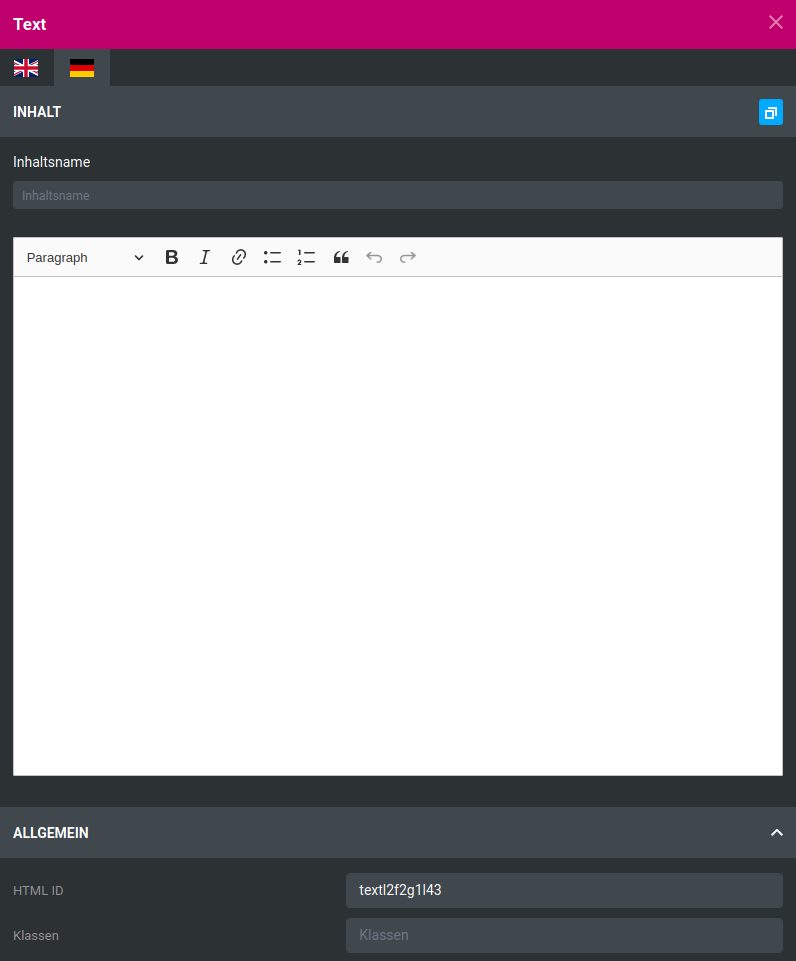
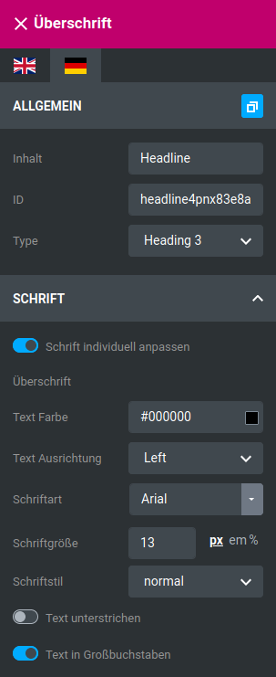
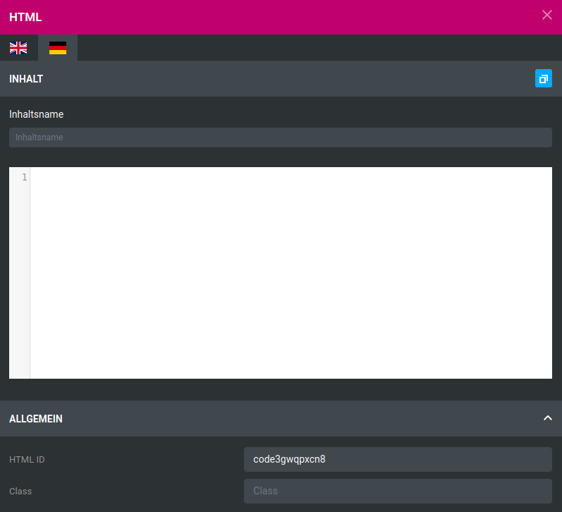
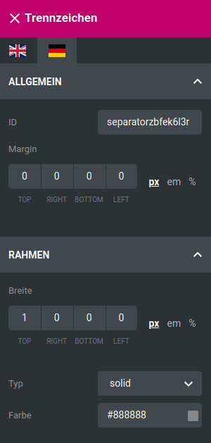
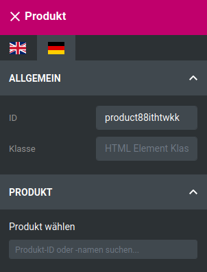
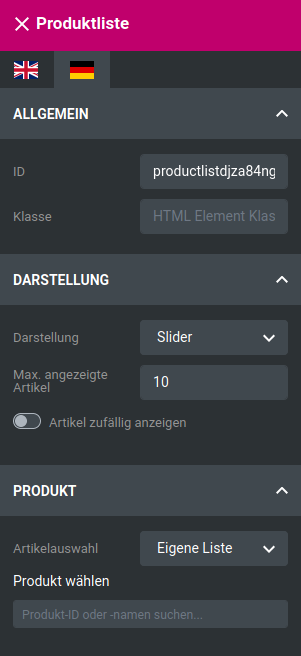

# Widgets {#styleedit4_themes_theme_bearbeiten_menues_widgets}

Widgets sind in vorgesehenen Bereichen frei platzierbare Inhalte. Derzeit gibt es die folgenden Widgets:

## Text { .section}

Text-Widgets erlauben das Platzieren von Texten. Über die Flaggen-Symbole kann die jeweilige Sprache ausgewählt werden die blaue Schaltfläche rechts oben erlaubt das Kopieren des aktuell angezeigten Textes in die Eingabefelder für die anderen Sprachen.

Der Inhaltsname legt den Namen des jeweiligen Textes fest, er wird auch im Content Manager verwendet.

Von links nach rechts stehen im Editor folgende Einstellungen zur Verfügung:

-   Paragraph/Heading: legt fest, ob die aktuell ausgewählte\(n\) Zeile\(n\) ein Absatz \(Paragraph\) oder eine Überschrift erster bis dritter Ordnung \(Heading 1 bis Heading 3\) ist bzw. sind.

    **Note:**

    Eine einzelne Zeile kann durch Setzen des Cursors ausgewählt werden. Mehrere Zeilen durch Markieren der Textstellen. Hierbei werden immer ganze Zeilen ausgewählt.

-   Bold \(fett\)
-   Italic \(kursiv\)
-   Link \(es wird ein Eingabefenster für die Linkadresse angezeigt\)

    **Note:**

    Die Einstellungen Bold, Italic und Linkwirken sich nur auf markierte Textstellen aus.

-   Unordered List \(ausgewählte Zeile\(n\) als Aufzählung mit Bullet Points festlegen\)
-   Ordered List \(ausgewählte Zeile\(n\) als Aufzählung mit arabischen Ziffern festlegen\)
-   Block Quote \(ausgewählte Zeile\(n\) als Zitat festlegen\)
-   Undo \(letzten Schritt rückgängig machen\)
-   Redo \(zuletzt rückgängig gemachten Schritt nochmals ausführen\)

Unter dem Editor wird die HTML ID ausgegeben. Sie wird zur eindeutigen Identifizierung des Inhalts innerhalb des HTML-Codes verwendet. Änderungen sind optional. Über das Feld Klassen erhält das Element auf HTML-Ebene eine sogenannte Klasse. Für mehrere Elemente mit der gleichen Klasse können z.B. über CSS-Code eigene Style-Einstellungen vorgenommen werden. Die Verwendung ist optional.

## Bild { .section}

|Feldname|Beschreibung|
|--------|------------|
|Bild|Auswahl der Bilddatei|
|Name|Name des Bildes|
|Link|Link, der beim Klick auf das Bild aufgerufen werden soll|
|Target|Wo soll der Link aufgerufen werden?|

|Feldname|Beschreibung|
|--------|------------|
|Breite|Breite des Bildes in der eingestellten Einheit|
|Höhe|Höhe des Bildes in der eingestellten Einheit|
|Bild responsive anpassen|soll das Bild responsiv dargestellt werden?|

**Note:**

Durch Klick auf px, em oder % kann die jeweilige Größeneinheit eingestellt werden

|Feldname|Beschreibung|
|--------|------------|
|ID|HTML-ID des Widgets, zur Auszeichnung des Elements im Quellcode|
|Klassen|HTML-Klasse des Widgets, zur Auszeichnung des Elements im Quellcode|

**Note:**

IDs und Klassen werden auf HTML-Ebene verwendet. Änderungen sind optional.

## Überschrift { .section}

Überschriften können frei platziert werden, ohne einem anderen Widget zugeordnet werden zu müssen.

|Feldname|Beschreibung|
|--------|------------|
|Inhalt|Text der Überschrift|
|ID|HTML-ID der Überschrift, Änderung optional|
|Type|Ordnung der Überschrift, Heading 1 bis Heading 6|

|Feldname|Beschreibung|
|--------|------------|
|Schrift individuell anpassen|Aktiviert die Schrift-Einstellungen der Überschrift|
|Text Farbe|Schriftfarbe der Überschrift|
|Text Ausrichtung|Ausrichtung der Überschrift \(Left: linksbündig, Center: zentriert, Right: rechtsbündig, Justify: Blocksatz, Initial: Standardwert, Inherit: Einstellung des übergeordneten Elements verwenden\)|
|Schriftart|Schriftart der Überschrift|
|Schriftgröße|Schriftgröße der Überschrift in der eingestellten Einheit|
|Schriftstil|Schriftstil der Überschrift \(normal, italic: kursive Darstellung entsprechend der Schriftart, oblique: kursive Darstellung auch ohne kursive Variante der Schriftart, initial: Standardwert, inherit: Einstellung des übergeordneten Elements\)|
|Text unterstrichen|Überschrift wird unterstrichen dargestellt|
|Text in Großbuchstaben|Überschrift wird in Großbuchstaben dargestellt|

**Note:**

Aktiviere die Einstellung Schrift individuell anpassen, um Einstellungen vornehmen zu können

**Note:**

Durch Klick auf px, em oder % kann die jeweilige Größeneinheit eingestellt werden

**Note:**

IDs und Klassen werden auf HTML-Ebene verwendet. Änderungen sind optional.

## Button { .section}

Buttons sind Schaltflächen, die mit einem Link versehen werden können.

|Feldname|Beschreibung|
|--------|------------|
|Inhalt|Beschriftung der Schaltfläche|
|Link|Link, der von der Schaltfläche aus aufgerufen werden soll|
|Target|Zielseite, in der der Link geöffnet werden soll|
|Klassen|HTML-Klasse der Schaltfläche|
|ID|HTML-ID der Schaltfläche|

**Note:**

IDs und Klassen werden auf HTML-Ebene verwendet. Änderungen sind optional.

Im Bereich Button Size wird die allgemeine Größe der Schaltfläche eingestellt. Unter Button Type kann die Schrift- und Hintergrundfarbe entsprechend der eingestellten Standardfarbschemata \(Default, Primary, Success, Info, Warning, Danger\) umgestellt werden.

## HTML { .section}

HTML-Widgets erlauben das Platzieren von HTML-Codes. Über die Flaggen-Symbole kann die jeweilige Sprache ausgewählt werden die blaue Schaltfläche rechts oben erlaubt das Kopieren des aktuell angezeigten Textes in die Eingabefelder für die anderen Sprachen.

Der Inhaltsname legt den Namen des jeweiligen HTML-Codes fest, er wird auch im Content Manager verwendet.

Unter dem Editor wird die HTML ID ausgegeben. Sie wird zur eindeutigen Identifizierung des Inhalts innerhalb des HTML-Codes verwendet. Änderungen sind optional. Über das Feld Klassen erhält das Element auf HTML-Ebene eine sogenannte Klasse. Für mehrere Elemente mit der gleichen Klasse können z.B. über CSS-Code eigene Style-Einstellungen vorgenommen werden. Die Verwendung ist optional.

## Trennzeichen { .section}

Das Trennzeichen-Widget platziert eine horizontale Trennlinie.

|Feldname|Beschreibung|
|--------|------------|
|ID|HTML-ID der Trennlinie|
|Margin|Äußerer Abstand zur Trennlinie in der eingestellten Einheit. Es können verschiedene Abstände \(TOP: darüber, RIGHT: rechts, BOTTOM: darunter, LEFT: links\) festgelegt werden|

|Feldname|Beschreibung|
|--------|------------|
|Breite|legt die Dicke der Grenzlinie in die verschiedenen Richtungen \(TOP: darüber, RIGHT: rechts, BOTTOM: darunter, LEFT: links\) in der eingestellten Einheit fest|
|Typ|Art der Trennlinie: solid \(duchgängig\), hidden \(unsichtbar\), dotted \(gepunktet\), dashed \(gestrichelt\), double \(doppelt\), groove \(gerillt\), ridge \(kammförmig\), inset \(eingefügt, hintergründig\), outset \(hervorgehoben, vordergründig\), initial \(Standardwert\), inherit \(Wert des übergeordneten Elements\)|
|Farbe|Farbe der Trennlinie|

**Note:**

Durch Klick auf px, em oder % kann die jeweilige Größeneinheit eingestellt werden

**Note:**

IDs und Klassen werden auf HTML-Ebene verwendet. Änderungen sind optional.

## Produkt { .section}

Über das Produkt-Widget kann eine einzelne Artikel-Kachel platziert werden.

Unter Allgemein können ID und Klasse der Artikelkachel festgelegt werden.

**Note:**

IDs und Klassen werden auf HTML-Ebene verwendet. Änderungen sind optional.

Unter Produkt kann der Artikel für die Artikelkachel ausgewählt werden. Im Feld Produkt wählen kann hierzu ein Suchbegriff eingegeben und der Artikel aus den in einem Dropdown angezeigten Werten ausgewählt werden.

## Produktliste { .section}

Über das Produktlisten-Widget kann eine Liste von Artikeln platziert werden.

Unter Allgemein können ID und Klasse der Artikelliste festgelegt werden.

**Note:**

IDs und Klassen werden auf HTML-Ebene verwendet. Änderungen sind optional.

|Feldname|Beschreibung|
|--------|------------|
|Darstellung|Soll die Produktliste als Liste oder als Slider angezeigt werden?|
|Max. angezeigte Artikel|begrenzt die Anzahl der maximal angezeigten Artikel|
|Artikel zufällig anzeigen|Reihenfolge der Artikel ist zufallsgeneriert|

Unter Produkt können die Artikel für die Liste ausgewählt werden. Über Artikelauswahl kann wahlweise eine der vordefinierten Auflistungen des Shops \(Kategorien, Angebote, empfohlene Artikel, Ankündigungen, neue Artikel\) oder eine eigene Liste ausgewählt werden.

Bei Kategorien und eigenen Listen kann über das Feld Kategorie wählen bzw. Produkt wählen nach Kategorien oder Artikeln gesucht und die Ergebnisse aus einem Dropdown ausgewählt werden.

Bei der eigenen Liste können Artikel durch Ziehen und Halten des Pfeilkreuz-Symbols nach oben oder unten verschoben werden, um deren Reihenfolge zu ändern. Über das X kann ein Artikel aus der eigenen Liste entfernt werden.

