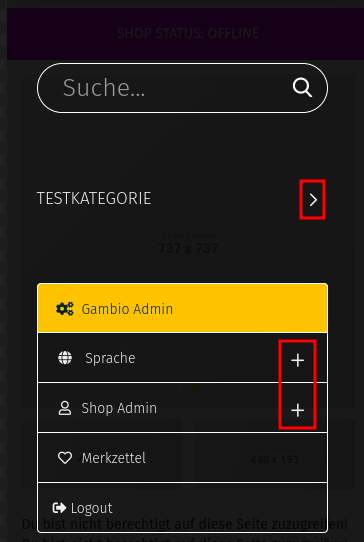
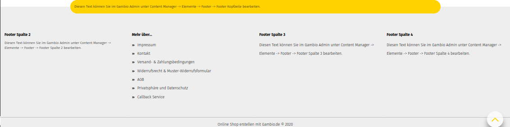
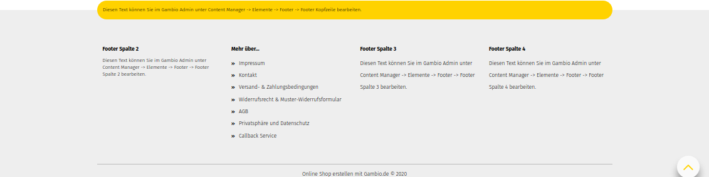
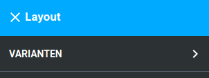
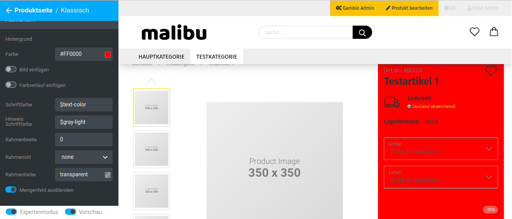

# Neu hinzugekommene Menüs 

Durch die weiterreichenden Einstellungsmöglichkeiten sind in den einzelnen Bereichen verschiedene Optionen hinzugekommen.

## Header 

**Note:**

Die Einstellungsmöglichkeiten für den Header ändern sich mit der Auswahl der Header-Variante.

Die nachfolgend für Header 1 gezeigten Aufteilungen und Einstellungen sind analog für die VarianteHeader 2 .

|Feldname|Beschreibung|
|--------|------------|
|Höhe|Höhe des inneren Bereichs der horizontalen Navigationsleiste, ist mit dem Platzhalter $navbar-height vorbelegt|
|Höhe Sticky|Höhe des inneren Bereichs der horizontalen Navigationsleiste im Sticky-Header, ist standardmäßig mit 0 vorbelegt|
|Übergänge|sanfteres Einblenden des Mega-Dropdown, wenn der Mauszeiger über eine Kategorie mit Unterkategorien bewegt wird|
|Höhe außen|Höhe des äußeren Bereichs der horizontalen Navigationsleiste|
|Abstand unten|Unterer Abstand zur Kategorieleiste, ist mit dem Platzhalter $line-height-computed vorbelegt|

**Note:**

Sticky bezeichnet die reduzierte Form des Headers, die verwendet wird, wenn mit fixierter Kopfzeile nach unten gescrollt wird.

|Feldname|Beschreibung|
|--------|------------|
|horizontaler Abstand|linker Abstand der Einträge der Sekundärnavigation, vorbelegt mit floor\(\($grid-gutter-width/2\)\)|
|vertikaler Abstand|Abstand oberhalb und unterhalb der Einträge für Hauptkategorien|
|Hintergrund|
|Farbe|Hintergrundfarbe der horizontalen Menüleiste \(ohne Content-Einträge\), vorbelegt mit transparent|
|Bild einfügen|Hintergrundbild der horizontalen Menüleiste \(ohne Content-Einträge\)|
|Farbverlauf einfügen|Farbverlauf für den Hintergrund der horizontalen Menüleiste \(ohne Content-Einträge\)|
|Hintergrund außen|Hintergrundfarbe, die in der Fortführung der horizontalen Menüleiste links und rechts angezeigt wird**Note:**

Die hier eingestellte Farbe verläuft auf der Breite der kompletten Kategorieleiste. Sie ist auch in der Mitte der Leiste zu sehen, wenn die Einstellung Farbe unter Hintergrund auf transparent gesetzt ist.

|
|Schriftfarbe|Schriftfarbe der Hauptkategorien \(ohne Unterkategorien und Content-Einträge\) in der horizontalen Menüleiste|
|Schriftfarbe Custom|Schriftfarbe der Content-Einträge in der horizontalen Menüleiste|
|Schriftfarbe Hover|Schriftfarbe der Hauptkategorien \(ohne Unterkategorien und Content-Einträge\) in der horizontalen Menüleiste, beim Hovern mit dem Mauszeiger, ohne dass Unterkategorien aufgeklappt werden, vorbelegt mit $brand-primary|
|Schriftfarbe Hover Custom|Schriftfarbe der Content-Einträge in der horizontalen Menüleiste, beim Hovern mit dem Mauszeiger|
|Schriftfarbe Aktiv|Schriftfarbe der Hauptkategorie in der horizontalen Menüleiste, die aktuell angezeigt wird|
|Schriftfarbe Aktiv Custom|Schriftfarbe der Content-Seite in der horizontalen Menüleiste, die aktuell angezeigt wird|
|Texttransformation|Ändert Groß- und Kleinschreibung der Beschriftung der Hauptkategorie in der horizontalen Menüleistenone: Text wird so ausgegeben, wie er im Shop als Kategoriename hinterlegt ist

uppercase: Text wird in Großbuchstaben ausgegeben

lowercase: Text wird in Kleinbuchstaben ausgegeben

capitalize: Jedes Wort beginnt mit einem Großbuchstaben

|
|Schriftgröße|Schriftgröße der Hauptkategorien in der horizontalen und vertikalen Menüleiste|
|Hintergrund Hover|Hintergrundfarbe der Hauptkategorien in der horlzontalen Menüleiste beim Hovern mit der Maus|
|Hintergrund Aktiv|Hintergrundfarbe der aktuell angezeigten Hauptkategorie in der horizontalen Kategorieleiste|
|Hintergrund Custom|Hintergrundfarbe der Content-Einträge in der horizontalen Menüleiste, vorbelegt mit $gx-brand-secondary|
|Hintergrund Hover Custom|Hintergrundfarbe der Content-Einträge in der horizontalen Menüleiste, beim Hovern mit der Maus, vorbelegt mit lighten\($gx-custom-bg-color, 10%\)|
|Hintergrund Aktiv Custom|Hintergrundfarbe des Content-Eintrags in der horizontalen Menüleiste, der aktuell angezeigt wird, vorbelegt mit lighten\($gx-custom-bg-color, 10%\)|

**Note:**

Hovern bzw. Mouseover bezeichnet das Platzieren des Mauszeigers über ein Element, ohne es anzuklicken

|Feldname|Beschreibung|
|--------|------------|
|Mobil-Menü Höhe|Höhe des mobilen Menüs|
|Höhe|Höhe der Menü-Einträge|
|Vertikaler Abstand|Abstand des Namens zur oberen Kante des Menüeintrags|
|Icons anzeigen|Icons im mobilen Menü anzeigen ja/nein

|

|Feldname|Beschreibung|
|--------|------------|
|Schriftgröße Überschriften|Schriftgröße der Einträge im Dropdown des Kategoriemenüs|
|Schriftfarbe|Schriftfarbe der Einträge im Dropdown des Kategoriemenüs, vorbelegt mit $text-color|
|Rahmenfarbe|Farbe der Rahmenelemente der Einträge im Dropdown des Kategoriemenüs|
|Block-Breite|Breite der Unterkategorie-Blöcke im Mega-Dropdown

|
|Anzahl Blöcke|Anzahl der nebeneinander angezeigten Blöcke im Mega-Dropdown|
|Tab-Verschiebung|innerer Abstand der einzelnen Menüeinträge, vorbelegt mit 2px|
|Hintergrund|
|Farbe|Hintergrundfarbe des Mega-Dropdowns|
|Bild einfügen|Hintergrundbild des Mega-Dropdowns|
|Farbverlauf einfügen|Verwenden eines Farbverlaufs für den Hintergrund des Mega-Dropdowns|
|Schriftfarbe Alle Anzeigen|Schriftfarbe des Buttons Alle Anzeigen, vorbelegt mit $text-color|
|Hintergrund Alle Anzeigen|
|Farbe|Hintergrundfarbe des Buttons Alle Anzeigen, vorbelegt mit $gray-lighter|
|Bild einfügen|Hintergrundbild des Buttons Alle Anzeigen|
|Farbverlauf einfügen|Farbverlauf als Hintergrundbild des Buttons Alle Anzeigen|

|Feldname|Beschreibung|
|--------|------------|
|Schriftfarbe|Schriftfarbe des vertikalen Kategoriemenüs, mit $text-color vorbelegt|
|Schriftfarbe Hover|Schriftfarbe des vertikalen Kategoriemenüs beim Hovern, mit $text-color vorbelegt|
|Schriftfarbe Aktiv|Schriftfarbe der aktuell angezeigten Kategorie im vertikalen Kategoriemenü|
|Schriftfarbe geöffnet|Schriftfartbe der aufgeklappten Kategorien im vertikalen Kategoriemenü, vorbelegt mit $text-color|
|Hintergrund|
|Farbe|Hintergrundfarbe des vertikalen Kategoriemenüs im vertikalen
                  Kategoriemenü")

|
|Bild einfügen|Hintergrundbild des vertikalen Kategoriemenüs|
|Farbverlauf einfügen|Farbverlauf als Hintergrund im vertikalen Kategoriemenü|
|Hintergrund Hover|
|Farbe|Hintergrundfarbe des Untermenüeintrags im vertikalen Kategoriemenü beim Hovern mit der Maus|
|Bild einfügen|Hintergrundbild des Menüeintrags im vertikalen Kategoriemenü beim Hovern mit der Maus|
|Farbverlauf einfügen|Farbverlauf als Hintergrund des Menüeintrags im vertikalen Kategoriemenü beim Hovern mit der Maus|
|Hintergrund Aktiv|
|Farbe|Hintergrundfarbe der aktuell angezeigten Kategorie im vertikalen Kategoriemenü, vorbelegt mit $brand-primary|
|Bild einfügen|Hintergrundbild der aktuell angezeigten Kategorie im vertikalen Kategoriemenü|
|Farbverlauf einfügen|Farbverlauf als Hintergrund der angezeigten Kategorie im vertikalen Kategoriemenü|
|Hintergrund geöffnet|
|Farbe|Hintergrundfarbe der aktuell aufgeklappten Hauptkategorie als Hintergrund
                  hat")

|
|Bild einfügen|Hintergrundbild der Hauptkategorien im vertikalen Kategoriemenü|
|Farbverlauf einfügen|Farbverlauf als Hintergrund der Hauptkategorien im vertikalen Kategoriemenü|

**Note:**

Hovern bzw. Mouseover bezeichnet das Platzieren des Mauszeigers über ein Element, ohne es anzuklicken

|Feldname|Beschreibung|
|--------|------------|
|Kategorie-Spalte ausblenden|blendet die Anzeige der Kategorien als zusätzlichen Bereich im Header ein bzw. aus")

|
|Höhe|Höhe der Kategoriespalte im Header|
|Höhe Sticky|Höhe der Kategoriespalte im Sticky Header|
|Warenkorb Vertikaler Abstand|Abstand der Kategorieeinträge nach oben und unten|
|Warenkorb Vertikaler Abstand Sticky|Abstand der Kategorieeinträge nach oben und unten im Sticky Header|
|Warenkorb Vertikaler äußerer Abstand|äußerer Abstand der Kategorieeinträge nach oben und unten|
|Warenkorb Vertikaler äußerer Abstand Sticky|äußerer Abstand der Kategorieeinträge nach oben und unten im Sticky Header|
|Grid-Spalten Klein|Anzahl der Grid-Spalten des Kategoriespalten-Bereichs für kleine Darstellung, typischerweise Tablet im Portrait/Hoch-Format|
|Grid-Spalten Medium|Anzahl der Grid-Spalten des Kategoriespalten-Bereichs für mittelgroße Darstellung, typischerweise Tablet im Landscape/Quer-Format|
|Grid-Spalten Groß|Anzahl der Grid-Spalten des Kategoriespalten-Bereichs für große Darstellung, typischerweise Desktop-Computer|

**Note:**

Sticky bezeichnet die reduzierte Form des Headers, die verwendet wird, wenn mit fixierter Kopfzeile nach unten gescrollt wird.

**Note:**

Die grafische Oberfläche des Shops wird in der Breite in 12 sogenannte Grid-Spalten aufgeteilt. Für jede Größe \(groß, medium, klein\) gibt es eine eigene Einstellung. Die Summe aller Einstellungen einer Größe, die nicht ausgeblendet werden, muss 12 ergeben. Weitere Informationen hierzu sind im Kapitel Grid-Spalten aufgeführt.

|Feldname|Beschreibung|
|--------|------------|
|Schriftgröße|Schriftgröße der Menüeinträge in der Sekundärnavigation, mit $font-size-small vorbelegt

|
|Höhe|Höhe der Einträge der Sekundärnavigation

|
|Höhe Sticky|Höhe der Einträge der Sekundärnavigation in der Sticky-Ansicht|
|Hintergrund|
|Farbe|Hintergrundfarbe der Sekundärnavigationsleiste|
|Bild einfügen|Hintergrundbild der Sekundärnavigationsleiste|
|Farbverlauf einfügen|Farbverlauf als Hintergrund der Sekundärnavigationsleiste|

**Note:**

Sticky bezeichnet die reduzierte Form des Headers, die verwendet wird, wenn mit fixierter Kopfzeile nach unten gescrollt wird.

|Feldname|Beschreibung|
|--------|------------|
|Schriftfarbe|Schriftfarbe der Menüeinträge in der Sekundärnavigation, abzüglich Gambio Admin-Button|
|Scriftfarbe Hover|Schriftfarbe der Menüeinträge in der Sekundärnavigation beim Hovern, abzüglich Gambio Admin-Button|
|Schriftfarbe Aktiv|Schriftfarbe der Menüeinträge in der Sekundärnavgiation, beim Ausklappen eines Dropdowns als
                  Schriftfarbe Aktiv")

|
|Hintergrund|
|Farbe|Hintergrundfarbe der Menüeinträge der Sekundärnavigation, abzüglich Gambio Admin-Button, mit transparent vorbelegt|
|Bild einfügen|Hintergrundbild der Menüeinträge der Sekundärnavigation|
|Farbverlauf einfügen|Farbverlauf als Hintergrund der Menüeinträge der Sekundärnavigation|
|Hintergrund Hover|
|Farbe|Hintergrundfarbe der Menüeinträge der Sekundärnavigation beim Hovern mit der Maus, abzüglich Gambio Admin-Button|
|Bild einfügen|Hintergrundbild der Menüeinträge der Sekundärnavigation beim Hovern mit der Maus|
|Farbverlauf einfügen|Farbverlauf als Hintergrund der Menüeinträge der Sekundärnavigation beim Hovern mit der Maus|
|Hintergrund Aktiv|
|Farbe|Hintergrundfarbe der Menüeinträge in der Sekundärnavgiation, beim Ausklappen eines Dropdowns als
                  Farbe für Hintergrund
                  Aktiv")

|
|Bild einfügen|Hintergrundbild der Menüeinträge in der Sekundärnavgiation, beim Ausklappen eines Dropdowns|
|Farbverlauf einfügen|Farbverlauf als Hintergrund der Menüeinträge der Sekundärnavigation beim Ausklappen eines Dropdowns|
|Link Abstand|innerer Abstand des Textes nach oben und unten bzw. links und rechts zum Rand des Buttons, vorbelegt mit 11px 15px|

**Note:**

Hovern bzw. Mouseover bezeichnet das Platzieren des Mauszeigers über ein Element, ohne es anzuklicken

|Feldname|Beschreibung|
|--------|------------|
|Sekundär-Spalte ausblenden|Blendet die Sekundär-Spalte zur Verwendung im Header aus, dies verringert die Anzahl der verwendeten Grid-Spalten.|
|Schriftgröße|Schriftgröße der verwendeten Icons, vorbelegt mit $font-size-small|
|Höhe|Höhe der Sekundär-Spalte|
|Höhe Sticky|Höhe der Sekundär-Spalte im Sticky-Header|
|Vertikaler Abstand|Abstand der einzelnen Icons nach oben und unten, vorbelegt mit 0|
|Vertikaler Abstand Sticky|Abstand der einzelnen Icons nach oben und unten im Sticky-Header, vorbelegt mit 0|
|Vertikaler äußerer Abstand|Äußerer Abstand der einzelnen Icons, vorbelegt mit 0|
|Vertikaler äußerer Abstand Sticky|Äußerer Abstand der einzelnen Icons im Sticky-Header, vorbelegt mit 0|
|Grid-Spalten Klein|Anzahl der Grid-Spalten des Sekundär-Spalten-Bereichs für kleine Darstellung, typischerweise Tablet im Portrait/Hoch-Format|
|Grid-Spalten Medium|Anzahl der Grid-Spalten des Sekundär-Spalten-Bereichs für mittelgroße Darstellung, typischerweise Tablet im Landscape/Quer-Format|
|Grid-Spalten Groß|Anzahl der Grid-Spalten des Sekundär-Spalten-Bereichs für große Darstellung, typischerweise Desktop-Computer|

**Note:**

Sticky bezeichnet die reduzierte Form des Headers, die verwendet wird, wenn mit fixierter Kopfzeile nach unten gescrollt wird.

**Note:**

Die grafische Oberfläche des Shops wird in der Breite in 12 sogenannte Grid-Spalten aufgeteilt. Für jede Größe \(groß, medium, klein\) gibt es eine eigene Einstellung. Die Summe aller Einstellungen einer Größe, die nicht ausgeblendet werden, muss 12 ergeben. Weitere Informationen hierzu sind im Kapitel Grid-Spalten aufgeführt.

|Feldname|Beschreibung|
|--------|------------|
|Schriftfarbe|Schriftfarbe der Icons in der Sekundär-Spalte|
|Scriftfarbe Hover|Schriftfarbe der Icons in der Sekundär-Spalte beim Hovern|
|Schriftfarbe Aktiv|Schriftfarbe der Icons in der Sekundär-Spalte, nach dem Anklicken|
|Hintergrund|
|Farbe|Hintergrundfarbe der Icons der Sekundär-Spalte, mit transparent vorbelegt|
|Bild einfügen|Hintergrundbild der Icons der Sekundär-Spalte|
|Farbverlauf einfügen|Farbverlauf als Hintergrund der Icons der Sekundär-Spalte|
|Hintergrund Hover|
|Farbe|Hintergrundfarbe der Icons der Sekundär-Spalte beim Hovern mit der Maus|
|Bild einfügen|Hintergrundbild der Icons der Sekundär-Spalte beim Hovern mit der Maus|
|Farbverlauf einfügen|Farbverlauf als Hintergrund der Icons der Sekundär-Spalte beim Hovern mit der Maus|
|Hintergrund Aktiv|
|Farbe|Hintergrundfarbe der Icons in der Sekundär-Spalte, beim Anklicken|
|Bild einfügen|Hintergrundbild der Icons in der Sekundär-Spalte, beim Anklicken|
|Farbverlauf einfügen|Farbverlauf als Hintergrund der Icons der Sekundär-Spalte beim Anklicken|
|Link Abstand|innerer Abstand des Icons nach oben und unten bzw. links und rechts zum Rand des Buttons, vorbelegt mit 25px 10px|

**Note:**

Hovern bzw. Mouseover bezeichnet das Platzieren des Mauszeigers über ein Element, ohne es anzuklicken

## Footer 

|Feldname|Beschreibung|
|--------|------------|
|Footer wrappen|Richtet die Footer-Spalten an den äußeren Abmessungen des Footer Headers aus|

## Layout 

Unter Bereiche / Layout / Varianten kann das Layout des Themes umgestellt werden. Es stehen die folgenden Varianten zur Verfügung:

-   Full Screen
-   Boxed
-   Hero

## Teaser-Slider 

Es stehen folgende Varianten für den Teaser-Slider zur Auswahl:

-   Klassisch
-   Boxed
-   Full width

## Produktseite 

Es können die folgenden Varianten für die Produktseite gewählt werden:

-   Klassisch
-   Links ausrichten

**Note:**

DIe Einstellungen für die Produktseite ändern sich mit der Auswahl der Produktseiten-Variante

|Feldname|Beschreibung|
|--------|------------|
|Hintergrund|
|Farbe|Hintergrundfarbe der Produkt-Detailbox / Preisbox

|
|Bild einfügen|Hintergrundbild der Produkt-Detailbox / Preisbox

|
|Farbverlauf einfügen|Farbverlauf als Hintergrund der Produkt-Detailbox / Preisbox|
|Schriftfarbe|Schriftfarbe der Produkt-Detailbox / Preisbox, vorbelegt mit $text-color|
|Hinweis Schriftfarbe|Schriftfarbe des Preis-, Steuer- und Versandkostenhinweises, vorbelegt mit $gray-light|
|Rahmebreite|Breite des Rahmens um die Produkt-Detailbox / Preisbox, vorbelegt mit 0|
|Rahmenstil|Stil des Rahmens um die Produkt-Detailbox / Preisbox. Mögliche Auswahlwerte: solid \(duchgängig\), hidden \(unsichtbar\), dotted \(gepunktet\), dashed \(gestrichelt\), double \(doppelt\), groove \(gerillt\), ridge \(kammförmig\), inset \(eingefügt, hintergründig\), outset \(hervorgehoben, vordergründig\), initial \(Standardwert\), inherit \(Wert des übergeordneten Elements\), vorbelegt mit none|
|Rahmenfarbe|Farbe des Rahmens um die Produkt-Detailbox / Preisbox, vorbelegt mit transparent|
|Mengenfeld ausblenden|Ausblenden des Mengeneingabefelds|

|Feldname|Beschreibung|
|--------|------------|
|Hintergrund|
|Farbe|Hintergrundfarbe der Produkt-Detailbox / Preisbox|
|Bild einfügen|Hintergrundbild der Produkt-Detailbox / Preisbox|
|Farbverlauf einfügen|Farbverlauf als Hintergrund der Produkt-Detailbox / Preisbox|
|Schriftfarbe|Schriftfarbe in der Produkt-Detailbox / Preisbox, vorbelegt mit $text-color|
|Hinweis Schriftfarbe|Schriftfarbe für Preis-, Steuer- und Versandkostenhinweis, vorbelegt mit $gray-light|
|Rahmenbreite|Breite des Rahmens um die Produkt-Detailbox / Preisbox, vorbelegt mit 0|
|Rahmenstil|Stil des Rahmens um die Produkt-Detailbox / Preisbox, vorbelegt mit none|
|Rahmenfarbe|Farbe des Rahmens um die Produkt-Detailbox / Preisbox, vorbelegt mit transparent|
|Button Schriftfarbe|Schriftfarbe der Buttons unterhalb des Warenkorb-Buttons|
|Button Schriftfarbe Hover|Schriftfarbe der Buttons unterhalb des Warenkorb-Buttons beim Mouseover/Hover, vorbelegt mit darken\($gx-product-info-button-color, 10%\)|
|Button Hintergrundfarbe|Hintergrundfarbe der Buttons unterhalb des Warenkorb-Buttons, vorbelegt mit transparent|
|Button Hintergrundfarbe Hover|Hintergrundfarbe der Buttons unterhalb des Warenkorb-Buttons beim Mouseover/Hover, vorbelegt mit transparent|
|Button Rahmenfarbe|Rahmenfarbe der Buttons unterhalb des Warenkorb-Buttons|
|Button Rahmenfarbe Hover|Rahmenfarbe der Buttons unterhalb des Warenkorb-Buttons beim Mouseover/Hover|
|Preisbox mitscrollen|soll die Produktdetailbox mitscrollen?|

**Note:**

Hovern bzw. Mouseover bezeichnet das Platzieren des Mauszeigers über ein Element, ohne es anzuklicken

