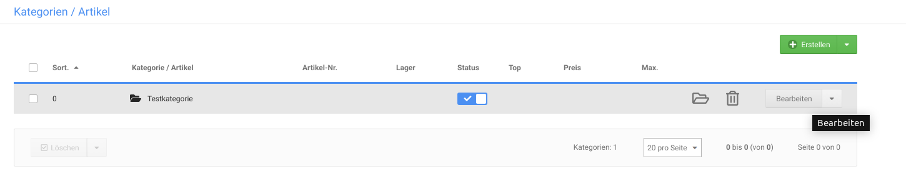

# Teaser-Slider zuweisen 

Teaser-Slider kannst du einer oder mehreren Kategorien, Artikeln und Content-Seiten sowie der Startseite zuweisen.

## Startseiten-Slider festlegen { .section}

Den Startseiten-Slider kannst du im Gambio Admin deines Shops unter Darstellung \> Teaser‑Slider festlegen. Setze hierzu in der Spalte Startseite den Haken für den gewüschten Teaser-Slider.

## Content-Slider festlegen { .section}

")

Den Teaser-Slider für einen Content kannst du im Gambio Admin unter Darstellung \> Content‑Manager festlegen.

1.  Klicke bei dem Content auf das Bleistift-Symbol \(bearbeiten\), zu dem du einen Slider hinterlegen möchtest
2.  Wähle aus der Liste Content Teaser-Slider den Teaser-Slider für diesen Content aus
3.  Klicke am Ende der Eingabemaske auf Speichern oder Aktualisieren, um den Teaser-Slider dem Content zuzuweisen

## Kategorie-Slider festlegen { .section}

Den Teaser-Slider für eine Kategorie kannst du im Gambio Admin unter Artikel \> Artikel/Kategorien festlegen.

1.  Wähle aus der Liste die gewünschte Kategorie aus
2.  Klicke in der Dropdown-Schaltfläche auf Bearbeiten
3.  Wähle aus der Liste Kategorie Teaser-Slider den Teaser-Slider für diese Kategorie aus
4.  Klicke rechts neben der Liste Kategorie Teaser-Slider auf Speichern, um den Teaser-Slider der Kategorie zuzuweisen

## Artikel-Slider festlegen { .section}

Den Teaser-Slider für einen Artikel kannst du im Gambio Admin unter Artikel \> Artikel/Kategorien festlegen.

1.  Wähle aus der Liste den gewünschten Artikel aus
2.  Klicke wahlweise auf das Bleistift-Icon oder über die Dropdown-Schaltfläche auf Bearbeiten
3.  Wähle aus der Liste Produkt Teaser-Slider den Teaser-Slider für die Detailseite dieses Artikels aus
4.  Klicke am Ende der Seite auf Speichern oder Aktualisieren, um den Teaser‑Slider dem Artikel zuzuweisen

