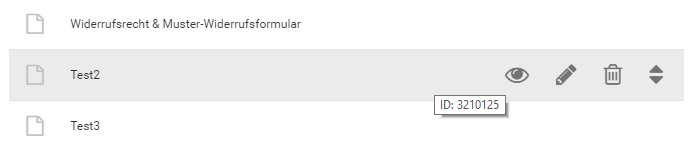
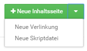
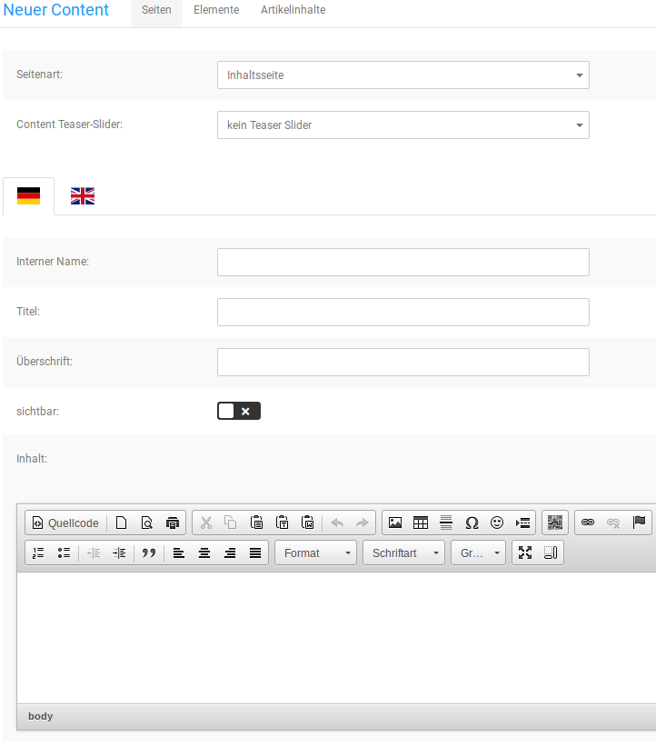

# Seiten 

Die hier angelegten Inhalte stellen eigenständige Seiten dar, die alleine für sich aufgerufen werden können. Der Shop bringt hier eine ganze Auswahl vorgegebener Seiten mit, die ihren eigenen Verwendungszweck haben, z.B. AGB, Impressum, Widerrufsrecht & Muster- Widerrufsformular und dergleichen mehr.

CAUTION:

Der eingetragene Text im Content Widerrufsrecht & Muster-Widerrufsformular darf nicht angepasst werden, da hierüber einzelne Elemente für die Widerrufsbelehrung zusammengeführt werden \(siehe Kapitel Elemente, Verbraucherrechterichtlinie\).

## Aktionen zu einem Content 

Um die möglichen Aktionen für einen Content anzuzeigen, bewege zunächst den Mauszeiger in die jeweilige Zeile des Contents. Es werden mehrere Symbole angezeigt, diese sind von links nach rechts: Vorschau, Bearbeiten, Löschen, Verschieben. Klicke das jeweilige Symbol an, um eine Aktion auszuführen.

**Note:** Bei vordefinierten Contents wird kein Löschen-Symbol angezeigt. Diese Contents können nicht entfernt werden, da der Shop diese benötigt.

**Vorschau aufrufen**

Bewege den Mauszeiger über das Augensymbol des gewünschten Contents und klicke mit der linken Maustaste darauf, um die Vorschau aufzurufen. Auf diese Weise kannst du einen Content betrachten, ohne die komplette Eingabemaske aufrufen zu müssen \(siehe Content bearbeiten\).

**Content bearbeiten**

Bewege den Mauszeiger über das Bleistift-Symbol des gewünschten Contents und klicke mit der linken Maustaste darauf, um diesen zu bearbeiten. Es öffnet sich die Eingabemaske des Contents, über die du die Änderungen vornehmen kannst \(siehe Eingabemaske\).

**Content löschen**

Bewege den Mauszeiger über das Mülltonnen-Symbol des zu löschenden Contents und klicke mit der linken Maustaste darauf, um diesen zu löschen. Es wird eine Sicherheitsabfrage angezeigt, in der Name und ID des Contents aufgeführt sind. Wenn du sicher bist dass der Content entfernt werden soll, klicke auf Löschen. Anderenfalls klicke auf Abbrechen und der Dialog wird wieder geschlossen, ohne dass der Content gelöscht wird.

**Content verschieben**

Bewege den Mauszeiger über das Pfeilsymbol des gewünschten Contents, klicke und halte die linke Maustaste, um diesen in einen anderen Bereich zu verschieben. Ziehe so den Content nach oben oder unten in den gewünschten Bereich und lasse dort die linke Maustaste wieder los. Jeder Bereich hat seine eigene Funktion \(siehe Bereiche des Abschnitts Seiten\).

## Bereiche des Abschnitts Seiten 

Über die Bereiche kann festgelegt werden in welchem Teil des Shops ein Content angezeigt wird \(siehe Kapitel Bereiche des Shopsystems\). Für Inhaltsseiten stehen die folgenden Bereiche zur Verfügung:

-   Hauptkategorien - der Content wird als Eintrag in der horizontalen Menüleiste angezeigt
-   Sekundärnavigation - der Content wird als Eintrag in der Sekundärnavigation angezeigt
-   Infoseiten - der Content wird als Link in der ersten Spalte des Footers \(Mehr über\) angezeigt
-   Weitere - der Content wird als Link in der Box Informationen angezeigt

## Anlegen eines Contents 

Über die grünen Schaltflächen kann ein neuer Content angelegt werden, der Content wird dem Bereich hinzugefügt, neben dem die Schaltfläche angezeigt wird \(siehe Bereiche des Abschnitts Seiten\) Verwende die Dropdown-Funktion um die Art des Contents auszuwählen, den du anlegen möchtest. Es steht die folgende Auswahl zur Verfügung:

-   Neue Inhaltsseite: eine normale Informationsseite, die Texte, Bilder, Tabellen und ähnliches enthalten kann
-   Neue Verlinkung: der Content wird als Link auf eine andere Seite verwendet. Dies kann sowohl eine andere Seite des Shops als auch eine externe Webseite sein
-   Neue Skriptdatei: der Content enthält z.B. eine HTML- oder TXT-Datei, welche als Inhalt verwendet wird

**Note:** Es können aus Sicherheitsgründen keine Skriptdateien mit ausführbarem Programmcode über den Dateimanager hochgeladen werden.

## Eingabemaske 

 

Die Eingabemaske, welche beim Anlegen oder Bearbeiten eines Contents angezeigt wird, unterscheidet sich je nach der gewählten Seitenart. Bei einer Inhaltsseite steht die Eingabe über den CK-Editor unter Inhalt im Vordergrund, während bei einer Verlinkung die eingetragene URL ausschlaggebend ist. Nachfolgend führen wir die verfügbaren Felder auf:

**Inhaltsseite**

|Feldname|Beschreibung|
|--------|------------|
|Seitenart|Art des Contents \(Inhaltsseite, Verlinkung, Skriptdatei\)|
|Content Teaser-Slider|Auswahl für Teaser-Slider, der auf der Content-Seite angezeigt wird|
|Sprachauswahl|klicke auf die jeweilige Landesflagge, um den Content für die gewünschte Sprache zu bearbeiten|
|Interner Name|Name der Seite, der im Content Manager angezeigt wird. Kann für vordefinierte Contents nicht geändert werden.|
|Name|Name der Seite, unter diesem Namen kann die Content-Seite im Shop aufgerufen werden|
|Überschrift|Überschrift der Seite, im Content wird diese Überschrift verwendet|
|sichtbar|ist die Einstellung aktiviert \(Häkchen-Symbol vor blauem Hintergrund\) kann die Seite aufgerufen werden|
|Inhalt|Inhalt der Seite, zur Eingabe wird standardmäßig der CK-Editor verwendet \(siehe Kapitel CK-Editor\)|
|Als Download|Datei, die zu diesem Content heruntergeladen werden kann \(für spezielle Anwendungsfälle, z.B. für das Widerrufsrecht\).|
|Meta Title|Meta-Titel der Seite, wird für die Anzeige im Browser-Tab und Suchmaschinen verwendet|
|Meta Keywords|Schlagwörter unter denen Suchmaschinen diese Seite finden sollen, Eingabe mit Komma getrennt, ohne Leerzeichen|
|Meta Description|freier Text zur Beschreibung der Seite, zur Verwendung von Suchmaschinen|
|URL Keywords|Teil-URL unter der die Seite im Shop aufgerufen werden kann, wird automatisch vergeben, muss mindestens 3 Zeichen lang sein|
|URL Rewrite|Feld zur Eingabe einer alternativen URL, siehe Kapitel URL Rewrite|
|In die Sitemap aufnehmen|Soll die Seite in die Sitemap \(für Suchmaschinen\) aufgenommen werden?|
|Priorität in der Sitemap|wie wichtig ist die Seite im Shop, Angabe von 0.0 \(weniger wichtig\) bis 1.0 \(sehr wichtig\)|
|Änderungsgfrequenz in der Sitemap|Vorgabe für Suchmaschinen in welchem Zeitintervall diese Seite auf Aktualisierungen geprüft werden sollte \(Wunschvorgabe, das tatsächliche Intervall liegt im Ermessen des Suchmaschinenbetreibers\)|
|Eintrag in robots. txt \(disallow\)|soll die Seite in der Robots-Datei für Suchmaschinen gesperrt werden?|
|Bild für soziale Medien \(og:image\)|Bild für soziale Medien, wird mit einem Open Graph Meta-Tag eingebunden|

**Verlinkung**

|Feldname|Beschreibung|
|--------|------------|
|Seitenart|Art des Contents \(Inhaltsseite, Verlinkung, Skriptdatei\)|
|Sprachauswahl|klicke auf die jeweilige Landesflagge, um den Content für die gewünschte Sprache zu bearbeiten|
|Interner Name|Name der Seite, der im Content Manager angezeigt wird. Kann für vordefinierte Contents nicht geändert werden.|
|Titel|Name der Seite, dieser Text wird im Shop als Link verwendet|
|Linkadresse|URL der aufzurufenden Seite, bei externen Seiten muss die komplette URL inklusive führenden http:// bzw. https:// angegeben werden, bei shopeigenen Seiten reicht die Angabe der Teil-URL \(z.B. /hauptkategorie/unterkategorie/artikel.html\)|
|sichtbar|ist die Einstellung aktiviert \(Häkchen-Symbol vor blauem Hintergrund\) kann die Seite aufgerufen werden|
|In neuem Fenster öffnen|ist der Haken gesetzt, wird der Link in einem neuen Tab bzw. neuem Fenster \(je nach Browser-Einstellung\) geöffnet, sinnvoll bei externen Seiten|

**Note:** Ist ein Unterordner Bestandteil deiner Shop- Adresse, z.B.

www.beispiel.de/shop

muss bei einem internen Link ebenfalls der Unterordner

/shop/

mit angegeben werden.

**Skriptdatei**

|Feldname|Beschreibung|
|--------|------------|
|Seitenart|Art des Contents \(Inhaltsseite, Verlinkung, Skriptdatei\)|
|Content Teaser-Slider|Auswahl für Teaser-Slider, der auf der Content-Seite angezeigt wird|
|Sprachauswahl|klicke auf die jeweilige Landesflagge, um den Content für die gewünschte Sprache zu bearbeiten|
|Interner Name:|Name der Seite, der im Content Manager angezeigt wird. Kann für vordefinierte Contents nicht geändert werden.|
|Titel|Name der Seite, unter diesem Namen kann die Content-Seite im Shop aufgerufen werden|
|sichtbar|ist die Einstellung aktiviert \(Häkchen-Symbol vor blauem Hintergrund\) kann die Seite aufgerufen werden|
|Inhalt|Inhalt der Seite, zusätzlich oder ersatzweise zum Skript, zur Eingabe wird standardmäßig der CK-Editor verwendet \(siehe Kapitel CK-Editor\)|
|Datei wählen|ruft den Dateimanager auf, über den die Datei hochgeladen oder ausgewählt werden kann|
|Als Download|Datei, die zu diesem Content heruntergeladen werden kann \(für spezielle Anwendungsfälle, z.B. für das Widerrufsrecht\).|
|Meta Title|Meta-Titel der Seite, wird für die Anzeige im Browser- Tab und Suchmaschinen verwendet|
|Meta Keywords|Schlagwörter unter denen Suchmaschinen diese Seite finden sollen, Eingabe mit Komma getrennt, ohne Leerzeichen|
|Meta Description|freier Text zur Beschreibung der Seite, zur Verwendung von Suchmaschinen|
|URL Keywords|Teil-URL unter der die Seite im Shop aufgerufen werden kann, wird automatisch vergeben, muss mindestens 3 Zeichen lang sein|
|URL Rewrite|Feld zur Eingabe einer alternativen URL, siehe Kapitel URL Rewrite|
|In die Sitemap aufnehmen|Soll die Seite in die Sitemap \(für Suchmaschinen\) aufgenommen werden?|
|Priorität in der Sitemap|wie wichtig ist die Seite im Shop, Angabe von 0.0 \(weniger wichtig\) bis 1.0 \(sehr wichtig\)|
|Änderungsgfrequenz in der Sitemap|Vorgabe für Suchmaschinen in welchem Zeitintervall diese Seite auf Aktualisierungen geprüft werden sollte \(Wunschvorgabe, das tatsächliche Intervall liegt im Ermessen des Suchmaschinenbetreibers\)|
|Eintrag in robots. txt \(disallow\)|soll die Seite in der Robots-Datei für Suchmaschinen gesperrt werden?|
|Bild für soziale Medien \(og:image\)|Bild für soziale Medien, wird mit einem Opern Graph Meta-Tag eingebunden|

Nimm die Eintragungen nach Bedarf vor. Mit einem Klick auf Speichern, speicherst du die Änderungen ab und verlässt die Eingabemaske. Über Aktualisieren werden die Änderungen gespeichert, ohne jedoch die Eingabemaske zu verlassen. Mit Zurück verlässt du die Eingabemaske, die zuletzt gemachten Änderungen werden verworfen.

