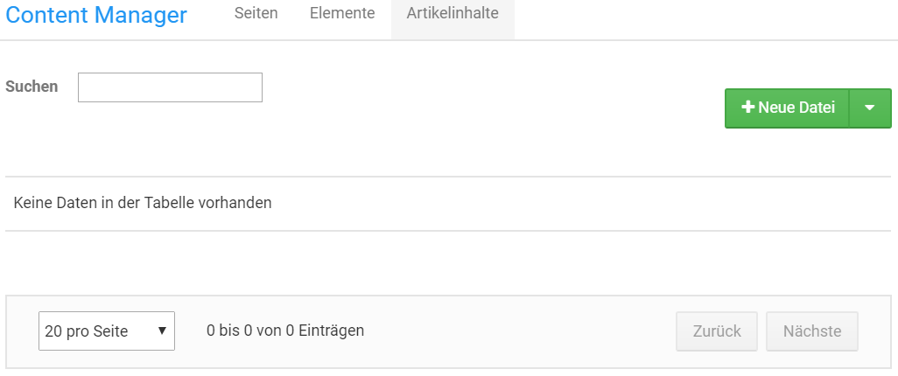
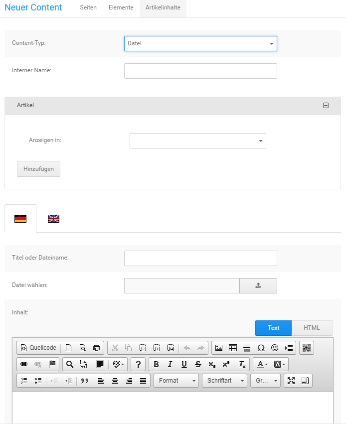
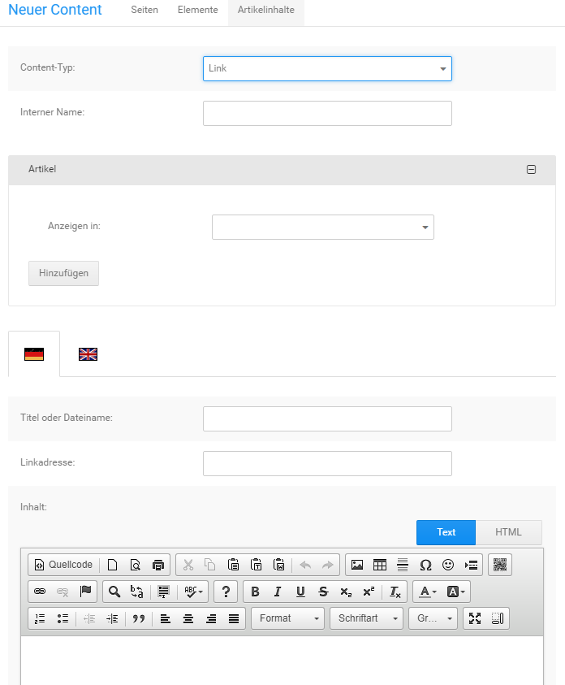
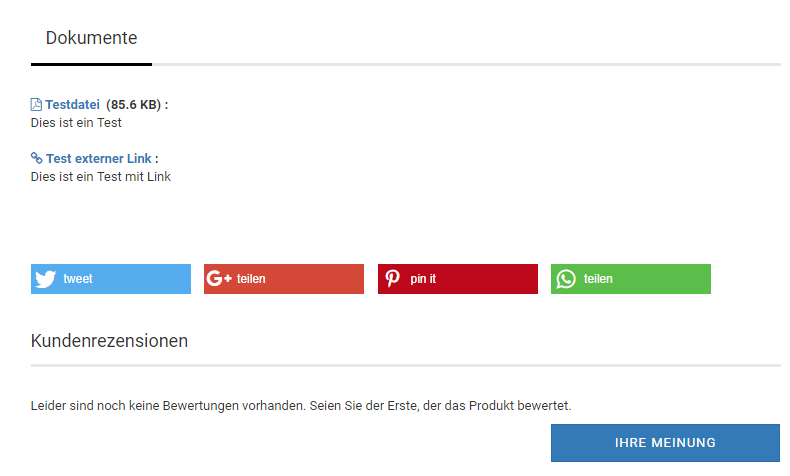

# Artikelinhalte 

Artikelinhalte, auch Artikelcontents genannt, können einem Artikel als zusätzlicher Download zugeordnet werden. Dies eignet sich beispielsweise dazu zu einem Produkt eine PDF-Anleitung zum Download anbieten zu können.

**Note:** Im Gegensatz zu Download-Artikeln ist das Herunterladen dieser Dateien immer möglich. Der Artikel muss hierzu nicht bestellt werden.

## Aktionen zu einem Artikelinhalt { .section}

Um die möglichen Aktionen für einen Artikelcontent anzuzeigen, bewege zunächst den Mauszeiger in die jeweilige Zeile des Contents. Es werden mehrere Symbole angezeigt, diese sind von links nach rechts: Bearbeiten, Löschen. Klicke das jeweilige Symbol an, um eine Aktion auszuführen.

**Content bearbeiten**

Bewege den Mauszeiger über das Bleistift-Symbol des gewünschten Contents und klicke mit der linken Maustaste darauf, um diesen zu bearbeiten. Es öffnet sich die Eingabemaske des Contents, über die du die Änderungen vornehmen kannst \(siehe Eingabemaske\).

**Content löschen**

Bewege den Mauszeiger über das Mülltonnen-Symbol des zu löschenden Contents und klicke mit der linken Maustaste darauf, um diesen zu löschen. Es wird eine Sicherheitsabfrage angezeigt, in der Name und ID des Contents aufgeführt sind. Wenn du sicher bist dass der Content entfernt werden soll, klicke auf Löschen. Anderenfalls klicke auf Abbrechen und der Dialog wird wieder geschlossen, ohne dass der Content gelöscht wird.

## Anlegen eines Artikelcontents { .section}

Über die grüne Schaltfläche kann ein neuer Artikelcontent angelegt werden. Verwende die Dropdown-Funktion um die Art des Contents auszuwählen, den du anlegen möchtest. Es steht die folgende Auswahl zur Verfügung:

-   Neue Datei: der Artikelcontent enthält eine Datei, die auf dem FTP-Server abgelegt wird
-   Neuer Link: der Artikelcontent enthält einen Link auf das gewünschte Ziel

**Note:** Es können aus Sicherheitsgründen keine Skriptdateien mit ausführbarem Programmcode über den Dateimanager hochgeladen werden.

## Eingabemaske { .section}

**Datei**

|Feldname|Beschreibung|
|--------|------------|
|Content-Typ|Art des Artikelcontents \(Datei, Link\)|
|Interner Name|Name des Artikelcontents im Content Manager|
|Anzeigen in|Auswahl der Artikel dem der Artikelcontent zugeordnet werden soll|
|Sprachauswahl|klicke auf die jeweilige Landesflagge, um den Content für die jeweilige Sprache zu bearbeiten|
|Titel oder Dateiname|Text der als Link zur Datei im Artikel angezeigt wird|
|Datei wählen|Aufruf des Dateimanagers um die Datei auszuwählen|
|Inhalt|freier Text zur Beschreibung der Datei|

**Link**

|Feldname|Beschreibung|
|--------|------------|
|Content-Typ|Art des Artikelcontents \(Datei, Link\)|
|Interner Name|Name des Artikelcontents im Content Manager|
|Anzeigen in|Auswahl der Artikel dem der Artikelcontent zugeordnet werden soll|
|Sprachauswahl|klicke auf die jeweilige Landesflagge, um den Content für die jeweilige Sprache zu bearbeiten|
|Titel oder Dateiname|Text der als Link zur angegebenen URL im Artikel angezeigt wird|
|Linkadresse|URL zum gewünschten Ziel des Artikelcontents|
|Inhalt|freier Text zur Beschreibung des verlinkten Inhalts|

Wähle im Bereich Artikel den gewünschten Artikel aus, um den Artikelcontent zuzuordnen. Über Hinzufügen kann die Auswahl für einen weiteren Artikel ergänzt werden. Über einen Klick auf das Mülltonnen-Symbol kann eine überzählige Auswahl wieder entfernt werden.

Nimm die Eintragungen nach Bedarf vor. Mit einem Klick auf Speichern speicherst du die Änderungen ab und verlässt die Eingabemaske. Über Aktualisieren werden die Änderungen gespeichert, ohne jedoch die Eingabemaske zu verlassen. Mit Zurück verlässt du die Eingabemaske, die zuletzt gemachten Änderungen werden verworfen.

