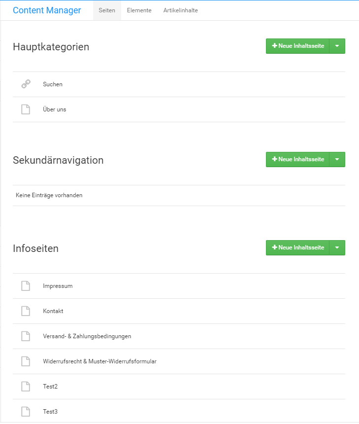

# Content Manager 

Im Bereich Darstellung des Gambio Admins findest du den Eintrag Content Manager, dort kannst du Informationsseiten für deinen Shop anlegen und bestehende Informationsseiten bearbeiten. Der Content Manager ist in drei Abschnitte aufgeteilt, die über einen Klick auf den jeweiligen Reiter ausgewählt werden können:

-   Seiten
-   Elemente
-   Artikelinhalte

-   **[Seiten](10_6_1_Seiten.md)**  

-   **[Elemente](10_6_2_Elemente.md)**  

-   **[Artikelinhalte](10_6_3_Artikelinhalte.md)**  

