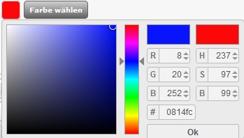

# Urlaubsschaltung {#shop_online_offline_urlaubsschaltung}

Die Nachricht der Urlaubsschaltung kann wahlweise in einer sogenannten TopBar erfolgen, hierbei wird der Hinweis in einer Leiste am oberen Rand des Shopfensters angezeigt, oder in einem Popup-Fenster. Klicke jeweils auf den Reiter Top-Bar bzw. Pop-Up, um die jeweilige Einstellung vorzunehmen.

Für beide Varianten kann je ein individueller Text eingerichtet werden, verwende hierfür bitte die Eingabefenster TopBar Inhalt bzw. Popup Inhalt. Über die Schalter Status TopBar und Status Popup kann die jeweilige Meldung an- bzw. abgeschaltet werden:

✔ Urlaubsschaltung aktiviert

✖ Urlaubsschaltung deaktiviert

Für die TopBar kann zudem noch die Hintergrundfarbe und der Anzeigemodus festgelegt werden.

Um die Farbe zu wählen, klicke bitte auf die Schaltfläche Farbe wählen. Es öffnet sich ein Auswahlfenster, in dem die Farbe entweder anhand des genauen Farbcodes eingegeben oder mit Hilfe eines Vorschaufensters ausgewählt wird. Klicke zum Bestätigen der Farbe bitte auf OK.

Über die Landesflaggen kann für jede Sprache ein individueller Inhalt angelegt werden. Sobald du die Einstellung für den jeweiligen Status vorgenommen hast, klicke bitte auf Speichern, damit diese wirksam wird.

