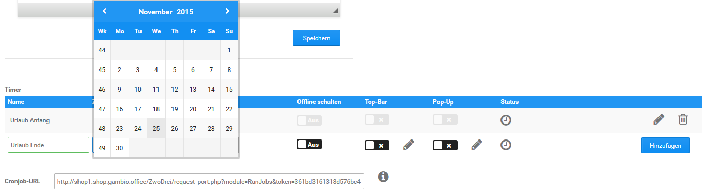

# Zeitgesteuerter Statuswechsel {#shop_online_offline_zeitgesteuerter_statuswechsel}

Sowohl der Shopstatus \(online/offline\) als auch die einzelnen Varianten der Urlaubsschaltung können zeitgesteuert geändert werden. Hierzu ist bei deinem Hosting-Anbieter die Einrichtung eines sogenannten Cronjobs notwendig. Die vorgesehene URL zur Einrichtung dieses Cronjobs kannst du aus dem Feld Cronjob-URL am unteren Ende der Seite herauskopieren.

Um einen zeitgesteuerten Vorgang festzulegen trage bitte in das Eingabefeld Name eine entsprechende Bezeichung ein. In der Spalte Zeit kannst du den genauen Zeitpunkt einstellen, zu dem der Vorgang ausgelöst werden soll.

Welche Aktion durchgeführt werden soll, kann über die Checkboxen in den Spalten Offline schalten, Top-Bar und Pop-Up festgelegt werden. Setze hier jeweils die Einstellung, um die Funktion zu aktivieren bzw. entferne sie, um die Funktion wieder zu deaktivieren. Über das Bleistift-Symbol wird für den automatisierten Vorgang jeweils ein eigener Text festgelegt. Mit Klick auf Hinzufügen wird der Vorgang angelegt.

**Note:** Lieferstatus und Artikelstatus können ebenfalls zeitgesteuert angepasst werden. Weitere Informationen hierzu findest du im Kapitel Timer.

Über das Bleistift-Symbol kann ein bestehender Vorgang bearbeitet werden. Nimm die gewünschten Änderungen vor und klicke auf Speichern, um diese zu übernehmen. Mit Klick auf Abbrechen gelangst du zurück, ohne die Änderungen zu speichern.

Mit einem Klick auf das Mülltonen-Symbol kann ein bestehender Vorgang gelöscht werden.

In der Zeile Status kann der jeweilige Status eines angelegten Vorgangs eingesehen werden. Bewege hierzu den Mauszeiger über das angezeigte Symbol, es wird eine entsprechende Meldung angezeigt.

