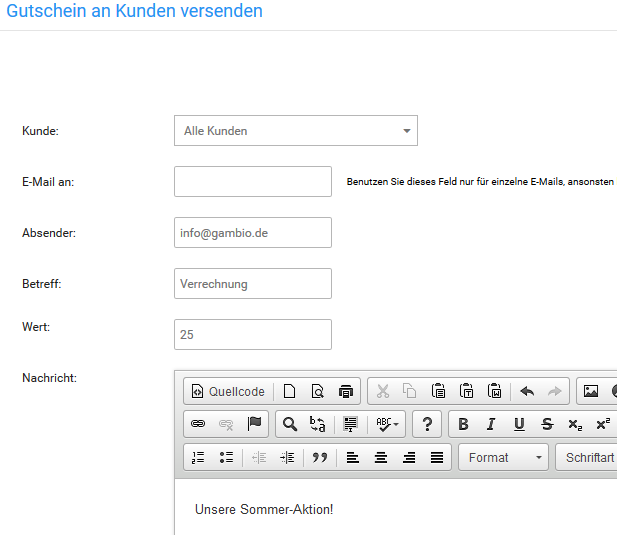
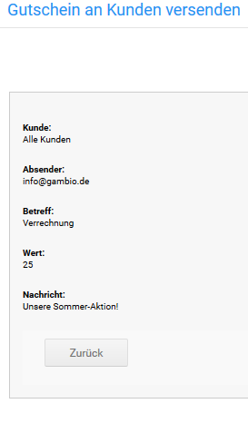

# Gutscheine verschicken 

## Willkommens-Gutschein { .section}

Das Shopsystem kann neuen Kunden mit der Registrierungsbestätigung einen Willkommens-Gutschein ausstellen. Der Gutschein muss vom Kunden aktiv eingelöst werden, damit er verwendet werden kann.

Trage den gewünschten Willkommens-Gutscheinwert unter Shop Einstellungen \> Zusatzmodule in das Feld Willkommens-Geschenk Gutscheinwert ein.

**Note:** Wenn du sowohl einen Willkommens-Gutschein als auch einen Willkommens-Rabatt Kupon einrichtest, wird dem Kunden bei der Registrierung ein Gutschein-Code und ein Rabatt Kupon-Code zugeschickt.

## Gutschein E-Mail { .section}

Wenn du einem bestimmten Kunden oder einem potentiellen Neukunden einen Gutschein zusenden möchtest, rufe im Gambio Admin den Menüpunkt Gutscheine \> Gutschein E-Mail auf.

1.  Wähle einen Kunden aus der Liste Kunde oder trage eine E-Mail Adresse deiner Wahl in das Feld E-Mail ein
2.  Wenn der Gutschein von einer abweichenden E-Mail Adresse verschickt werden soll, ändere die Adresse im Feld Absender
3.  Gib im Feld Betreff einen Betreff für die Gutschein E-Mail ein

    Wenn du keinen Betreff einträgst, wird als Betreff Verrechnung verwendet

4.  Gib den Gutschein-Wert im Feld Wert ein
5.  Im Feld Nachricht kannst du eine persönliche Nachricht hinzufügen
6.  Klicke auf E-Mail senden, um eine Vorschau anzuzeigen
7.  Klicke erneut auf E-Mail senden, um den Gutschein zu verschicken

Der Gutschein-Empfänger erhält eine E-Mail mit dem gewählten Betreff. Die E-Mail enthält den Gutschein-Code für die Eingabe im Warenkorb sowie einen Link, über den der Gutschein direkt eingelöst werden kann. Löst der Kunde den Gutschein ein, wird der Gutscheinwert dem Guthabenkonto des Kunden gutgeschrieben.

**Note:** Der Gutschein-Empfänger kann den Gutschein-Code weitergeben, sodass ein anderer Kunde den Gutschein einlösen kann. Der Gutscheinwert wird dem Gutscheinkonto des einlösenden Kunden gutgeschrieben.

