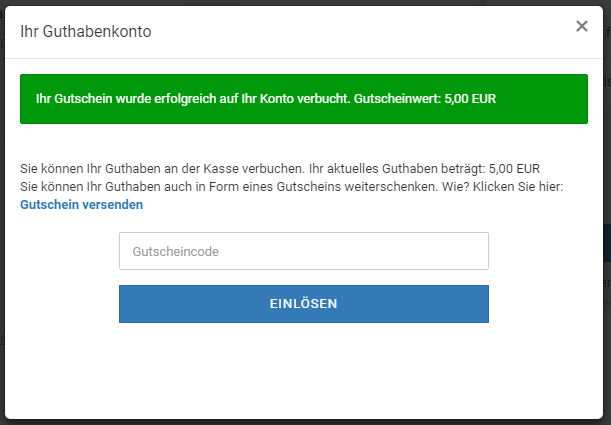

# Gutscheine 

Gutscheine können von dir im Shop zum Kauf angeboten werden. Außerdem hast du die Möglichkeit, Gutscheine gezielt an bestimmte Kunden oder potentielle Neukunden zu versenden.

Installiere das Modul Gutscheine unter Module \> Zusammenfassung, damit Gutscheine bei der Berechnung der Bestellsummen berücksichtigt werden.

**Note:** Der Gutscheinwert wird beim Einlösen dem Guthabenkonto des einlösenden Kunden gutgeschrieben. Wenn der Warenwert einer Bestellung bei Verwendung des Guthabens geringer ist, als das aktuelle Guthaben des Kunden, bleibt das Restguthaben nach der Bestellung erhalten. Der aktuelle Guthaben-Kontostand kann im Warenkorb eingesehen werden, sobald ein Artikel darin liegt.

CAUTION:

Gutscheine können auch von Gastkunden eingelöst werden. Wenn der Warenwert geringer ist, als der Gutscheinwert, verfällt bei Gastkunden der Restwert, da Gastkundenkonten nur einmalig verwendet werden können. Mit dem Kundengruppencheck kannst du Gutscheinartikel vor Gastkunden verbergen. Nähere Informationen zum Kundengruppencheck erhältst du im Kapitel Zusatzmodule.

  

  

  

