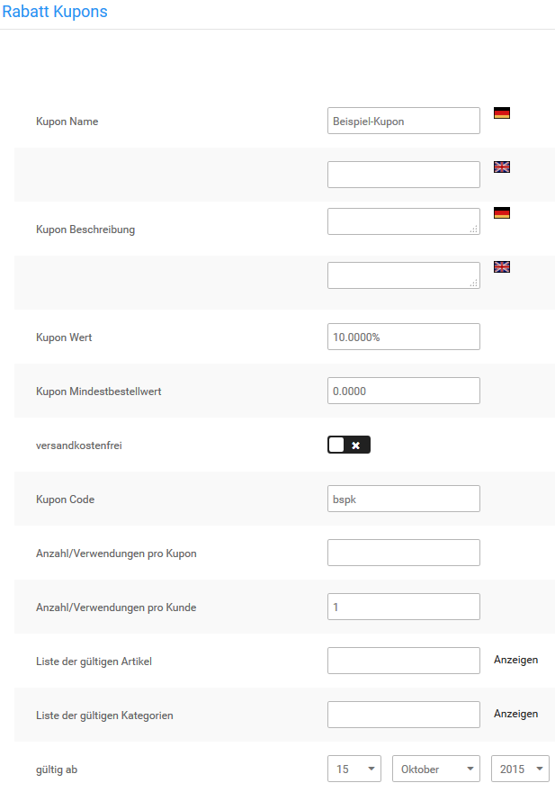
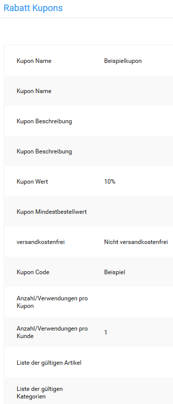

# Neuen Rabatt Kupon anlegen 

1.  Öffne im Gambio Admin deines Shops den Menüpunkt Gutscheine \> Rabatt Kupons
2.  Klicke auf Erstellen

    Die Eingabemaske für Rabatt Kupons öffnet sich

3.  Fülle die gewünschten Felder aus. Beachte dabei auch die Tabelle Kupon-Eingabemaske
4.  Wähle über die Listen gültig ab und gültig bis einen Gültigkeitszeitraum aus
5.  Klicke auf Vorschau

    Du siehst eine Übersicht mit den Details deines neuen Kupons

6.  Klicke auf Bestätigen, wenn die Details deines neuen Kupons korrekt sind

**Note:** Die Option versandkostenfrei kann ausschließlich mit einem festen Kupon-Wert kombiniert werden. Wenn du die Option versandkostenfrei mit einem prozentualen Kupon-Wert aktivierst, werden deinen Kunden mit dem Kupon ausschließlich die Versandkosten erstattet.

|Feldname|Beschreibung|
|--------|------------|
|Kupon Name|interne Beschreibung für den Kupon|
|Kupon Beschreibung|Beschreibung des Kupons für den Kunden; wird beim Einlösen in den Kupon-Details angezeigt|
|Kupon Wert|Pflichtfeld: Gegenwert des Kupons; möglich sind prozentuale Werte \(10%\) oder feste Beträge \(2.5000 =\> 2.50 EUR\)|
|Kupon Mindestbestellwert|Warenwert, der mindestens im Warenkorb liegen muss, damit der Kupon bei der Berechnung berücksichtigt wird|
|versandkostenfrei|wenn aktiviert, wird zusätzlich zu einem festen Kupon-Wert die Höhe der Versandkosten erstattet \[nicht aktiv\]|
|Kupon Code|Code, der zum Einlösen des Kupons eingegeben werden muss; wird automatisch erzeugt, wenn kein Code eingegeben wird|
|Anzahl/Verwendungen pro Kupon|legt fest, wie oft der Kupon eingelöst werden kann; lasse das Feld leer, wenn der Kupon beliebig oft eingelöst werden können soll|
|Anzahl/Verwendungen pro Kunde|legt fest, wie oft der Kupon von jedem Kunden eingelöst werden kann; lasse das Feld leer, wenn der Kupon von jedem Kunden beliebig oft eingelöst werden können soll \[1\]|
|Liste der gültigen Artikel|kommagetrennte Liste von internen Artikel

Eine Liste der zugehörigen IDs kann über den Link Anzeigen aufgerufen werden. Sie öffnet sich in einem neuen Browser-Fenster.

|
|Liste der gültigen Kategorien|kommagetrennte Liste von internen Kategorie

Eine Liste der zugehörigen IDs kann über den Link Anzeigen aufgerufen werden. Sie öffnet sich in einem neuen Browser-Fenster.

|
|gültig ab|das Datum, ab dem der Kupon eingelöst werden kann \[aktuelles Datum\]|
|gültig bis|das Datum, an dem der Kupon abläuft \[aktueller Tag im nächsten Jahr\]|

