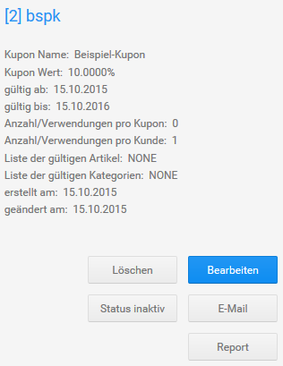

# Rabatt Kupons 

Mit Rabatt Kupons bietest du deinen Kunden eine Vergünstigung auf bestimmte Artikel oder Artikel aus bestimmten Kategorien an. Der Preisnachlass wird prozentual vom Warenwert berechnet oder als fester Betrag hinterlegt.

Über Rabatt Kupons kannst du außerdem die Versandkosten erstatten, die bei einer Bestellung normalerweise entstehen würden. Ausgenommen hiervon sind Sperrgutzuschläge. Die Befreiung von den Versandkosten kann mit einem festen Preisnachlass kombiniert werden.

Installiere das Modul Rabatt Kupons unter Module \> Zusammenfassung, damit Rabatt Kupons bei der Berechnung der Bestellsummen berücksichtigt werden. Informationen zur Konfiguration dieses Moduls erhältst du im Kapitel Zusammenfassung \> Rabatte.

**Note:** Wenn der Warenwert geringer ist, als der Kupon-Wert, so entfällt der Restwert des Rabatt Kupons nach der Bestellung.

  

  

