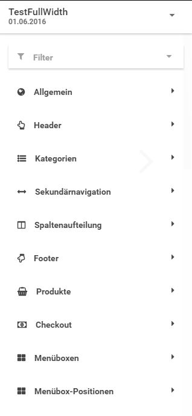
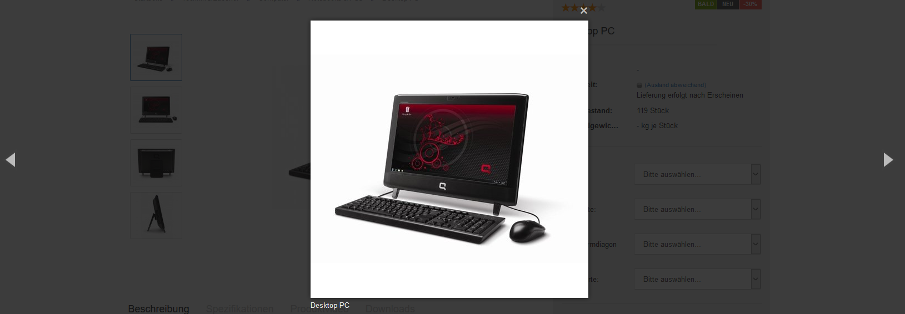

# Honeygrid und StyleEdit v3

Das _**Honeygrid**_ ist eine responsive Benutzeroberfläche, passt sich also an die jeweilige Bildschirmauflösung an und ist daher sowohl für Desktop-Computer als auch mobile Endgeräte verwendbar.

Das Honeygrid steht sowohl als _**Template**_- als auch als _**Theme**_-Veriante zur Verfügung, letztere bietet mehr Einstellungsmöglichkeiten.

Das _**StyleEdit v3**_ oder kurz _**StyleEdit3**_ genannt, dient ausschließlich der Bearbeitung des Honeygrid-Templates. Modernere Themes, wie z.B. das auf Honeygrid basierende Standard-Theme _**Malibu**_, können nicht hierüber bearbeitet werden.

## Einrichten des Honeygrids als aktuelles Template

Das Template kann unter _**Darstellung \> Template-Einstellungen**_ bzw. _**Inhalte \> Template-Einstellungen**_ festgelegt werden. Verwende hierzu das Dropdown-Menü _**Templateset \(Theme\)**_ und wähle den Eintrag _**Honeygrid \(Template\)**_ aus. Bestätige die Änderung mit einem Klick auf _**Speichern**_.

!!! note "Hinweis"

	 Templates bieten im Gegensatz zu Themes weniger Einstellungsmöglichkeiten. Die standardmäßige Benutzeroberfläche des Shops, das sogenannte _**Malibu**_, basiert auf der Theme-Variante des Honeygrids. Wir empfehlen die Verwendung von Honeygrid-basierten Themes anstelle von Templates.

Wechsele anschließend im Gambio Admin zum Menü _**Toolbox \> Cache**_ und leere alle Caches. Betätige hierzu die einzelnen Schaltflächen von unten nach oben und warte jeweils bis die Bestätigungsmeldung oberhalb der Buttons angezeigt wird.

## Template-Einstellungen

Über _**Darstellung \> Template-Einstellungen**_ bzw. _**Inhalte \> Template-Einstellungen**_ kann das _**StyleEdit v3**_ gestartet werden. Klicke hierzu auf _**Shop im Bearbeitungsmodus**_ laden.

!!! note "Hinweis" 
	 Ist das _**EyeCandy**_-Template aktiv, kann das _**StyleEdit3**_ über die Schaltfläche _**Shop im Honeygrid-Bearbeitungsmodus laden**_ gestartet werden, ohne das Template umzustellen.

### Übersicht

Das StyleEdit wird in einer Box auf der rechten Seite des Bildschirms angezeigt. Von oben nach unten stehen die folgenden Bereiche zur Verfügung

#### Vorschau-Ansicht

in der schwarzen Titel-Zeile des StyleEdits kann die Vorschau-Ansicht ausgewählt werden. Klicke hierzu auf das Symbol in der rechten, oberen Ecke und wähle unter den folgenden Ansichten aus:

-   Smartphone \(375x637\)
-   Tablet Portrait \(768x1024\)
-   Tablet Landscape \(1024x768\)
-   Desktop \(\> 1200\)

Standardmäßig ist die Ansicht _**Desktop**_ aktiviert. Wenn eine der Vorschau-Ansichten für mobile Endgeräte gewählt wird, erfolgt die Darstellung in einem zum Endgerät passenden, stilisierten Rahmen. Die Anzeige des Shops entspricht der in den Klammern angegebenen Auflösung.

#### Meine Styles

Dies ist der Hauptbereich des StyleEdits. Änderungen an den Grafik-Einstellungen können in eigenen Profilen zusammengefasst und gespeichert werden, den sogenannten _**Styles**_. Styles lassen sich anlegen, bearbeiten und herunterladen. Sie können ebenfalls dupliziert und gelöscht werden.

!!! note "Hinweis" 
	 Wenn du das _**StyleEdit v3**_ das erste Mal aufrufst, sind noch keine Styles vorhanden \(vgl. Abb. _**StyleEdit v3**_\). Um Änderungen an deinem Template vornehmen zu können, sollte daher ein neuer Style angelegt werden. Weiteres hierzu findest du im Abschnitt _**StyleEdit-Buttons**_.

Styles werden mit einem frei vergebenen Namen und dem Datum der letzten gespeicherten Änderung aufgelistet. Über einen Klick auf das nach unten weisende Dreieck können für einen Style die folgenden Aktionen aufgerufen werden:

-   _**Aktivieren**_: aktivert den Style, sodass die hier vorgenommenden Einstellungen im Shop verwendet werden. Ein aktiver Style wird im StyleEdit mit einem blauen Haken und dem Hinweis _**Aktiv**_ angezeigt.

 und ein inaktiver Style")

-   _**Bearbeiten**_: öffnet den Style zur Bearbeitung, um Änderungen daran vorzunehmen. Weiteres hierzu findest du im Kapitel _**Bearbeiten**_.
-   _**Duplizieren**_: kopiert einen Style und legt ihn unter einem neuen Namen an. Klicke auf _**Name des Styles angeben**_ um einen Namen festzulegen. Mit einem Klick auf _**Erstellen**_ wird der Style unter dem neuen Namen angelegt. Mit Klick auf _**Abbrechen**_ verlässt du den Dialog, ohne den Style zu duplizieren.

!!! danger "Achtung"

	 Wir empfehlen das Anlegen je eines Duplikats deiner Styles als Sicherung.

-   _**Löschen**_: Löscht einen bestehenden Style. Es findet eine Sicherheitsabfrage statt. Mit Klick auf _**Ja**_ wird der Style unwiderruflich gelöscht.

!!! note "Hinweis" 
	 Aktive Styles können nicht gelöscht werden.

-   _**Download**_: mit Klick auf _**Download**_ kann der Style heruntergeladen werden.

!!! note "Hinweis" 
	 Styles werden in sogenannten JSON-Dateien gespeichert. JSON steht für JavaScript Object Notation.

#### StyleEdit-Buttons

Über die Schaltfläche _**Neuer Style**_ kann ein neuer Style angelegt werden. Es stehen drei grundsätzliche Layouts zur Verfügung:

-   _**Full Width Slider**_: der Teaser-Slider wird über die gesamte Breite der Seite angezeigt
-   _**Boxed Layout**_: der gesamte Shop-Bereich wird in einer zentralen Box angezeigt
-   _**Transparent Header**_: der Head-Bereich wird transparent zum Hintergrund dargestellt

Wähle einen Namen und klicke auf _**Erstellen**_, um einen neuen Style anzulegen. Über _**Abbrechen**_ verlässt du den Dialog, ohne einen neuen Style zu erstellen.

Über die Schaltfläche _**Style Upload**_ kann ein gespeicherter Style hochgeladen werden. Mit einem Klick auf _**Datei wählen**_ kann die Datei auf deinem Computer ausgewählt werden. Klicke auf _**Erstellen**_, um den Style unter dem eingegebenen Namen hochzuladen. Mit einem Klick auf _**Abbrechen**_ verlässt du den Dialog, ohne den Style hinzuzufügen.

Über _**Beenden**_ kannst du das StyleEdit verlassen und kehrst zur Shop-Ansicht zurück.

### Bearbeiten

Wähle den jeweiligen Style aus, welchen du bearbeiten möchtest und öffne das Menü über einen Klick auf das nach unten weisende Dreieck. Klicke auf _**Bearbeiten**_.

Es öffnen sich die einzelnen Bestandteile des Styles, die über ein Dropdown ausgewählt werden können. Klicke den jeweiligen Bereich an, um die einzelnen Einstellungen einzublenden. Es stehen der Reihe nach die folgenden Bereiche zur Verfügung:

-   Allgemein
-   Header
-   Kategorien
-   Sekundärnavigation
-   Spaltenaufteilung
-   Footer
-   Produkte
-   Checkout
-   Menüboxen
-   Menüboxen-Positionen

Während der Style bearbeitet wird, steht neben dem Style-Namen ein Drodpown-Feld zur Verfügung. Hierüber kann der Link _**Eigenes CSS hinzufügen**_ ausgeklappt werden. Dieser verweist auf ein Texteingabefeld, in das eigener CSS-Code platziet werden kann.

!!! danger "Achtung"

	 Eigene CSS-Codes können im ungünstigen Fall ungewollte Auswirkungen auf die Darstellung haben. Wir empfehlen daher etwaige Änderungen zunächst an einer Kopie deines aktiven Styles vorzunehmen und die Auswirkung auf die einzelnen Seiten des Shops eingängig zu prüfen, indem du diese aus dem Bearbeitungsmodus heraus aufrufst.

Die Anzeige der Einstellungen kann über einen Filter übersichtlicher gemacht werden. Klicke auf _**Filter**_ um die gewünschten Filter auszuwählen:

-   Alle anzeigen
-   Farben & Hintergründe
-   Schriftart
-   Mobil
-   Layout

Nach der Auswahl werden nur noch die Bereiche und Einstellungen angezeigt, die im Filter eingestellt sind. Wenn du z.B. den Filter _**Farben & Hintergründe**_ auswählst, werden nur noch die Bereiche angezeigt, in denen Farb- und Hintergrund-Einstellungen vorgenommen werden können. Zudem werden bei der Auswahl eines Bereichs nur noch die Einstellungen für Farben und Hintergründe angezeigt. Der Name des ausgwählten Filters wird neben dem Filter-Symbol in dunkelgrauer Schrift angezeigt.

Über _**Alle Anzeigen**_ wird die Filter-Auswahl wieder rückgängig gemacht, der inaktive Filter wird in hellgrauer Schrift dargestellt.

Änderungen können über vier Arten von Einstellungen vorgenommen werden:

#### Schalter/Schieber

Die jeweilige Einstellung wird an- oder ausgeschaltet. Wird ein Schieber blau angezeigt, ist die Einstellung aktiv. Wird er stattdessen hellgrau angezeigt, ist die Einstellung inaktiv

 und eine inaktive Einstellung")

#### Textfelder

Textfelder sind im StyleEdit mit einem Unterstrich versehen. Über einen Klick in das Textfeld kann der Inhalt geändert werden. Bei einem aktiven Textfeld wird der Unterstrich blau angezeigt.

#### Farbauswahl

Farbauswahlen werden über ein Textfeld, das den Farb-Wert im Hex-Code enthält \(zu erkennen an der vorangestellten Raute\) und die Vorschau-Box dargestellt, in der die eingestellte Farbe angezeigt wird. Über einen Klick in das Textfeld kann der Farbwert manuell eingetragen werden. Wenn du auf die Vorschau-Box klickst, kann die Farbe über einen Dialog eingestellt werden.

Der Dialog besteht aus einer zentralen Auswahl-Box, in der der Farbverlauf angezeigt wird und verschiedenen Einstellungen. Klicke in die Box in der Mitte, um eine Farbe im Verlauf auszuwählen. Über den Regler rechts neben dem Verlauf kann ein anderer Bereich des Farbspektrums eingestellt werden. Unterhalb der Auswahl-Box kann die Transparenz der gewählten Farbe über einen Regler festgelegt werden. Unterhalb dieses Reglers wird die ausgewählte Farbe in einem Vorschau-Fenster angezeigt. Die linke Hälfte der Vorschau zeigt die bisher eingestellte Farbe an. Die rechte Hälfte zeigt die neue Auswahl an. Rechts neben der Vorschau wird der Farbwert in einem Eingabefeld angezeigt und kann dort nachträglich geändert werden.

Links von der Vorschau-Box befindet sich eine Historie der bisher eingestellten Farben. Über einen Klick in das jeweilige Quadrat wird die angezeigte Farbe eingestellt. Über einen Klick auf _**OK**_ wird die neue Farbe als Auswahl übernommen. Mit _**Abbrechen**_ verlässt du den Dialog, ohne die Farbe zu ändern.

#### Dateiauswahl

Die Dateiauswahl ist ähnlich wie das Textfeld aufgebaut, es wird der Dateiname der eingestellten Datei angezeigt. Bewege die Maus über das Feld, um die einzelnen Auswahlen anzuzeigen. Die drei Symbole stellen von links nach rechts die Aktionen _**Upload**_, _**Vorschau**_ und _**Löschen**_ dar.

Über einen Klick auf _**Upload**_ öffnet sich der Dialog zum Hochladen einer Datei, typischerweise eines Bildes. Klicke auf _**Datei auswählen**_ um die Datei auf deinem Rechner auszuwählen. Über die Schaltfläche _**Upload**_ wird die Datei hochgeladen und eingebunden. Mit _**Abbrechen**_ verlässt du den Dialog, ohne die eingerichtete Datei zu ändern.

Mit _**Vorschau**_ wird eine Vorschau-Ansicht des eingerichteten Bilds geöffnet. Über _**Löschen**_ kann ein eingerichtetes Bild wieder entfernt werden. Das Löschen muss mit einer Sicherheitsabfrage bestätigt werden, klicke auf _**Ja**_ um das Bild zu entfernen. Mit _**Nein**_ wird das Löschen abgebrochen.

Am unteren Ende des StyleEdits werden drei Schaltflächen angezeigt. Über _**Speichern**_ werden die im Style vorgenommenen Änderungen übernommen. Mit _**Vorschau**_ kann die Änderung im Vorschau-Bereich angezeigt werden, ohne sie dauerhaft zu speichern.

Mit einem Klick auf _**Zurück**_ gelangst du wieder zur Auswahl der Styles. Wenn seit dem letzten Speichern Änderungen vorgenommen wurden, wird eine Sicherheitsabfrage angezeigt. Wenn du die Bearbeitung des Styles abbrechen möchtest, bestätige dies mit einem Klick auf _**Ja**_, alle Änderungen die seit dem letzten Speichern vorgenommen worden sind, gehen hierbei verloren. Mit einem Klick auf _**Nein**_ wird die Aktion abgebrochen und du kehrst zur Bearbeitung des Styles zurück.

### Beschreibung der verschiedenen Bereiche

#### Allgemein

Der Bereich _**Allgemein**_ beinhaltet übergreifende Einstellungen für das gesamte Template. Es können Details zu Layout und Hintergrund, der allgemeinen Farben und der verwendeten Schriften eingestellt werden. Außerdem können Details zur Anzeige des Teaser-Sliders festgelegt werden.

#### Header

Der _**Header**_ bezeichnet den oberen Bereich des Shops, in dem das Logo, die Suchleiste und verschiedene Schaltflächen untergebracht sind. Neben der Farbgebung können die Größen und Aufteilungen der verschiedenen Bereiche innerhalb des Headers, sowei die Anzeige des Warenkorbs und der Suche festgelgt werden.

#### Kategorien

Für die _**Kategorien**_ können Abmessungen und Abstände festgelegt werden. Außerdem kann die Farbgebung und die generelle Erscheinung angepasst werden.

#### Sekundärnavigation

Die _**Sekundärnavigation**_ ist in der Leiste im oberen Teil des Headers untergebracht. Es können die einzelnen Schrift- und Hintergrundfarben und verschiedene Abstände eingestellt werden.

#### Spaltenaufteilung

Das Shop-Template ist in 12 gleichgroße _**Spalten**_ gegliedert, die sich über die gesamte Breite des Fensters erstrecken. Die Aufteilung dieser Spalten kann in diesem Bereich festgelgt werden.

!!! danger "Achtung"

	 Die **Summe** der eingetragenen Spaltenanzahlen für jeden Bereich \(z.B: _**Groß \(Desktops\)**_ oder _**Medium \(Tablet Landscape\)**_ muss nach einer Änderung wieder **12** betragen.

#### Footer

Für den _**Footer**_ können Mindesthöhe, sowie Hintergrund- und Schriftfarbe festgelgt werden. Zudem können die einzelen Spalten in ihrer Aufteilung angepasst und bei Bedarf komplett ausgeblendet werden.

#### Produkte

Für die Anzeige der _**Produkte**_ kann neben der Farbgebung und Aufteilung der einzelnen Bereiche auch Änderungen an den Abmessungen der Artikelbilder \(Info-Bilder und Thumbnails\) vorgenommen werden.

#### Checkout

Der _**Checkout**_ kann farblich angepasst werden. Vom Warenkorb bis zur letzten Seite des Bestellvorgangs sind verschiedene Einstellungen möglich.

#### Menüboxen

Die _**Menüboxen**_ können farblich angepasst werden. Zudem kann für die _**Startseite**_, die _**Produkt-Info**_- und _**Listen-Seiten**_, den _**Warenkorb**_ sowie den _**Checkout**_ festgelegt werden ob diese über die gesamte Breite angezeigt wird und damit die Menüboxen deaktiviert werden.

#### Menübox-Positionen

In diesem Abschnitt kann die Anzeige der einzelnen _**Menüboxen**_ an- und abgeschaltet werden. Zudem kann die Reihenfolge der Boxen in der linken Spalte geändert werden, indem die einzelnen Einträge über Klicken und Halten an ihre neue Position innerhalb des StyleEdit v3 gezogen werden.

#### Icons

Über den Bereich _**Icons**_ können Größe und Farbe von verschiedenen Icons angepasst werden.

!!! note "Hinweis"

	 Der Bereich _**Icons**_ wird nur angezeigt, wenn unter _**Shop Einstellungen \> Mein Shop**_, bzw. _**Darstellung \> Template-Einstellungen**_ oder _**Inhalte \> Template-Einstellungen**_ für _**Templateset \(Theme\)**_ der Eintrag _**Honeygrid \(Theme\)**_ eingestellt worden ist.
	 
## Template Konfiguration

Unter _**Darstellung \> Template-Einstellungen**_ bzw. _**Inhalte \> Template-Einstellungen**_ befindet sich die _**Themeauswahl**_. Hier kann über die Einstellung _**Templateset \(Theme\)**_ das gewünschte Theme oder Template zur Anzeige im Shop ausgewählt werden. Es können ebenfalls generelle Einstellungen vorgenommen werden, die nicht an Styles gebunden sind.

!!! note "Hinweis"

	 Ab Version 4.3 befinden sich diese Einstellungen im Gambio Admin unter _**Einstellungen / Layout & Design**_.

Die Einstellungen sind nach den folgenden Bereichen gegliedert:

-   Startseite
-   Artikeldetailseite
-   Artikelübersicht
-   Kategoriemenü
-   Top-Menü
-   Warenkorb 
	 
### Einstellungen für die Startseite

|Feldname|Beschreibung|
|--------|------------|
|In Kürze verfügbare Produkte in Swiper anzeigen|Artikelankündigungen werden im Swiper auf der Startseite angezeigt.|
|Empfehlungen in Swiper anzeigen|Empfehlungen werden im Swiper auf der Startseite angezeigt.|
|Angebote in Swiper anzeigen|Sonderangebote werden im Swiper auf der Startseite angezeigt.|
|Neue Produkte in Swiper anzeigen|Neue Artikel werden im Swiper auf der Startseite angezeigt.|

### Einstellungen für die Artikeldetailseite

|Feldname|Beschreibung|
|--------|------------|
|Darstellung bei Eigenschaftskombinationsauswahl|sollen _**nur Eigenschaftskombinationsbilder**_ oder _**Eigenschaftskombinationsbilder + Stammartikelbilder**_ angezeigt werden?|
|Hersteller-Bilder anzeigen|Anzeige des Hersteller-Bilds auf der Artikeldetailseite|
|Zusatzfelder auf Detailseite aktivieren|Die Inhalte der Zusatzfelder werden auf der Detailseite angezeit|
|Bilderzoom aktivieren|Aktivieren der Lupenfunktion für das Artikelbild|
|Merkzettel aktivieren|Aktivieren des Merkzettels auf der Artikeldetaiseite|
|"Frage zum Produkt"- Modul auf Detailseite aktivieren|Der Link _**Frage zu Produkt**_ wird auf der Artikel-Detailseite unterhalb des Warenkorb-Buttons angezeigt|
|Facebook "Gefällt mir"-Button auf Detailseite aktivieren|Aktivieren des _**Gefällt Mir**_-Buttons auf der Artikeldetailseite|
|WhatsApp Teilen Button auf Detailseite aktivieren|Aktivieren des WhatsApp _**teilen**_-Buttons auf der Artikeldetailseite|
|Tweet-Button \(Twitter\) auf Detailseite aktivieren|Aktivieren des _**Tweet**_-Buttons auf der Artikeldetailseite|
|Google +1 Button auf Detailseite aktivieren|Aktivieren des _**Google +1**_ Buttons auf der Artikeldetailseite|
|Pinterest Button auf Detailseite aktivieren|Aktivieren des _**Pinterest**_-Buttons auf der Artikeldetailseite|
|Bildergalerie als Lightbox einbinden|Die Bildergalerie wird als Lightbox angezeigt|
|Artikelnummer anzeigen|Anzeige der Artikelnummer auf der Artikeldetailseite aktivieren|

### Einstellungen für die Artikelübersicht

|Feldname|Beschreibung|
|--------|------------|
|Lagerbestand anzeigen \(z. B. Suchergebnisse, Hersteller-Artikel\)|Lagerbestand in der Artikelübersicht anzeigen|
|Artikelattribute anzeigen \(z. B. Suchergebnisse, Hersteller-Artikel\)|Attribute in der Artikelübersicht anzeigen|
|Staffelpreise anzeigen \(z. B. Suchergebnisse, Hersteller-Artikel\)|Staffelpreise in der Artikelübersicht anzeigen|
|Mengeneingabefeld anzeigen \(z. B. Suchergebnisse, Hersteller-Artikel\)|Mengeneingabefeld in der Artikelübersicht anzeigen|
|Gekachelte Artikelauflistung \(z. B. Suchergebnisse, Hersteller-Artikel\)|Wenn aktiviert, werden Artikel in der Artikelübersicht gekachelt angezeigt, sonst in Listenform|
|Hersteller-Bilder anzeigen|Hersteller-Bilder in der Artikelübersicht anzeigen|
|Artikel-Ribbons aktivieren|Artikel-Ribbons in der Artikelübersicht anzeigen|
|Anzahl der Angebote auf der Startseite|Anzahl der Sonderangebote, die auf der Startseite angezeigt werden|
|Anzahl der neuen Artikel auf der Startseite|Anzahl der neuen Artikel, die auf der Startseite angezeigt werden|
|Anzahl der empfohlenen Artikel auf der Startseite|Anzahl der Empfehlungen, die auf der Startseite angezeigt werden|
|Artikelnummer anzeigen|Anzeige der Artikelnummer in der Artikelübersicht aktivieren|

### Einstellungen für das Kategoriemenü

|Feldname|Beschreibung|
|--------|------------|
|Horizontale Kategorie-Navigation im Header anzeigen|Kategorie-Anzeige im Top-Menü wird verwendet|
|Horizontale Kategorie-Navigation Kategorien bis zu folgender Tiefe darstellen|Unterkategorien bis zu dieser Ebene werden im horizontalen Kategoriemenü angezeigt|
|Vertikale Kategorie-Navigation in der Sidebar anzeigen|Kategorie-Anzeige in der linken Spalte wird verwendet|
|In vertikaler Navigation nur Unterkategorien der aktuellen Kategorie anzeigen|Im linken Kategoriemenü nur die Unterkategorien der geöffneten Kategorie anzeigen|
|Klick auf Kategorie in vertikaler Navigation klappt Unterkategorien auf statt hineinzugehen|Im linken Kategoriemenü können die Unterkategorien aufgeklappt werden|
|Kategorietiefe bis zu der die vertikale Navigation immer aufgeklappt angezeigt wird|Wie viele Ebenen des linken Kategoriemenüs sollen standardmäßig aufgeklappt sein?|
|Maximale Kategorietiefe bis zu der die vertikale Navigation aufgeklappt werden kann|Bis zu dieser Tiefe lassen sich Kategorien aufklappen|

### Einstellungen für das Top-Menü

|Feldname|Beschreibung|
|--------|------------|
|Währungsauswahl im Top-Menü aktivieren|Währungsauwahl im Top-Menü wird verwendet|
|Wohnort im Top-Menü aktivieren|Wohnortauswahl im Top-Menü wird verwendet|
|Schnellsuche im TopMenü aktivieren|Schnellsuche im Top-Menü wird verwendet|

### Einstellungen für den Warenkorb

|Feldname|Beschreibung|
|--------|------------|
|Artikelnummer im Warenkorb/Merkzettel anzeigen|Anzeige der Artikelnummer in Warenkorb/Merkzettel aktivieren|
|"Weiter einkaufen"-Button immer anzeigen|An- und Abschalten des Buttons _**Weiter einkaufen**_ im Warenkorb|
|Artikelanzahl statt Artikelstückzahl im kleinen Warenkorb anzeigen|Anzahl der verschiedenen Artikel im Warenkorb anstatt der Gesamtzahl an Artikeln anzeigen|

### Einstellungen für die Artikelbewertungen

|Feldname|Beschreibung|
|--------|------------|
|Produktbewertungen aktivieren|Kundenrezensionen aktivieren|
|Produktbewertungen in der Produktliste und in der gekachelten Artikelauflistung anzeigen?|Bewertungssterne in Artikelübersichten anzeigen|
|Produktbewertungen im Tab anzeigen|Kundenrezensionen werden in einem Artikeltab und nicht mehr unterhalb der Artikelbeschreibung angezeigt|

### Einstellungen für die Artikelbilder

|Feldname|Beschreibung|
|--------|------------|
|Kleine Artikelbilder in Übersichten und Swipern verwenden|Verwendung der kleineren Thumbnails anstelle der Info-Bilder|

### Allgemeine Template-Einstellungen

|Feldname|Beschreibung|
|--------|------------|
|Automatische Silbentrennung aktivieren|Artikelnamen orthografisch trennen|
|Suchvorschläge aktivieren|Die Suche im Header schlägt Suchbegriffe anhand der Eingabe vor|

## Grid-Spalten

Viele Einstellungen über das _**StyleEdit v3**_ definieren die Anzahl sogenannter _**Grid-Spalten**_. Die gesamte Breite des Shopbereichs ist auf 12 gleichgroße Streifen, die _**Grid-Spalten**_, verteilt. Indem für einen Bereich, z.B. die linke Spalte \(Zusatzboxen, vertikales Kategoriemenü\) eine bestimmte Anzahl an _**Grid-Spalten**_ verwendet wird, kann die Breite im Verhältnis zum gesamten Shop festgelegt werden.

In der obenstehenden Abbildung werden 3 von 12 _**Grid-Spalten**_ für die linke Spalte verwendet, in der z.B. die Zusatzboxen untergebracht sind. Die 9 verbleibenden _**Grid-Spalten**_ \(in der Abbildung nicht eingezeichnet\) werden für die anderen Shop-Inhalte verwendet.

Wichtig bei der Einstellung ist, dass die Gesamtzahl der _**Grid-Spalten**_ für alle Einstellungen in der **Summe** immer **12** ergeben müssen - dies entspricht 100% der Breite.

## Weiterführende Links

Ergänzend zu den bisherigen Unterkapiteln findest du im Gambio Blog Tutorien zu verschiedenen Themen, rund um das StyleEdit v3. Nachfolgend findest du die entsprechenden Links \(letzter Aufruf 08.08.2018\):

https://www.gambio.de/blog/styleedit-3-tutorials-teil-1/

https://www.gambio.de/blog/styleedit-3-tutorials-variablen-scss-mixins/

https://www.gambio.de/blog/styleedit-3-tutorials-teil-3-header/

https://www.gambio.de/blog/styleedit-3-tutorials-teil-3-footer/