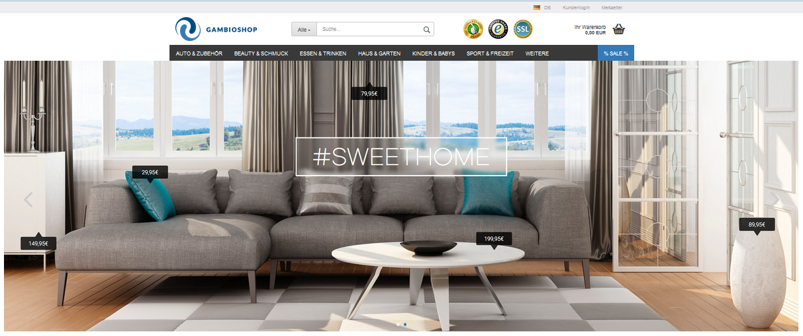
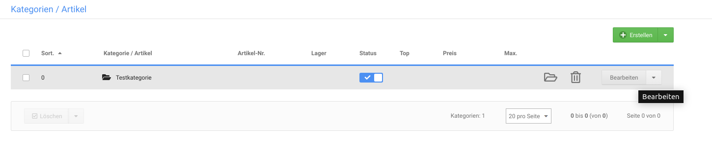
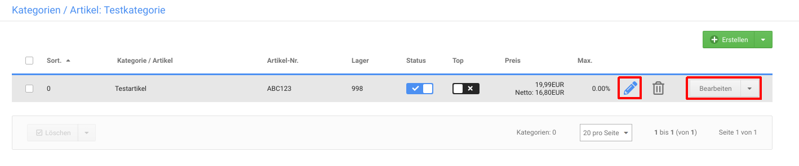

# Teaser-Slider

Ein Teaser-Slider ist eine Bildpräsentation, die im Shopbereich oberhalb des Seiteninhalts angezeigt wird. Teaser-Slider kannst du auf der Startseite und auf Content-Seiten sowie auf Kategorieseiten und Artikeldetailseiten individuell einbinden.

## Teaser-Slider verwalten

Neue Teaser-Slider kannst du im Gambio Admin deines Shops unter _**Darstellung \> Teaser-Slider**_ bzw. _**Inhalte \> Teaser-Slider**_ anlegen.

!!! note "Hinweis" 
	 Im Teaser-Slider können Vorschaubilder der im Slider enthaltenen Bilder in der unteren rechten Ecke des Sliders angezeigt werden. Die Vorschaubilder \(Thumbnails\) werden nicht vom Shopsystem erstellt und müssen vor dem Hochladen mit einem geeigneten Grafikprogramm auf die gewünschte Größe verkleinert werden.

### Slider anlegen

1.  Klicke auf _**Erstellen**_
2.  Trage unter _**Name**_ einen Namen für den neuen Slider ein
3.  Ändere bei Bedarf im Feld _**Geschwindigkeit**_ die Anzeigedauer je Bild in Sekunden
4.  Klicke auf _**Speichern**_, um die Konfiguration des Teaser-Sliders zu speichern

### Slider löschen

1.  Bewege den Mauszeiger in die Zeile des Sliders, den du löschen möchtest
2.  Klicke auf das Mülltonen-Symbol
3.  Bestätige die Sicherheitsabfrage mit einem Klick auf _**Löschen**_, um den gewählten Teaser-Slider zu löschen

### Bilder hinzufügen

Für jedes Bild des Teaser-Sliders wird ein sogenannter _**Slide**_ angelegt. Ein _**Slide**_ entspricht einem Bild, jedoch kann für die verschiedene Ansichten des Shops je eine eigene Bild-Datei zugeordnet werden. Auf diese Weise können für unterschiedliche Ansichten \(z.B. Desktop-Ansicht oder Smartphone-Ansicht\) Bilder mit hierfür angepassten Auflösungen verwendet werden. Ein _**Slide**_ hat für jede einzelne Sprache, die im Shop verwendet wird, eine eigene Einstellungsseite, die über den Reiter mit der Landesflagge oben links ausgewählt werden kann.

Um eine Bilddatei für einen bestimmten Anwendungsfall einzurichten, bewege den Mauszeiger in die Zeile mit dem zugehörigen Dropdown-Menü und klicke anschließend auf das _**Upload**_-Icon. Die Bilddatei steht nach dem Hochladen im zugehörigen Dropdown zur Verfügung.

|Feldname|Beschreibung|
|--------|------------|
|Vorschaubild|Bild-Datei, die als Thumbnail verwendet wird|
|Smartphone|Bild-Datei für die Smartphone-Ansicht|
|Tablet Portrait|Bild-Datei die Tablet-Ansicht \(hochkannt\)|
|Tablet Landscape|Bild-Datei für Tablet-Ansicht \(quer\)|
|Desktop|Bild-Datei für Desktop-Ansicht|
|Titel|der Bildtitel des aktuellen Slides \(wird im Shopbereich beim darüberfahren mit der Maus angezeigt\)|
|ALT-Text|der Alternativtext des aktuellen Slides \(wird angezeigt, wenn das Bild nicht geladen werden kann\)|
|Link|legt fest, ob die angegebene Internetseite in einem neuen Fenster oder im selben Fenster geöffnet wird|
| |wenn angegeben, wird der Kunde beim Klick auf den Slider auf die angegebene Internetseite weitergeleitet \(wird ignoriert, wenn die Image-Map konfiguriert ist\)|

Über einen Klick auf das Mülltonen-Symbol in der grauen Titel-Leiste des Slides kann ein Slide gelöscht werden. Mit dem - bzw. + kann ein Slide minimiert bzw. wiederhergestellt werden.

## Teaser-Slider zuweisen

Teaser-Slider kannst du einer oder mehreren Kategorien, Artikeln und Content-Seiten sowie der Startseite zuweisen.

### Startseiten-Slider festlegen

Den Startseiten-Slider kannst du im Gambio Admin deines Shops unter _**Darstellung \> Teaser‑Slider**_ bzw. _**Inhalte \> Teaser-Slider**_ festlegen. Setze hierzu in der Spalte _**Startseite**_ den Haken für den gewüschten Teaser-Slider.

### Content-Slider festlegen

")

Den Teaser-Slider für einen Content kannst du im Gambio Admin unter _**Darstellung \> Content Manager**_ bzw. _**Inhalte \> Content Manager**_ festlegen.

1.  Klicke bei dem Content auf das Bleistift-Symbol \(bearbeiten\), zu dem du einen Slider hinterlegen möchtest
2.  Wähle aus der Liste _**Content Teaser-Slider**_ den Teaser-Slider für diesen Content aus
3.  Klicke am Ende der Eingabemaske auf _**Speichern**_ oder _**Aktualisieren**_, um den Teaser-Slider dem Content zuzuweisen

### Kategorie-Slider festlegen

Den Teaser-Slider für eine Kategorie kannst du im Gambio Admin unter _**Artikel \> Artikel/Kategorien**_ festlegen.

1.  Wähle aus der Liste die gewünschte Kategorie aus
2.  Klicke in der Dropdown-Schaltfläche auf _**Bearbeiten**_
3.  Wähle aus der Liste _**Kategorie Teaser-Slider**_ den Teaser-Slider für diese Kategorie aus
4.  Klicke rechts neben der Liste _**Kategorie Teaser-Slider**_ auf _**Speichern**_, um den Teaser-Slider der Kategorie zuzuweisen

### Artikel-Slider festlegen

Den Teaser-Slider für einen Artikel kannst du im Gambio Admin unter _**Artikel \> Artikel/Kategorien**_ festlegen.

1.  Wähle aus der Liste den gewünschten Artikel aus
2.  Klicke wahlweise auf das Bleistift-Icon oder über die Dropdown-Schaltfläche auf _**Bearbeiten**_
3.  Wähle aus der Liste _**Produkt Teaser-Slider**_ den Teaser-Slider für die Detailseite dieses Artikels aus
4.  Klicke am Ende der Seite auf _**Speichern**_ oder _**Aktualisieren**_, um den Teaser‑Slider dem Artikel zuzuweisen

## Image-Map

Jedem Bild im Teaser-Slider \(außer Vorschaubildern\) kann eine sogenannte Image-Map zugeordnet werden. Hierüber lassen sich einzelne Bereiche eines Bilds als Links festlegen und mit Verweisen zu anderen Seiten versehen. Auf diese Weise können z.B. mehrere Artikel in einem Bild direkt verlinkt werden.

Gehe zunächst unter _**Darstellung \> Teaser-Slider**_ bzw. _**Inhalte \> Teaser-Slider**_ und bearbeite den gewünschten Slider. Scrolle zum jeweiligen Slide und bewege den Mauszeiger in die Zeile des Bilds \(z.B. Bild für Desktop\), für das eine Image-Map angelegt werden soll. Klicke hier auf das Image-Map-Icon:

")

Es öffnet sich ein neues Fenster, in dessen unterem Teil das Bild angezeigt wird. Im oberen Teil werden der Reihe nach folgende Einstellungen angezeigt:

-   _**Linkbereich**_: über das Dropdown lassen sich die einzelnen Linkbereiche auswählen
-   _**Linkbereich-Titel**_: der Name des Linkbereichs kann über dieses Feld vergeben werden
-   _**Linkbereich-URL**_: Ziel des Links
-   _**Linkbereich-Ziel**_: soll der Link im selben Fenster/Tab oder in einem neuen Fenster/Tab geöffnet werden

### Neuen Linkbereich erstellen

Mit der Schaltfläche _**Neuen Linkbereich erstellen**_ kann ein Teil des Bilds ausgewählt und verlinkt werden. Vergebe hierzu einen _**Linkbereich-Titel**_ und füge unter _**Linkbereich-URL**_ die Adresse ein, die beim Klick in den Linkbereich aufgerufen werden soll.

!!! note "Hinweis" 
	 Wenn die Seite außerhalb des Shops liegt **muss** der Link mit _**http://**_ bzw. _**https://**_ angegeben werden. Bei Seiten innerhalb des Shops reicht die Angabe hinter der Shop-Adresse. Wenn z.B. auf die Kategorie _**Test**_ mit der URL _**https://www.beispiel.de/test**_ verlinkt werden soll, reicht die Angabe _**/test**_ für die Linkbereich-URL aus.

Wähle zudem über _**Linkbereich-Ziel**_ aus ob die verlinkte Seite im selben Tab/Fenster \(je nach Browsereinstellung\) geöffnet werden soll.

!!! note "HInweis" 
	 Bei Seiten die außerhalb des Shops liegen empfiehlt sich die Einstellung _**In neuem Fenster öffnen**_, sodass der Kunde parallel die Shopseite geöffnet hat. Bei Seiten innerhalb des Shops kann _**in selbem Fenster öffnen**_ verwendet werden.

Mit der Maus kann im unteren Teil des Fensters der Linkbereich festgelegt werden. Klicke hierzu jeweils mit der linken Maustaste in das Bild, um einen Eckpunkt zu setzen. Der Bereich kann über drei oder mehr Eckpunkte festgelegt werden. Durch Drücken und Ziehen mit der linken Maustaste kann ein Punkt verschoben werden. Um einen Punkt zu löschen, klicke mit der rechten Maustaste darauf.

Bestätige den festgelegten Linkbereich mit einem Klick auf _**Übernehmen**_. Wenn du die Einstellungen verwerfen möchtest, klicke auf _**Abbrechen**_.

### Bestehenden Linkbereich bearbeiten

Um einen Linkbereich zu bearbeiten kann dieser über das Dropdown _**Linkbereich**_ ausgewählt werden. Es können alle Einstellungen verändert werden, die beim Anlegen des Linkbereichs getroffen worden sind.

Bestätige die Änderungen mit einem Klick auf _**Übernehmen**_. Mit einem Klick auf _**Abbrechen**_ beendest du die Bearbeitung, ohne die Änderungen zu speichern.

### Linkbereich löschen

Um einen Linkbereich zu löschen, wähle diesen über das Dropdown _**Linkbereich**_ aus und klicke auf _**Löschen**_.

!!! danger "Achtung"

	 Es erfolgt keine Sicherheitsabfrage, der Linkbereich wird **unwiderruflich gelöscht**.