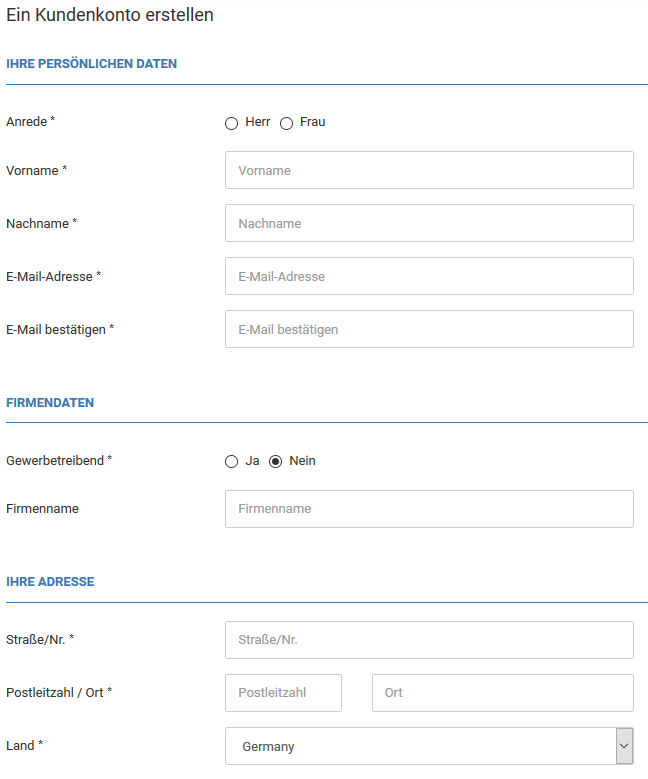

# Kundenregistrierung {#kundenregistrierung}

Im Gambio Admin deines Shops kannst du unter Kunden \> Kunden \> Kunden-Details festlegen, ob deine Kunden über ein Registrierungsformular selbständig ein Kundenkonto anlegen können. Wähle bei Art der Kontoerstellung eine der in der Tabelle Art der Kontoerstellung beschriebenen Optionen aus. Klicke anschließend auf Speichern, um die Änderungen zu speichern.

|Art|Beschreibung|
|---|------------|
|Kundenkonto|bei der Kontoerstellung Kundenkonto können ausschließlich registrierte Kunden in deinem Shop bestellen|
|Gastkonto|bei der Kontoerstellung Gastkonto können keine Kundenkonten für Stammkunden angelegt werden|
|beides|bei der Kontoerstellung beides können Kunden sich in deinem Shop registrieren oder ohne Kundenkonto bestellen|

Gast-Konten werden nicht notwendigerweise dauerhaft angelegt, da Kunden hierüber die Möglichkeit haben sollen ohne festes Kundenkonto zu bestellen. Wenn sich der Kunde direkt nach der Bestellung ausloggt, wird das Konto unwiderruflich gelöscht. Die Bestellung mit den vollständigen Kontaktdaten bleibt dabei erhalten. Wähle unter Kunden \> Kunden \> Kunden-Details bei Löschen von Gastkonten die Option ✖ aus, wenn das automatische Löschen von Gastkonten nicht gewünscht ist. Klicke anschließend auf Speichern, um die Änderungen zu speichern.

CAUTION:

In manchen Shopversionen wird zum Teil unter Kunden \> Kunden \> Kunden-Details eine Cronjob-URL angezeigt. Diese ist nicht mehr aktuell und wird mit einem kommenden Update entfernt. Für das automatisierte Löschen von Gast-Konten sollte die Cronjob-URL unter Toolbox \> Zeitgesteuerte Aufgaben verwendet werden.

-   **[Felder des Registrierungsformulars](12_1_1_Felder_des_Registrierungsformulars.md)**  

-   **[Kunden-Details](12_1_1_Kunden_Details.md)**  

-   **[Pflichtfelder festlegen](12_1_2_Pflichtfelder_festlegen.md)**  

**Parent topic:**[Kunden](12_Kunden.md)

