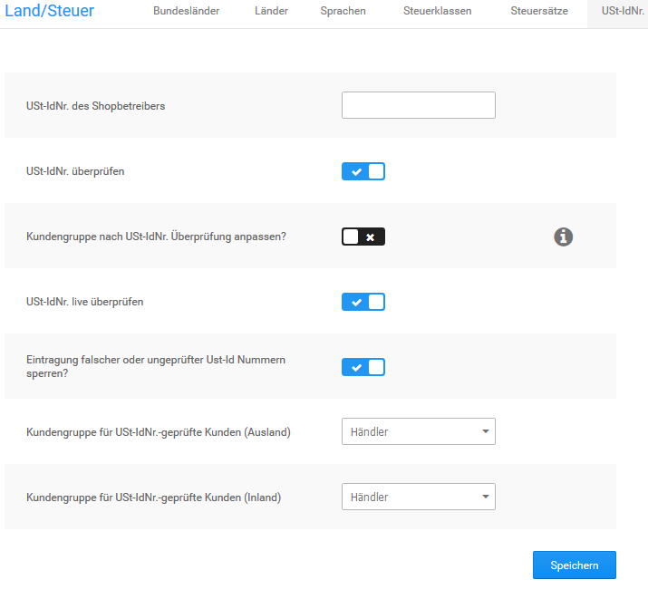

# Händlerkunden 

Das Shopsystem bietet eine Funktion, über die Händler bei Angabe einer gültigen Umsatzsteuer Id-Nummer bei der Registrierung nach einer Prüfung automatisch in eine vordefinierte Kundengruppe verschoben werden. Die Konfiguration dieser Funktion kannst du unter Shop Einstellungen \> Land/Steuer \> Ust-IdNr. vornehmen. Bitte beachte, dass die Ust-IdNr nur für EU-Staaten geprüft werden kann.

  

  

