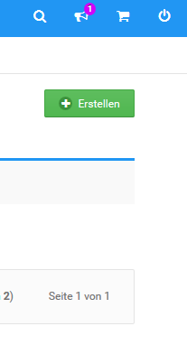

# Kundenkonto manuell anlegen 

Kundenkonten kannst du im Gambio Admin deines Shops unter Kunden \> Kunden von Hand erstellen.

1.  Klicke auf Erstellen unterhalb der Admin-Info Box
2.  Trage die Kundendaten in der Kunden-Eingabemaske ein, eine Übersicht über die Bedeutung der einzelnen Felder findest du in der Tabelle Übersicht über die Kundenkonto-Eingabemaske
3.  Wähle unter Weitere Optionen aus der Liste Kundengruppe die gewünschte Kundengruppe für den neuen Kunden aus
4.  Ändere die Option bei E-Mail mit Passwort an Kunden versenden auf Nein, wenn du deinem Kunden keine Benachrichtigung über das neue Kundenkonto zusenden möchtest
5.  Trage im Feld Passwort ein Passwort für das neue Kundenkonto ein, wenn du nicht das voreingestellte Zufallspasswort verwenden möchtest
6.  Trage im Feld Zusätzlicher E-Mail-Text eine persönliche Nachricht für die Benachrichtigung an den Kunden ein
7.  Klicke auf Einfügen, um das neue Kundenkonto zu speichern

")

|Feldname|Beschreibung|
|--------|------------|
|Anrede|Legt die Anrede für den Kunden fest|
|Kundennummer|Feld für die Kundennummer des Kunden|
|Vorname|Feld für den Vornamen des Kunden|
|Nachname|Feld für den Nachnamen des Kunden|
|E-Mail-Adresse|Feld für die E-Mail-Adresse des Kunden|
|Firmenname|Feld für den Firmennamen des Kunden|
|Ust-IdNr.|Feld für die Umsatzsteuer ID-Nummer des Kunden|
|Straße|Feld für die Straße der Kundenanschrift|
|Hausnummer|Feld für Hausnummer der Kundenanschrift|
|Postleitzahl|Feld für die Postleitzahl der Kundenanschrift|
|Stadt|Feld für die Stadt der Kundenanschrift|
|Land|Feld für das Land der Kundenanschrift|
|Telefonnummer|Feld für die Telefonnummer des Kunden|
|Telefaxnummer|Feld für die Faxnummer des Kunden|
|Kundengruppe|Auswahlliste für die Kundennummer des Kunden \(Nur bei manuellem Anlegen eines Kunden\)|
|E-Mail mit Passwort an Kunden versenden|Bei ja wird dem Kunden eine Willkommens-Nachricht zugeschickt \(Nur bei manuellem Anlegen eines Kunden\)|
|Nicht erlaubte Zahlungsmodule|Kommagetrennte Liste mit Modulnamen von gesperrten Zahlungsweisen|
|Nicht erlaubte Versandmodule|Kommagetrennte Liste mit Modulnamen von gesperrten Versandarten|
|\(Neues\) Passwort|Feld für das Passwort des Kunden|
|Zusätzlicher E-Mail-Text|Feld für eine persönliche Nachricht in der Willkommens- Nachricht \(Nur bei manuellem Anlegen eines Kunden\)|
|Newsletter|Auswahlliste zum Newsletter-Abonnement-Status des Kunden|
|Memo|Feld für Kundennotizen für den Shopbetreiber|

!!! Info "Hinweis
	 Die Trennung von Straße und Hausnummer kann unter Kunden \> Kunden im Reiter Kunden-Details an- und abgeschaltet werden. Ist die Trennung abgeschaltet, steht das Feld Hausnummer nicht zur Verfügung.

