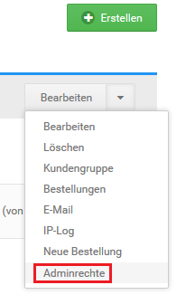

# Administrator-Konto anlegen 

1.  Wähle aus der Kundenliste das mit Administrator-Rechten zu versehende Kundenkonto aus oder lege ein neues Kundenkonto an, wie im Kapitel Kundenkonto manuell erstellen beschrieben und wähle das neu erstellte Kundenkonto aus

    Das aktuell ausgewählte Kundenkonto ist grau hinterlegt

2.  Klicke auf Kundengruppe
3.  Wähle aus der Liste die Kundengruppe Admin aus
4.  Klicke auf Aktualisieren, um das Kundenkonto der Kundengruppe Admin hinzuzufügen
5.  Klicke auf Adminrechte, es öffnet sich die Seite Rollenzuweisung
6.  Sollte die benötigte Zugriffsrolle für das Administrator-Konto noch nicht angezeigt werden, lege diese über den Bereich Zugriffsrollen verwalten an \(siehe Kapitel Rollen und Berechtigungen\)
7.  Setze den Haken für die gewünschte Zugriffsrolle, um diese dem Administrator-Konto zuzuweisen

