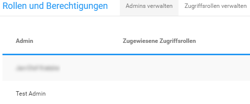
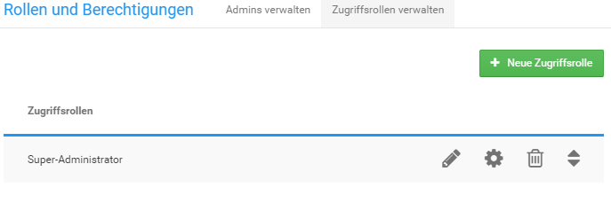
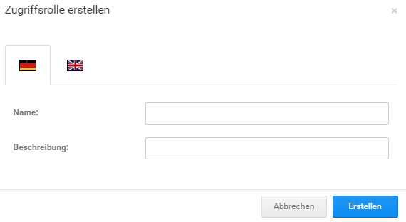
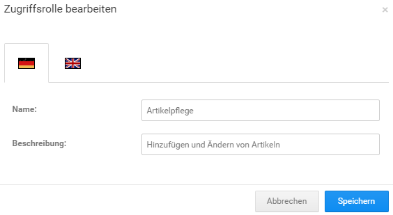

# Rollen und Berechtigungen 

Mit Rollen und Berechtigungen werden ab Shopversion 3.9 die Zugriffsrechte für Administratoren gesteuert. Für jede Rolle können die einzelnen Rechte individuell eingestellt werden. Die Rolle kann wiederum den jeweiligen Administrator-Konten zugeordnet werden.

## Admins verwalten 

Im Bereich Admins verwalten werden alle Konten der Gruppe Admin angezeigt. Wenn du den Mauszeiger in die jeweilige Zeile eines Administrators bewegst, wird ein Bleistift-Symbol angezeigt. Hierüber kann dem Admin eine Rolle zugeordnet werden.

!!! Info "Hinweis"
	 Wird kein Bleistift-Symbol zu einen Admin-Konto angezeigt, handelt es sich um den Hauptadministrator. Dieser hat per Definition alle Rechte.

Ein Klick auf das Bleistift-Symbol ruft die Rollenzuweisung für den jeweiligen Administrator auf. Es werden die einzelnen Zugriffsrollen angezeigt. Wird ein Haken in der Spalte Rolle zuweisen gesetzt, wird die jeweilige Rolle dem Administrator-Konto zugeordnet.

!!! Info "Hinweis"
	 Standardmäßig ist nur die Rolle Super-Administrator angelegt. Weitere Rollen können über den Reiter Zugriffsrollen verwalten erstellt werden.

## Zugriffsrollen verwalten 

Im Reiter Zugriffsrollen verwalten werden alle Rollen aufgelistet. Zudem können über die Schaltfläche Neue Zugriffsrolle weitere Rollen hinzugefügt werden. Wenn du den Mauszeiger in die Zeile einer Zugriffsrolle bewegst, werden die möglichen Aktionen zu dieser Rolle angezeigt. Diese sind von links nach rechts: Bearbeiten, Konfigurieren, Löschen, Verschieben.

CAUTION:

Die Rolle Super-Administrator sollte weder gelöscht noch geändert werden.

**Aktionen**

-   Bearbeiten: Namen und Beschreibung der Rolle festgelegen
-   Konfigurieren: Zugriffsrechte der Rolle festlegen, siehe Zugriffsrechte
-   Löschen
-   Verschieben: ändert die Reihenfolge der angezeigten Zugriffsrollen, klicke und halte die linke Maustaste und ziehe den Eintrag an die gewünschte Position

**Zugriffsrechte**

Setze beziehungsweise entferne den Haken Zugriff erlauben hinter einem Zugriffsrecht, um das Recht zu gewähren respektive zu entziehen. Bewege den Mauszeiger über das Info-Symbol, um die Beschreibung des jeweiligen Zugriffsrechts anzuzeigen.

|Feldname|Beschreibung|
|--------|------------|
|Alle Berechtigungen|Diese Berechtigung steht stellvertretend für alle Berechtigungen|
|API|Erlaubt die generelle Nutzung der API. Dies wird z.B. zur Nutzung einiger Warenwirtschaftssysteme benötigt|
|Gambio Admin Web UI|Erlaubt die generelle Nutzung der Gambio Admin Weboberfläche und Zugriff auf die Gambio News|
|Bestellungen|Erlaubt die Verwaltung von Bestellungen|
|Widerrufe|Erlaubt den Zugriff auf die Widerrufe|
|Rechnungen|Erlaubt den Zugriff auf die Rechnungen|
|Kunden|Erlaubt die Verwaltung von Kunden|
|Kundengruppen|Erlaubt die Verwaltung von Kundengruppen|
|E-Mails|Erlaubt die Verwaltung von E-Mails|
|Rollen und Berechtigungen|Erlaubt die Verwaltung von Zugriffsrechten|
|Google|Erlaubt die Nutzung des Google Services|
|Artikel|Erlaubt die Verwaltung von Artikeln, Kategorien, Sonderangeboten, Eigenschaften, Attributen und Artikel-Filtern|
|QuickEdit|Erlaubt die Nutzung von QuickEdit|
|Hersteller|Erlaubt den Zugriff auf die Hersteller|
|Verpackungseinheiten|Erlaubt den Zugriff auf die Verpackungseinheiten|
|Mengeneinheiten|Erlaubt den Zugriff auf die Mengeneinheiten|
|GX-Customizer|Erlaubt den Zugriff auf den GX-Customizer|
|Cross-Marketing Gruppen|Erlaubt den Zugriff auf die Cross-Marketing Gruppen|
|Kundenrezensionen|Erlaubt den Zugriff auf die Kundenrezensionen|
|Darstellung|Erlaubt die generelle Nutzung von Darstellungsoptionen|
|Template Einstellungen|Erlaubt die Verwaltung der Templates und Logos|
|Logo Manager|Erlaubt die Nutzung des Logo Managers|
|Sliders|Erlaubt die Verwaltung von Slidern|
|Content Manager|Erlaubt die Verwaltung der Shopinhalte mit dem Content Manager|
|Shop offline|Erlaubt die Verwaltung der "Shop offline" Einstellungen|
|Banner Manager|Erlaubt die Nutzung des Banner Managers|
|Image Processing|Erlaubt die Nutzung des Image Processings|
|Toolbox|Erlaubt die generelle Nutzung der Toolbox|
|Cache|Erlaubt die Verwaltung des Caching-Systems|
|Timer|Erlaubt die Verwaltung der Timer|
|OpenSearch|Erlaubt die Verwaltung von OpenSearch-Plugins|
|Texte bearbeiten|Erlaubt die Verwaltung der Shop-Texte|
|Newsletter|Erlaubt die Verwaltung der Newsletter|
|Datenbanksicherung|Erlaubt die Nutzung der Datenbanksicherung|
|Dateien sichern|Erlaubt den Zugriff auf die Backup-Dateien|
|Logs|Erlaubt die Verwaltung der Serverlogs|
|Server Info|Erlaubt die Einsicht in die Serverinformationen|
|SQL|Erlaubt die Nutzung des phpMiniAdmins|
|File Manager|Erlaubt die Nutzung des FileManagers|
|Module|Erlaubt die generelle Nutzung von Modulen aus dem Modul-Center|
|Modul-Center|Erlaubt die Verwaltung von Modulen über das Modul-Center|
|Statistiken|Erlaubt die Einsicht in die Statistiken|
|Import / Export|Erlaubt die Nutzung des Import und Exports|
|Artikeldaten|Erlaubt den Export von Artikeldaten|
|Kundenexport|Erlaubt den Export von Kundendaten|
|Gutscheine|Erlaubt die Verwaltung von Gutscheinen|
|Shop Einstellungen|Erlaubt den generellen Zugriff auf die Shop Einstellungen|
|Allgemeine Einstellungen|Erlaubt die Verwaltung der allgemeinen Einstellungen des Shops|
|Rechtliches|Erlaubt die Verwaltung der rechtlichen Shop Einstellungen|
|Lieferstatus|Erlaubt die Verwaltung der Lieferstatus des Shops|
|Paketdienste|Erlaubt die Verwaltung der Paketdienste des Shops|
|Nummernkreise|Erlaubt die Verwaltung der Start IDs des Shops|
|SEO|Erlaubt die Verwaltung der SEO-Einstellungen des Shops|
|Zonen & Steuern|Erlaubt die Verwaltung von Zonen und Steuern|
|Sicherheit|Erlaubt die Verwaltung der Sicherheits-Einstellungen des Shops|
|Hub|Erlaubt die Verwaltung des Gambio Hubs|
|Unbekannte Module|Diese Berechtigung fasst alle unbekannten Module zusammen. Es wird empfohlen, dass diese Berechtigung immer erlaubt wird|

