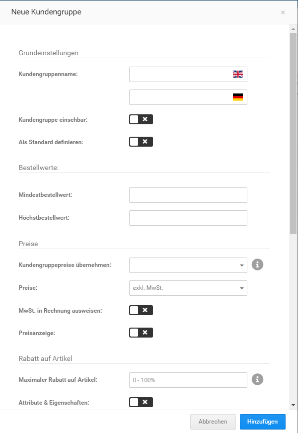

# Kundengruppen anlegen {#kundengruppen_anlegen}

Neue Kundengruppen kannst du im Gambio Admin deines Shops unter Kunden \> Kundengruppen anlegen.

1.  Klicke oberhalb der Kundengruppen-Liste auf Erstellen

    Es öffnet sich die Kundengruppen-Eingabemaske

2.  Trage im Feld Kundengruppenname einen Namen für deine neue Kundengruppe ein
3.  Nimm die Konfiguration der Kundengruppe anhand der Tabelle Übersicht über die Kundengruppen-Eingabemaske vor
4.  Wähle aus der Liste Kundengruppenpreise übernehmen für Artikelpreise die Kundengruppe aus, dessen Kundengruppenpreise in die neue Kundengruppe importiert werden sollen
5.  Klicke auf Hinzufügen, um die neue Kundengruppe hinzuzufügen

|Feldname|Beschreibung|
|--------|------------|
|Kundengruppenname|Feld für den Namen der Kundengruppe|
|Kundengruppe einsehbar|Bei ✔ wird der Name der Kundengruppe im Shopbereich im Dropdown des Login-Buttons in der Sekundärnavigation angezeigt|
|Als Standard definieren|Wenn aktiviert, wird die aktuelle Kundengruppe als Standardkundengruppe definiert|
|Mindestbestellwert|Mindestbestellwert für die Kundengruppe \(optional\)|
|Höchstbestellwert|Höchstwert für die Kundengruppe \(optional\)|
|Kundengruppenpreise übernehmen|Übernimmt die Artikelpreise aus der ausgewählten Gruppe|
|Preise|Auswahlliste für die Anzeige von Preisen inklusive oder exklusive Umsatzsteuer|
|MwSt. in Rechnung ausweisen|Bei ✖ wird die Umsatzsteuer auf der Rechnung nicht ausgewiesen|
|Preisanzeige|Bei ✖ werden im Shop keine Preise angezeigt, die Kaufoptionen werden deaktiviert|
|Maximaler Rabatt auf Artikel|Feld für den Maximalen Artikelrabatt, in Artikeln eingetragene Rabatte werden bis zu diesem Wert gewährt|
|Attribute & Eigenschaften|Bei ✔ werden auch Artikelattribute und Artikeleigenschaften mit dem Artikelrabatt reduziert|
|Rabatt auf gesamte Bestellung|Feld für Rabatt auf Gesamtbestellung|
|Rabatt auf Gesamtbestellwert|Bei ✔ wird der Prozentwert aus dem vorherigen Feld bei der Bestellzusammenfassung als Nachlass auf die Gesamtrechnung ausgezeichnet|
|Staffelpreise aktivieren|Bei ✔ werden für diese Kundengruppe eingerichtete Staffelpreise angezeigt|
|Unerlaubte Zahlungsweisen|Kommagetrennte Liste für diese Kundengruppe nicht erlaubter Zahlungsweisen, Angabe anhand des Modulnamens, z.B. invoice,cod für Rechnung und Nachnahme|
|Unerlaubte Versandarten|Kommagetrennte Liste für diese Kundengruppe nicht erlaubter Versandarten, Angabe anhand des Modulnamens, z.B: flat,table für Pauschale Versandkosten und Versandkosten nach Preis/Gewicht|
|FSK18 Artikel kaufen|Bei ✔ können Kunden dieser Gruppe als FSK18 ausgewiesene Artikel erwerben|
|FSK18 Artikel anzeigen|Bei ✔ werden Kunden dieser Gruppe Artikel angezeigt, die als FSK18 ausgewiesen sind|
|Artikel bewerten|Bei ✔ können Kunden dieser Gruppe Kundenrezensionen verfassen und Artikel bewerten|
|Kundenrezensionen lesen|Bei ✔ können Kunden dieser Gruppe Kundenrezensionen einsehen|

